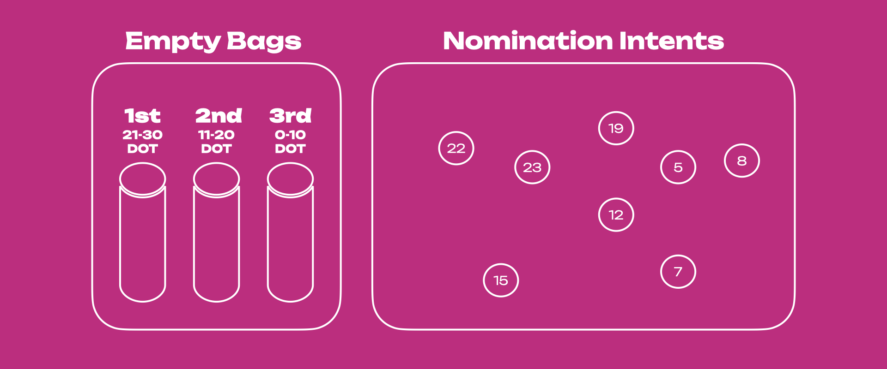
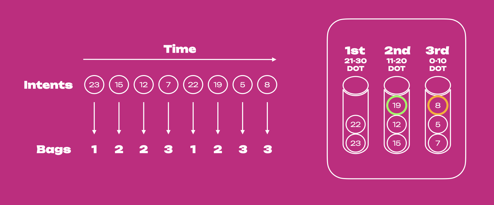

!!!tip "New to Staking?"
      Start your staking journey or explore more information about staking on [Polkadot's Home Page](https://polkadot.network/staking/). Discover the new [Staking Dashboard](https://staking.polkadot.cloud/#/overview) that makes staking much easier and check this [extensive article list](https://support.polkadot.network/support/solutions/articles/65000182104) to help you get started. You can now stake natively with a [small number of tokens](../general/chain-state-values.md#minimum-bond-to-join-a-nomination-pool) and earn staking rewards. For additional information, check out [this blog post](https://polkadot.network/blog/nomination-pools-are-live-stake-natively-with-just-1-dot/).

This page is meant to be an advanced guide to staking with the relay chain. For a more general
introduction, checkout the [Introduction to Staking](./learn-staking.md) page.

## Staking Proxies

Polkadot makes it possible to create accounts having special permissions also called **proxy
accounts**. For more details about proxy accounts visit the [dedicated page](./learn-proxies.md) on
this wiki.

Proxy accounts are special accounts which can sign
[**extrinsic calls**](./learn-transactions.md#pallets-and-extrinsics) made to specific **pallets**
on behalf of the proxied account. There is thus the possibility to create staking proxy accounts
that can be used to sign extrinsic calls specific to the staking, session and utility pallets.

Staking is not a set-and-forget action, as a nominator you will need to monitor the performance of
your validators and make changes if needed. There will be this transactions such as nominating that
will be needed to regularly signed. Each time you sign with an account, in the case of hot accounts,
you expose the private key of that account to the internet with consequent risk of attack. A hot
stash will be exposed all the time a transaction is signed. Even in the case of a cold stash created
with a Ledger device, signing with the stash will build a transaction history that might tell
something about your habits and preferences, or even your location.

Ideally, accounts with high economic power like the stash must be and remain as isolated as
possible. With a staking proxy, the stash account is fully isolated when signing for staking-related
transactions. The proxy private key will be used to sign staking-related transactions, the stash
private key will stay isolated and the staking transaction history will be built by the proxy.


For a practical perspective we need to use only one account and remember one password to sign for
all staking-related transactions. From a security perspective who controls the staking proxy
controls our staking actions.

It is important to remember that actions that can be performed by the proxy accounts are limited,
and in the case of staking proxy, extrinsic calls to the balances pallet cannot be signed. This
means it is not possible to do balance transfers on the proxied account through a staking proxy.

Note that to change the staking proxy you will need to sign with the stash or an _any_ proxy.

## Bags List

!!!info
    On Polkadot and Kusama, the instance of the pallet [Bags-List](https://paritytech.github.io/substrate/master/pallet_bags_list/) is named as 'voterList'.

For a demo about bags list see [this video tutorial](https://youtu.be/hIIZRJLrBZA).

In Polkadot's NPoS nomination intents are placed in a semi-sorted list called
[bags-list](https://github.com/paritytech/substrate/pull/9507). The Bags-List substrate pallet is
designed to be self-maintaining, with minimal effort from the blockchain, making it extremely
scalable. The bags list has two primary components, bags and nodes (or nominators' accounts), with
bags containing the nodes with bonded balance within a specific range. In the figure below the 1st
empty bag will contain nominators whose bonded balance is in the range of 21 - 30 DOT, the 2nd bag
11 - 20 DOT, and the 3rd bag 0-10 DOT. The nomination intents are the nominators' accounts with
bonded tokens (in the example shown below, there are eight nomination intents) that will be put
inside each of those three bags depending on their stake.



The bags list is semi-sorted, meaning that sorting is only partially done. When the nomination
intents are submitted to the network, they are automatically put into each bag based on the number
of bonded tokens, but within each bag, those nodes are arranged based on the time they are inserted
and not based on their stake (see figure below). When the nomination intent of 19 DOT is submitted,
it gets placed at the last spot in the 2nd bag (shown in the green circle). The same scenario
applies for the node with 8 DOT (yellow circle) in the 3rd bag. Placing the node above all nodes
with a lesser stake requires an additional step (more on this later).



The mentioned two nodes (19 DOT and 8 DOT) have the option to move up in their respective bags,
which can put them in front of the nodes with less stake than them (see figure below). This action
must be done manually by submitting the `putInFrontOf` extrinsic within the `voterList` pallet
instance. Moreover, if the node with 19 DOT bonds an additional 2 DOT, that node will be put
automatically in the 1st bag (i.e. automatic `rebag`) because the total number of bonded tokens will
now be within the range of the 1st bag. That node with now 21 DOT will be put at the tail end of the
1st bag with the possibility to manually put itself in front of "older" nodes with less than 21 DOT
(if there are any).


If one decides to send staking rewards to the stash account and automatically bond them (i.e.
compounding the staking rewards), the position within a bag does not change automatically. The same
scenario applies to a slashing event, i.e., when a nominator gets slashed, their position within a
bag does not change. This might result in a scenario where the node is in the wrong bag and needs to
be placed in the right bag. To address this issue, any account on-chain can submit the
permissionless extrinsic `rebag` within the `voterList` pallet instance to update the positions of
the nodes that do not belong to their bag and place them in the correct one. To reiterate, actions
like bonding/unbonding tokens automatically rebag the nominator node, but events like staking
rewards/slashing do not. See the [bags-list](learn-nominator.md#bags-list) section for more
information.

The bags-list is capable of including an unlimited number of nodes, subject to the chain's runtime
storage. In the current staking system configuration, at most 22500 nominators in the bags-list
(12500 on Kusama) come out as the electing nominators. See
[Staking Election Stages](learn-nominator.md#staking-election-stages) section for more info.

This means that only a portion of the nomination intents is kept. Once the nomination period ends,
the NPoS election system takes all nomination intents and their associated votes as input, and it
outputs a set of validators. The bags are iterated from the most staked to the least staked. If the
accounts are not appropriately sorted, this could leave the last touched bag to only be partially
iterated. Thus, in some edge cases, the order of the members within a bag is important. Continuing
with the example used in the previous figures, there are 8 nomination intents of which only 7 will
be kept. If the bags list stays semi-sorted (i.e. no accounts call the `putInFrontOf` and `rebag`
extrinsics), the nomination of the node with 8 DOT in the 3rd bag will not be considered while that
of the preceding node with 5 DOT will be. Nomination of the node with 8 DOT will be kept only if it
puts itself in front of the one with 5 DOT. Note how the nomination of the node with 19 DOT in the
2nd bag will be considered regardless of changing its position inside the bag. The sorting
functionality of nomination intents using bags is extremely important for the
[long-term improvements](https://gist.github.com/kianenigma/aa835946455b9a3f167821b9d05ba376) of the
staking/election system.


!!!caution "Minimum active nomination threshold to earn rewards is dynamic"
      Submitting a nomination intent does not guarantee staking rewards. The stake of the top 22500 nominators (12500 on Kusama) is applied to the validators in the active set. To avail of staking rewards, ensure that the number of tokens bonded is higher than the minimum active bond. For more information, see the [nominator guide](learn-nominator.md).

The "election solution" which is a connected graph between nominators and validators with the stake
as edge weights, has to meet certain requirements, such as maximizing the amount of stake to
nominate validators and distributing the stake backing validators as evenly as possible. The
objectives of this election mechanism are to maximize the security of the network, and achieve fair
representation of the nominators. If you want to know more about how NPoS works (e.g. election,
running time complexity, etc.), please read
[here](https://research.web3.foundation/en/latest/polkadot/NPoS.html).

## Rewards Distribution

!!!info
    The general rule for rewards across validators is that two validators get paid essentially the same amount of tokens for equal work, i.e. they are not paid proportional to their total stakes. There is a probabilistic component to staking rewards in the form of [era points](../maintain/maintain-guides-validator-payout.md#era-points) and [tips](./learn-guides-transfers.md#calculating-fees-with-polkadot-js) but these should average out over time.

Validators are paid the same regardless of stake backing them. Validators with less stake will
generally pay more to nominators per-token than the ones with more stake. This gives nominators an
economic incentive to gradually shift their preferences to lower-staked validators that gain a
sufficient amount of reputation. A consequence of this is that the stake across validators will be
as evenly distributed as possible which avoids concentration of power among a few validators. In the
long term, validators will have similar levels of stake, with the stake being higher for validators
with higher reputation. A nominator who is willing to risk more by backing a validator with a lower
reputation will get paid more, provided there are no slashing events.

Before distributing rewards to nominators, validators can create a cut of the reward (a commission)
that is not shared with the nominators. This cut is a percentage of the block reward, not an
absolute value. After the commission gets deducted, the remaining portion is distributed pro-rata
based on their staked value and split between the validator and all of the nominators whose stake
has backed this validator.

For example, assume the block reward for a validator is 10 DOT. A validator may specify
`validator_commission = 50%`, in which case the validator would receive 5 DOT. The remaining 5 DOT
would then be split between the validator and their nominators based on the proportion of stake each
nominator had. Note that for this calculation, validator's self-stake acts just as if they were
another nominator.

Thus, a percentage of the reward goes thus to pay the validator's commission fees and the remainder
is paid pro-rata (i.e. proportional to stake) to the nominators and validator. If a validator's
commission is set to 100%, no tokens will be paid out to any of the nominators. Notice in particular
that the validator is rewarded twice: once in commission fees for validating (if their commission
rate is above 0%), and once for nominating itself with own stake.

The following example should clarify the above. For simplicity, we have the following assumptions:

- These validators do not have a stake of their own.
- They each receive the same number of era points.
- There are no tips for any transactions processed.
- They do NOT charge any commission fees.
- Total reward amount is 100 DOT tokens.
- The current minimum amount of DOT to be a validator is 350 (note that this is _not_ the actual
  value, which fluctuates, but merely an assumption for purposes of this example; to understand how
  the actual minimal stake is calculated, see
  [here](../general/faq.md#what-is-the-minimum-stake-necessary-to-be-elected-as-an-active-validator)).

|               | **Validator A** |                             |         |
| :-----------: | :-------------: | :-------------------------: | :-----: |
| Nominator (4) |   Stake (600)   | Fraction of the Total Stake | Rewards |
|      Jin      |       100       |            0.167            |  16.7   |
|    **Sam**    |       50        |            0.083            |   8.3   |
|     Anson     |       250       |            0.417            |  41.7   |
|     Bobby     |       200       |            0.333            |  33.3   |

|               | **Validator B** |                             |         |
| :-----------: | :-------------: | :-------------------------: | :-----: |
| Nominator (4) |   Stake (400)   | Fraction of the Total Stake | Rewards |
|     Alice     |       100       |            0.25             |   25    |
|     Peter     |       100       |            0.25             |   25    |
|     John      |       150       |            0.375            |  37.5   |
|   **Kitty**   |       50        |            0.125            |  12.5   |

_Both validators A & B have 4 nominators with a total stake 600 and 400 respectively._

Based on the above rewards distribution, nominators of validator B get more rewards per DOT than
those of validator A because A has more overall stake. Sam has staked 50 DOT with validator A, but
he only gets 8.3 in return, whereas Kitty gets 12.5 with the same amount of stake.

To estimate how many tokens you can get each month as a nominator or validator, you can use this
[tool](https://www.stakingrewards.com/earn/polkadot/calculate) as a reference and play around with
it by changing some parameters (e.g. how many days you would like to stake with your DOT, provider
fees, compound rewards, etc.) to have a better estimate. Even though it may not be entirely accurate
since staking participation is changing dynamically, it works well as an indicator.

#### Commission Fees & Slashes

The network [slashes](./learn-offenses.md) a validator for a misbehavior. The slashed amount is a
fixed percentage (and not a fixed amount), which means that validators with more stake get slashed
more DOT. Again, this is done to provide nominators with an economic incentive to shift their
preferences and back less popular validators whom they consider to be trustworthy.

Also, note that each validator candidate is free to name their desired commission fee (as a
percentage of rewards) to cover operational costs. Since validators are paid the same, validators
with lower commission fees pay more to nominators than validators with higher fees. Thus, each
validator can choose between increasing their fees to earn more, or decreasing their fees to attract
more nominators and increase their chances of being elected. In the long term, we expect that all
validators will need to be cost-efficient to remain competitive, and that validators with higher
reputation will be able to charge slightly higher commission fees (which is fair).

## Simple Payouts

Polkadot makes stakers claim their rewards for past eras by submitting a transaction. This naturally
leads to spreading out reward distribution, as people make transactions at disparate times, rather
than updating the accounts of all stakers in a single block.

Even if everyone submitted a reward claim at the same time, the fact that they are individual
transactions would allow the block construction algorithm to process only a limited number per block
and ensure that the network maintains a constant block time. If all rewards were sent out in one
block, this could cause serious issues with the stability of the network.

Simple payouts require one transaction per validator, per [era](../general/glossary.md#era), to
claim rewards. The reason Polkadot requires this is to avoid an attack where someone has several
thousand accounts nominating a single validator. The major cost in reward distribution is mutating
the accounts in storage, and Polkadot cannot pay out several thousand accounts in a single
transaction.

### Claiming Rewards

The relay chain stores the last 84 eras of reward information (e.g. maps of era number to validator
points, staking rewards, nomination exposure, etc.). Rewards will not be claimable more than 84 eras
after they were earned. This means that all rewards must be claimed within a maximum of 84 eras,
although under certain circumstances (described below) this may be as low as 28 eras.

If a validator kills their stash, any remaining rewards will no longer be claimable. Before doing
this, however, they would need to first stop validating and then unbond the funds in their stash,
which takes 28 eras. If a validator were to immediately chill and start unbonding after rewards are
calculated, and nobody issued a payout for that era from that validator in the next 28 eras, the
reward would no longer be claimable.

!!!info "Advanced How-to Guides"
    In order to be absolutely sure that staking rewards can be claimed, users should trigger a payout before 28 eras have passed. See [this page](./learn-guides-nominator.md#claiming-rewards-with-polkadot-js) for more information about how to claim rewards using the Polkadot-JS UI.

### FAQ and Cautionary Notes

1. Rewards expire after 84 eras. On Polkadot, that's about 84 days. On Kusama, it is approximately
   21 days. Validators should claim all pending rewards before killing their stash in the event the
   validator decides to `chill` -> `unbonds all` -> `withdraws unbonded`. Nominators will not miss
   out on rewards if they claim the pending rewards for a validator within 28 days. Essentially, the
   deadline to ensure you get staking rewards is 28 eras. If the validator verifies its intent and
   does not unbond and withdraw, the 84 era timeline holds.
2. Claiming rewards (or neglecting to claim rewards) does not affect nominations in any way.
   Nominations will persist after claiming rewards or after the rewards expire.
3. Rewards are not minted until they are claimed. Therefore, if your reward destination is "stash,
   increasing amount at stake", then your staked amount does not reflect your rewards until you
   claim them. If you want to maximize compounding, then you will need to claim often or nominate
   validators which regularly claim for you.
4. Staking operations at the end of an era are closed to allow the off-chain validator election to
   take place. See [Off-chain Phragmén](learn-phragmen.md#off-chain-phragmen) for more information.

## Staking Miner

!!!caution
      The staking-miner code is experimental and it is still in the development phase. Use is at your own discretion, as there is a risk of losing some funds.

At the end of each era on Polkadot and Kusama, using [NPoS](learn-phragmen.md), a new set of validators
must be elected based on the nominator preferences. This is a computationally intensive process,
hence the usage of the term "mining" for computing the solution. The validators use
[off-chain workers](https://paritytech.github.io/polkadot-sdk/master/polkadot_sdk_docs/reference_docs/frame_offchain_workers/index.html) to compute
the result and submit a transaction to propose the set of winners. This can also be delegated to
stand-alone programs, whose task is to mine the optimal solution. Staking miners compete with each
other to produce election solutions which consist of a validator set, stake distribution across that
set, and a score indicating how optimal the solution is. Staking miners run any given staking
algorithms (as of now, sequential Phragmén or PhragMMS, subject to change if improved algorithms are
introduced) to produce results, which are then sent as a transaction to the relay chain via a normal
signed extrinsic. The transaction requires a bond and a transaction fee. The best solution is
rewarded, which the least covers the transaction fee, and the bond is returned to the account.
[The bond and the fee](./learn-staking-advanced.md#deposit-and-reward-mechanics) are lost if the
solution is invalid.

Staking miner uses a pallet called `pallet_election_provider_multi_phase` and can only produce
solutions during the
[`SignedPhase`](https://crates.parity.io/pallet_election_provider_multi_phase/index.html#signed-phase)
of the pallet's life cycle. Once the `SignedPhase` is over and the
[`UnsignedPhase`](https://crates.parity.io/pallet_election_provider_multi_phase/index.html#unsigned-phase)
starts, only the off-chain workers can provide election results.

Running the staking miner requires passing the seed of a funded account in order to pay the fees for
the transactions that will be sent. The same account's balance is used to reserve deposits as well.
The best solution in each round is rewarded. All correct solutions will get their deposit back and
the ones that submit invalid solutions will lose their deposit.

### NPoS election optimization


A basic election solution is a simple distribution of stake across validators, but this can be
optimized for better distribution equaling a higher security score. The staking miner does not act
as a validator and focuses solely on the election result and optimization of the solution. It
connects to a specified chain and keeps listening to new signed phase of the election pallet in
order to submit solutions to the NPoS election. When the correct time comes, it computes its
solution and submits it to the chain. The default miner algorithm is sequential Phragmén with a
configurable number of balancing iterations that improve the score.

### Signed Phase of the election pallet

The election provider pallet `pallet_election_provider_multi_phase` is divided into two phases,
**signed** and **unsigned**. At the end of the pallet's timeline, the function `elect()` is called.

```
                                                                   elect()
                +   <--T::SignedPhase-->  +  <--T::UnsignedPhase-->   +
  +-------------------------------------------------------------------+
   Phase::Off   +       Phase::Signed     +      Phase::Unsigned      +
```

Solutions provided by the staking miner can only be submitted during the signed phase. Solutions are
submitted and queued on the chain as a `RawSolution`. Once submitted, a solution cannot be retracted
by the originating account.

`RawSolution` struct definition:

```
pub struct RawSolution<S> {
    pub solution: S, // The solution itself
    pub score: ElectionScore, // The claimed score of the solution.
    pub round: u32, // The round at which this solution should be submitted.
}
```

A maximum of
[`pallet::Config::SignedMaxSubmissions`](https://github.com/paritytech/polkadot-sdk/blob/f610ffc05876d4b98a14cee245b4cc27bd3c0c15/runtime/polkadot/src/lib.rs#L390)
will be stored on-chain and they will be sorted based on score. Higher the score the more optimal
the election solution is. The
[`SignedMaxSubmissions`](../general/chain-state-values.md#staking-miner-max-submissions) variable
can be modified through governance.

Upon arrival of a new solution:

1. If the queue is not full, it is stored in the appropriate sorted index.
2. If the queue is full but the submitted solution is better than one of the queued ones, the worse
   solution is discarded, the deposit of the outgoing solution is returned, and the new solution is
   stored in the correct index.
3. If the queue is full and the solution is not an improvement compared to any of the queued ones,
   it is instantly rejected and no deposit is reserved.

Upon the end of the `SignedPhase`, no more solutions can be submitted and the solutions in the queue
will be checked using
[`Pallet::feasibility_check`](https://paritytech.github.io/substrate/master/pallet_election_provider_multi_phase/pallet/struct.Pallet.html#method.feasibility_check)
which ensures the score is indeed correct, and marks them as valid or invalid. By checking each
solution in the queue, the queue will be reorganized by score. The highest valid score will be
rewarded. Invalid solutions with higher score than the winning solution will be slashed. The rest of
the solutions will be discarded and their deposit will be returned. Once the staking miner with a
winning solution is ready to be rewarded the runtime will automatically execute
[`finalize_signed_phase_accept_solution`](https://github.com/paritytech/substrate/blob/f2bc08a3071a91b71fec63cf2b22c707411cec0e/frame/election-provider-multi-phase/src/signed.rs#L453-L474)
which reward account associated with the winning solution.

```
Queue
+-------------------------------+
|Solution(score=20, valid=false)| +-->  Slashed
+-------------------------------+
|Solution(score=15, valid=true )| +-->  Rewarded, Saved
+-------------------------------+
|Solution(score=10, valid=true )| +-->  Discarded
+-------------------------------+
|Solution(score=05, valid=false)| +-->  Discarded
+-------------------------------+
|             None              |
+-------------------------------+
```

### Deposit and reward mechanics

The staking miners are required to pay a deposit to post their solutions. Deposit amount is the sum
of `SignedDepositBase` +`SignedDepositByte` + `SignedDepositWeight`. All good solutions are subject
to receiving a `SignedRewardBase`. For more information about deposit values see the
[Chain State Values page](../general/chain-state-values.md).

### Further Resources

If you want to run a staking miner on your validator, refer to the repository provided in the
resources section below.

- [Staking Miner repository](https://github.com/paritytech/staking-miner-v2)
- [Election Pallet definition](https://crates.parity.io/pallet_election_provider_multi_phase/index.html)
- [Signed phase parameter configuration on Polkadot](https://github.com/paritytech/polkadot-sdk/blob/f610ffc05876d4b98a14cee245b4cc27bd3c0c15/runtime/polkadot/src/lib.rs#L389:L397)
