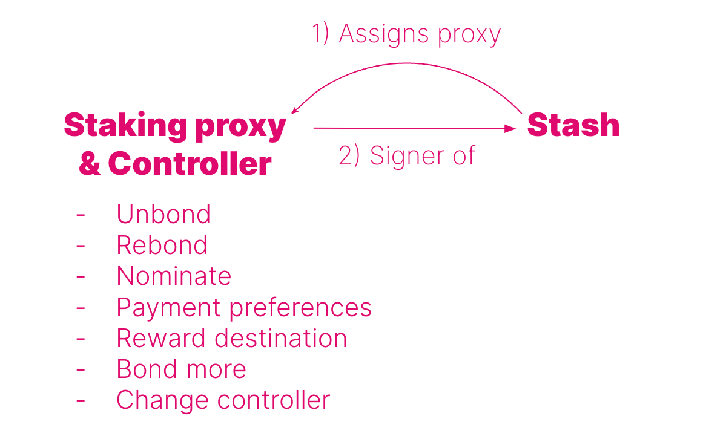

import RPC from "./../../components/RPC-Connection"

This page is meant to be an advanced guide to staking with Polkadot. If you are a nominator in a nominator pool

## Staking Proxies

{{ polkadot: Polkadot :polkadot }}{{ kusama: Kusama :kusama }} is built using
[substrate](https://substrate.io/), a modular system to efficiently build blockchains. Within each module or **pallet**, one can **call** different
functions that have similar logic. For example, the staking pallet contains all functionalities
related to staking such as bonding or unbonding funds. The combined information of pallets and calls
constitutes an **extrinsic**, i.e. a transaction that is executed from outside the chain but that
triggers an event on the chain. Continuing with the staking example, within the staking pallet
a nominator can bond funds and nominate some validators. The signature of such
extrinsic might lead to an event on the chain such as a reward payout to that nominator at the end of an era; this is an event inside the chain. This way of having
transactions categorized within pallets and functionalities makes it possible to create accounts
having special permissions also called **proxy accounts**.

In {{ polkadot: Polkadot :polkadot }}{{ kusama: Kusama :kusama }} proxy accounts are special
accounts which can sign extrinsic calls made to specific pallets on behalf of the proxied account. There is thus the
possibility to create staking proxy accounts that can be used to sign only extrinsic calls to staking,
session and utility pallets. This makes the stash account even more isolated than using a controller
account since one can bond / unbond / bond more funds using the staking proxy account. However,
it is important to remember that actions that can be performed by the proxy accounts are limited, and in the case of staking
proxy, extrinsic calls to the balances pallet cannot be signed. This means it is not possible to do balance transfers
on the proxied account through a staking proxy.