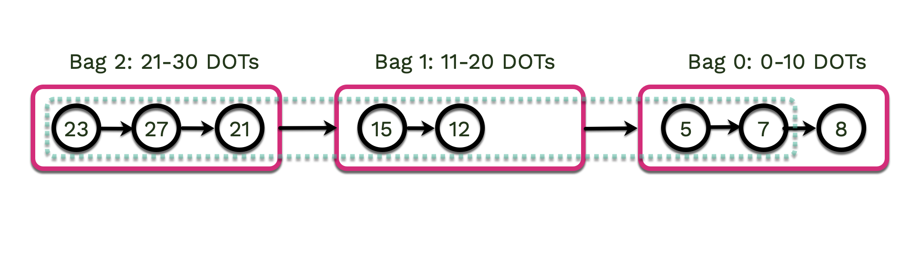
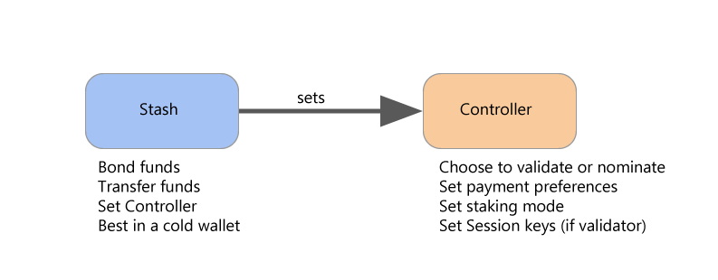
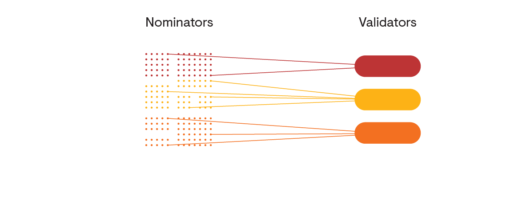

import RPC from "./../../components/RPC-Connection"

{{ polkadot: Polkadot :polkadot }}{{ kusama: Kusama :kusama }} implements NPoS (Nominated Proof-of-Stake),
a relatively novel and sophisticated mechanism to select the validators who are allowed to participate in 
its [consensus](learn-consensus.md) protocol. The NPoS encourages {{ polkadot: DOT :polkadot }}{{ kusama: KSM :kusama }} 
holders to participate as nominators. Nominators may back up to 
{{ polkadot: <RPC network="polkadot" path="consts.staking.maxNominations" defaultValue={16}/> :polkadot }}
{{ kusama: <RPC network="kusama" path="consts.staking.maxNominations" defaultValue={24}/> :kusama }} 
validators as trusted validator candidates. Both validators and nominators lock their tokens as collateral 
and receive staking rewards.

The staking system pays out rewards essentially equally to all validators regardless of stake.
Having more stake on a validator does not influence the amount of block rewards it receives.
However, there is a probabilistic component to reward calculation (discussed below), so rewards may
not be exactly equal for all validators in a given era.

Distribution of the rewards are pro-rata to all stakers after the validator's commission is
deducted. In this way, the network creates incentives for the nomination of lower-staked validators
to create an equally-staked validator set.

## How does staking work?

### 1. Identifying which role you are

In staking, you can be either a [nominator or a validator](#validators-and-nominators).

As a nominator, you can nominate validator candidates that you trust to help you earn rewards in the
chain's native token. The earned rewards can be bonded (locked) immediately for staking on your
account, which would effectively compound the rewards you receive over time. You could also choose
to have them deposited to your account or a different account as free (transferable) balance. You
can take a look at the [nominator guide](learn-nominator.md) to understand your responsibilities as
a nominator, and the [validator docs](learn-validator.md) to understand what you need to do as a
validator.

If you are a beginner and would like to securely stake your tokens using Polkadot JS Apps, watch the
video below.
{{ kusama: The video below demonstrates it on Polkadot, but the procedue is the same for Kusama :kusama }}

[](https://youtu.be/FCXC0CDhyS4)

### 2. Staking System Overview

Any potential validators can indicate their intention to be a validator candidate. Their candidacies
are made public to all nominators, and a nominator in turn submits a list of up to
{{ polkadot: <RPC network="polkadot" path="consts.staking.maxNominations" defaultValue={16}/> :polkadot }}
{{ kusama: <RPC network="kusama" path="consts.staking.maxNominations" defaultValue={24}/> :kusama }} 
candidates that it supports. In the next era, a certain number of validators having the
most {{ polkadot: DOT :polkadot }}{{ kusama: KSM :kusama }} backing get elected and become active.
As a nominator, a minimum of 
{{ polkadot: <RPC network="polkadot" path="query.staking.minNominatorBond" defaultValue={100000000000} filter="humanReadable"/> :polkadot }}
{{ kusama: <RPC network="kusama" path="query.staking.minNominatorBond" defaultValue={100000000000} filter="humanReadable"/> :kusama }}
is required to submit an intention to
nominate. The nomination intents are placed in a semi-sorted list called
[bags-list](https://github.com/paritytech/substrate/pull/9507).

:::caution Minimum Nomination to Receive Staking Rewards

Although the minimum nomination intent is 
{{ polkadot: <RPC network="polkadot" path="query.staking.minNominatorBond" defaultValue={100000000000} filter="humanReadable"/> :polkadot }}{{ kusama: <RPC network="kusama" path="query.staking.minNominatorBond" defaultValue={100000000000} filter="humanReadable"/> :kusama }}, 
it does not guarantee
staking rewards. The nominated amount has to be greater than
[minimum active nomination](learn-nominator.md#minimum-active-nomination-to-receive-staking-rewards),
which is a dynamic value that can be much higher than 
{{ polkadot: <RPC network="polkadot" path="query.staking.minNominatorBond" defaultValue={100000000000} filter="humanReadable"/> :polkadot }}{{ kusama: <RPC network="kusama" path="query.staking.minNominatorBond" defaultValue={100000000000} filter="humanReadable"/> :kusama }}.

:::

{{ kusama: The bags list example below uses DOT for explaining the concepts. :kusama }}The bags list
has two primary components, bags and nodes. The list is composed of bags that each describe a range
of active bonded funds (e.g. the 1st bag will have nominators with 0 → 10 DOT, 2nd bag 11 → 20 DOT,
etc). In each bag is a list of nodes that correspond to a nominator and their staked funds.

The bags-list pallet is designed to be self-maintaining, with minimal effort from the blockchain,
making it extremely scalable. Let us explore the sorting functionality of the bags list with an
example. In the bags list below, there are 8 nodes placed in 3 bags. It can be observed that the
list of nodes within the bags are arranged based on their insertion order and not based on the
number of tokens bonded. For instance, the nodes in bag 1 are arranged in this order: 15 → 12 → 19


Let's say the nominator with the stake of 19 DOT bonds 2 DOT additionally. This action would place
that nominator node in bag 2, right after the node with 27 DOT.

:::info

Actions like bonding/unbonding tokens automatically rebags the nominator node, but events like
staking rewards/slashing do not! The bags-list pallet comes with an important permissionless
extrinsic: `rebag`. This allows anyone to specify another account that is in the wrong bag, and
place it in the correct one. Check the [bags-list](learn-nominator.md#bags-list) section for more
information.

:::


This sorting functionality is extremely important for the
[long-term improvements](https://gist.github.com/kianenigma/aa835946455b9a3f167821b9d05ba376) of the
staking/election system. The bags-list is capable of including an unlimited number of nodes, subject
to the chain's runtime storage. In the current staking system configuration, the bags list keeps
{{ polkadot: <RPC network="polkadot" path="query.staking.maxNominatorsCount" defaultValue={50000}/> :polkadot }}
{{ kusama: <RPC network="kusama" path="query.staking.maxNominatorsCount" defaultValue={20000}/> :kusama }}
nomination intents, of which, at most
{{ polkadot: 22,500 :polkadot }}{{ kusama: 20,000  :kusama }} come out as the electing nominators.
Check [Staking Election Stages](learn-nominator.md#staking-election-stages) section for more info.

:::caution Minimum active nomination threshold to earn rewards is dynamic

Once again, submitting a nomination intent does not guarantee staking rewards. The stake of the top
{{ polkadot: 22,500 :polkadot }}{{ kusama: 20,000  :kusama }} nominators is applied to the
validators in the active set. To avail staking rewards, ensure that the number of tokens bonded is
higher than the minimum active nomination. For more information, check the
[nominator guide](learn-nominator.md)

:::

Once the nomination period ends, the NPoS election mechanism takes the nomination intents and their
associated votes as input, and outputs a set of validators. The bags are iterated from the most
staked to the least staked. This could leave the last touched bag to only be partially iterated.
This means that in some edge cases, the order of members within a bag is also important. Recall that
within each bag, the iteration order is simply the insertion order. If only 7 nodes have to be
picked for the electing set, the nodes with 5 and 7 DOT will be selected and will the node with 8
DOT will be left out. The bags-list pallet comes with an extrinsic: `putInFrontOf` which helps the
node to move up in the bag. Check the [bags-list](learn-nominator.md#bags-list) section for more
information.



The "election solution" has to meet certain requirements, such as maximizing the amount of stake to
nominate validators and distributing the stake backing validators as evenly as possible. The
objectives of this election mechanism are to maximize the security of the network, and achieve fair
representation of the nominators. If you want to know more about how NPoS works (e.g. election,
running time complexity, etc.), please read
[here](http://research.web3.foundation/en/latest/polkadot/NPoS.html).

We expect each nominator to carefully track the performance and reputation of the validators they
back. Nominating is _not_ a "set and forget" operation.

### 3. Staking Rewards Distribution

To explain how rewards are paid to validators and nominators, we need to consider **validator
pools**. A validator pool consists of the stake of an elected validator together with the nominators
backing it.

If a nominator `n` with stake `s` backs several elected validators, say `k`, the NPoS election
mechanism will split its stakes into pieces `s_1`, `s_2`, …, `s_k`, so that it backs validator `i`
with stake `s_i`. In that case, nominator `n` will be rewarded essentially the same as if there were
`k` nominators in different pools, each backing a single validator `i` with stake `s_i`.

For each validator pool, we keep a list of nominators with the associated stakes.

The general rule for rewards across validator pools is that two validator pools get paid essentially
the **same amount of tokens** for equal work, i.e. they are NOT paid proportional to the stakes in
each pool. There is a probabilistic component to staking rewards in the form of
[era points](../maintain/maintain-guides-validator-payout.md##era-points) and
[tips](learn-transaction-fees.md#fee-calculation) but these should average out over time.

Within a validator pool, a (configurable) percentage of the reward goes to pay the validator's
commission fees and the remainder is paid **pro-rata** (i.e. proportional to stake) to the
nominators and validator. Notice in particular that the validator is rewarded twice: once in
commission fees for validating (if their commission rate is above 0%), and once for nominating
itself with stake. If a validator's commission is set to 100%, no tokens will be paid out to any
nominations in the validator pool.

To estimate the inflation rate and how many tokens you can get each month as a nominator or
validator, you can use this [tool](https://www.stakingrewards.com/earn/polkadot/calculate) as a
reference and play around with it by changing some parameters (e.g. how many days you would like to
stake with your DOT, provider fees, compound rewards, etc.) to have a better estimate. Even though
it may not be entirely accurate since staking participation is changing dynamically, it works well
as an indicator.

### 4. Rewards Mechanism

We highlight two features of this payment scheme. The first is that since validator pools are paid
the same regardless of stake level, pools with less stake will generally pay more to nominators
per-token than pools with more stake.

We thus give nominators an economic incentive to gradually shift their preferences to lower staked
validators that gain a sufficient amount of reputation. The reason for this is that we want the
stake across validator pools to be as evenly distributed as possible, to avoid a concentration of
power among a few validators.

In the long term, we expect all validator pools to have similar levels of stake, with the stake
being higher for higher reputation validators (meaning that a nominator that is willing to risk more
by backing a validator with a low reputation will get paid more).

The following example should clarify the above. For simplicity, we have the following assumptions:

- These validators do not have a stake of their own.
- They each receive the same number of era points.
- There are no tips for any transactions processed.
- They do NOT charge any commission fees.
- Total reward amount is 100 DOT tokens.
- The current minimum amount of DOT to be a validator is 350 (note that this is _not_ the actual
  value, which fluctuates, but merely an assumption for purposes of this example; to understand how
  the actual minimal stake is calculated, see
  [here](../general/faq.md#what-is-the-minimum-stake-necessary-to-be-elected-as-an-active-validator)).

|               | **A - Validator Pool** |                             |         |
| :-----------: | :--------------------: | :-------------------------: | :-----: |
| Nominator (4) |      Stake (600)       | Fraction of the Total Stake | Rewards |
|      Jin      |          100           |            0.167            |  16.7   |
|    **Sam**    |           50           |            0.083            |   8.3   |
|     Anson     |          250           |            0.417            |  41.7   |
|     Bobby     |          200           |            0.333            |  33.3   |

|               | **B - Validator Pool** |                             |         |
| :-----------: | :--------------------: | :-------------------------: | :-----: |
| Nominator (4) |      Stake (400)       | Fraction of the Total Stake | Rewards |
|     Alice     |          100           |            0.25             |   25    |
|     Peter     |          100           |            0.25             |   25    |
|     John      |          150           |            0.375            |  37.5   |
|   **Kitty**   |           50           |            0.125            |  12.5   |

_Both validator pools A & B have 4 nominators with the total stake 600 and 400 respectively._

Based on the above rewards distribution, nominators in validator pool B get more rewards per DOT
than those in pool A because pool A has more overall stake. Sam has staked 50 DOT in pool A, but he
only gets 8.3 in return, whereas Kitty gets 12.5 with the same amount of stake.

There is an additional factor to consider in terms of rewards. While there is no limit to the number
of nominators a validator may have, a validator does have a limit to how many nominators to which it
can pay rewards.

In Polkadot and Kusama, this limit is currently {{ polkadot_max_nominators }}, although this can be
modified via runtime upgrade. A validator with more than {{ polkadot_max_nominators }} nominators is
*oversubscribed*. When payouts occur, only the top {{ polkadot_max_nominators }} nominators as
measured by amount of stake allocated to that validator will receive rewards. All other nominators
are essentially "wasting" their stake - they used their nomination to elect that validator to the
active stake, but receive no rewards in exchange for doing so.

We also remark that when the network slashes a validator slot for a misbehavior (e.g. validator
offline, equivocation, etc.) the slashed amount is a fixed percentage (and NOT a fixed amount),
which means that validator pools with more stake get slashed more DOT. Again, this is done to
provide nominators with an economic incentive to shift their preferences and back less popular
validators whom they consider to be trustworthy.

The second point to note is that each validator candidate is free to name their desired commission
fee (as a percentage of rewards) to cover operational costs. Since validator pools are paid the
same, pools with lower commission fees pay more to nominators than pools with higher fees. Thus,
each validator can choose between increasing their fees to earn more, or decreasing their fees to
attract more nominators and increase their chances of being elected. In the long term, we expect
that all validators will need to be cost efficient to remain competitive, and that validators with
higher reputation will be able to charge slightly higher commission fees (which is fair).

## Accounts

There are two different accounts for managing your funds: `Stash` and `Controller`.



- **Stash:** This account holds funds bonded for staking, but delegates some functions to a
  Controller. As a result, you may actively participate with a Stash key kept in a cold wallet,
  meaning it stays offline all the time. You can also designate a Proxy account to vote in
  [governance](learn-governance.md) proposals.
- **Controller** This account acts on behalf of the Stash account, signalling decisions about
  nominating and validating. It sets preferences like payout account and commission. If you are a
  validator, it also sets your [session keys](learn-keys.md#session-keys). It only needs enough
  funds to pay transaction fees.

We designed this hierarchy of separate key types so that validator operators and nominators can
protect themselves much better than in systems with only one key. As a rule, you lose security
anytime you use one key for multiple roles, or even if you use keys related by derivation. You
should never use any account key for a "hot" session key in particular.

Controller and Stash account keys can be either sr25519 or ed25519. For more on how keys are used in
Polkadot and the cryptography behind it [see here](learn-keys.md).

## Validators and Nominators

Since validator slots are limited, most of those who wish to stake their DOT and contribute economic
security to the network will be nominators.

Validators do most of the heavy lifting: they produce new block candidates in BABE, vote and come to
consensus in GRANDPA, validate the state transition function of parachains, and possibly some other
responsibilities regarding data availability and [XCM](learn-cross-consensus.md).

Nominators, on the other hand, have far fewer responsibilities. Those include monitoring their
validators' performance (uptime), keeping an eye on changing commission rates (a validator can
change commission at any time), and general health monitoring of their and their validators'
account. Thus, while not set-it-and-forget-it, a nominator's experience is relatively hands-off
compared to a validator's.



### Want to stake DOT?

- [Nominator Guide](../maintain/maintain-guides-how-to-nominate-polkadot.md) - Become a nominator on
  the Polkadot network.
- [Validator Guide](../maintain/maintain-guides-how-to-validate-polkadot.md) - Become a validator on
  the Polkadot network.

## Slashing

Slashing will happen if a validator misbehaves (e.g. goes offline, attacks the network, or runs
modified software) in the network. They and their nominators will get slashed by losing a percentage
of their bonded/staked DOT.

Any slashed DOT will be added to the [Treasury](learn-treasury.md). The rationale for this (rather
than burning or distributing them as rewards) is that slashes may then be reverted by the Council by
simply paying out from the Treasury. This would be useful in situations such as a faulty runtime
causing slashing or forcing validators offline through no fault of their own. In the case of
legitimate slashing, it moves tokens away from malicious validators to those building the ecosystem
through the normal Treasury process.

Validator pools with larger total stake backing them will get slashed more harshly than less popular
ones, so we encourage nominators to shift their nominations to less popular validators to reduce
their possible losses.

It is important to realize that slashing only occurs for active validations for a given nominator,
and slashes are not mitigated by having other inactive or waiting nominations. They are also not
mitigated by the validator operator running separate validators; each validator is considered its
own entity for purposes of slashing, just as they are for staking rewards.

As an example, assume BIG_COMPANY has 50 validators that all go offline at the same time, thus
causing a 1% unresponsiveness slash to their nominators. In this example, the nominator has
nominated five validators, two of which are with BIG_COMPANY (BC_1 and BC_2) and three are with
other validators that do not belong to BIG_COMPANY (OV_1, OV_2, and OV_3). In this era, BC_1 is the
active validator for this nominator, BC_2 and OV_1 are inactive, and OV_2 and OV_3 are waiting. The
nominator will be slashed 1% of bonded stake, since BC_1 is the active validator. The inactive and
waiting validators (BC_2 and OV_1 through 3) don't have any effect on this, since they are not
actively validating. Any nominator actively nominating BC_2 also receives a 1% slash, but any
nominator actively nominating OV_1 is unaffected.

In rare instances, a nominator may be actively nominating several validators in a single era. In
this case, the slash is proportionate to the amount staked to that specific validator. For instance,
if another nominator had their stake split 50% to BC_1 and 50% to OV_1, they would receive a slash
of 0.5% (50% of 1%). If a nominator were actively nominating BC_1 and BC_2, again with 50% of their
stake allocated to each, they would still end up with a 1% slash, since a 1% slash is applied to
both halves of their stake. Note that you cannot control the percentage of stake you have allocated
to each validator or choose who your active validator will be (except in the trivial case of
nominating a single validator). Staking allocations are controlled by the
[Phragmén algorithm](learn-phragmen.md).

Once a validator gets slashed, it goes into the state as an "unapplied slash". You can check this
via
[Polkadot-JS Apps](https://polkadot.js.org/apps/?rpc=wss%3A%2F%2Frpc.polkadot.io#/staking/slashes).
The UI shows it per validator and then all the affected nominators along with the amounts. While
unapplied, a governance proposal can be made to reverse it during this period (7 days on Kusama, 28
days on Polkadot). After the grace period, the slashes are applied.

The following levels of offence are
[defined](https://research.web3.foundation/en/latest/polkadot/slashing/amounts.html). However, these
particular levels are not implemented or referred to in the code or in the system; they are meant as
guidelines for different levels of severity for offences. To understand how slash amounts are
calculated, see the equations in the section below.

- Level 1: isolated unresponsiveness, i.e. being offline for an entire [epoch][]. Generally no
  slashing, only [_chilling_](#chilling).
- Level 2: concurrent unresponsiveness or isolated equivocation. Slashes a very small amount of the
  stake and chills.
- Level 3: misconducts unlikely to be accidental, but which do not harm the network's security to
  any large extent. Examples include concurrent equivocation or isolated cases of unjustified voting
  in [GRANDPA](learn-consensus.md). Slashes a moderately small amount of the stake and chills.
- Level 4: misconduct that poses a serious security or monetary risk to the system, or mass
  collusion. Slashes all or most of the stake behind the validator and chills.

Let's look at these offences in a bit more detail.

### Unresponsiveness

For every session, validators will send an "I'm online" heartbeat to indicate they are live. If a
validator produces no blocks during an epoch and fails to send the heartbeat, it will be reported as
unresponsive. Slashing may occur depending on the repeated offences and how many other validators were
unresponsive or offline during the epoch.

Validators should have a well-architected network infrastructure to ensure the node runs to
reduce the risk of slashing or chilling. A high availability setup is desirable, preferably with
backup nodes that kick in **only once the original node is verifiably offline** (to avoid double-signing
and being slashed for equivocation - see below). A comprehensive guide on validator setup is
available [here](../maintain/maintain-guides-secure-validator.md).

Here is the formula for calculating slashing due to unresponsiveness:

    Let x = offenders, n = total no. validators in the active set

    min((3 * (x - (n / 10 + 1))) / n, 1) * 0.07

The examples demonstrate how to calculate the slashing penalty for unresponsiveness.

:::note

In all of the examples, assume that there are 100 validators in the active set.

:::

No slashing would enact if < 10% of all validators are unresponsive.

For example, if exactly 10 validators were unresponsive, the expression 3 * (x - (n / 10 + 1))) / n
would be 3 * (10 - (100 / 10 + 1)) / 100 = 3 * (10 - (10 + 1)) / 100 = -0.03 which is rounded to 0.

:::note

The minimum value between 0 and 1 is 0. 0 multipled by 0.07 is 0.

:::

If 14 validators are unresponsive, then slashing would occur, as > 10% of validators are unresponsive.

The slashing penalty would be
min((3 * (14 - (100 / 10 + 1))) / 100, 1) * 0.07 = min((3 * (14 - 11))/100, 1) * 0.07 = min(0.09, 1) * 0.07 = 0.6%

Similarly, if one-third of the validator set (around 33/100) are unresponsive, the slashing penalty would be
about 5%.

The maximum slashing that can occur due to unresponsiveness is 7%. After around 45% of the validators go offline,
the expression 3 * (x - (n / 10 + 1))) / n will go beyond 1. Hence, min((3 * (x - (n / 10 + 1))) / n, 1) * 0.07
will be ceiled to 7%.

### Equivocation

**GRANDPA Equivocation**: A validator signs two or more votes in the same round on different chains.

**BABE Equivocation**: A validator produces two or more blocks on the Relay Chain in the same time slot.

Both GRANDPA and BABE equivocation use the same formula for calculating the slashing penalty:

    Let x = offenders, n = total no. validators in active set

    min( (3 * x / n )^2, 1)

As an example, assume that there are 100 validators in the active set, and one of them equivocates
in a slot (for our purposes, it does not matter whether it was a BABE or GRANDPA equivocation). This
is unlikely to be an attack on the network, but much more likely to be a misconfiguration of a
validator. The penalty would be min(3 \* 1 / 100)^2, 1) = 0.0009, or a 0.09% slash for that
validator pool (i.e., all stake held by the validator and its nominators).

Now assume that there is a group running several validators, and all of them have an issue in the
same slot. The penalty would be min((3 \* 5 / 100)^2, 1) = 0.0225, or a 2.25% slash. If 20 validators
equivocate, this is a much more serious offence and possibly indicates a coordinated attack on the
network, and so the slash will be much greater - min((3 \* 20 / 100)^2, 1) = 0.36, or a 36% slash on
all of these validators and their nominators. All slashed validators will also be chilled.

From the example above, the risk in nominating or running many validators in the active set are
apparent. While rewards grow linearly (two validators will get you approximately twice as many
staking rewards as one), slashing grows exponentially. A single validator equivocating causes a
0.09% slash, two validators equivocating does not cause a 0.09 \* 2 = 0.18% slash, but rather a
0.36% slash - 4x as much as the single validator.

Validators may run their nodes on multiple machines to make sure they can still perform validation
work in case one of their nodes goes down, but validator operators should be extremely careful in
setting these up. If they do not have good coordination to manage signing machines, equivocation is
possible, and equivocation offences are slashed at much higher rates than equivalent offline
offences.

If a validator is reported for any one of the offences they will be removed from the validator set
([chilled](#chilling)) and they will not be paid while they are out. They will be considered
inactive immediately and will lose their nominators. They need to re-issue intent to validate and
again gather support from nominators.

If you want to know more details about slashing, please look at our
[research page](https://research.web3.foundation/en/latest/polkadot/slashing/amounts.html).

### Chilling

Chilling is the act of stepping back from any nominating or validating. It can be done by a
validator or nominator at any time themselves, taking effect in the next era. It can also specifically
mean removing a validator from the active validator set by another validator, disqualifying them
from the set of electable candidates in the next NPoS cycle.

Chilling may be voluntary and validator-initiated, e.g. if there is a planned outage in the
validator's surroundings or hosting provider, and the validator wants to exit to protect themselves
against slashing. When voluntary, chilling will keep the validator active in the current session,
but will move them to the inactive set in the next. The validator will not lose their nominators.

When used as part of a punishment (initiated externally), being chilled carries an implied penalty
of being un-nominated. It also disables the validator for the remainder of the current era and
removes the offending validator from the next election.

Polkadot allows some validators to be disabled, but if the number of disabled validators gets too
large, Polkadot will trigger a new validator election to get a full set. Disabled validators will
need to resubmit their intention to validate and re-garner support from nominators.

For more on chilling, see the [How to Chill][] page on this wiki.

### Slashing Across Eras

There are 3 main difficulties to account for with slashing in NPoS:

- A nominator can nominate multiple validators and be slashed via any of them.
- Until slashed, stake is reused from era to era. Nominating with N coins for E eras in a row does
  not mean you have N\*E coins to be slashed - you've only ever had N.
- Slashable offences can be found after the fact and out of order.

To balance this, we only slash for the maximum slash a participant can receive in some time period,
rather than the sum. This ensures protection from overslashing. Likewise, the time span over which
maximum slashes are computed are finite and the validator is chilled with nominations withdrawn
after a slashing event, as stated in the previous section. This prevents rage-quit attacks in which,
once caught misbehaving, a participant deliberately misbehaves more because their slashing amount is
already maxed out.

## Reward Distribution

Note that Kusama runs approximately 4x as fast as Polkadot, except for block production times.
Polkadot will also produce blocks at approximately six second intervals.

Rewards are recorded per session (approximately one hour on Kusama and four hours on Polkadot) and
calculated per era (approximately six hours on Kusama and twenty-four hours on Polkadot). Thus,
rewards will be calculated four times per day on Kusama and once per day on Polkadot.

Rewards are calculated based on era points, which have a probabilistic component. In other words,
there may be slight differences in your rewards from era to era, and even amongst validators in the
active set at the same time. These variations should cancel out over a long enough timeline. See the
page on [Validator Payout Guide](../maintain/maintain-guides-validator-payout.md) for more information on how
these are calculated.

In order to be paid your staking rewards, someone must claim them for each validator that you
nominate. Staking rewards are kept available for 84 eras, which is approximately 84 days on Polkadot
and 21 days on Kusama. For more information on why this is so, see the page on
[simple payouts](learn-simple-payouts.md).


:::warning Claiming staking rewards

If nobody claims your staking rewards by this time, then you will not be able to claim
them and some of your staking rewards will be lost. Additionally, if the validator unbonds all
their own stake, any pending payouts will be lost. Since unbonding takes 28 days on Polkadot,
nominators should check if they have pending payouts at least this often.

:::

### Claiming Rewards

If you go to the Staking payouts page on
[Polkadot-JS](https://polkadot.js.org/apps/#/staking/payout), you will see a list of all validators
that you have nominated in the past 84 eras and for which you have not yet received a payout. Each
one has the option to trigger the payout for all unclaimed eras. Note that this will pay everyone
who was nominating that validator during those eras, and anyone can call it. Therefore, you may not
see anything in this tab, yet still have received a payout if somebody (generally, but not
necessarily, another nominator or the validator operator) has triggered the payout for that
validator for that era.

If you wish to check if you received a payout, you will have to check via a block explorer. See
[the relevant Support page](https://support.polkadot.network/support/solutions/articles/65000168954-how-can-i-see-my-staking-rewards-)
for details.

### Reward Distribution Example

```
    PER_ERA * BLOCK_TIME = **Reward Distribution Time**

    3_600 * 6 seconds = 21_600 s = 6 hours

```

Validators can create a cut of the reward (a commission) that is not shared with the nominators.
This cut is a percentage of the block reward, not an absolute value. After the commission gets
deducted, the remaining portion is based on their staked value and split between the validator and
all of the nominators who have voted for this validator.

For example, assume the block reward for a validator is 10 DOT. A validator may specify
`validator_commission = 50%`, in which case the validator would receive 5 DOT. The remaining 5 DOT
would then be split between the validator and their nominators based on the proportion of stake each
nominator had. Note that validators can put up their own stake, and for this calculation, their
stake acts just as if they were another nominator.

Rewards can be directed to the same account (controller), to the stash account (and either
increasing the staked value or not increasing the staked value), or to a completely unrelated
account. By using the Extrinsics tab (`Developer -> Extrinsics -> Staking -> Bond`) you can also
send rewards to "None", effectively burning them. It is also possible to top-up / withdraw some
bonded DOT without having to un-stake all staked DOT.

For specific details about validator payouts, please see
[this guide](../maintain/maintain-guides-validator-payout.md).

## Inflation

{{ polkadot: DOT is inflationary; there is no maximum number of DOT. Inflation is designed
to be approximately 10% annually, with validator rewards being a function of the amount staked
and the remainder going to treasury. DOT went through [redenomination](../general/redenomination.md) 
in 2020. The current token supply on Polkadot is <RPC network="polkadot" path="query.balances.totalIssuance" defaultValue={12230666300429914781} filter="humanReadable"/> (Over 1.2 Billion DOT). :polkadot }}

{{ kusama: KSM is inflationary; there is no maximum number of KSM. Inflation is designed
to be approximately 10% annually, with validator rewards being a function of the amount staked
and the remainder going to treasury. The current token supply on Kusama is 
{{ kusama: <RPC network="kusama" path="query.balances.totalIssuance" defaultValue={12619256191792480093}/> :kusama }} (Over 12 Million KSM). :kusama }}

There is an *ideal staking rate* that the network tries to maintain.
The goal is to have the *system staking rate* meet the *ideal staking rate*. The system staking rate would be the total amount staked over the total token supply, where
the total amount staked is the stake of all validators and nominators on the network. The ideal
staking rate accounts for having sufficient backing of {{ polkadot: DOT :polkadot }}
{{ kusama: KSM :kusama }} to prevent the possible compromise of security while keeping the native
token liquid. {{ polkadot: DOT :polkadot }}{{ kusama: KSM :kusama }} is inflated according to the 
system staking rate of the entire network.

:::info 

According to the inflation model, this would suggest that if you do not use your
{{ polkadot: DOT :polkadot }}{{ kusama: KSM :kusama }} for staking, your tokens
dilute over time.

:::

The ideal staking rate on Polkadot also varies with the number of parachains (50% is the current
estimation of all DOT that should be staked when all the parachain slots are taken).

:::note 

The current staking rate on Polkadot still assumes the absence of parachains, with the suggested 
ideal staking rate of 75%. You can track the progress on the issue to adjust it 
[here](https://github.com/paritytech/polkadot/pull/5872). This has already been adjusted on Kusama.

:::

If the amount of tokens staked goes below the ideal rate, then staking rewards for nominators
go up incentivizing to stake more tokens on the network. On the contrary, if it goes above the 
ideal rate, staking rewards drop. This is a result of the change in the percentage of staking 
rewards that go to the Treasury.


<p style={{textAlign:"center"}}>Source: <a href="https://w3f-research.readthedocs.io/en/latest/polkadot/overview/2-token-economics.html">Research - Web3 Foundation</a></p>

- **x-axis**: Proportion of {{ polkadot: DOT :polkadot }}{{ kusama: KSM :kusama }} staked
- **y-axis**: Inflation, annualized percentage
- **Blue line**: Annual inflation rate of NPoS, i.e. total amount of tokens minted to pay validators and nominators.
- **Green line**: Annual rewards rate for stakers. For instance, 0.2 corresponds to 20% of annual returns on the staked tokens

You can determine the staking rewards by checking the staking overview on
[Polkadot-JS Apps](https://polkadot.js.org/apps/#/staking).

The above chart shows the inflation model of the network. Depending on the staking participation,
the distribution of the inflation to validators/nominators versus the treasury will change
dynamically to provide incentives to participate (or not participate) in staking.

For instance, assuming that the ideal staking rate is 50%, all of the inflation would go to the
validators/nominators if 50% of all KSM / DOT are staked. Any deviation from the 50% - positive or
negative - sends the proportional remainder to the treasury and effectively reduces staking rewards.

For those who are interested in knowing more about the design of inflation model for the network,
please see
[here](https://w3f-research.readthedocs.io/en/latest/polkadot/overview/2-token-economics.html).

### Why stake?

- 10% inflation/year when the network launches
- 50% targeted active staking
- ~20% annual nominal return

Up until now, the network has been following an inflation model that excludes the metric of active
parachains. The ideal staking rate is not always 50%, as the number of active parachains influences
the available liquidity that is available to secure the network.

Keep in mind that when the system's staking rate is lower than the ideal staking rate, the annual 
nominal return rate will be higher, encouraging more users to use their tokens for staking. On the 
contrary, when the system staking rate is higher than the ideal staking rate, the annual nominal 
return will be less, encouraging some users to withdraw.

### Why not stake?

- Tokens will be locked for about 28 days on Polkadot after unbonding, seven days on Kusama.
- Punishment in case of validator found to be misbehaving (see [#slashing](#slashing)).
- You want to use the tokens for a parachain slot.

## How many validators does Polkadot have?

Polkadot started with 20 open validator positions and has increased gradually to 297. The top bound
on the number of validators has not been determined yet, but should only be limited by the bandwidth
strain of the network due to peer-to-peer message passing. The estimate of the number of validators
that Polkadot will have at maturity is around 1000. Kusama, Polkadot's canary network, currently has
900 validator slots in the active set.

## Resources

- [How Nominated Proof of Stake will work in Polkadot](https://medium.com/web3foundation/how-nominated-proof-of-stake-will-work-in-polkadot-377d70c6bd43) -
  Blog post by Web3 Foundation researcher Alfonso Cevallos covering NPoS in Polkadot.
- [Validator setup](../maintain/maintain-guides-secure-validator.md)

[epoch]: ../general/glossary.md#epoch
[how to chill]: ../maintain/maintain-guides-how-to-chill.md
