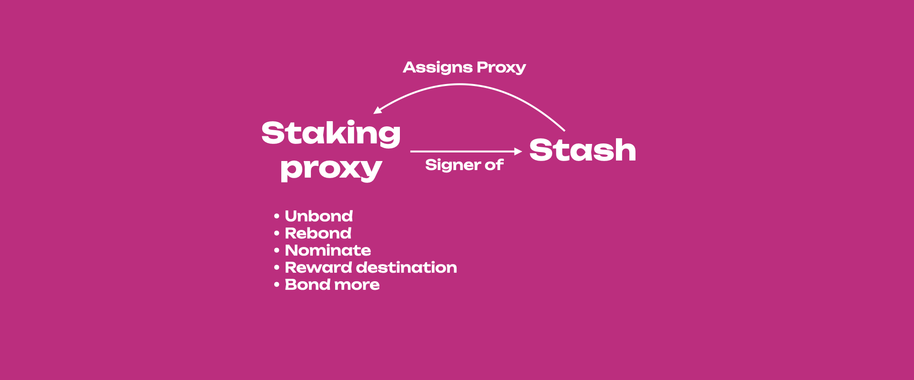

<!-- MessageBox -->

  

    Nomination Pools are evolving! Soon you'll be able to participate in a pool and in OpenGov with your pooled funds! You do not need to do anything, unless you are participating in a pool and also staking solo from the same account. In this case, please check
    <a href="https://support.polkadot.network/support/solutions/articles/65000188140-changes-for-nomination-pool-members-and-opengov-participation" target="_blank" rel="noopener noreferrer">
      this article
    </a>
    on the actions you need to take as soon as possible. 
  

  <button class="close-messagebox" aria-label="Close message">✖</button>

!!!tip "New to Staking?"
    Explore Polkadot with a secure and user-friendly wallets listed on the [Polkadot website](https://www.polkadot.network/ecosystem/wallets/) and start your staking journey or explore more information about staking on [Polkadot's Staking Page](https://polkadot.network/staking/). Discover the new [Staking Dashboard](https://staking.polkadot.cloud/#/overview) that makes staking much easier and check this [extensive article list](https://support.polkadot.network/support/solutions/articles/65000182104) to help you get started. The dashboard supports [Ledger](../general/ledger.md) devices natively and does not require an extension or wallet as an interface.

!!!info "Stake through Nomination Pools"
    The minimum amount required to become an active nominator (i.e. [the minimum active bond](../general/chain-state-values.md#minimum-active-bond)) and earn rewards may change from era to era. If you have less tokens than the minimum active nomination and still want to participate in staking, you can join the nomination pools with a [minimal bond](../general/chain-state-values.md#minimum-bond-to-join-a-nomination-pool) and earn staking rewards. For additional information, check out [this blog post](https://polkadot.network/blog/nomination-pools-are-live-stake-natively-with-just-1-dot/). Check the wiki doc on [nomination pools](learn-nomination-pools.md) for more information.

Here you will learn about what staking is, why it is important, and how it works.

## Proof-of-Stake (PoS)

Blockchain networks use [consensus](../general/faq.md#why-do-we-need-consensus) mechanisms to
finalize blocks on the chain. Consensus is the process of agreeing on something, in this case, the
progression of the blockchain or how blocks are added to the chain. Consensus consists of two
actions:

- **Block production**, i.e. the way multiple blocks candidates are produced, and
- **Block finality**, i.e. the way only one block out of many candidates is selected and added to
  the canonical chain (see [this](./learn-consensus.md#probabilistic-vs-provable-finality) article
  for more information about finality).

Proof-of-Work (PoW) and Proof-of-Stake (PoS) are well-known mechanisms used to reach consensus in a
secure and trustless way on public blockchains, where there are many participants who do not know
each other (and probably never will). In PoW, network security relies on the fact that the miners
who are responsible for adding blocks to the chain must compete to solve difficult mathematic
puzzles to add blocks - a solution that has been criticized for the wastage of energy. For doing
this work, miners are typically rewarded with tokens.

In PoS networks like Polkadot, the security of the network depends on the amount of capital locked
on the chain: the more the capital locked, the lower the chance of an attack on the network, as the
attacker needs to incur a heavy loss to orchestrate a successful attack (more on this later on). The
process of locking tokens on the chain is called **staking**.

Similar to the miners in PoW networks, PoS networks have **validators**, but they do not have to
compete with each other to solve mathematical puzzles. They are instead pre-selected to produce the
blocks based on the stake backing them. Token holders can lock funds on the chain and for doing so,
they are getting **staking rewards**. There is thus an economic incentive for token holders to
become active participants who contribute to the economic security and stability of the network. PoS
networks in general are therefore more inclusive than PoW networks, as participants do not need to
have either technical knowledge about blockchain technology or experience in running mining
equipment.

PoS ensures that everybody participating in the staking process has "skin in the game" and thus can
be held accountable. In case of misbehavior, participants in the staking process can be punished or
[**slashed**](./learn-offenses.md), and depending on the gravity of the situation, their stake can
be partly or fully confiscated by the network. It is not in a staker's economic interest to
orchestrate an attack and risk losing tokens. Any rational actor staking on the network would want
to get rewarded, and the PoS network rewards good behavior and punishes bad behavior.

## Nominated Proof-of-Stake (NPoS)

Polkadot implements
[Nominated Proof-of-Stake (NPoS)](./learn-consensus.md#nominated-proof-of-stake), a relatively novel
and sophisticated mechanism to select the validators who are allowed to participate in its
[consensus](learn-consensus.md) protocol. NPoS encourages token holders to participate as
**nominators**.

Any potential validators can indicate their intention to be a validator candidate. Their candidacies
are made public to all nominators, and a nominator, in turn, submits a
[capped list of candidates](../general/chain-state-values.md#maximum-votes-per-nominator) that it
supports, and the network will automatically distribute the stake among validators in an even manner
so that the economic security is maximized. In the next era, a certain number of validators having
the highest backing get elected and become active. For more information about the election algorithm
go to [this](learn-phragmen.md) page on the wiki or
[this](https://research.web3.foundation/Polkadot/protocols/NPoS/Paper) research article. As a
nominator, a [minimum bond](../general/chain-state-values.md#minimum-bond-to-participate-in-staking)
is required to submit an intention to nominate, which can be thought of as registering to be a
nominator. Note that in NPoS the stake of both nominators and validators can be
[slashed](./learn-offenses.md). For an in-depth review of NPoS see
[this](https://research.web3.foundation/Polkadot/protocols/NPoS/Overview) research article.

!!!caution "Minimum Nomination to Receive Staking Rewards"
    [The minimum nomination intent](../general/chain-state-values.md#minimum-bond-to-participate-in-staking) does not guarantee staking rewards. The nominated amount has to be greater than [minimum active nomination](../general/chain-state-values.md#minimum-active-bond), which is a dynamic value that can be much higher than the minimum nomination intent. This dynamic value depends on the amount of tokens being staked, in addition to the selected nominations.

### Nominating Validators

Nominating requires 2 actions:

- Locking tokens on-chain.
- Selecting a set of validators, to whom these locked tokens will automatically be allocated to.

How many tokens you lock up is completely up to you - as are the validators you wish to select. The
action of locking tokens is also known as **bonding**. You can also refer to your locked tokens as
your bonded tokens, or staked tokens. Likewise, selecting validators is also known as backing or
nominating validators. These terms are used interchangeably by the community. From now on locked
tokens will be referred to as bonded tokens.

Once the previous 2 steps are completed and you are nominating, your bonded tokens could be
allocated to one or more of your selected validators, and this happens every time the active
validator set changes. This validator set is updated every era.

Unlike other staking systems, Polkadot automatically chooses which of your selected validators will
be backed by your bonded tokens. Selecting a group of validators increases your chances of
consistently backing at least one who is active. This results in your bonded tokens being allocated
to validators more often, which means more network security and more rewards. This is in strong
contrast to other staking systems that only allow you to back one validator; if that validator is
not active, you as a staker will also not be.

Polkadot's nomination model solves this. It uses tools ranging from election theory to game theory
to discrete optimization, to develop an efficient validator selection process that offers fair
representation and security, thus avoiding uneven power and influence among validators. The election
algorithms are based on the Proportional Justified Representation (PJR) methods like
[Phragmen](learn-phragmen.md). For more information about PJR methods visit
[this](https://research.web3.foundation/Polkadot/protocols/NPoS/Overview) research article.

### Eras and Sessions

The stake from nominators is used to increase the number of tokens held by such candidates,
increasing their chance of being selected by the election algorithm for block production during a
specific **era**. An era is a period of 24 hours (6 hours on Kusama) during which an **active set**
of validators is producing blocks and performing other actions on the chain. This means that not all
validators are in the active set and such set changes between eras. Each era is divided into 6
epochs or **sessions** during which validators are assigned as block producers to specific time
frames or **slots**. This means that validators know the slots when they will be required to produce
a block within a specific session, but they do not know all the slots within a specific era. Having
sessions adds a layer of security because it decreases the chance of having multiple validators
assigned to a slot colluding to harm the network.

### Staking Rewards

Validators who produce a block are rewarded with tokens, and they can share rewards with their
nominators. Both validators and nominators can stake their tokens on chain and receive staking
rewards at the end of each era. The staking system pays out rewards equally to all validators
regardless of stake. Thus, having more stake in a validator does not influence the amount of block
rewards it receives. This avoids the centralization of power to a few validators. There is a
probabilistic component in the calculation of rewards, so they may not be exactly equal for all
validators. In fact, during each era validators can earn **era points** by doing different tasks on
chain. The more the points, the higher the reward for a specific era. This promotes validators'
activity on chain. To know more about era points, and how and on which basis they are distributed
visit the [dedicated page](../maintain/maintain-guides-validator-payout.md). Distribution of the
rewards is pro-rata to all stakers after the validator's commission is deducted.

### Skin in the game when Staking

The security of PoS networks depends on the amount of staked tokens. To successfully attack the
network, a malicious actor would need to accrue a large number of tokens or would need different
participants to collude and act maliciously. If there is an attack in the case of NPoS, both the
validator(s) and nominators will be slashed resulting in their stake being partially or fully
confiscated by the network and then deposited to the treasury. There is little interest for a
rational network participant to act in a harmful way because NPoS ensures that all participants can
be held accountable for their bad actions. In NPoS, validators are paid equal rewards regardless of
the amount of stake backing them, thus avoiding large payouts to few large validators which might
lead to centralization.

## Being a Nominator

### Tasks and Responsibilities of a Nominator

**Validators.** Since validator slots are limited, most of those who wish to stake their tokens and
contribute to the economic security of the network will be nominators, thus here we focus on the
role of nominators. However, it is worth mentioning that validators do most of the heavy lifting:
they run the validator nodes and manage
[session keys](https://research.web3.foundation/Polkadot/security/keys/session), produce new block
candidates in [BABE](./learn-consensus.md#block-production-babe), vote and come to consensus in
[GRANDPA](./learn-consensus.md#finality-gadget-grandpa), validate the state transition function of
parachains, and possibly some other responsibilities regarding data availability and
[XCM](learn-xcm.md). For more information, you can take a look at the
[validator docs](learn-validator.md) to understand what you need to do as a validator. If you want
to become a validator you can consult
[this](../maintain/maintain-guides-how-to-validate-polkadot.md) guide.

**Nominators.** Nominators have far fewer responsibilities than validators. These include selecting
validators and monitoring their performance, keeping an eye on changing commission rates (a
validator can change commission at any time), and general health monitoring of their validators'
accounts. Thus, while not being completely set-it-and-forget-it, a nominator's experience is
relatively hands-off compared to that of a validator, and even more with
[nomination pools](./learn-nomination-pools.md). For more information, you can take a look at the
nominator [guide](learn-nominator.md) to understanding your responsibilities as a nominator.

If you want to become a nominator, see [this](../learn/learn-nominator.md) guide. If you are a
beginner and would like to securely stake your tokens using the Polkadot-JS UI, refer to
[this](https://support.polkadot.network/support/solutions/articles/65000168057-how-do-i-stake-nominate-on-polkadot-)
support article. The tutorial presented in the support article is demonstrated on Polkadot, but the
procedure is the same for Kusama.

!!!info "Polkadot Staking Dashboard"
    The [Staking Dashboard](https://staking.polkadot.cloud/dashboard/#/overview) provides a more user-friendly alternative to staking. See the instructions in [this](https://support.polkadot.network/support/solutions/articles/65000182133-how-to-use-the-staking-dashboard-staking-your-dot) support article to learn how to stake with the dashboard.

**Pools.** Pools are "built" on top of NPoS to provide a very low barrier to entry to staking,
without sacrificing Polkadot's strict security model.

### Selection of Validators

The task of choosing validators is not simple, as it should take into account nominator reward and
risk preferences. Ideally one aims to maximize the reward-to-risk ratio by maximizing rewards and
minimizing risks, with sometimes having to compromise between the two, as minimizing risks might
decrease rewards as well. Nominators should pay attention, especially to six criteria when
nominating validators (not in order of importance):

- recent history of the era points earned across eras
- validator's self stake (shows skin in the game)
- total stake backing the validator (which is the sum of self stake and the stake coming from
  nominators)
- commission fees (i.e. how much validators charge nominators)
- verified identity
- previous slashes

The diagram below shows how the selection of those criteria affects the reward-to-risk ratio.

#### Validator Selection Criteria

To maximize rewards and minimize risk, one could select those validators that:

- have era points above average (because they will get more rewards for being active),
- have the total stake backing the validator below the average active validator stake (because they
  will pay out more rewards per staked token),
- have high own stake (because if slashed they have something to lose),
- have low commission fees but not 0% (because it makes sense that for doing the heavy lifting,
  validators ask for a small commission),
- have on-chain registered identity (because it adds a layer of trust and possibly provides access
  to their website and contact details),
- and have not been slashed (meaning that their on-chain behavior is genuine).

#### Network Providers

For successful operation, a Validator node should always be ensured to meet the required
[software, hardware, and network bandwidth specifications](../maintain/maintain-guides-how-to-validate-polkadot.md#reference-hardware).
Understandably, most of the validator nodes run on cloud service providers that guarantee high
hardware specifications and high levels of availability and connectivity. Keep in mind that a
validator in the active set is supposed to be fully online and available for producing blocks. If
the active validator node goes offline due to network interruptions or a power outage, that
validator will get fewer rewards.

!!!tip "Checking Validators using Network Providers"
    You can connect your stash account to the [Polkawatch app](https://polkawatch.app/). The app will show your rewards earned in the past 60 eras divided by network provider and country. You will be able to see networks used by each validator and verify if your validators are using providers who support PoS. This is also a great tool to explore how decentralized your nominations are and act accordingly.

#### Keeping Track of Nominated Validators

!!!caution "Nominators must periodically check their validators"
    Nominating is _not_ a "set and forget" operation. The whole NPoS system is dynamic and nominators should periodically monitor the performance and reputation of their validators. Failing to do so could result in applied slashes and/or rewards not being paid out, possibly for a prolonged period.

Although the theory can be used as a general guideline, in practice it is more complicated and
following the theory might not necessarily lead to the desired result. Validators might have the
total stake backing them below average, low commission and above average era points in one era and
then have a different profile in the next one. Selection based on the criteria like on-chain
identity, slash history and low commission make the staking rewards deterministic. But some criteria
vary more than others, with era points being the most variable and thus one of the key probabilistic
components of staking rewards. Part of this probability is directly related to the fact that a
validator can produce blocks for a parachain (i.e. para-validators) or the relay chain, with
para-validators earning more era points per unit time (see
[this](../maintain/maintain-guides-validator-payout.md#era-points) page for more information). The
role can switch between sessions, and you can look at
[the staking tab on the Polkadot-JS UI](https://polkadot.js.org/apps/#/staking) to know which
validator is producing blocks for the relay chain or parachains.

It is not recommended to change nominations because of the low era points of a validator in a single
era. Variability in rewards due to the era points should level out over time. If a validator
consistently gets era points below average, it makes sense to nominate a better-performing validator
for the health of the network and increased staking rewards. See
[this](https://support.polkadot.network/support/solutions/articles/65000150130-how-do-i-know-which-validators-to-choose-)
support article to understand in detail how to select the set of validators to nominate.

### Stash Account and Staking Proxy

Two different accounts can be used to securely manage your funds while staking.

- **Stash:** This account holds funds bonded for staking, but delegates all staking functions to a
  staking proxy account. You may actively participate in staking with a stash private key kept in a
  cold wallet like Ledger, meaning it stays offline all the time. Having a staking proxy will allow
  you to sign all staking-related transactions with the proxy instead of using your Ledger device.
  This will allow you:

  - to avoid carrying around your Ledger device just to sign staking-related transactions, and
  - to keep the transaction history of your stash clean

- **Staking Proxy:** This account acts on behalf of the stash account, signalling decisions about
  nominating and validating. It can set preferences like commission (for validators) and the staking
  rewards payout account. The earned rewards can be bonded (locked) immediately for bonding on your
  stash account, which would effectively compound the rewards you receive over time. You could also
  choose to have them deposited to a different account as a free (transferable) balance. If you are
  a validator, it can also be used to set your [session keys](learn-cryptography.md). Staking
  proxies only need sufficient funds to pay for the transaction fees.

!!!warning
    Never leave a high balance on a proxy account which are usually "hot" as their private key is stored on the device (PC, phone) and it is always exposed to the internet for potential hacks and scams. It is good practice to deposit rewards on the stash account or to send them to another account on a cold wallet.

This hierarchy of separate keys for stash and staking accounts was designed to add a layer of
protection to nominators and validator operators. The more often one exposes and uses a private key,
the higher its vulnerability for hacks or scams. So, if one uses a key for multiple roles on a
blockchain network, it is likely that the account can get compromised. Note that the damage linked
to stolen private keys is different depending on the type of account derivation. In the case of soft
derivation, all derived accounts are compromised. More information about account derivation can be
found [here](./learn-account-advanced.md#derivation-paths).

!!!info
    For Ledger users staking directly on Ledger Live, currently, there is no option to use separate stash and staking proxy accounts.

Ledger devices are now supported in [SubWallet](https://www.subwallet.app/download.html),
[Talisman](https://talisman.xyz/), and [PolkaGate](https://polkagate.xyz/) extension. Users can
import their Ledger accounts in the extension and use them as a stash in staking. You can find more
information about, SubWallet, Talisman, PolkaGate and other wallets that officially secured funding
from the treasury [here](../general/wallets-and-extensions.md).

### Claiming Staking Rewards

Note that Kusama runs approximately 4x as fast as Polkadot, except for block production times.
Polkadot will also produce blocks at approximately six-second intervals.

Rewards are calculated per era (approximately six hours on Kusama and twenty-four hours on
Polkadot). These rewards are calculated based on era points, which have a probabilistic component.
In other words, there may be slight differences in your rewards from era to era, and even amongst
validators in the active set at the same time. These variations should cancel out over a long enough
timeline. See the page on [Validator Payout Guide](../maintain/maintain-guides-validator-payout.md).

The distribution of staking rewards to the nominators is not automatic and needs to be triggered by
someone. Typically the validators take care of this, but anyone can permissionlessly trigger rewards
payout for all the nominators whose stake has backed a specific validator in the active set of that
era. Staking rewards are kept available for
[a limited amount of time](../general/chain-state-values.md#staking-reward-retention).

For more information on why this is so, see the page on [simple payouts](learn-staking-advanced.md).

!!!info "Payouts"
    Payouts are unclaimed rewards waiting to be paid out to both validators and nominators. If you go to the Staking payouts page on [Polkadot-JS](https://polkadot.js.org/apps/#/staking), you will see a list of all validators that you have nominated in the past 84 eras and for which you have not yet received a payout. The payout page is visible only to stakers.

Each validator as well as their nominators have the option to trigger the payout for all unclaimed
eras. Note that this will pay everyone who was nominating that validator during those eras.
Therefore, you may not see anything in this tab, yet still have received a payout if somebody
(generally, but not necessarily, another nominator or the validator operator) has triggered the
payout for that validator for that era.

!!!warning "Time limit to claim staking rewards"
    If nobody claims your staking rewards within 84 eras, then you will not be able to claim them and they will be lost. Additionally, if the validator unbonds all their own stake, any pending payouts will also be lost.

Rewards can be directed to the same account used to sign the payout or to a completely unrelated
account. It is also possible to top-up / withdraw some bonded tokens without having to un-stake all
staked tokens.

If you wish to know if you received a payout, you will have to check via a block explorer. See
[the relevant Support page](https://support.polkadot.network/support/solutions/articles/65000168954-how-can-i-see-my-staking-rewards-)
for details. For specific details about validator payouts, please see
[this guide](../maintain/maintain-guides-validator-payout.md).

### Chilling

Chilling is the act of stepping back from any nominating or validating. It can be done by a
validator or nominator at any time, taking effect in the next era.

Chilling can be validator-initiated, e.g. if there is a planned outage in the validator's
surroundings or hosting provider, and the validator wants to exit to protect themselves against
slashing. Chilling will keep the validator active in the current era, but will move them to the
inactive set in the next. The validator will not lose their nominators.

For more on chilling, see the "[How to Chill](../maintain/maintain-guides-how-to-chill.md)" page on
this wiki.

### Fast Unstake

!!!info "Fast Unstaking feature is live!"
    If you accidentally bonded your tokens or your bonded tokens never backed any active validator, you can now unbond them immediately.

If your bonded balance did not back any validators for a
[pre-determined period](../general/chain-state-values.md#bounty-duration), you are eligible to
perform fast unstaking. The [staking dashboard](https://staking.polkadot.cloud/#/overview) will
automatically check if you qualify. For more information, visit the
["Fast Unstake" section in this support article](https://support.polkadot.network/support/solutions/articles/65000169433-can-i-transfer-dot-without-unbonding-and-waiting-28-days-).

## Why and Why not to Stake?

### Pros of Staking

- Earn rewards for contributing to the network's security through staking.
- Low barrier of entry through [Nomination Pools](learn-nomination-pools.md).
- Can choose [multiple validators](../general/chain-state-values.md#maximum-votes-per-nominator)
  which can help to decentralize the network through the sophisticated
  [NPoS system](./learn-consensus.md#nominated-proof-of-stake)
- 85% of inflation/year of the tokens is primarily intended for staking rewards. Check the
  [inflation](learn-inflation.md) section on the Wiki for more information.

### Cons of Staking

- Tokens will be locked during the
  [unbonding period](../general/chain-state-values.md#unbonding-duration) and no rewards will be
  earned if you unbond.
- Possible punishment in case of the active validator found to be misbehaving (see
  [slashing](./learn-offenses.md)).
- Lack of liquidity i.e. You would not be able to use the tokens for participating in crowdloans or
  transfer them to different account etc.

#### Unbonding Period Length

The [unbonding period](../general/chain-state-values.md#unbonding-duration) provides a safety net
for slashing offenses identified in
[past eras](https://research.web3.foundation/Polkadot/security/slashing/npos#slashing-in-past-eras),
which can hold the respective validators and their nominators accountable. The unbonding period is
crucial in mitigating ex post facto slashing, particularly in guarding against long-range attacks.
When a client encounters a chain finalized by
[GRANDPA](./learn-consensus.md#finality-gadget-grandpa) that originates more than one
[unbonding period](../general/chain-state-values.md#unbonding-duration) in the past, it lacks the
security of slashing protection.

Essentially, this period establishes a cadence for synchronizing with the chain or acquiring a
checkpoint within a timeframe that engenders trust. It's worth noting that while the choice of
[unbonding period length](../general/chain-state-values.md#unbonding-duration) is somewhat
arbitrary, it unquestionably provides a higher level of security compared to a shorter period.

## How many Validators?

The top bound on the [number of validators](../general/chain-state-values.md#active-validator-count)
has not been determined yet, but should only be limited by the bandwidth strain of the network due
to peer-to-peer message passing.

The estimate of the number of validators that Polkadot will have at maturity is around 1000, while
Kusama is already operating at this threshold.

## Why am I not receiving rewards?

Nominating is not a set-and-forget action. Nominators need to monitor their nominations and ensure
they are eligible to receive staking rewards. Otherwise, they would be risking their funds to secure
the chain with no reward. If you are bonding significantly more than the Minimum Active Bond and yet
not receiving rewards, your nominations are all waiting, or your active validator has 100%
commission. However, if you bond funds close to the Minimum Active Bond, there could be several
possibilities for not receiving staking rewards. The table below can be used to troubleshoot why you
might not be receiving staking rewards using Polkadot-JS UI.

|                   Nomination Status                   |                                                                                                                                               What's happening?                                                                                                                                                |                                                                                                                                                    Causes                                                                                                                                                    |                                                                                                                                                What to do?                                                                                                                                                |
| :---------------------------------------------------: | :------------------------------------------------------------------------------------------------------------------------------------------------------------------------------------------------------------------------------------------------------------------------------------------------------------: | :----------------------------------------------------------------------------------------------------------------------------------------------------------------------------------------------------------------------------------------------------------------------------------------------------------: | :-------------------------------------------------------------------------------------------------------------------------------------------------------------------------------------------------------------------------------------------------------------------------------------------------------: |
|    Nominated validators are all in waiting status.    |                                                                                           Your stake has not been assigned to any of the nominated validators. You cannot earn rewards, nor be slashed in that era.                                                                                            |                                                                   Waiting validators are not in the active set in the current era and the stake backing them is not used to secure the network. In simple words, NPoS "does not see them".                                                                   |                                                                                    Change your nominations. Try to select validators (with reasonable commission) that have high chances to end up in the active set.                                                                                     |
| You have some inactive, and some waiting nominations. | Validators shown as "Inactive" in your staking dashboard are still in the active set and are producing blocks in the current era, but your stake has not been assigned to any of them. You will not earn rewards if your stake is not backing an active validator. In this case, you cannot be slashed either. | **Scenario 1:** You have bonded less than the Minimum Active Bond. **Scenario 2:** You have more than the Minimum Active Bond, but your account is at the tail end of the [bags list](learn-staking-advanced.md#bags-list) and within your bag there are accounts with less stake than you, in front of you. | **Scenario 1:** Try bonding more funds. **Scenario 2:** Try to put your account in front of the accounts with less stake than you. Instructions available [here](https://support.polkadot.network/support/solutions/articles/65000181018-i-have-more-than-the-minimum-bonded-but-i-m-not-getting-rewards) |

!!!tip "Join a Nomination Pool"
    By joining a [nomination pool](learn-nomination-pools.md) that is active and earning rewards, you can start earning staking rewards with as low as 1 DOT. The nomination pools typically have a dedicated pool operator who ensures that the pool's stake is always backing an active validator and is receiving rewards.

!!!info "Bags List & Minimum Active Bond"
    You can find information about why you might not receive staking rewards on [this support page](https://support.polkadot.network/support/solutions/articles/65000170805-why-am-i-not-getting-staking-rewards-) and [this video tutorial](https://youtu.be/hIIZRJLrBZA).

## Staking FAQ

!!!info
    See [this support page](https://support.polkadot.network/support/solutions/articles/65000181959-staking-faq-s) for the FAQs about staking.

## Resources

- [How Nominated Proof of Stake will work in Polkadot](https://medium.com/web3foundation/how-nominated-proof-of-stake-will-work-in-polkadot-377d70c6bd43) -
  Blog post by Web3 Foundation researcher Alfonso Cevallos covering NPoS in Polkadot.
- [Validator setup](../maintain/maintain-guides-secure-validator.md)
- [Polkadot validator selector tool](https://decentradot.com/polkadot-validator-selector/) - A tool
  that helps nominators find reliable validators that meet quality-control criteria, including
  commission rates, verified identity, etc.

---

!!!info "Polkadot-JS Guides"
    If you are an advanced user, see the [Polkadot-JS guides about staking](./learn-guides-staking.md).
