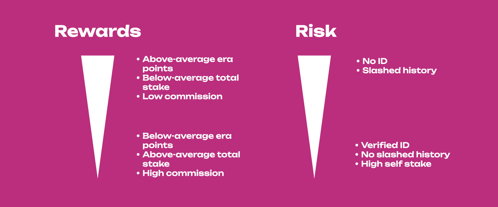

import RPC from "./../../components/RPC-Connection";

:::tip New to Staking?

Start your staking journey or explore more information about staking on
[Polkadot's Home Page](https://polkadot.network/staking/). Discover the new
[Staking Dashboard](https://staking.polkadot.network/#/overview) that makes staking much easier and
check this
[extensive article list](https://support.polkadot.network/support/solutions/articles/65000182104) to
help you get started.
{{ polkadot: You can now [stake natively with just 1 DOT and earn staking rewards](https://polkadot.network/blog/nomination-pools-are-live-stake-natively-with-just-1-dot/). :polkadot }}
{{ kusama: All the examples presented on Polkadot apply to Kusama as well. :kusama }}

:::

Here you will learn about what staking is, why it is important and how it works on
{{ polkadot: Polkadot :polkadot }}{{ kusama: Kusama :kusama }}.

## Proof-of-Stake (PoS)

Blockchain networks use [consensus](learn-consensus.md/#why-do-we-need-consensus) mechanisms to
finalize blocks on the chain. Consensus is the process of agreeing on something, in this case, the
progression of the blockchain or how blocks are added to the chain. Consensus consists of two
actions:

- **Block production**, i.e. the way multiple blocks candidates are produced, and
- **Block finality**, i.e. the way only one block out of many candidates is selected and added to
  the canonical chain (see [this](learn-consensus.md/#probabilistic-vs-provable-finality) article
  for more information about finality).

Proof-of-Work (PoW) and Proof-of-Stake (PoS) are well-known mechanisms used to reach consensus in a
secure and trustless way on public blockchains, where there are many participants who do not know
each other (and probably never will). In PoW, network security relies on the fact that the miners
who are responsible for adding blocks to the chain must compete to solve difficult mathematic
puzzles to add blocks - a solution that has been criticized for the wastage of energy. For doing
this work, miners are typically rewarded with tokens.

In PoS networks like {{ polkadot: Polkadot :polkadot }}{{ kusama: Kusama :kusama }} the security of
the network depends on the amount of capital locked on the chain: the more the capital locked, the
lower the chance of an attack on the network, as the attacker needs to incur a heavy loss to
orchestrate a successful attack (more on this later on). The process of locking tokens on the chain
is called **staking**.

Similar to the miners in PoW networks, PoS networks have **validators**, but they do not have to
compete with each other to solve mathematical puzzles. They are instead pre-selected to produce the
blocks based on the stake backing them. Token holders can lock funds on the chain and for doing so,
they are getting **staking rewards**. There is thus an economic incentive for token holders to
become active participants who contribute to the economic security and stability of the network. PoS
networks in general are therefore more inclusive than PoW networks, as participants do not need to
have either technical knowledge about blockchain technology or experience in running mining
equipment.

PoS ensures that everybody participating in the staking process has "skin in the game" and thus can
be held accountable. In case of misbehavior, participants in the staking process can be punished or
**slashed**, and depending on the gravity of the situation, their stake can be partly or fully
confiscated by the network. It is not in a staker's economic interest to orchestrate an attack and
risk losing tokens. Any rational actor staking on the network would want to get rewarded, and the
PoS network rewards good behavior and punishes bad behavior.

## Nominated Proof-of-Stake (NPoS)

{{ polkadot: Polkadot :polkadot }}{{ kusama: Kusama :kusama }} implements
[Nominated Proof-of-Stake (NPoS)](learn-consensus.md/#nominated-proof-of-stake), a relatively novel
and sophisticated mechanism to select the validators who are allowed to participate in its
[consensus](learn-consensus.md) protocol. NPoS encourages
{{ polkadot: DOT :polkadot }}{{ kusama: KSM :kusama }} holders to participate as **nominators**.

Any potential validators can indicate their intention to be a validator candidate. Their candidacies
are made public to all nominators, and a nominator, in turn, submits a list of up to
{{ polkadot: <RPC network="polkadot" path="consts.staking.maxNominations" defaultValue={16}/> :polkadot }}
{{ kusama: <RPC network="kusama" path="consts.staking.maxNominations" defaultValue={24}/> :kusama }}
candidates that it supports, and the network will automatically distribute the stake among
validators in an even manner so that the economic security is maximized. In the next era, a certain
number of validators having the most {{ polkadot: DOT :polkadot }}{{ kusama: KSM :kusama }} backing
get elected and become active. For more information about the election algorithm go to
[this](learn-phragmen.md) page on the wiki or
[this](https://research.web3.foundation/en/latest/polkadot/NPoS/1.%20Overview.html?highlight=proportional%20justified%20representation#)
research article. As a nominator, a minimum of
{{ polkadot: <RPC network="polkadot" path="query.staking.minNominatorBond" defaultValue={100000000000} filter="humanReadable"/> :polkadot }}
{{ kusama: <RPC network="kusama" path="query.staking.minNominatorBond" defaultValue={100000000000} filter="humanReadable"/> :kusama }}
is required to submit an intention to nominate, which can be thought of as registering to be a
nominator. Note that in NPoS the stake of both nominators and validators can be slashed. For an
in-depth review of NPoS see
[this](https://research.web3.foundation/en/latest/polkadot/NPoS/index.html) research article.

:::caution Minimum Nomination to Receive Staking Rewards

Although the minimum nomination intent is
{{ polkadot: <RPC network="polkadot" path="query.staking.minNominatorBond" defaultValue={100000000000} filter="humanReadable"/> :polkadot }}{{ kusama: <RPC network="kusama" path="query.staking.minNominatorBond" defaultValue={100000000000} filter="humanReadable"/> :kusama }},
it does not guarantee staking rewards. The nominated amount has to be greater than
[minimum active nomination](learn-nominator.md#minimum-active-nomination-to-receive-staking-rewards),
which is a dynamic value that can be much higher than
{{ polkadot: <RPC network="polkadot" path="query.staking.minNominatorBond" defaultValue={100000000000} filter="humanReadable"/> :polkadot }}{{ kusama: <RPC network="kusama" path="query.staking.minNominatorBond" defaultValue={100000000000} filter="humanReadable"/> :kusama }}.
This dynamic value depends on the amount of {{ polkadot: DOT :polkadot }}{{ kusama: KSM :kusama }}
being staked, in addition to the selected nominations.

:::

### Nominating Validators

Nominating on {{ polkadot: Polkadot :polkadot }}{{ kusama: Kusama :kusama }} requires 2 actions:

- Locking tokens on-chain.
- Selecting a set of validators, to whom these locked tokens will automatically be allocated to.

How many tokens you lock up is completely up to you - as are the validators you wish to select. The
action of locking tokens is also known as **bonding**. You can also refer to your locked tokens as
your bonded tokens, or staked tokens. Likewise, selecting validators is also known as backing or
nominating validators. These terms are used interchangeably by the community. From now on locked
tokens will be referred to as bonded tokens.

Once the previous 2 steps are completed and you are nominating, your bonded tokens could be
allocated to one or more of your selected validators, and this happens every time the active
validator set changes. This validator set is updated every era on
{{ polkadot: Polkadot :polkadot }}{{ kusama: Kusama :kusama }}.

Unlike other staking systems, Polkadot automatically chooses which of your selected validators will
be backed by your bonded tokens. Selecting a group of validators increases your chances of
consistently backing at least one who is active. This results in your bonded tokens being allocated
to validators more often, which means more network security and more rewards. This is in strong
contrast to other staking systems that only allow you to back one validator; if that validator is
not active, you as a staker will also not be. Polkadot's nomination model solves this.

{{ polkadot: Polkadot :polkadot }}{{ kusama: Kusama :kusama }} uses tools ranging from election
theory to game theory to discrete optimization, to develop an efficient validator selection process
that offers fair representation and security, thus avoiding uneven power and influence among
validators. The election algorithms used by
{{ polkadot: Polkadot :polkadot }}{{ kusama: Kusama :kusama }} are based on the Proportional
Justified Representation (PJR) methods like [Phragmen](learn-phragmen.md). For more information
about PJR methods visit
[this](https://research.web3.foundation/en/latest/polkadot/NPoS/1.%20Overview.html?highlight=proportional%20justified%20representation#)
research article.

### Eras and Sessions

The stake from nominators is used to increase the number of tokens held by such candidates,
increasing their chance of being selected by the election algorithm for block production during a
specific **era**. An era is a period of
{{ polkadot: 24 hours :polkadot }}{{ kusama: 6 hours :kusama }} during which an **active set** of
validators is producing blocks and performing other actions on the chain. This means that not all
validators are in the active set and such set changes between eras. Each era is divided into 6
epochs or **sessions** during which validators are assigned as block producers to specific time
frames or **slots**. This means that validators know the slots when they will be required to produce
a block within a specific session, but they do not know all the slots within a specific era. Having
sessions adds a layer of security because it decreases the chance of having multiple validators
assigned to a slot colluding to harm the network.

### Staking Rewards

Validators who produce a block are rewarded with tokens, and they can share rewards with their
nominators. Both validators and nominators can stake their tokens on chain and receive staking
rewards at the end of each era. The staking system pays out rewards equally to all validators
regardless of stake. Thus, having more stake in a validator does not influence the amount of block
rewards it receives. This avoids the centralization of power to a few validators. There is a
probabilistic component in the calculation of rewards, so they may not be exactly equal for all
validators. In fact, during each era validators can earn **era points** by doing different tasks on
chain. The more the points, the higher the reward for a specific era. This promotes validators'
activity on chain. To know more about era points, and how and on which basis they are distributed
visit the [dedicated page](../maintain/maintain-guides-validator-payout.md). Distribution of the
rewards is pro-rata to all stakers after the validator's commission is deducted.

### Skin in the game when Staking

The security of PoS networks depends on the amount of staked tokens. To successfully attack the
network, a malicious actor would need to accrue a large number of tokens or would need different
participants to collude and act maliciously. If there is an attack in the case of NPoS, both the
validator(s) and nominators will be slashed resulting in their stake being partially or fully
confiscated by the network and then deposited to the treasury. There is little interest for a
rational network participant to act in a harmful way because NPoS ensures that all participants can
be held accountable for their bad actions. In NPoS, validators are paid equal rewards regardless of
the amount of stake backing them, thus avoiding large payouts to few large validators which might
lead to centralization.

## Being a Nominator

### Tasks and Responsibilities of a Nominator

**Validators.** Since validator slots are limited, most of those who wish to stake their
{{ polkadot: DOT :polkadot }}{{ kusama: KSM :kusama }} and contribute to the economic security of
the network will be nominators, thus here we focus on the role of nominators. However, it is worth
mentioning that validators do most of the heavy lifting: they run the validator nodes and manage
[session keys](https://research.web3.foundation/en/latest/polkadot/keys/index.html?highlight=session%20keys),
produce new block candidates in [BABE](learn-consensus.md/#block-production-babe), vote and come to
consensus in [GRANDPA](learn-consensus.md/#finality-gadget-grandpa), validate the state transition
function of parachains, and possibly some other responsibilities regarding data availability and
[XCM](learn-xcm.md). For more information, you can take a look at the
[validator docs](learn-validator.md) to understand what you need to do as a validator. If you want
to become a validator you can consult
[this](../maintain/maintain-guides-how-to-validate-polkadot.md) guide.

**Nominators.** Nominators have far fewer responsibilities than validators. These include selecting
validators and monitoring their performance, keeping an eye on changing commission rates (a
validator can change commission at any time), and general health monitoring of their validators'
accounts. Thus, while not being completely set-it-and-forget-it, a nominator's experience is
relatively hands-off compared to that of a validator, and even more with
[nomination pools](./learn-nomination-pools.md). For more information, you can take a look at the
nominator [guide](learn-nominator.md) to understanding your responsibilities as a nominator.

If you want to become a nominator, see
[this](../maintain/maintain-guides-how-to-nominate-polkadot.md) guide. If you are a beginner and
would like to securely stake your tokens using the Polkadot-JS UI, refer to
[this](https://support.polkadot.network/support/solutions/articles/65000168057-how-do-i-stake-nominate-on-polkadot-)
support article.
{{ kusama: The tutorial presented in the support article is demonstrated on Polkadot, but the procedure is the same for Kusama. :kusama }}

:::info Polkadot Staking Dashboard

The [Staking Dashboard](https://staking.polkadot.network/dashboard/#/overview) provides a more
user-friendly alternative to staking. See the instructions in
[this](https://support.polkadot.network/support/solutions/articles/65000182133-how-to-use-the-staking-dashboard-staking-your-dot)
support article to learn how to stake with the dashboard.

:::

**Pools.** Pools are "built" on top of NPoS to provide a very low barrier to entry to staking,
without sacrificing Polkadot's strict security model.

### Selection of Validators

The task of choosing validators is not simple, as it should take into account nominator reward and
risk preferences. Ideally one aims to maximize the reward-to-risk ratio by maximizing rewards and
minimizing risks, with sometimes having to compromise between the two, as minimizing risks might
decrease rewards as well. Nominators should pay attention, especially to six criteria when
nominating validators (not in order of importance):

- recent history of the era points earned across eras
- validator's self stake (shows skin in the game)
- total stake backing the validator (which is the sum of self stake and the stake coming from
  nominators)
- commission fees (i.e. how much validators charge nominators)
- verified identity
- previous slashes

The diagram below shows how the selection of those criteria affects the reward-to-risk ratio.

#### Validator Selection Criteria

To maximize rewards and minimize risk, one could select those validators that:

- have era points above average (because they will get more rewards for being active),
- have the total stake backing the validator below the average active validator stake (because they
  will pay out more rewards per staked {{ polkadot: DOT :polkadot }}{{ kusama: KSM :kusama }}),
- have high own stake (because if slashed they have something to lose),
- have low commission fees but not 0% (because it makes sense that for doing the heavy lifting,
  validators ask for a small commission),
- have on-chain registered identity (because it adds a layer of trust and possibly provides access
  to their website and contact details),
- and have not been slashed (meaning that their on-chain behavior is genuine).

#### Network Providers

For successful operation, a Validator node should always be ensured to meet the required
[software, hardware, and network bandwidth specifications](../maintain/maintain-guides-how-to-validate-polkadot#reference-hardware).
Understandably, most of the validator nodes run on cloud service providers that guarantee high
hardware specifications and high levels of availability and connectivity. Keep in mind that a
validator in the active set is supposed to be fully online and available for producing blocks. If
the active validator node goes offline due to network interruptions or a power outage, that
validator might be subject to
[slashing due to unresponsiveness](./learn-staking-advanced#unresponsiveness). As
[Polkadot's block production mechanism](./learn-consensus.md#block-production-babe) is reasonably
resilient to a small proportion of validators going offline, no slashing is imposed until 10% of the
validators in the active set go offline. Hence, if multiple nodes are running on a single cloud
service provider and go offline simultaneously due to an outage or due to a change in their terms
and conditions policy regarding the support of Proof-of-Stake (PoS) operations, the offline
validators and all the nominators backing them can be slashed up 7% of their stake on Polkadot.
Hence, it is recommended that you check if you are nominating the validator nodes that are running
on cloud service providers, and if they do, check if they allow for Proof-of-Stake operations.

:::tip Checking Validators using Network Providers

You can connect your stash account to the [Polkawatch app](https://polkawatch.app/). The app will
show your rewards earned in the past 60 eras divided by network provider and country. You will be
able to see networks used by each validator and verify if your validators are using providers who
support PoS. This is also a great tool to explore how decentralized your nominations are and act
accordingly.

:::

#### Keeping Track of Nominated Validators

:::caution Nominators must periodically check their validators

Nominating is _not_ a "set and forget" operation. The whole NPoS system is dynamic and nominators
should periodically monitor the performance and reputation of their validators. Failing to do so
could result in applied slashes and/or rewards not being paid out, possibly for a prolonged period.

:::

Although the theory can be used as a general guideline, in practice it is more complicated and
following the theory might not necessarily lead to the desired result. Validators might have the
total stake backing them below average, low commission and above average era points in one era and
then have a different profile in the next one. Selection based the criteria like on-chain identity,
slash history and low commission make the staking rewards deterministic. But some criteria vary more
than others, with era points being the most variable and thus one of the key probabilistic
components of staking rewards. Part of this probability is directly related to the fact that a
validator can produce blocks for a parachain (i.e. para-validators) or the relay chain, with
para-validators earning more era points per unit time (see
[this](../maintain/maintain-guides-validator-payout.md#era-points) page for more information). The
role can switch between sessions, and you can look at
[the staking tab on the Polkadot-JS UI](https://polkadot.js.org/apps/#/staking) to know which
validator is producing blocks for the relay chain or parachains.

It is not recommended to change nominations because of the low era points of a validator in a single
era. Variability in rewards due to the era points should level out over time. If a validator
consistently gets era points below average, it makes sense to nominate a better-performing validator
for the health of the network and increased staking rewards. See
[this](https://support.polkadot.network/support/solutions/articles/65000150130-how-do-i-know-which-validators-to-choose-)
support article to understand in detail how to select the set of validators to nominate.

### Stash and Controller Accounts for Staking

Two different accounts can be used to securely manage your funds while staking.

- **Stash:** This account holds funds bonded for staking, but delegates some functions to a
  controller account. As a result, you may actively participate in staking with a stash private key
  kept in a cold wallet like Ledger, meaning it stays offline all the time. Stash account keys are
  used to sign staking actions such as bonding additional funds.

- **Controller:** This account acts on behalf of the stash account, signaling decisions about
  nominating and validating. It can set preferences like commission (for validators) and the staking
  rewards payout account. The earned rewards can be bonded (locked) immediately for bonding on your
  stash account, which would effectively compound the rewards you receive over time. You could also
  choose to have them deposited to your controller account or a different account as a free
  (transferable) balance. If you are a validator, it can also be used to set your
  [session keys](learn-cryptography.md). Controller accounts only need sufficient funds to pay for
  the transaction fees.

:::warning

Never leave a high balance on a controller account which are usually "hot" as their private key is
stored on the device (PC, phone) and it is always exposed to the internet for potential hacks and
scams. It is good practice to deposit rewards on the stash account or to send them to another
account on a cold wallet.

:::

This hierarchy of separate keys for stash and controller accounts was designed to add a layer of
protection to nominators and validator operators. The more often one exposes and uses a private key,
the higher its vulnerability for hacks or scams. So, if one uses a key for multiple roles on a
blockchain network, it is likely that the account can get compromised. Note that the damage linked
to stolen private keys is different depending on the type of account derivation. In the case of soft
derivation, all derived accounts are compromised. More information about account derivation can be
found [here](../learn/learn-accounts.md/#derivation-paths).

:::info

For Ledger users staking directly on Ledger Live, currently, there is no option to use separate
stash and controller accounts. That is if you stake on Ledger Live your stash account will be your
controller too.

Ledger devices are now supported in [Talisman](https://talisman.xyz/) extension. Users can import
their Ledger accounts in the extension and use them as a stash and controller. You can find more
information about Talisman and other third-party wallets that officially secured funding from the
treasury [here](..//build/build-wallets.md/#treasury-funded-wallets).

:::

### Claiming Staking Rewards

{{ kusama: Note that Kusama runs approximately 4x as fast as Polkadot, except for block production times.
Polkadot will also produce blocks at approximately six-second intervals. :kusama }}

Rewards are calculated per era (approximately six hours on Kusama and twenty-four hours on
Polkadot). These rewards are calculated based on era points, which have a probabilistic component.
In other words, there may be slight differences in your rewards from era to era, and even amongst
validators in the active set at the same time. These variations should cancel out over a long enough
timeline. See the page on [Validator Payout Guide](../maintain/maintain-guides-validator-payout.md).

The distribution of staking rewards to the nominators is not automatic and needs to be triggered by
someone. Typically the validators take care of this, but anyone can permissionlessly trigger rewards
payout for all the nominators whose stake has backed a specific validator in the active set of that
era. Staking rewards are kept available for 84 eras, which is approximately
{{ polkadot: 84 days :polkadot }}{{ kusama: 21 days :kusama }}. For more information on why this is
so, see the page on [simple payouts](learn-staking-advanced.md).

:::info Payouts

Payouts are unclaimed rewards waiting to be paid out to both validators and nominators. If you go to
the Staking payouts page on [Polkadot-JS](https://polkadot.js.org/apps/#/staking), you will see a
list of all validators that you have nominated in the past 84 eras and for which you have not yet
received a payout. The payout page is visible only to stakers.

Each validator as well as their nominators have the option to trigger the payout for all unclaimed
eras. Note that this will pay everyone who was nominating that validator during those eras.
Therefore, you may not see anything in this tab, yet still have received a payout if somebody
(generally, but not necessarily, another nominator or the validator operator) has triggered the
payout for that validator for that era.

:::

:::warning Time limit to claim staking rewards

If nobody claims your staking rewards within 84 eras, then you will not be able to claim them and
they will be lost. Additionally, if the validator unbonds all their own stake, any pending payouts
will also be lost. Since unbonding takes
{{ polkadot: <RPC network="polkadot" path="query.staking.bondingDuration" defaultValue={28}/> days :polkadot }}{{ kusama: <RPC network="kusama" path="query.staking.bondingDuration" defaultValue={7}/> days :kusama }},
nominators should check if they have pending payouts at least this often.

:::

Rewards can be directed to the same account used to sign the payout (controller), or to the stash
account (and either increasing the staked value or not increasing the staked value), or to a
completely unrelated account. It is also possible to top-up / withdraw some bonded tokens without
having to un-stake all staked tokens.

If you wish to know if you received a payout, you will have to check via a block explorer. See
[the relevant Support page](https://support.polkadot.network/support/solutions/articles/65000168954-how-can-i-see-my-staking-rewards-)
for details. For specific details about validator payouts, please see
[this guide](../maintain/maintain-guides-validator-payout.md).

### Slashing

Slashing will happen if a validator misbehaves (e.g. goes offline, attacks the network, or runs
modified software) in the network. They and their nominators will get slashed by losing a percentage
of their bonded/staked DOT.

Any slashed DOT will be added to the [Treasury](learn-treasury.md). The rationale for this (rather
than burning or distributing them as rewards) is that slashes may then be reverted by the Council by
simply paying out from the Treasury. This would be useful in situations such as faulty slashes. In
the case of legitimate slashing, it moves tokens away from malicious validators to those building
the ecosystem through the normal Treasury process.

Validators with a larger total stake backing them will get slashed more harshly than less popular
ones, so we encourage nominators to shift their nominations to less popular validators to reduce
their possible losses.

It is important to realize that slashing only occurs for active validations for a given nominator,
and slashes are not mitigated by having other inactive or waiting nominations. They are also not
mitigated by the validator operator running separate validators; each validator is considered its
own entity for purposes of slashing, just as they are for staking rewards.

In rare instances, a nominator may be actively nominating several validators in a single era. In
this case, the slash is proportionate to the amount staked to that specific validator. With very
large bonds, such as parachain liquid staking accounts, a nominator has multiple active nominations
per era (Acala's LDOT nominator typically has 7-12 active nominations per era). Note that you cannot
control the percentage of stake you have allocated to each validator or choose who your active
validator will be (except in the trivial case of nominating a single validator). Staking allocations
are controlled by the [Phragmén algorithm](learn-phragmen.md).

Once a validator gets slashed, it goes into the state as an "unapplied slash". You can check this
via
[Polkadot-JS UI](https://polkadot.js.org/apps/?rpc=wss%3A%2F%2Frpc.polkadot.io#/staking/slashes).
The UI shows it per validator and then all the affected nominators along with the amounts. While
unapplied, a governance proposal can be made to reverse it during this period (7 days on Kusama, 28
days on Polkadot). After the grace period, the slashes are applied.

The following levels of offense are
[defined](https://research.web3.foundation/en/latest/polkadot/slashing/amounts.html). However, these
particular levels are not implemented or referred to in the code or in the system; they are meant as
guidelines for different levels of severity for offenses. To understand how slash amounts are
calculated, see the equations in the section below.

- Level 1: isolated [unresponsiveness](./learn-staking-advanced.md/#unresponsiveness), i.e. being
  offline for an entire session. Generally no slashing, only [chilling](#chilling).
- Level 2: concurrent unresponsiveness or isolated
  [equivocation](./learn-staking-advanced.md/#equivocation), slashes a very small amount of the
  stake and chills.
- Level 3: misconducts unlikely to be accidental, but which do not harm the network's security to
  any large extent. Examples include concurrent equivocation or isolated cases of unjustified voting
  in [GRANDPA](learn-consensus.md). Slashes a moderately small amount of the stake and chills.
- Level 4: misconduct that poses serious security or monetary risk to the system, or mass collusion.
  Slashes all or most of the stake behind the validator and chills.

If you want to know more details about slashing, please look at our
[research page](https://research.web3.foundation/en/latest/polkadot/slashing/amounts.html).

### Chilling

Chilling is the act of stepping back from any nominating or validating. It can be done by a
validator or nominator at any time, taking effect in the next era. It can also specifically mean
removing a validator from the active validator set by another validator, disqualifying them from the
set of electable candidates in the next NPoS cycle.

Chilling may be voluntary and validator-initiated, e.g. if there is a planned outage in the
validator's surroundings or hosting provider, and the validator wants to exit to protect themselves
against slashing. When voluntary, chilling will keep the validator active in the current session,
but will move them to the inactive set in the next. The validator will not lose their nominators.

When used as part of a punishment (initiated externally), being chilled carries an implied penalty
of being un-nominated. It also disables the validator for the remainder of the current era and
removes the offending validator from the next election.

Polkadot allows some validators to be disabled, but if the number of disabled validators gets too
large, Polkadot will trigger a new validator election to get a full set. Disabled validators will
need to resubmit their intention to validate and re-garner support from nominators.

For more on chilling, see the "[How to Chill][]" page on this wiki.

## Why and Why not to Stake?

### Pros of Staking

- Earn rewards for contributing to the network's security through staking.
- Low barrier of entry through [Nomination Pools](learn-nomination-pools.md).
- Can choose up-to
  {{ polkadot: <RPC network="polkadot" path="consts.staking.maxNominations" defaultValue={16}/> :polkadot }}
 {{ kusama: <RPC network="kusama" path="consts.staking.maxNominations" defaultValue={24}/> :kusama }} validators which can help to decentralize the network through the sophisticated
  [NPoS system](learn-consensus.md/#nominated-proof-of-stake)
- 10% inflation/year of the tokens is primarily intended for staking rewards.

When the system staking rate matches with the ideal staking rate, the entire inflation of the
network is given away as the staking rewards.
{{ polkadot: Up until now, the network has been following an inflation model that excludes the metric of active parachains. :polkadot }}
The ideal staking rate is a dynamic value - as the number of active parachains influences the
available liquidity that is available to secure the network.

Any divergence from the ideal staking rate will result in the distribution of a proportion of the
newly minted tokens through inflation to go to the treasury.Keep in mind that when the system's
staking rate is lower than the ideal staking rate, the annual nominal return rate will be higher,
encouraging more users to use their tokens for staking. On the contrary, when the system staking
rate is higher than the ideal staking rate, the annual nominal return will be less, encouraging some
users to withdraw. For in-depth understanding, check the
[inflation](learn-staking-advanced.md#inflation) section on the Wiki.

### Cons of Staking

- Tokens will be locked away for about 28 days on Polkadot after unbonding, and seven days on
  Kusama. No rewards will be earned during the unbonding period.
- Possible punishment in case of the active validator found to be misbehaving (see
  [slashing](#slashing)).
- Lack of liquidity i.e. You would not be able to use the tokens for participating in crowdloans or
  transfer them to different account etc.

## How many Validators does Polkadot have?

Polkadot currently has
{{ polkadot: <RPC network="polkadot" path="query.staking.validatorCount" defaultValue={297}/> :polkadot }}
{{ kusama: <RPC network="polkadot" path="query.staking.validatorCount" defaultValue={297}/> :kusama }}
validators. The top bound on the number of validators has not been determined yet, but should only
be limited by the bandwidth strain of the network due to peer-to-peer message passing. The estimate
of the number of validators that Polkadot will have at maturity is around 1000. Kusama, Polkadot's
canary network, currently has
{{ polkadot: <RPC network="kusama" path="query.staking.validatorCount" defaultValue={1000}/> :polkadot }}
{{ kusama: <RPC network="kusama" path="query.staking.validatorCount" defaultValue={1000}/> :kusama }}
validator slots in the active set.

## Resources

- [How Nominated Proof of Stake will work in Polkadot](https://medium.com/web3foundation/how-nominated-proof-of-stake-will-work-in-polkadot-377d70c6bd43) -
  Blog post by Web3 Foundation researcher Alfonso Cevallos covering NPoS in Polkadot.
- [Validator setup](../maintain/maintain-guides-secure-validator.md)

[epoch]: ../general/glossary.md#epoch
[how to chill]: ../maintain/maintain-guides-how-to-chill.md
