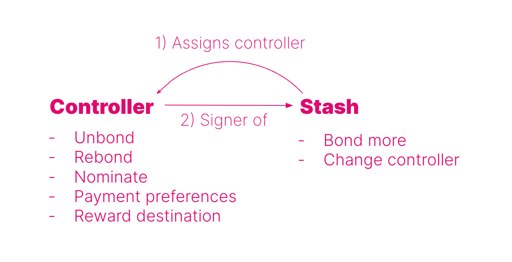

import RPC from "./../../components/RPC-Connection"

Here you will learn about what staking is, why it is important and how it works on
{{ polkadot: Polkadot :polkadot }}{{ kusama: Kusama :kusama }}.

## Proof-of-Stake (PoS)

Blockchain networks use [consensus](learn-consensus.md/#why-do-we-need-consensus) mechanisms to finalize
blocks on the chain. Consensus is the process of agreeing on something, in this case, the progression
of the blockchain or how blocks are added to the chain. Consensus consists of two actions:

- **block production**, i.e. the way multiple blocks candidates are produced, and 
- **block finality**, i.e. the way only one block out of many candidates is selected and added to the canonical chain (see [this](learn-consensus.md/#probabilistic-vs-provable-finality) article for more information about finality).

Proof-of-Work (PoW) and Proof-of-Stake (PoS) are well-known mechanisms used to reach consensus in a secure and trustless way on public blockchains, where there are many participants who do not know each other (and probably never will). In PoW, network security relies on the fact that the miners who are responsible for adding blocks to the chain must compete to solve difficult mathematic puzzles to add blocks - a solution that has been criticized for the wastage of energy. For doing this work, miners are typically rewarded with tokens. 

In PoS networks like {{ polkadot: Polkadot :polkadot }}{{ kusama: Kusama :kusama }} the
security of the network depends on the amount of capital locked on the chain: the more the capital
locked, the lower the chance of an attack on the network, as the attacker
needs to incur a heavy loss to orchestrate a successful attack (more on this later on). The process of
locking tokens on the chain is called **staking**.

Similar to the miners in PoW networks, PoS networks have **validators**, but they do not have to compete with each other to solve mathematical puzzles.
They are instead pre-selected to produce the blocks based on the stake backing them.
Token holders can lock funds on the chain and for doing so, they are getting **staking rewards**. There is
thus an economic incentive for token holders to become active participants who contribute to the economic security and stability of the network. PoS networks in general are therefore more inclusive
than PoW networks, as participants do not need to have either technical knowledge about
blockchain technology or experience in running mining equipment. 

PoS ensures that everybody participating in the staking process has
"skin in the game" and thus can be held accountable. In case of misbehavior, participants in the
staking process can be punished or **slashed**, and depending on the gravity of the situation, their
stake can be partly or fully confiscated by the network. It is not in a staker's economic interest to orchestrate an attack and risk losing tokens. Any rational actor staking on the network would want to get rewarded, and the PoS network rewards good behavior and punishes bad behavior.

## Nominated Proof-of-Stake (NPoS)

{{ polkadot: Polkadot :polkadot }}{{ kusama: Kusama :kusama }} implements [Nominated Proof-of-Stake (NPoS)](learn-consensus.md/#nominated-proof-of-stake),
a relatively novel and sophisticated mechanism to select the validators who are allowed to participate in 
its [consensus](learn-consensus.md) protocol. The NPoS encourages {{ polkadot: DOT :polkadot }}{{ kusama: KSM :kusama }} 
holders to participate as nominators. NPoS encourages {{ polkadot: DOT :polkadot }}{{ kusama: KSM :kusama }}
holders to participate as **nominators**. 

Any potential validators can indicate their intention to be a validator candidate. Their candidacies
are made public to all nominators, and a nominator, in turn, submits a list of up to
{{ polkadot: <RPC network="polkadot" path="consts.staking.maxNominations" defaultValue={16}/> :polkadot }}
{{ kusama: <RPC network="kusama" path="consts.staking.maxNominations" defaultValue={24}/> :kusama }}
candidates that it supports, and the network will automatically distribute the stake among validators in
an even manner so that the economic security is maximized. In the next era, a certain number of validators having the most
{{ polkadot: DOT :polkadot }}{{ kusama: KSM :kusama }} backing get elected and become active. For more information about the election algorithm go to [this](learn-phragmen.md) page on the wiki or [this](https://research.web3.foundation/en/latest/polkadot/NPoS/1.%20Overview.html?highlight=proportional%20justified%20representation#) research article. As a
nominator, a minimum of
{{ polkadot: <RPC network="polkadot" path="query.staking.minNominatorBond" defaultValue={100000000000} filter="humanReadable"/> :polkadot }}
{{ kusama: <RPC network="kusama" path="query.staking.minNominatorBond" defaultValue={100000000000} filter="humanReadable"/> :kusama }}
is required to submit an intention to nominate. Note that in NPoS the stake of both nominators and validators can be slashed.  For an in-depth review of NPoS see
[this](https://research.web3.foundation/en/latest/polkadot/NPoS/index.html) research article.

:::caution Minimum Nomination to Receive Staking Rewards

Although the minimum nomination intent is
{{ polkadot: <RPC network="polkadot" path="query.staking.minNominatorBond" defaultValue={100000000000} filter="humanReadable"/> :polkadot }}{{ kusama: <RPC network="kusama" path="query.staking.minNominatorBond" defaultValue={100000000000} filter="humanReadable"/> :kusama }},
it does not guarantee staking rewards. The nominated amount has to be greater than
[minimum active nomination](learn-nominator.md#minimum-active-nomination-to-receive-staking-rewards),
which is a dynamic value that can be much higher than
{{ polkadot: <RPC network="polkadot" path="query.staking.minNominatorBond" defaultValue={100000000000} filter="humanReadable"/> :polkadot }}{{ kusama: <RPC network="kusama" path="query.staking.minNominatorBond" defaultValue={100000000000} filter="humanReadable"/> :kusama }}.

:::

### Nominating Validators

The action of nominating consists of:

- locking or bonding tokens (stake) on the chain, and
- nominating a set of validator candidates to whom the stake will
be allocated. 

{{ polkadot: Polkadot :polkadot }}{{ kusama: Kusama :kusama }} uses tools ranging
from election theory to game theory to discrete optimization, to develop an efficient validator
selection process that offers fair representation and security, thus avoiding uneven power and
influence among validators. The election algorithms used by {{ polkadot: Polkadot :polkadot }}{{ kusama: Kusama :kusama }} are based on the Proportional Justified Representation (PJR) methods like [Phragmen](learn-phragmen.md). For more information about PJR methods visit [this](https://research.web3.foundation/en/latest/polkadot/NPoS/1.%20Overview.html?highlight=proportional%20justified%20representation#) research article.

### Eras and Sessions

The stake from nominators is used to increase the number of tokens held by such candidates, increasing their chance of being selected by the election algorithm for block
production during a specific **era**. An era is a period of {{ polkadot: 24 hours :polkadot }}{{ kusama: 6 hours :kusama }} during
which an **active set** of validators is producing blocks and performing other actions on the chain. This
means that not all validators are in the active set and such set changes between eras. Each era is
divided into 6 epochs or **sessions** during which validators are assigned as block producers to
specific time frames or **slots**. This means that validators know the slots when they will be
required to produce a block within a specific session, but they do not know all the slots within a
specific era. Having sessions adds a layer of security because it decreases the chance of having
multiple validators assigned to a slot colluding to harm the network.

### Staking Rewards

Validators who produce a block are rewarded with tokens, and they can share rewards with their
nominators. Both validators and nominators can stake their tokens on chain and receive staking
rewards at the end of each era. The staking system pays out rewards equally to all validators
regardless of stake. Thus, having more stake in a validator does not influence the amount of block rewards
it receives. This avoids the centralization of power to a few validators. There is a probabilistic
component in the calculation of rewards, so they may not be exactly equal for all validators. In
fact, during each era validators can earn **era points** by doing different tasks on chain. The more the points, the higher the reward for a specific era. This promotes validators' activity on chain.
To know more about era points, and how and on which basis they are distributed visit the
[dedicated page](../maintain/maintain-guides-validator-payout.md). Distribution of the rewards is pro-rata to all stakers after the validator's commission is deducted.

### Skin in the game when Staking

The security of PoS networks depends on the amount of staked tokens. To successfully attack the network, a malicious actor would need to accrue a large number of tokens or would need different participants to collude and act maliciously. If there is an attack in the case of NPoS, both the validator(s) and nominators will be
slashed resulting in their stake being partially or fully confiscated by the network and then deposited to the treasury. There is little interest for a rational network participant to act in a harmful way because NPoS ensures that all participants can be
held accountable for their bad actions. In NPoS, validators are paid equal rewards regardless of the amount of stake backing them, thus avoiding large payouts to few large validators which might lead to centralization.

## Being a nominator

### Tasks and Responsibilities of a Nominator

Since validator slots are limited, most of those who wish to stake their {{ polkadot: DOT :polkadot }}{{ kusama: KSM :kusama }} and contribute to the
economic security of the network will be nominators, thus here we focus on the role of nominators.
However, it is worth mentioning that validators do most of the heavy lifting: they run the validator nodes and manage
[session keys](https://research.web3.foundation/en/latest/polkadot/keys/index.html?highlight=session%20keys),
produce new block candidates in [BABE](learn-consensus.md/#block-production-babe), vote and come to
consensus in [GRANDPA](learn-consensus.md/#finality-gadget-grandpa), validate the state transition
function of parachains, and possibly some other responsibilities regarding data availability and
[XCM](learn-cross-consensus.md). For more information, you can take a look at the
[validator docs](learn-validator.md) to understand what you need to do as a validator. If you want
to become a validator you can consult [this](../maintain/maintain-guides-how-to-validate-polkadot.md) guide.

Nominators have far fewer responsibilities than validators. These include selecting validators and
monitoring their performance, keeping an eye on changing commission rates (a validator can change
commission at any time), and general health monitoring of their validators' accounts. Thus, while not
being completely set-it-and-forget-it, a nominator's experience is relatively hands-off compared to that of
a validator, and even more with [nominator pools](./learn-nomination-pools.md). For more information, you can take a look at the [nominator [guide](learn-nominator.md) to understanding your responsibilities as a nominator.

If you want to become a nominator, see
[this](../maintain/maintain-guides-how-to-nominate-polkadot.md) guide. If you are a beginner and
would like to securely stake your tokens using the Polkadot-JS UI, refer to [this](https://support.polkadot.network/support/solutions/articles/65000168057-how-do-i-stake-nominate-on-polkadot-) support article. {{ kusama: The tutorial presented in the support article is demonstrated on Polkadot, but the procedure is the same for Kusama :kusama }}

### Selection of Validators

The task of choosing validators is not simple, as it should take into account nominator reward and
risk preferences. Ideally one aims to maximize the reward-to-risk ratio by maximizing rewards and minimizing risks, with sometimes having to
compromise between the two, as minimizing risks might decrease rewards as well. Nominators should pay attention, especially to six criteria when nominating validators (not in order of importance):

- recent history of the era points earned across eras
- validator's self stake (shows skin in the game)
- total stake backing the validator (which is the sum of self stake and the stake coming from nominators)
- commission fees (i.e. how much validators charge nominators)
- verified identity
- previous slashes

The diagram below shows how the selection of those criteria affects the reward-to-risk ratio.

#### Validator Selection Criteria

To maximize rewards and minimize risk, one could select those validators
that:

- have era points above average (because they will get more rewards for being active), 
- have the total stake backing the validator below the average active validator stake (because they will pay out more rewards per staked {{ polkadot: DOT :polkadot }}{{ kusama: KSM :kusama }}), 
- have high own stake (because if slashed they have something to lose), 
- have low commission fees but not 0% (because it makes sense that for doing the heavy lifting, validators ask for a small commission), 
- have on-chain registered identity (because it adds a layer of trust and possibly provides access to their website and contact details), 
- and have not been slashed (meaning that their on-chain behavior is genuine).

#### Keeping Track of Nominated Validators

:::caution Nominators must periodically check their validators

Nominating is _not_ a "set and forget" operation. The whole NPoS system is dynamic and nominators should
periodically monitor the performance and reputation of their validators. Failing to do so could
result in applied slashes and/or rewards not being paid out, possibly for a prolonged period.

:::

Although the theory can be used as a general guideline, in practice it is more complicated and
following the theory might not necessarily lead to the desired result. Validators might have the total stake backing them below average, low commission and above average era points in one era and then have a different profile in the next one. Selection based the criteria like on-chain identity, slash history and low commission make the staking rewards deterministic. But some criteria vary more than others, with era points
being the most variable and thus one of the key probabilistic components of staking rewards. Part of this probability is directly related to the fact that a validator can produce blocks for a parachain (i.e. para-validators) or the relay chain, with para-validators earning more era points per unit time (see [this](../maintain/maintain-guides-validator-payout.md#era-points) page for more information). The role can switch between sessions, and you can look at [the staking tab on the Polkadot-JS UI](https://polkadot.js.org/apps/#/staking) to know which validator is producing blocks for the relay chain or parachains.

It is not recommended
to change nominations because of the low era points of a validator in a single era. Variability in rewards due to the era points should level out over time. If a validator consistently gets
era points below average, it makes sense to nominate a better-performing validator for the health of the network and increased staking rewards. See
[this](https://support.polkadot.network/support/solutions/articles/65000150130-how-do-i-know-which-validators-to-choose-)
support article to understand in detail how to select the set of validators to nominate.

### Stash and Controller Accounts for Staking

Two different accounts can be used to securely manage your funds while staking.

- **Stash:** This account holds funds bonded for staking, but delegates some functions to a
  controller account. As a result, you may actively participate in staking with a stash private key kept in
  a cold wallet like Ledger, meaning it stays offline all the time. Stash account keys are used to
  sign staking actions such as bonding additional funds.

- **Controller:** This account acts on behalf of the stash account, signaling decisions about
  nominating and validating. It can set preferences like commission (for validators) and the staking rewards payout
  account. The earned rewards can be bonded (locked) immediately for staking on your stash account,
  which would effectively compound the rewards you receive over time. You could also choose to have
  them deposited to your controller account or a different account as a free (transferable) balance.
  If you are a validator, it can also be used to set your [session keys](learn-keys.md#session-keys). Controller
  accounts only need sufficient funds to pay for the transaction fees.

:::warning

Never leave a high balance on a controller account which are usually "hot" as their
private key is stored on the device (PC, phone) and it is always exposed to the internet for potential hacks and scams. It is good practice to deposit rewards on the stash account or to send them to another
account on a cold wallet.

:::

This hierarchy of separate keys for stash and controller accounts was designed to add a layer of protection to nominators and validator operators. The more often one exposes and uses a private key, the higher its vulnerability for hacks or scams. So, if one uses a key
for multiple roles on a blockchain network, it is likely that the account can get compromised. Note that the damage linked to stolen private keys is different
depending on the type of account derivation. In the case of soft derivation, all derived accounts are
compromised. More information about account derivation can be found
[here](../learn/learn-accounts.md/#derivation-paths).

:::info

For Ledger users staking directly on Ledger Live, currently, there is no option to use separate stash and controller accounts. That is if you stake on Ledger Live your stash account will be your controller too.

:::

### Claiming Staking Rewards

{{ kusama: Note that Kusama runs approximately 4x as fast as Polkadot, except for block production times.
Polkadot will also produce blocks at approximately six-second intervals. :kusama }}

Rewards are calculated per era (approximately six hours on Kusama and twenty-four hours on Polkadot). These rewards are calculated based on era points, which have a probabilistic component. In other words,
there may be slight differences in your rewards from era to era, and even amongst validators in the
active set at the same time. These variations should cancel out over a long enough timeline. See the
page on [Validator Payout Guide](../maintain/maintain-guides-validator-payout.md).

The distribution of staking rewards to the nominators is not automatic and needs to be triggered by someone. Typically the validators take care of this, but anyone can permissionlessly trigger rewards payout for all the nominators whose stake has backed a specific validator in the active set of that era. Staking rewards are kept available for 84 eras, which is approximately {{ polkadot: 84 days :polkadot }}{{ kusama: 21 days :kusama }}. For more information on why this is so, see the page on [simple payouts](learn-simple-payouts.md).

:::info Payouts

Payouts are unclaimed rewards waiting to be paid out to both validators and nominators. If you go to the Staking payouts page on
[Polkadot-JS](https://polkadot.js.org/apps/#/staking), you will see a list of all validators
that you have nominated in the past 84 eras and for which you have not yet received a payout. The payout page is visible only to stakers.

:::

Each validator as well as their nominators have the option to trigger the payout for all unclaimed eras. Note that this will pay everyone
who was nominating that validator during those eras. Therefore, you may not
see anything in this tab, yet still have received a payout if somebody (generally, but not
necessarily, another nominator or the validator operator) has triggered the payout for that
validator for that era.

:::warning Time limit to claim staking rewards

If nobody claims your staking rewards within 84 eras, then you will not be able to claim them and they will be lost. Additionally, if the validator unbonds all their own stake, any pending payouts will also be lost. Since unbonding takes {{ polkadot: <RPC network="polkadot" path="query.staking.bondingDuration" defaultValue={28}/> days :polkadot }}{{ kusama: <RPC network="kusama" path="query.staking.bondingDuration" defaultValue={7}/> days :kusama }}, nominators should check if they have pending payouts at least this often.

:::

Rewards can be directed to the same account used to sign the payout (controller), or to the stash account (and either
increasing the staked value or not increasing the staked value), or to a completely unrelated
account. It is also possible to top-up / withdraw some bonded tokens without having to un-stake all staked tokens.

If you wish to know if you received a payout, you will have to check via a block explorer. See
[the relevant Support page](https://support.polkadot.network/support/solutions/articles/65000168954-how-can-i-see-my-staking-rewards-)
for details. For specific details about validator payouts, please see
[this guide](../maintain/maintain-guides-validator-payout.md).

## Slashing

Slashing will happen if a validator misbehaves (e.g. goes offline, attacks the network, or runs
modified software) in the network. They and their nominators will get slashed by losing a percentage
of their bonded/staked DOT.

Any slashed DOT will be added to the [Treasury](learn-treasury.md). The rationale for this (rather
than burning or distributing them as rewards) is that slashes may then be reverted by the Council by
simply paying out from the Treasury. This would be useful in situations such as faulty slashes. In the case of
legitimate slashing, it moves tokens away from malicious validators to those building the ecosystem
through the normal Treasury process.

Validators with a larger total stake backing them will get slashed more harshly than less popular
ones, so we encourage nominators to shift their nominations to less popular validators to reduce
their possible losses.

It is important to realize that slashing only occurs for active validations for a given nominator,
and slashes are not mitigated by having other inactive or waiting nominations. They are also not
mitigated by the validator operator running separate validators; each validator is considered its
own entity for purposes of slashing, just as they are for staking rewards.

In rare instances, a nominator may be actively nominating several validators in a single era. In
this case, the slash is proportionate to the amount staked to that specific validator. Note that you cannot control the percentage of stake you have allocated
to each validator or choose who your active validator will be (except in the trivial case of
nominating a single validator). Staking allocations are controlled by the
[Phragmén algorithm](learn-phragmen.md).

Once a validator gets slashed, it goes into the state as an "unapplied slash". You can check this
via
[Polkadot-JS UI](https://polkadot.js.org/apps/?rpc=wss%3A%2F%2Frpc.polkadot.io#/staking/slashes).
The UI shows it per validator and then all the affected nominators along with the amounts. While
unapplied, a governance proposal can be made to reverse it during this period (7 days on Kusama, 28
days on Polkadot). After the grace period, the slashes are applied.

The following levels of offense are
[defined](https://research.web3.foundation/en/latest/polkadot/slashing/amounts.html). However, these
particular levels are not implemented or referred to in the code or in the system; they are meant as
guidelines for different levels of severity for offenses. To understand how slash amounts are
calculated, see the equations in the section below.

- Level 1: isolated [unresponsiveness](#unresponsiveness), i.e. being offline for an entire session. Generally no slashing, only [_chilling_](#chilling).
- Level 2: concurrent unresponsiveness or isolated [equivocation](#equivocation), slashes a very small amount of the stake and chills.
- Level 3: misconducts unlikely to be accidental, but which do not harm the network's security to
  any large extent. Examples include concurrent equivocation or isolated cases of unjustified voting
  in [GRANDPA](learn-consensus.md). Slashes a moderately small amount of the stake and chills.
- Level 4: misconduct that poses serious security or monetary risk to the system, or mass
  collusion. Slashes all or most of the stake behind the validator and chills.

If you want to know more details about slashing, please look at our [research page](https://research.web3.foundation/en/latest/polkadot/slashing/amounts.html).

### Unresponsiveness

For every session, validators will send an "I'm online" heartbeat to indicate they are live. If a
validator produces no blocks during an epoch and fails to send the heartbeat, it will be reported as
unresponsive. Slashing may occur depending on the repeated offenses and how many other validators
were unresponsive or offline during the epoch.

Validators should have a well-architected network infrastructure to ensure the node runs to reduce
the risk of slashing or chilling. A high availability setup is desirable, preferably with backup
nodes that kick in **only once the original node is verifiably offline** (to avoid double-signing
and being slashed for equivocation - see below). A comprehensive guide on validator setup is
available [here](../maintain/maintain-guides-secure-validator.md).

Here is the formula for calculating slashing due to unresponsiveness:

    Let x = offenders, n = total no. validators in the active set

    min((3 * (x - (n / 10 + 1))) / n, 1) * 0.07

The examples demonstrate how to calculate the slashing penalty for unresponsiveness.

:::note

In all of the examples, assume that there are 100 validators in the active set.

:::

No slashing would enact if < 10% of all validators are unresponsive.

For example, if exactly 10 validators were unresponsive, the expression 3 _ (x - (n / 10 + 1))) / n
would be 3 _ (10 - (100 / 10 + 1)) / 100 = 3 \* (10 - (10 + 1)) / 100 = -0.03 which is rounded to 0.

:::note

The minimum value between 0 and 1 is 0. 0 multiplied by 0.07 is 0.

:::

If 14 validators are unresponsive, then slashing would occur, as > 10% of validators are
unresponsive.

The slashing penalty would be min((3 _ (14 - (100 / 10 + 1))) / 100, 1) _ 0.07 = min((3 _ (14 -
11))/100, 1) _ 0.07 = min(0.09, 1) \* 0.07 = 0.6%

Similarly, if one-third of the validator set (around 33/100) are unresponsive, the slashing penalty
would be about 5%.

The maximum slashing that can occur due to unresponsiveness is 7%. After around 45% of the
validators go offline, the expression 3 _ (x - (n / 10 + 1))) / n will go beyond 1. Hence, min((3 _
(x - (n / 10 + 1))) / n, 1) \* 0.07 will be ceiled to 7%.

### Equivocation

**GRANDPA Equivocation**: A validator signs two or more votes in the same round on different chains.

**BABE Equivocation**: A validator produces two or more blocks on the Relay Chain in the same time
slot.

Both GRANDPA and BABE equivocation use the same formula for calculating the slashing penalty:

    Let x = offenders, n = total no. validators in the active set

    min( (3 * x / n )^2, 1)

As an example, assume that there are 100 validators in the active set, and one of them equivocates
in a slot (for our purposes, it does not matter whether it was a BABE or GRANDPA equivocation). This
is unlikely to be an attack on the network, but much more likely to be a misconfiguration of a
validator. The penalty would be min(3 \* 1 / 100)^2, 1) = 0.0009, or a 0.09% slash for that
validator (i.e., the stake held by the validator and its nominators).

Now assume that there is a group running several validators, and all of them have an issue in the
same slot. The penalty would be min((3 \* 5 / 100)^2, 1) = 0.0225, or a 2.25% slash. If 20
validators equivocate, this is a much more serious offense and possibly indicates a coordinated
attack on the network, and so the slash will be much greater - min((3 \* 20 / 100)^2, 1) = 0.36, or
a 36% slash on all of these validators and their nominators. All slashed validators will also be
chilled.

From the example above, the risk of nominating or running many validators in the active set are
apparent. While rewards grow linearly (two validators will get you approximately twice as many
staking rewards as one), slashing grows exponentially. A single validator equivocating causes a
0.09% slash, two validators equivocating does not cause a 0.09 \* 2 = 0.18% slash, but rather a
0.36% slash - 4x as much as the single validator.

Validators may run their nodes on multiple machines to make sure they can still perform validation
work in case one of their nodes goes down, but validator operators should be extremely careful in
setting these up. If they do not have good coordination to manage signing machines, equivocation is
possible, and equivocation offenses are slashed at much higher rates than equivalent offline
offenses.

If a validator is reported for any one of the offenses they will be removed from the validator set
([chilled](#chilling)) and they will not be paid while they are out. They will be considered
inactive immediately and will lose their nominators. They need to re-issue intent to validate and
again gather support from nominators.

### Slashing Across Eras

There are 3 main difficulties to account for with slashing in NPoS:

- A nominator can nominate multiple validators and be slashed via any of them.
- Until slashed, the stake is reused from era to era. Nominating with N coins for E eras in a row does
  not mean you have N\*E coins to be slashed - you've only ever had N.
- Slashable offenses can be found after the fact and out of order.

To balance this, we only slash for the maximum slash a participant can receive in some time period,
rather than the sum. This ensures protection from overslashing. Likewise, the period over which
maximum slashes are computed is finite and the validator is chilled with nominations withdrawn
after a slashing event, as stated in the previous section. This prevents rage-quit attacks in which,
once caught misbehaving, a participant deliberately misbehaves more because their slashing amount is
already maxed out.

## Chilling

Chilling is the act of stepping back from any nominating or validating. It can be done by a
validator or nominator at any time, taking effect in the next era. It can also
specifically mean removing a validator from the active validator set by another validator,
disqualifying them from the set of electable candidates in the next NPoS cycle.

Chilling may be voluntary and validator-initiated, e.g. if there is a planned outage in the
validator's surroundings or hosting provider, and the validator wants to exit to protect themselves
against slashing. When voluntary, chilling will keep the validator active in the current session,
but will move them to the inactive set in the next. The validator will not lose their nominators.

When used as part of a punishment (initiated externally), being chilled carries an implied penalty
of being un-nominated. It also disables the validator for the remainder of the current era and
removes the offending validator from the next election.

Polkadot allows some validators to be disabled, but if the number of disabled validators gets too
large, Polkadot will trigger a new validator election to get a full set. Disabled validators will
need to resubmit their intention to validate and re-garner support from nominators.

For more on chilling, see the [How to Chill][] page on this wiki.

## Inflation

{{ polkadot: DOT is inflationary; there is no maximum number of DOT. Inflation is designed
to be approximately 10% annually, with validator rewards being a function of the amount staked
and the remainder going to the treasury. The current token supply of DOT is ~1,000,000,000, as
a result of [redenomination](../general/redenomination.md). :polkadot }}

{{ kusama: KSM is inflationary; there is no maximum number of KSM. Inflation is designed
to be approximately 10% annually, with validator rewards being a function of the amount staked
and the remainder going to the treasury. The current token supply of KSM is ~10,000,000. :kusama }}

There is an _ideal staking rate_ that the network tries to maintain. The goal is to have the _system
staking rate_ meet the _ideal staking rate_.

The system staking rate would be the total amount staked over the total token supply, where the
total amount staked is the stake of all validators and nominators on the network. The ideal staking
rate accounts for having sufficient backing of {{ polkadot: DOT :polkadot }}
{{ kusama: KSM :kusama }} to prevent the possible compromise of security while keeping the native
token liquid. An **ideal staking rate of 50% stabilizes the network**.
{{ polkadot: DOT :polkadot }}{{ kusama: KSM :kusama }} is inflated according to the system staking
rate of the entire network.

:::info

According to the inflation model, this would suggest that if you do not use your
{{ polkadot: DOT :polkadot }}{{ kusama: KSM :kusama }} for staking, your tokens dilute over time.

:::

The ideal staking rate on Polkadot also varies with the number of parachains (50% is the current
estimation of all DOT that should be staked, per parachain slot).

:::info Staking rate without parachains

In the **absence of parachains, the suggested ideal staking rate is 75%**, as liquidity is not
constrained by locked parachain bonds.

:::

If the amount of tokens staked goes below the ideal rate, then staking rewards for nominators goes
up. On the contrary, if it goes above, staking rewards drop. This is a result of the change in the
percentage of staking rewards that go to the Treasury.

Source: <a href="https://w3f-research.readthedocs.io/en/latest/polkadot/overview/2-token-economics.html">Research - Web3 Foundation</a>

- **x-axis**: Proportion of {{ polkadot: DOT :polkadot }}{{ kusama: KSM :kusama }} staked
- **y-axis**: Inflation, annualized percentage
- **Blue line**: Inflation rewards to stakers
- **Green line**: Staker rate of return

You can determine the inflation rewards by looking at the top bar of the staking overview on
[Polkadot-JS UI](https://polkadot.js.org/apps/#/staking).

The above chart shows the inflation model of the network. Depending on the staking participation,
the distribution of the inflation to validators/nominators versus the treasury will change
dynamically to provide incentives to participate (or not participate) in staking.

For instance, assuming that the ideal staking rate is 50%, all of the inflation would go to the
validators/nominators if 50% of all KSM / DOT are staked. Any deviation from the 50% - positive or
negative - sends the proportional remainder to the treasury and effectively reduces staking rewards.

For those who are interested in knowing more about the design of the inflation model for the network,
please see
[here](https://w3f-research.readthedocs.io/en/latest/polkadot/overview/2-token-economics.html).

### Why stake?

- 10% inflation/year when the network launches
- 50% targeted active staking
- ~20% annual nominal return

Up until now, the network has been following an inflation model that excludes the metric of active
parachains. The ideal staking rate is not always 50%, as the number of active parachains influences
the available liquidity that is available to secure the network.

Keep in mind that when the system's staking rate is lower than the ideal staking rate, the annual
nominal return rate will be higher, encouraging more users to use their tokens for staking. On the
contrary, when the system staking rate is higher than the ideal staking rate, the annual nominal
return will be less, encouraging some users to withdraw.

### Why not stake?

- Tokens will be locked for about 28 days on Polkadot after unbonding, and seven days on Kusama.
- Punishment in case of validator found to be misbehaving (see [#slashing](#slashing)).
- You want to use the tokens for a parachain slot.

## How many validators does Polkadot have?

Polkadot started with 20 open validator positions and has increased gradually to <RPC network="polkadot" path="query.staking.validatorCount" defaultValue={297}/>. The top bound
on the number of validators has not been determined yet, but should only be limited by the bandwidth
strain of the network due to peer-to-peer message passing. The estimate of the number of validators
that Polkadot will have at maturity is around 1000. Kusama, Polkadot's canary network, currently has
900 validator slots in the active set.

## Resources

- [How Nominated Proof of Stake will work in Polkadot](https://medium.com/web3foundation/how-nominated-proof-of-stake-will-work-in-polkadot-377d70c6bd43) -
  Blog post by Web3 Foundation researcher Alfonso Cevallos covering NPoS in Polkadot.
- [Validator setup](../maintain/maintain-guides-secure-validator.md)

[epoch]: ../general/glossary.md#epoch
[how to chill]: ../maintain/maintain-guides-how-to-chill.md
