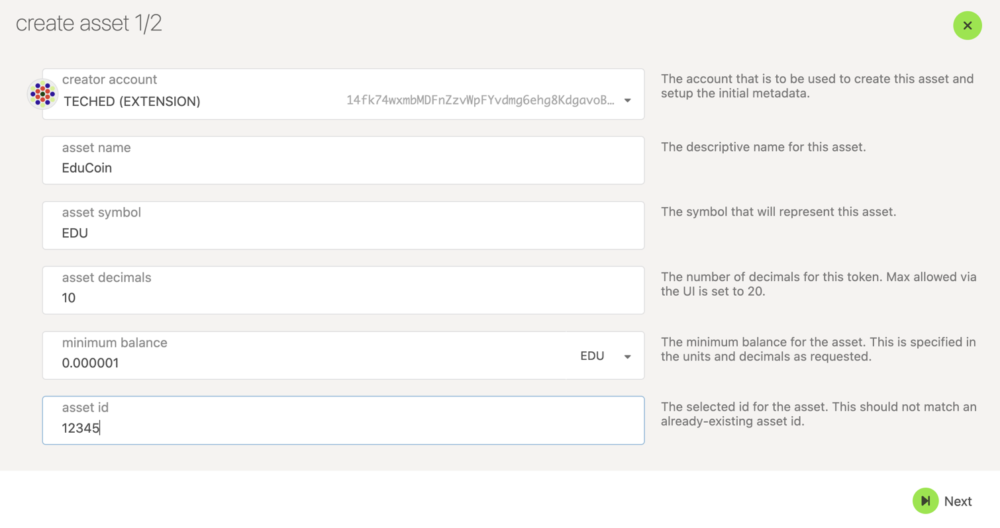
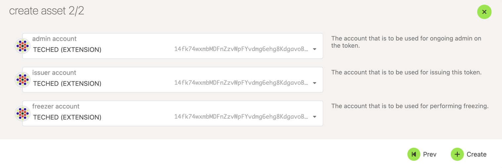
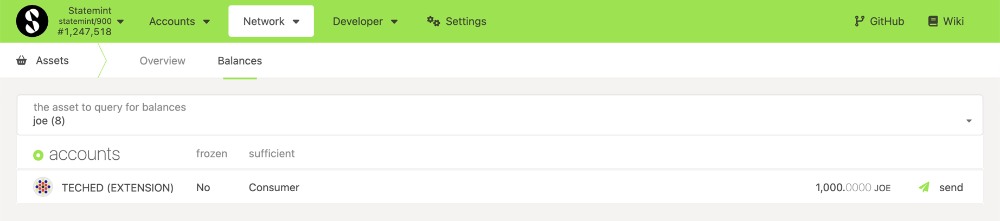
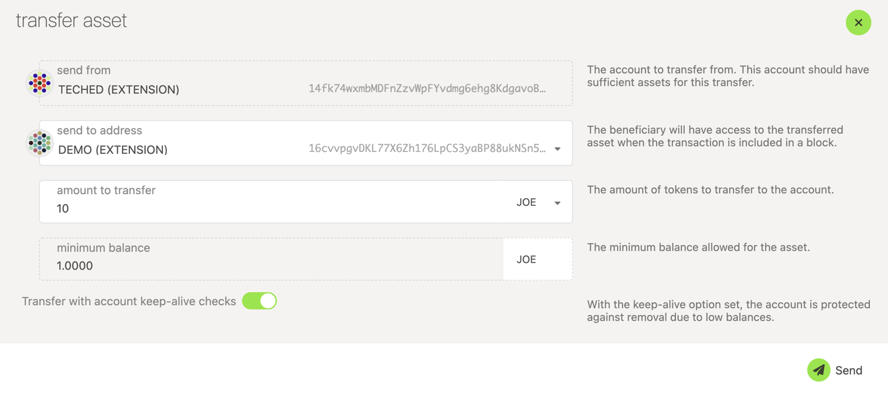
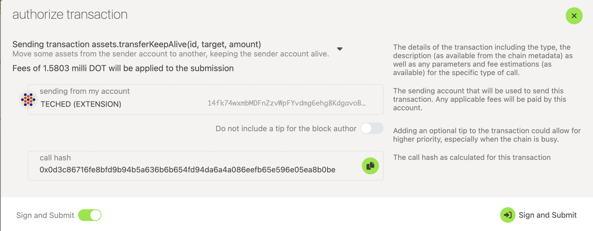

Statemint is a generic assets parachain which provides functionality for deploying and transferring assets — both Fungible and Non-Fungible Tokens (NFTs). It is a common good parachain on Polkadot (not to be confused with [Statemine](https://guide.kusama.network/docs/kusama-statemine/), which is a parachain on Polkadot). The native token of Statemint is DOT. Balance transfers and the Existential Deposit (ED) of DOT on Statemint are about 1/10th of the values on the Relay chain. 
Apart from the core protocol token DOT, the assets held on Statemint can be broadly categorized as 

- Assets backed by an on-chain protocol’s utility
- Assets with off-chain backing
- Assets without any backing

## Creating Assets on Statemint

:::info

Before minting assets on Statemint, we recommend that you try out this tutorial on Westmint, which is a parachain on Westend. 
The WND tokens (Westies) are free and are available through a [faucet](https://wiki.polkadot.network/docs/learn-DOT#getting-westies).

:::

To create an asset on Statemint, you would need a deposit of 100 DOT. Ensure that your Statemint account balance is more than 100 DOT,
which should account for the transaction fee as well. You can send DOT from a Polkadot account to a Statemint account using the teleport functionality. For instructions on teleporting DOT, check this [tutorial on Teleports](../learn/learn-teleport.md).

Assuming you have the required DOT balance on your Statemint account, the following instructions should let you successfully create an asset on Statemint

- Access Statemint through Polkdot-JS Apps UI.
- Navigate to Network > Assets.

- Click on the create button and you will be presented with a pop-up window. Choose the creator account, name of the asset to be
displayed on Statemint, the asset's symbol, number of decimals for the asset, the minimum balance required to hold this asset on a Statemint account and the most important field of your asset - the unique asset ID. The UI would not let you enter an ID that has already been taken. After all the details are entered, click on the next button.

- Choose the admin, issuer and the freezer accounts for your asset and click on the create button.

- Sign and submit the transaction. (If you like to verify the transaction details before signing, you can click on the dropdown button pointed by the arrow in the snapshot below)

If the transaction is successful,  you should see the asset and its details displayed in the Network > Assets page on Statemint.

## Transferring Assets on Statemint

:::caution Beware of scams

Due to the permissionless nature of Statemint, anyone can create an asset with any name and symbol. The most important attribute 
of an asset is the asset ID. There could be multiple assets with the same name and symbol, but they cannot have the same asset ID.

:::

:::info

The assets can be Sufficient or Non-Sufficient. To hold a Non-Sufficient asset, the Statemint account needs to exist on-chain. This is different from Ethereum where a non-existent account can hold ERC-20 tokens. Ensure that the receiver account has at least 0.1 DOT which is the Existential Deposit for a Statemint account. Although, there are a few exceptions to this - If an asset is Sufficient or someone has placed a deposit for that account to hold the asset, the Existential Deposit in DOT on the receiver account is not needed.

:::

To hold, send or receive most of the assets on Statemint (which are Non-Suffcient), the accounts need to have a minimum balance of 0.1 DOT (The Existential Deposit on Statemint). You can send DOT from a Polkadot account to a Statemint account using the teleport functionality. For instructions on teleporting DOT, check this [tutorial on Teleports](learn-teleport.md). The balance transfers of DOT on Statemint are similar to the balance transfers DOT on Polkadot and can be done on the accounts page on Polkadot-JS Apps UI.

In this tutorial, transfer of JOEs (Asset ID: 8, Symbol: JOE) is demonstrated.

- Access Statemint through Polkdot-JS Apps UI.
- Navigate to Network > Assets and click on the Balances tab
- Select the asset to transfer from the drop-down (The assets are sorted based on their IDs). If you have accounts with the selected asset, they will be displayed.

- Click on the send button 
- Enter the receiver address and the amount to transfer.

- Sign and submit the transaction

If the transaction is successful, the assets are transferred to the receiver account. 
