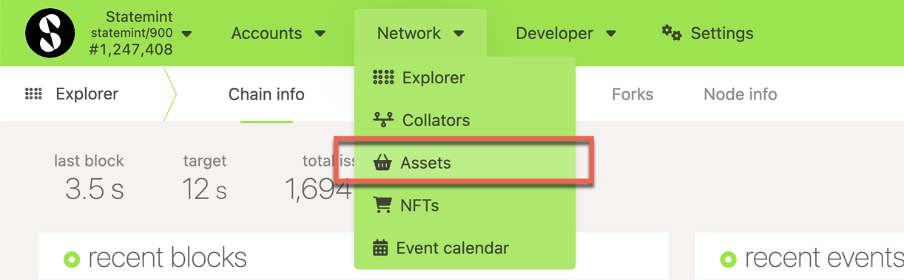
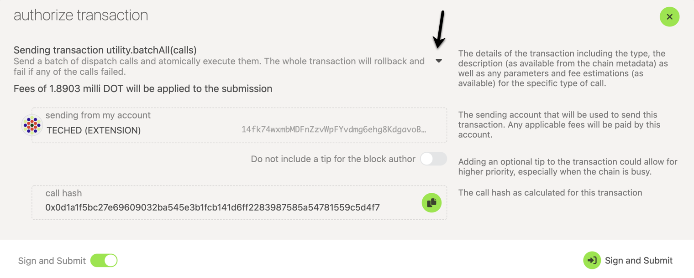

import RPC from "./../../components/RPC-Connection";

Statemint is a generic assets parachain which provides functionality for deploying and transferring
assets — both Fungible and Non-Fungible Tokens (NFTs). It is a common good parachain on Polkadot
(not to be confused with [Statemine](https://guide.kusama.network/docs/kusama-statemine/), which is
a parachain on Kusama). The native token of Statemint is DOT. The Existential Deposit (ED), transfer
fees, and the deposits for proxy/multisig operations on Statemint are about 1/10th of the values on
the Relay chain. For example, the Existential Deposit of a Statemint account is
{{ polkadot: <RPC network="statemint" path="consts.balances.existentialDeposit" defaultValue={1000000000} filter="humanReadable"/>, :polkadot }}
{{ kusama: <RPC network="statemint" path="consts.balances.existentialDeposit" defaultValue={1000000000} filter="humanReadable"/>, :kusama }}
when compared to
{{ polkadot: <RPC network="polkadot" path="consts.balances.existentialDeposit" defaultValue={10000000000} filter="humanReadable"/> :polkadot }}
{{ kusama:  <RPC network="polkadot" path="consts.balances.existentialDeposit" defaultValue={10000000000} filter="humanReadable"/> :kusama }}
on Polkadot. Apart from the core protocol token DOT, the assets held on Statemint can be broadly
categorized as

- Assets backed by an on-chain protocol’s utility
- Assets with off-chain backing
- Assets without any backing

For additional background on Statemint and Statemine check out
[this support article](https://support.polkadot.network/support/solutions/articles/65000181800-what-is-statemint-and-statemine-and-how-do-i-use-them-).

## Creating Assets on Statemint

:::info

Before minting assets on Statemint, we recommend that you try out this tutorial on Westmint, which
is a parachain on Westend. The WND tokens (Westies) are free and are available through a
[faucet](https://wiki.polkadot.network/docs/learn-DOT#getting-westies).

:::

To create an asset on Statemint, you would need a deposit of
{{ polkadot: <RPC network="statemint" path="consts.assets.assetDeposit" defaultValue={100000000000} filter="humanReadable"/> :polkadot }}
{{ kusama: <RPC network="statemint" path="consts.assets.assetDeposit" defaultValue={100000000000} filter="humanReadable"/> :kusama }}
and around
{{ polkadot: <RPC network="statemint" path="consts.assets.metadataDepositBase" defaultValue={2006800000} filter="humanReadable"/> :polkadot }}
{{ kusama: <RPC network="statemint" path="consts.assets.metadataDepositBase" defaultValue={2006800000} filter="humanReadable"/> :kusama }}
for the metadata . Before you create an asset on Statemint, ensure that your Statemint account
balance is a bit more than the sum of those two deposits, which should seamlessly account for the
required deposits and transaction fees. You can send DOT from a Polkadot account to a Statemint
account using the teleport functionality. For instructions on teleporting DOT, check this
[tutorial on Teleports](../learn/learn-teleport.md).

Assuming you have the required DOT balance on your Statemint account, the following instructions
should let you successfully create an asset on Statemint

- Access Statemint through [Polkadot-JS UI][].
- Navigate to Network > Assets.

- Click on the create button and you will be presented with a pop-up window. Choose the creator
  account, name of the asset to be displayed on Statemint, the asset's symbol, number of decimals
  for the asset, the minimum balance required to hold this asset on a Statemint account and the most
  important field of your asset - the unique asset ID. The UI would not let you enter an ID that has
  already been taken. After all the details are entered, click on the next button.

- Choose the admin, issuer and the freezer accounts for your asset and click on the create button.

- Sign and submit the transaction (If you like to verify the transaction details before signing, you
  can click on the dropdown button pointed by the arrow in the snapshot below).

If the transaction is successful, you should see the asset and its details displayed in the
Network > Assets page on Statemint.

## Transferring Assets on Statemint

Checkout
[this support article](https://support.polkadot.network/support/solutions/articles/65000181118-how-to-transfer-tether-usdt-on-statemine),
for a step by step guide covering how to make a transfer on the Statemine and the risks associated.

[polkadot-js ui]: https://polkadot.js.org/apps/#/explorer
