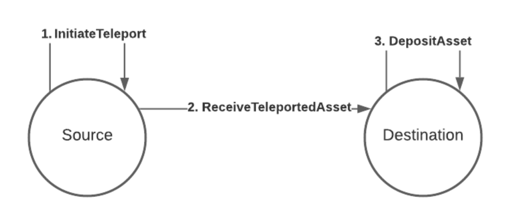

One of the main properties that Polkadot brings to the blockchain industry is secure
interoperability. This interoperability allows for **asset teleportation**, i.e., the process of
moving assets (such as fungible and non-fungible tokens) between chains (parachains) to use them as
any other asset native to that chain. Interoperability is possible through [XCM](learn-xcm.md) and
[SPREE modules](learn-spree.md), which together ensure that assets are not lost or duplicated across
multiple chains.

!!!info "Walk-through video tutorial about teleporting assets"
    See [this technical explainer video](https://youtu.be/3tE9ouub5Tg) to learn how to teleport assets from Kusama to the Asset Hub. The same procedure applies to teleporting between Polkadot and the Polkadot Asset Hub, or any other parachain.

## How Teleports work

As you can see from the diagram above, there are only two actors within this model: the source and
the destination. How we transfer assets between the source and the destination is briefly summarized
in the numbered labels on the diagram and explained in more detail below.

### Initiate Teleport

The source gathers the assets to be teleported from the sending account and **takes them out** from
the circulating supply, taking note of the total amount of assets that was taken out.

### Receive Teleported Assets

The source chain then creates an [XCM](learn-xcm.md) instruction called `ReceiveTeleportedAssets`
containing the receiving account and the amount of assets taken out from circulation as parameters.

It then sends this instruction over to the destination chain, where it gets processed, and new
assets are **put back into** the circulating supply.

### Deposit Asset

The destination deposits the assets to the receiving account. The actions of **taking out** from the
circulating supply and **putting back** into the circulating supply show the great flexibility that
an [XCM](learn-xcm.md) executor has in regulating the flow of an asset without changing its
circulating supply. Assets are transferred to an inaccessible account to remove them from
circulation. Likewise, for putting assets back into circulation, assets are released from a
pre-filled and inaccessible treasury, or perform a mint of the assets. This process requires mutual
trust between the source and destination. The destination must trust the source of having
appropriately removed the sent assets from the circulating supply, and the source must trust the
destination of having put the received assets back into circulation. The result of an asset
teleportation should result in the same circulating supply of the asset, and failing to uphold this
condition will result in a change in the asset's total issuance (in the case of fungible tokens) or
a complete loss/duplication of an NFT.
