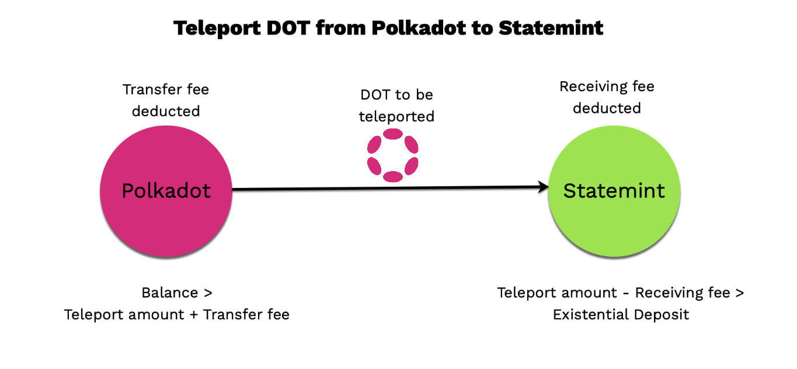
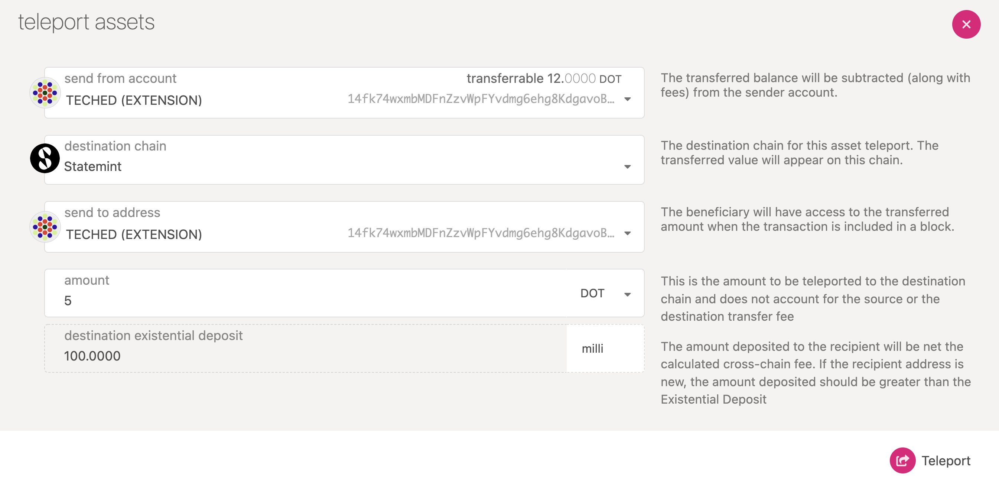
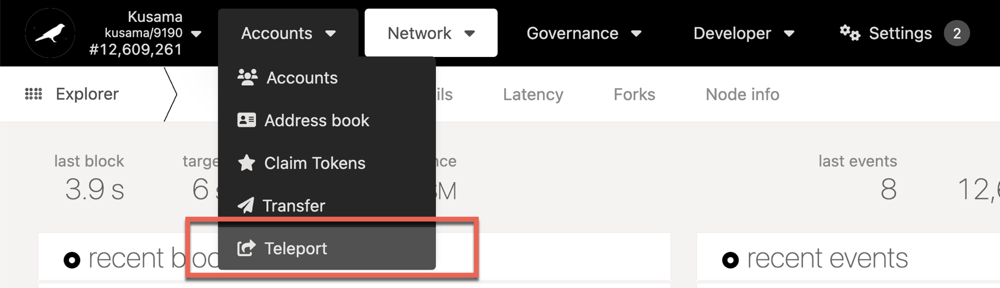
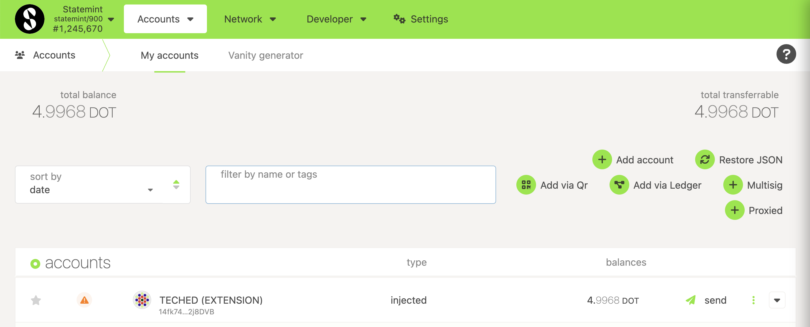

One of the main properties that Polkadot and Kusama bring to the ecosystems is decentralized
blockchain interoperability. This interoperability allows for asset teleportation: the process of
moving assets, such as coins, tokens, or NFTs, between chains (parachains) to use them as you would
any other asset native to that chain. Interoperability is possible through [XCM][] and [SPREE
modules][], which together ensure that assets are not lost or duplicated across multiple chain.

## How Teleports work

As you can see from the diagram above, there are only 2 actors within this model: the source and the destination.
The way in which we transfer assets between the source and the destination are briefly summarized in the numbered 
labels on the diagram, and are explained in more detail below:

### Initiate Teleport

The source gathers the assets to be teleported from the sending account and **takes them out of the circulating supply**, 
taking note of the total amount of assets that was taken out.

### Receive Teleported Assets

The source then creates an XCM instruction called `ReceiveTeleportedAssets` and puts the amount of assets taken out of 
circulation and the receiving account as parameters to this instruction. It then sends this instruction over to the 
destination, where it gets processed and new assets gets **put back into circulating supply accordingly**.

### Deposit Asset

The destination then deposits the assets to the receiving account of the asset.

The phrases **taken out of circulating supply** and **put back into circulating supply** are highlighted above to firstly give 
an indication of how much flexibility an XCM executor has in implementing the semantics of taking an asset out of and 
putting it back into its circulating supply. The straightforward answer is to burn the assets to take them out of 
circulation, but one can imagine that there are indeed multiple methods of achieving the same goal, such as transferring 
the assets locally to an inaccessible account, and likewise for putting assets back to circulation -- the receiving 
consensus system can freely choose to implement such semantics by releasing assets from a pre-filled and inaccessible 
treasury of the assets transferred, or perform a mint of the assets.

As such, the above also gives a hint on the disadvantages of this model -- it requires both the source and destination 
of have a high level of mutual trust. The destination must trust that the source has appropriately removed the assets 
that was sent over from the circulating supply, and the source must also trust the destination to put the assets that 
was taken out of circulation back into circulation. The result of an asset teleportation should result in the same 
circulating supply of the asset. Failing to uphold either of these two conditions will result in a change in the asset's 
total issuance (in the case of fungible tokens) or a complete loss/duplication of an NFT.

## Teleport {{ polkadot: DOT from Polkadot to Statemint :polkadot }}{{ kusama: KSM from Kusama to Statemine  :kusama }}

{{ polkadot:  :polkadot }}{{ kusama:  :kusama }}

Here are a couple of things that you need to understand before submitting a teleport transaction

- There will be a transaction fee imposed on the source chain. This fee is **not** automatically
  deducted from the teleport amount you plan to send. Your account balance should be greater than
  the teleport amount and the transaction fees. If you do not account for the sending fee, the
  teleport transaction will fail. The sending fee will be deducted from your account balance.

:::caution Existential Deposit

  After the teleport, if your account balance drops below the Existential Deposit which is 
{{ existential_deposit }}, that balance will be burnt and lost. Either plan on teleporting all of 
  your balance or leave enough balance such that the account does not get reaped.
  
:::

- There will be a transaction fee imposed at the destination chain. This fee is automatically
  deducted from the teleport amount you send. After this fee is deducted, the remaining account
  balance on the destination chain should be greater than its Existential Deposit. If not, the
  teleport transaction will fail and the sending fee along with the teleport amount will be deducted
  from your account balance.

Teleportation can be done through the [PolkadotJS Apps] interface or through the
`xcmPallet.limitedTeleportAssets()` extrinsic. In the following example, we will be using the
PolkadotJS interface to teleport {{ polkadot: DOT from Polkadot to Statemint. :polkadot }}{{ kusama: KSM from Kusama to Statemine. :kusama }}

1. Navigate to [PolkadotJS Apps] and connect to the chain with the tokens you want to teleport.
2. Navigate to "Accounts > Teleport". This opens the 'teleport assets' interface:

   {{ polkadot: 
    :polkadot }}{{ kusama:   :kusama }}

3. Fill out the transaction:
   1. "send from account" - Select the account with the source tokens.
   2. "destination chain" - Select the parachain you want to send the assets to.
   3. "send to address" - Select the account you want to be in control of the coins on the
      destination chain.
   4. "amount" - Insert the number of tokens you want to teleport. This does not include the
      transfer fee
4. After reviewing the transaction information and fees, click the "Teleport" button. Remember that
   the destination chain imposes receiving fee on the teleport amount {{ polkadot: It is currently 0.0032 DOT on
   Statemint) :polkadot }}{{ kusama: (It is currently 0.000010666 KSM on
   Statemine) :kusama }}
5. Click "Sign and Submit".
6. Enter your password, and click "Sign the transaction".

The transaction will be signed and broadcasted, and the tokens will appear on the destination chain
shortly. 

{{ polkadot:   :polkadot }}{{ kusama: In the given example screenshot, the received balance would be around 0.0049 KSM (Teleport amount
0.005 KSM - Receiving fee 0.000010666 KSM). If you plan to teleport KSM back to Kusama from Statemine, you
will follow the same procedure as above. :kusama }}

A video tutorial on teleporting (on Kusama) is provided below for reference:

## Troubleshooting

If you do not see "Accounts > Teleport" in [PolkadotJS Apps], the source chain that you have
selected does not support teleportation yet.

[polkadotjs apps]: https://polkadot.js.org/apps/
[xcm]: learn-cross-consensus.md
[spree modules]: learn-spree.md
