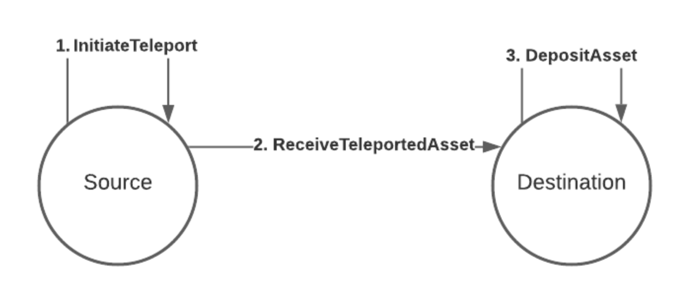

import RPC from "./../../components/RPC-Connection"

One of the main properties that Polkadot and Kusama bring to the ecosystems is decentralized
blockchain interoperability. This interoperability allows for asset teleportation: the process of
moving assets, such as coins, tokens, or NFTs, between chains (parachains) to use them as you would
any other asset native to that chain. Interoperability is possible through [XCM][] and [SPREE
modules][], which together ensure that assets are not lost or duplicated across multiple chain.

## How Teleports work

As you can see from the diagram above, there are only 2 actors within this model: the source and the
destination. The way in which we transfer assets between the source and the destination are briefly
summarized in the numbered labels on the diagram, and are explained in more detail below:

### Initiate Teleport

The source gathers the assets to be teleported from the sending account and **takes them out** from
the circulating supply, taking note of the total amount of assets that was taken out.

### Receive Teleported Assets

The source then creates an [XCM][] instruction called `ReceiveTeleportedAssets` containing as
parameters a) the receiving account and b) the amount of assets taken out from circulation. It then
sends this instruction over to the destination, where it gets processed and new assets are **put
back into** the circulating supply.

### Deposit Asset

The destination deposits the assets to the receiving account. The actions of **taking out** from the
circulating supply and **putting back** into the circulating supply show the great flexibility that
an [XCM][] executor has in regulating the flow of an asset without changing its circulating supply.
Assets are transferred to an inaccessible account in order to take them out from circulation.
Likewise, for putting assets back into circulation, assets are released from a pre-filled and
inaccessible treasury, or perform a mint of the assets. This process requires mutual trust between
the source and destination. The destination must trust the source of having appropriately removed
the sent assets from the circulating supply, and the source must trust the destination of having put
the received assets back into circulation. The result of an asset teleportation should result in the
same circulating supply of the asset, and failing to uphold this condition will result in a change
in the asset's total issuance (in the case of fungible tokens) or a complete loss/duplication of an
NFT.

## Teleporting Tokens using the Polkadot-JS UI

- [Video tutorial on Teleporting](https://youtu.be/PGyDpH2kad8)
- [Additional support article](https://support.polkadot.network/support/solutions/articles/65000181119-how-to-teleport-dot-or-ksm-between-statemint-or-statemine)

## Troubleshooting

If you do not see "Accounts > Teleport" in [Polkadot-JS UI], the source chain that you have selected
does not support teleportation yet.

[polkadot-js ui]: https://polkadot.js.org/apps/
[xcm]: learn-cross-consensus.md
[spree modules]: learn-spree.md
