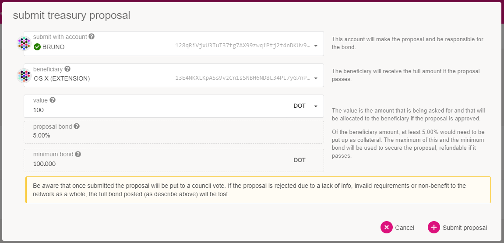
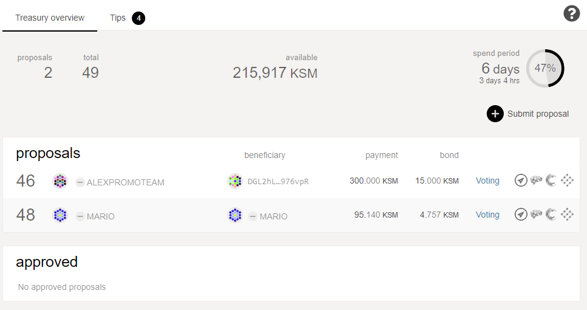
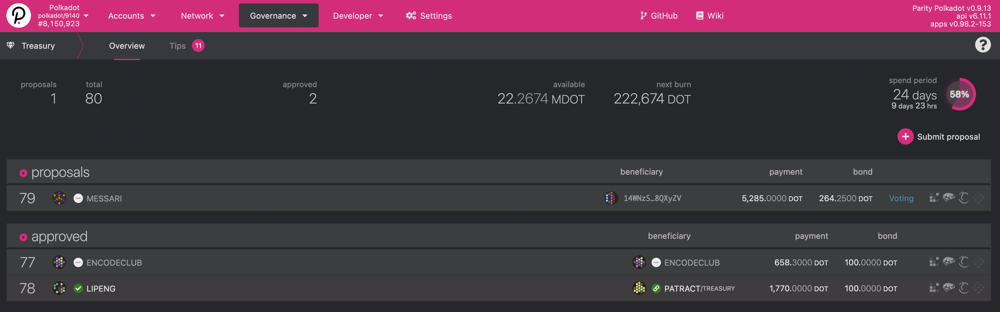

import RPC from "./../../components/RPC-Connection";

The Treasury is a pot of funds collected through a portion of block production rewards, transaction
fees, slashing, [staking inefficiencies](learn-staking.md#inflation), etc.

The funds held in the Treasury can be spent by making a spending proposal that, if approved by the
[Council](learn-governance.md#council), will enter a waiting period before distribution. This
waiting period is known as the _spend period_, and its duration is subject to
[governance](learn-governance.md), with the current default set to
{{ polkadot: <RPC network="polkadot" path="consts.treasury.spendPeriod" defaultValue={345600} filter="blocksToDays"/> :polkadot }}
{{ kusama: <RPC network="kusama" path="consts.treasury.spendPeriod" defaultValue={86400} filter="blocksToDays"/> :kusama }}
days. The Treasury attempts to spend as many proposals in the queue as it can without running out of
funds.

Treasury payout is an automatic process:

- If the Treasury funds run out with approved proposals left to fund, those proposals are kept in
  the approved queue, and will receive funding in the following spend period.
- If the Treasury ends a spend period without spending all of its funds, it suffers a burn of a
  percentage of its funds - thereby causing deflationary pressure. This encourages the spending of
  the funds in the Treasury by Polkadot's governance system.
  {{ polkadot: This percentage is currently at 1% on Polkadot. :polkadot }}
  {{ kusama: This percentage is currently 0.2% on Kusama, with the amount currently
  going to [Society](https://guide.kusama.network/docs/maintain-guides-society-kusama) rather than being
  burned. :kusama }}

When a stakeholder wishes to propose a spend from the Treasury, they must reserve a deposit of at
least 5% of the proposed spend (see below for variations). This deposit will be slashed if the
proposal is rejected, and returned if it is accepted.

Proposals may consist of (but are not limited to):

- Infrastructure deployment and continued operation.
- Network security operations (monitoring services, continuous auditing).
- Ecosystem provisions (collaborations with friendly chains).
- Marketing activities (advertising, paid features, collaborations).
- Community events and outreach (meetups, pizza parties, hackerspaces).
- Software development (wallets and wallet integration, clients and client upgrades).

The [Council](learn-governance#council) governs the Treasury and how the funds are spent is up to
their judgment.

:::caution

The Council does not approve or deny Treasury Proposals based on the available funds. Proposals are
not approved just because there are funds ready to spend but are subject to a burn.

:::

## Funding the Treasury

The Treasury is funded from different sources:

1. Slashing: When a validator is slashed for any reason, the slashed amount is sent to the Treasury
   with a reward going to the entity that reported the validator (another validator). The reward is
   taken from the slash amount and varies per offence and number of reporters.
2. Transaction fees: A portion of each block's transaction fees goes to the Treasury, with the
   remainder going to the block author.
3. Staking inefficiency: [Inflation](learn-staking.md#inflation) is designed to be 10% in the first
   year, and the ideal staking ratio is set at 50%, meaning half of all tokens should be locked in
   staking. Any deviation from this ratio will cause a proportional amount of the inflation to go to
   the Treasury. In other words, if 50% of all tokens are staked, then 100% of the inflation goes to
   the validators as reward. If the staking rate is greater than or less than 50%, then the
   validators will receive less, with the remainder going to the Treasury.
4. Parathreads: [Parathreads](learn-parathreads.md) participate in a per-block auction for block
   inclusion. Part of this bid goes to the validator that accepts the block and the remainder goes
   to the Treasury.

## Creating a Treasury Proposal

The proposer has to deposit a minimum of
{{ polkadot: <RPC network="polkadot" path="consts.treasury.proposalBondMinimum" defaultValue={1e12} filter="humanReadable"/> :polkadot }}
{{ kusama: <RPC network="kusama" path="consts.treasury.proposalBondMinimum" defaultValue={66000000000} filter="humanReadable"/> :kusama }}
or 5% of the requested amount with a maximum cap of
{{ polkadot: <RPC network="polkadot" path="consts.treasury.proposalBondMaximum" defaultValue={5e12} filter="humanReadable"/> :polkadot }}
{{ kusama: <RPC network="kusama" path="consts.treasury.proposalBondMaximum" defaultValue={3333000000000} filter="humanReadable"/> :kusama }}
as an anti-spam measure. This amount is burned if the proposal is rejected, or refunded otherwise.
These values are subject to [governance](learn-governance.md) so they may change in the future.

Please note that there is no way for a user to revoke a treasury proposal after it has been
submitted. The Council will either accept or reject the proposal, and if the proposal is rejected,
the bonded funds are burned.

### Announcing the Proposal

To minimize storage on chain, proposals don't contain contextual information. When a user submits a
proposal, they will probably need to find an off-chain way to explain the proposal. Most discussion
takes place on the following platforms:

- Many community members participate in discussion in the
  [Kusama Element (previously Riot)](https://matrix.to/#/#kusama:matrix.parity.io) chat or
  [Polkadot Element](https://matrix.to/#//#polkadot:matrix.parity.io).
- The [Polkassembly](https://polkassembly.io) discussion platform that allows users to log in with
  their Web3 address and automatically reads proposals from the chain, turning them into discussion
  threads. It also offers a sentiment gauge poll to get a feel for a proposal before committing to a
  vote.

Spreading the word about the proposal's explanation is ultimately up to the proposer - the
recommended way is using official Element channels like the
{{ polkadot: [Polkadot Watercooler](https://matrix.to/#/#polkadot-watercooler:web3.foundation) and :polkadot }}
{{ kusama: [Kusama Direction room](https://matrix.to/#/#kusama:matrix.parity.io) and the :kusama }}
{{ polkadot: [Polkadot Direction room](https://matrix.to/#/#polkadot-direction:matrix.parity.io). :polkadot }}
{{ kusama: [Kusama Watercooler](https://matrix.to/#/#kusamawatercooler:polkadot.builders). :kusama }}

### Creating the Proposal

One way to create the proposal is to use the Polkadot-JS Apps
[website](https://polkadot.js.org/apps). From the website, use either the
[extrinsics tab](https://polkadot.js.org/apps/#/extrinsics) and select the Treasury pallet, then
`proposeSpend` and enter the desired amount and recipient, or use the
[Treasury tab](https://polkadot.js.org/apps/#/treasury) and its dedicated Submit Proposal button:

The system will automatically take the required deposit, picking the higher of the two values
mentioned [above](#creating-a-treasury-proposal).

Once created, your proposal will become visible in the Treasury screen and the Council can start
voting on it.

Remember that the proposal has no metadata, so it's up to the proposer to create a description and
purpose that the Council could study and base their votes on.

At this point, a Council member can create a motion to accept or to reject the treasury proposal. It
is possible that one motion to accept and another motion to reject are both created. The proportions
to accept and reject Council proposals vary between accept or reject, and possibly depend on which
network the Treasury is implemented.

The threshold for accepting a treasury proposal is at least three-fifths of the Council. On the
other hand, the threshold for rejecting a proposal is at least one-half of the Council.

You will notice the "spend period" at the top of the Treasury UI.

## Tipping

Next to the proposals process, a separate system for making tips exists for the Treasury. Tips can
be suggested by anyone and are supported by members of the Council. Tips do not have any definite
value, and the final value of the tip is decided based on the median of all tips issued by the
tippers.

Currently, the tippers are the same as the members of the Council. However, being a tipper is not
the direct responsibility of the Council, and at some point the Council and the tippers may be
different groups of accounts.

A tip will enter a closing phase when more than a half plus one of the tipping group have endorsed a
tip. During that time frame, the other members of the tipping group can still issue their tips, but
do not have to. Once the window closes, anyone can call the `close_tip` extrinsic, and the tip will
be paid out.

There are two types of tips:

- public: A small bond is required to place them. This bond depends on the tip message length, and a
  fixed bond constant defined on chain, currently
  {{ polkadot: <RPC network="polkadot" path="consts.tips.tipReportDepositBase" defaultValue={10000000000} filter="humanReadable"/>. :polkadot }}
  {{ kusama: <RPC network="kusama" path="consts.tips.tipReportDepositBase" defaultValue={166000000000} filter="humanReadable"/>. :kusama }}
  Public tips carry a finder's fee of
  {{ polkadot: <RPC network="polkadot" path="consts.tips.tipFindersFee" defaultValue={20}/>%, :polkadot }}
  {{ kusama: <RPC network="kusama" path="consts.tips.tipFindersFee" defaultValue={20}/>%, :kusama }}
  which is paid out from the total amount.
- tipper-initiated: Tips that a Council member published, do not have a finder's fee or a bond.

:::info

For information about how to submit a tip from the Treasury you can read
[this support article](https://support.polkadot.network/support/solutions/articles/65000181971).

:::

To better understand the process a tip goes through until it is paid out, let's consider the example
below.

### Example

Bob has done something great for {{ polkadot: Polkadot :polkadot }}{{ kusama: Kusama :kusama }}.
Alice has noticed this and decides to report Bob as deserving a tip from the Treasury. The Council
is composed of three members Charlie, Dave, and Eve.

Alice begins the process by issuing the `report_awesome` extrinsic. This extrinsic requires two
arguments, a reason and the beneficiary. Alice submits Bob's address with the reason being a UTF-8
encoded URL to a post on {{ polkadot: [Polkassembly](https://polkadot.polkassembly.io) :polkadot }}
{{ kusama: [Polkassembly](https://kusama.polkassembly.io) :kusama }} that explains her reasoning for
why Bob deserves the tip.

As mentioned above, Alice must also lock up a deposit for making this report. The deposit is the
base deposit as set in the chain's parameter list, plus the additional deposit per byte contained in
the reason. This is why Alice submitted a URL as the reason instead of the explanation directly: it
was cheaper for her to do so. For her trouble, Alice is able to claim the eventual finder's fee if
the tip is approved by the tippers.

Since the tipper group is the same as the Council, the Council must now collectively (but also
independently) decide on the value of the tip that Bob deserves. Charlie, Dave, and Eve all review
the report and make tips according to their personal valuation of the benefit Bob has provided to
{{ polkadot: Polkadot :polkadot }}{{ kusama: Kusama :kusama }}. Charlie tips
{{ polkadot: 10 DOT :polkadot }}{{ kusama: 1 KSM :kusama }}, Dave tips
{{ polkadot: 30 DOT :polkadot }}{{ kusama: 3 KSM :kusama }}, and Eve tips
{{ polkadot: 100 DOT :polkadot }}{{ kusama: 10 KSM :kusama }}.

The tip could have been closed out with only two of the three tippers. Once more than half of the
tippers group have issued tip valuations, the countdown to close the tip will begin. In this case,
the third tipper issued their tip before the end of the closing period, so all three were able to
make their tip valuations known.

The actual tip that will be paid out to Bob is the median of these tips, so Bob will be paid out
{{ polkadot: 30 DOT :polkadot }}{{ kusama: 3 KSM :kusama }} from the Treasury. In order for Bob to
be paid his tip, some account must call the `close_tip` extrinsic at the end of the closing period
for the tip. This extrinsic may be called by anyone.

## Bounties Spending

There are practical limits to Council Members curation capabilities when it comes to treasury
proposals: Council members likely do not have the expertise to make a proper assessment of the
activities described in all proposals. Even if individual Councillors have that expertise, it is
highly unlikely that a majority of members are capable in such diverse topics.

Bounties Spending proposals aim to delegate the curation activity of spending proposals to experts
called Curators: They can be defined as addresses with agency over a portion of the Treasury with
the goal of fixing a bug or vulnerability, developing a strategy, or monitoring a set of tasks
related to a specific topic: all for the benefit of the
{{ polkadot: Polkadot :polkadot }}{{ kusama: Kusama :kusama }} ecosystem.

A proposer can submit a bounty proposal for the Council to pass, with a curator to be defined later,
whose background and expertise is such that they are capable of determining when the task is
complete. Curators are selected by the Council after the bounty proposal passes, and need to add an
upfront payment to take the position. This deposit can be used to punish them if they act
maliciously. However, if they are successful in their task of getting someone to complete the bounty
work, they will receive their deposit back and part of the bounty reward.

When submitting the value of the bounty, the proposer includes a reward for curators willing to
invest their time and expertise in the task: this amount is included in the total value of the
bounty. In this sense, the curator's fee can be defined as the result of subtracting the value paid
to the bounty rewardee from the total value of the bounty.

In general terms, curators are expected to have a well-balanced track record related to the issues
the bounty tries to resolve: they should be at least knowledgeable on the topics the bounty touches,
and show project management skills or experience. These recommendations ensure an effective use of
the mechanism. A Bounty Spending is a reward for a specified body of work - or specified set of
objectives - that needs to be executed for a predefined treasury amount to be paid out. The
responsibility of assigning a payout address once the specified set of objectives is completed is
delegated to the curator.

After the Council has activated a bounty, it delegates the work that requires expertise to the
curator who gets to close the active bounty. Closing the active bounty enacts a delayed payout to
the payout address and a payout of the curator fee. The delay phase allows the Council to act if any
issues arise.

To minimize storage on chain in the same way as any proposal, bounties don't contain contextual
information. When a user submits a bounty spending proposal, they will probably need to find an
off-chain way to explain the proposal (any of the available community forums serve this purpose).
[This template](https://docs.google.com/document/d/1-IBz_owspV5OcvezWXpksWDQReWowschD0TFuaVKKcU/edit?usp=sharing)
can help as a checklist of all needed information for the Council to make an informed decision.

The bounty has a predetermined duration of 90 days with the possibility of being extended by the
curator. Aiming to maintain flexibility on the tasks’ curation, the curator will be able to create
sub-bounties for more granularity and allocation in the next iteration of the mechanism.

### Creating a Bounty Proposal

Anyone can create a Bounty proposal using Polkadot-JS Apps: Users are able to submit a proposal on
the dedicated Bounty section under Governance. The development of a robust user interface to view
and manage bounties in the Polkadot Apps is still under development and it will serve Council
members, Curators and Beneficiaries of the bounties, as well as all users observing the on-chain
treasury governance. For now, the help of a Councillor is needed to open a bounty proposal as a
motion to be voted.

To submit a bounty, please visit [Polkadot-JS Apps](https://polkadot.js.org/apps) and click on the
governance tab in the options bar on the top of the site. After, click on 'Bounties' and find the
button '+ Add Bounty' on the upper-right side of the interface. Complete the bounty title, the
requested allocation (including curator's fee) and confirm the call.

After this, a Council member will need to assist you to pass the bounty proposal for vote as a
motion. You can contact the Council by joining the
{{ polkadot: Polkadot Direction [channel](https://matrix.to/#/#polkadot-direction:matrix.parity.io) :polkadot }}
{{ kusama: Kusama Direction [channel](https://matrix.to/#/#kusama:matrix.parity.io) :kusama }} in
Element or joining our
{{ polkadot: Polkadot Discord [server](https://parity.link/polkadot-discord) :polkadot }}
{{ kusama: Kusama Discord [server](https://parity.link/kusama-discord) :kusama }} and publishing a
short description of your bounty, with a link to one of the [forums](#announcing-the-proposal) for
contextual information.

A bounty can be cancelled by deleting the earmark for a specific treasury amount or be closed if the
tasks have been completed. On the opposite side, the 90 days life of a bounty can be extended by
amending the expiry block number of the bounty to stay active.

### Closing a bounty

The curator can close the bounty once they approve the completion of its tasks. The curator should
make sure to set up the payout address on the active bounty beforehand. Closing the Active bounty
enacts a delayed payout to the payout address and a payout of the curator fee.

A bounty can be closed by using the extrinsics tab and selecting the Treasury pallet, then
`Award_bounty`, making sure the right bounty is to be closed and finally sign the transaction. It is
important to note that those who received a reward after the bounty is completed, must claim the
specific amount of the payout from the payout address, by calling `Claim_bounty` after the curator
closed the allocation.

To understand more about Bounties and how this new mechanism works, read this
[Polkadot Blog post](https://polkadot.network/kusama-and-polkadot-now-reward-curators-helping-to-scale-councils-functions-join-the-force-moving-the-community-forward/).

## FAQ

### What prevents the Treasury from being captured by a majority of the Council?

The majority of the Council can decide the outcome of a treasury spend proposal. In an adversarial
mindset, we may consider the possibility that the Council may at some point go rogue and attempt to
steal all of the treasury funds. It is a possibility that the treasury pot becomes so great, that a
large financial incentive would present itself.

For one, the Treasury has deflationary pressure due to the burn that is suffered every spend period.
The burn aims to incentivize the complete spend of all treasury funds at every burn period, so
ideally the treasury pot doesn't have time to accumulate mass amounts of wealth. However, it is the
case that the burn on the Treasury could be so little that it does not matter - as is the case
currently on Kusama with a 0.2% burn.

However, it is the case on Kusama that the Council is composed of mainly well-known members of the
community. Remember, the Council is voted in by the token holders, so they must do some campaigning
or otherwise be recognized to earn votes. In the scenario of an attack, the Council members would
lose their social credibility. Furthermore, members of the Council are usually externally motivated
by the proper operation of the chain. This external motivation is either because they run businesses
that depend on the chain, or they have direct financial gain (through their holdings) of the token
value remaining steady.

Concretely, there are a couple on-chain methods that resist this kind of attack. One, the Council
majority may not be the token majority of the chain. This means that the token majority could vote
to replace the Council if they attempted this attack - or even reverse the treasury spend. They
would do this through a normal referendum. Two, there are time delays to treasury spends. They are
only enacted every spend period. This means that there will be some time to observe this attack is
taking place. The time delay then allows chain participants time to respond. The response may take
the form of governance measures or - in the most extreme cases a liquidation of their holdings and a
migration to a minority fork. However, the possibility of this scenario is quite low.

## Further Reading

- [Substrate's Treasury Pallet](https://github.com/paritytech/substrate/blob/master/frame/treasury/src/lib.rs)

- [Documentation of the Rust implementation of the Treasury](https://paritytech.github.io/substrate/master/pallet_treasury/index.html)
