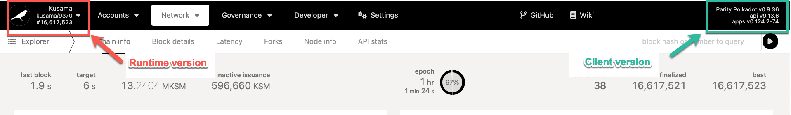

WebAssembly is used in Polkadot and Substrate as the compilation target for the runtime.

## What is WebAssembly?

WebAssembly, shortened to simply _Wasm_, is a binary instruction format for a stack-based virtual
machine. Wasm is designed as a portable target for compilation of high-level languages like
C/C++/Rust, enabling deployment on the web for client and server applications.

## Why WebAssembly?

WebAssembly is a platform agnostic binary format, meaning that it will run the same instructions
across whatever machine it is operating on. Blockchains need determinacy in order to have reliable
state transition updates across all nodes in the peer-to-peer network without forcing every peer to
run the same exact hardware. Wasm is a nice fit for reliability among the possibly diverse set of
machines. Wasm is both efficient and fast. The efficiency means that it can be uploaded onto the
chain as a blob of code without causing too much state bloat while keeping its ability to execute at
near-native speeds.

## Runtime Upgrades

Runtime upgrades allow {{ polkadot: Polkadot :polkadot }}{{ kusama: Kusama :kusama }} to change the
logic of the chain, without the need for a hard fork.

### Forkless Upgrades

You may have come across the term "hard fork" before in the blockchain space. A **hard fork** occurs
when a blockchain's logic changes such that nodes that do not include the new changes will not be
able to remain in consensus with nodes that do. Such changes are backward incompatible. Hard forks
can be political due to the nature of the upgrades, as well as logistically onerous due to the
number (potentially thousands) of nodes in the network that need to upgrade their software. Thus,
hard forking is slow, inefficient, and error prone due to the levels of offline coordination
required, and thus, the propensity to bundle many upgrades into one large-scale event.

By using Wasm in Substrate, the framework powering Polkadot, Kusama, and many connecting chains, the
chains are given the ability to upgrade their runtime logic without hard forking.

Rather than encode the runtime (a chain's "business logic") in the nodes,
{{ polkadot: Polkadot :polkadot }}{{ kusama: Kusama :kusama }} nodes contain a WebAssembly
[execution host](learn-polkadot-host). They maintain consensus on a very low level and
well-established instruction set. The {{ polkadot: Polkadot :polkadot }}{{ kusama: Kusama :kusama }}
runtime is stored on the {{ polkadot: Polkadot :polkadot }}{{ kusama: Kusama :kusama }} blockchain
itself. By deploying Wasm on-chain and having nodes auto-enact the new logic at a certain block
height, upgrades can be small, isolated, and very specific.

{{ polkadot: Polkadot :polkadot }}{{ kusama: Kusama :kusama }} can upgrade its runtime by upgrading
the logic stored on-chain, and removes the coordination challenge of requiring thousands of node
operators to upgrade in advance of a given block number. Polkadot stakeholders propose and approve
upgrades through the [on-chain governance](learn-governance.md) system, which also enacts them
autonomously.

As a result of storing the Runtime as part of the state, the Runtime code itself becomes state
sensitive and calls to Runtime can change the Runtime code itself. Therefore the Polkadot Host needs
to always make sure it provides the Runtime corresponding to the state in which the entrypoint has
been called.

### Client Releases

The existing runtime logic is followed to update the [Wasm](learn-wasm.md) runtime stored on the
blockchain to a new version. The upgrade is then included in the blockchain itself, meaning that all
the nodes on the network execute it. Generally, there is no need to upgrade your nodes manually
before the runtime upgrade as they will automatically start to follow the new logic of the chain.
Nodes only need to be updated when the runtime requires new host functions or there is a change in
networking or consensus.

Transactions constructed for a given runtime version will not work on later versions. Therefore, a
transaction constructed based on a runtime version will not be valid in later runtime versions. If
you don't think you can submit a transaction before the upgrade, it is better to wait and construct
it after the upgrade takes place.

Although upgrading your nodes is generally not necessary to follow an upgrade, we recommend
following the {{ polkadot: Polkadot :polkadot }}{{ kusama: Kusama :kusama }} releases and upgrading
promptly, especially for high priority or critical releases.

:::info New Client Releases

The details about the latest client releases can be found on the
[releases section on the Polkadot repository](https://github.com/paritytech/polkadot/releases). A
detailed analysis for client releases can be viewed on the
[Polkadot Forum](https://forum.polkadot.network/tag/release-analysis).

:::

#### Runtime vs Client versions

The runtime and client versions are distinct from each other. The runtime versioning typically looks
like `network-xxxx`, whereas the client versioning looks like `vx.x.xx`. For instance, the runtime
version shown on the top left section of Polkadot-JS UI below is `kusama-9370`, and the client
(node) version shown on the top right section is `v0.9.36`.

:::info Querying runtime and client versions

The runtime version can be queried on-chain through Polkadot-JS UI by navigating to Developer tab >
Chain State > Storage > system and query `lastRuntimeUpgrade()`.

The node version can be queried by navigating to Developer tab > RPC calls > system and query
`version()`.

:::

## Runtime Upgrades for Various Users

### For Infrastructure Providers

Infrastructure services include but are not limited to the following:

- [Validators](../maintain/maintain-guides-how-to-upgrade.md)
- API services
- Node-as-a-Service (NaaS)
- General infrastructure management (e.g. block explorers, custodians)
- [Wallets](./../general/wallets.md)

For validators, keeping in sync with the network is key. At times, upgrades will require validators
to upgrade their clients within a specific time frame, for example if a release includes breaking
changes to networking. It is essential to check the release notes, starting with the upgrade
priority and acting accordingly.

General infrastructure providers, aside from following the
{{ polkadot: Polkadot :polkadot }}{{ kusama: Kusama :kusama }} releases and upgrading in a timely
manner, should monitor changes to runtime events and auxiliary tooling, such as the
[Substrate API Sidecar](https://github.com/paritytech/substrate-api-sidecar).

Transactions constructed for runtime `n` will not work for any other runtime `>n`. If a runtime
upgrade occurs before broadcasting a previously constructed transaction, you will need to
reconstruct it with the appropriate runtime version and corresponding metadata.

### For [Nominators](../maintain/maintain-guides-how-to-nominate-polkadot.md)

Runtime upgrades don't require any actions by a nominator, though it is always encouraged to keep
up-to-date and participate with the latest runtime upgrade motions and releases, while keeping an
eye on how the nodes on the network are reacting to a new upgrade.

## Monitoring Runtime Changes

You can monitor the chain for upcoming upgrades. The client release notes include the hashes of any
proposals related to any on-chain upgrades for easy matching. Monitor the chain for:

1. `democracy(Started)` events and log `index` and `blockNumber`. This event indicates that a
   referendum has started (although does not mean that it is a runtime upgrade). Get the referendum
   info\*; it should have a status of `Ongoing`. Find the ending block number (`end`) and the
   enactment `delay` (delay). If the referendum passes, it will execute on block number
   `end + delay`.
2. `democracy(Passed)`, `democracy(NotPassed)`, or, `democracy(Cancelled)` events citing the index.
   If `Passed`, you need to look at the `scheduler(Scheduled)` event in the same block for the
   enactment block.
3. `democracy(PreimageNoted)` events with the same hash as the `ReferendumInfoOf(index)` item. This
   may be up to the last block before execution, but it will not work if this is missing.
4. `democracy(Executed)` events for actual execution. In the case of a runtime upgrade, there will
   also be a `system(CodeUpdated)` event.

You can also monitor [Polkassembly](https://polkadot.polkassembly.io/) for discussions on on-chain
proposals and referenda.

\* E.g. via `pallets/democracy/storage/ReferendumInfoOf?key1=index&at=blockNumber` on Sidecar.

## Resources

- [WebAssembly.org](https://webassembly.org/) - WebAssembly homepage that contains a link to the
  spec.
- [Wasmi](https://github.com/paritytech/Wasmi) - WebAssembly interpreter written in Rust.
- [Parity Wasm](https://github.com/paritytech/parity-Wasm) - WebAssembly
  serialization/deserialization in Rust.
- [Wasm utils](https://github.com/paritytech/Wasm-utils) - Collection of Wasm utilities used in
  Parity and Wasm contract development.
