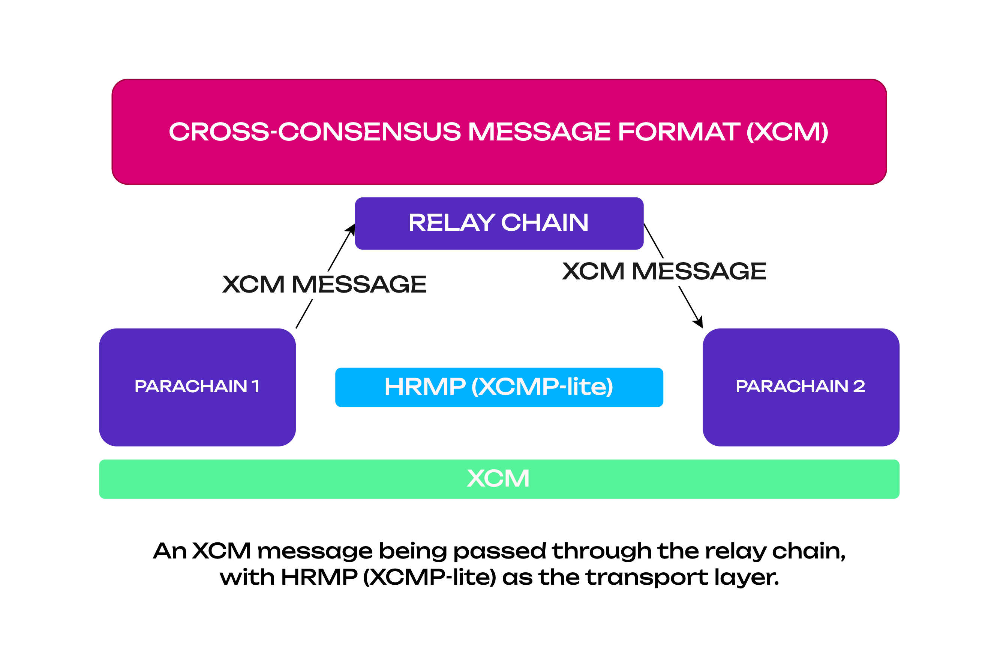

!!!info "XCM Documentation"
    For a more practical approach to utilizing XCM, refer to the [XCM Docs](./xcm/overview/intro.md). Please keep in mind that XCM is under active development.

With the XCM format established, common patterns for protocols of these messages are needed.
Polkadot implements two message passing protocols for acting on XCM messages between its constituent
parachains.

There are three primary methods for message passing, one of which is under development:

1. XCMP (Cross-Consensus Message Passing)
2. Horizontal Relay-routed Message Passing (HRMP/XCMP-lite)
3. VMP (Vertical Message Passing)

### XCMP (Cross-Chain Message Passing)

!!!caution
    XCMP is currently under development, and most of the cross-chain messages pass through HRMP channels for the time being.

XCM is related to XCMP in the same way that REST is related to RESTful.

_Cross-Consensus Message Passing_ secure message passing between parachains. There are two variants:
_Direct_ and _Relayed_.

- With _Direct_, message data goes direct between parachains and is O(1) on the side of the relay
  chain and is very scalable.
- With _Relayed_, message data is passed via the relay chain, and piggy-backs over VMP. It is much
  less scalable, and on-demand parachains in particular may not receive messages due to excessive
  queue growth.

Cross-chain transactions are resolved using a simple queuing mechanism based around a Merkle tree to
ensure fidelity. It is the task of the relay chain validators to move transactions on the output
queue of one parachain into the input queue of the destination parachain. However, only the
associated metadata is stored as a hash in the relay chain storage.

The input and output queue are sometimes referred to in the Polkadot codebase and associated
documentation as `ingress` and `egress` messages, respectively.

!!!info
    For detailed information about VMP see dedicated section in [The Polkadot Parachain Host Implementers' Guide](https://paritytech.github.io/polkadot/book/messaging.html#horizontal-message-passing).

### VMP (Vertical Message Passing)

_Vertical Message Passing_ message passing between the relay chain itself and a parachain. Message
data in both cases exists on the relay chain and are interpreted by the relay chain according to
[XCM](./learn-xcm.md#cross-consensus-message-format-xcm-format) standards. This includes:

- #### UMP (Upward Message Passing)

  _Upward Message Passing_ message passing from a parachain to the relay chain.

- #### DMP (Downward Message Passing)
  _Downward Message Passing_ message passing from the relay chain to a parachain.

!!!info
    For detailed information about VMP see dedicated section in [The Polkadot Parachain Host Implementers' Guide](https://paritytech.github.io/polkadot/book/messaging.html#vertical-message-passing).

### HRMP (XCMP-Lite)

While XCMP is still being implemented, a stop-gap protocol (see definition below) known as
**Horizontal Relay-routed Message Passing (HRMP)** exists in its place. HRMP has the same interface
and functionality as XCMP but is much more demanding on resources since it stores all messages in
the relay chain storage. When XCMP has been implemented, HRMP is planned to be deprecated and phased
out in favor of it.

!!!note
    A stop-gap protocol is a temporary substitute for the functionality that is not fully complete. While XCMP proper is still in development, HRMP is a working replacement.

A tutorial on how to open an HRMP channel on a parachain can be found
[here](../build/build-hrmp-channels.md).

### XCMP (Cross Consensus Message Passing) Design Summary

  

    
    

      <a href="https://www.youtube.com/watch?v=tOnzk4AROUY">XCMP Explained</a>
    

  

!!!note
    XCMP is not yet implemented. The following illustrates the overall design goals and expectations for XCMP.
    
- Cross-chain messages will _not_ be delivered to the relay chain.
- Cross-chain messages will be constrained to a maximum size specified in bytes.
- Parachains are allowed to block messages from other parachains, in which case the dispatching
  parachain would be aware of this block.
- Collator nodes are responsible for routing messages between chains.
- Collators produce a list of `egress` messages and will receive the `ingress` messages from other
  parachains.
- On each block, parachains are expected to route messages from some subset of all other parachains.
- When a collator produces a new block to hand off to a validator, it will collect the latest
  ingress queue information and process it.
- Validators will check the proof that the new candidate for the next parachain block includes the
  processing of the expected ingress messages to that parachain.

XCMP queues must be initiated by first opening a channel between two parachains. The channel is
identified by both the sender and recipient parachains, meaning that it's a one-way channel. A pair
of parachains can have at most establish two channels between them, one for sending messages to the
other chain and another for receiving messages. The channel will require a deposit in DOT to be
opened, which will get returned when the channel is closed.

#### The Anatomy of an XCMP Interaction

A smart contract that exists on parachain `A` will route a message to parachain `B` in which another
smart contract is called that makes a transfer of some assets within that chain.

Charlie executes the smart contract on parachain `A`, which initiates a new cross-chain message for
the destination of a smart contract on parachain `B`.

The collator node of parachain `A` will place this new cross-chain message into its outbound
messages queue, along with a `destination` and a `timestamp`.

The collator node of parachain `B` routinely pings all other collator nodes asking for new messages
(filtering by the `destination` field). When the collator of parachain `B` makes its next ping, it
will see this new message on parachain `A` and add it into its own inbound queue for processing into
the next block.

Validators for parachain `A` will also read the outbound queue and know the message. Validators for
parachain `B` will do the same. This is so that they will be able to verify the message transmission
happened.

When the collator of parachain `B` is building the next block in its chain, it will process the new
message in its inbound queue as well as any other messages it may have found/received.

During processing, the message will execute the smart contract on parachain `B` and complete the
asset transfer as intended.

The collator now hands this block to the validator, which itself will verify that this message was
processed. If the message was processed and all other aspects of the block are valid, the validator
will include this block for parachain `B` into the relay chain.
