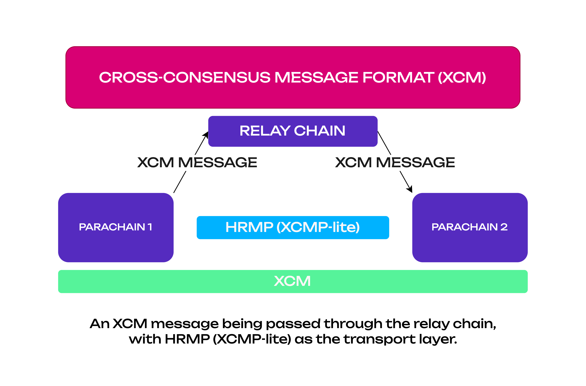

With the XCM format established, common patterns for protocols of these messages are needed.
{{ polkadot: Polkadot :polkadot }}{{ kusama: Kusama :kusama }} implements two message passing
protocols for acting on XCM messages between its constituent parachains.

There are three primary methods for message passing, one of which is under development:

1. XCMP (Cross-Chain Message Passing)
2. Horizontal Relay-routed Message Passing (HRMP/XCMP-lite)
3. VMP (Vertical Message Passing)

### XCMP (Cross-Chain Message Passing)

:::caution

XCMP is currently under development, and most of the cross-chain messages pass through HRMP channels for the
time being.

:::

XCM is related to XCMP in the same way that REST is related to RESTful.

_Cross-Chain Message Passing_ secure message passing between parachains. There are two variants:
_Direct_ and _Relayed_.

- With _Direct_, message data goes direct between parachains and is O(1) on the side of the
  Relay-chain and is very scalable.
- With _Relayed_, message data is passed via the Relay-chain, and piggy-backs over VMP. It is much
  less scalable, and parathreads in particular may not receive messages due to excessive queue
  growth.

Cross-chain transactions are resolved using a simple queuing mechanism based around a Merkle tree to
ensure fidelity. It is the task of the Relay Chain validators to move transactions on the output
queue of one parachain into the input queue of the destination parachain. However, only the
associated metadata is stored as a hash in the Relay Chain storage.

The input and output queue are sometimes referred to in the
{{ polkadot: Polkadot :polkadot }}{{ kusama: Kusama :kusama }} codebase and associated documentation
as `ingress` and `egress` messages, respectively.

:::info

For detailed information about VMP see dedicated section in
[The Polkadot Parachain Host Implementers' Guide](https://paritytech.github.io/polkadot/book/messaging.html#horizontal-message-passing).

:::

### VMP (Vertical Message Passing)

_Vertical Message Passing_ message passing between the Relay-chain itself and a parachain. Message
data in both cases exists on the Relay-chain and are interpreted by the relay chain according to
[XCM](./learn-xcm.md/#cross-consensus-message-format-xcm) standards. This includes:

- #### UMP (Upward Message Passing)

  _Upward Message Passing_ message passing from a parachain to the Relay-chain.

- #### DMP (Downward Message Passing)
  _Downward Message Passing_ message passing from the Relay-chain to a parachain.

:::info

For detailed information about VMP see dedicated section in
[The Polkadot Parachain Host Implementers' Guide](https://paritytech.github.io/polkadot/book/messaging.html#vertical-message-passing).

:::

### HRMP (XCMP-Lite)

While XCMP is still being implemented, a stop-gap protocol (see definition below) known as
**Horizontal Relay-routed Message Passing (HRMP)** exists in its place. HRMP has the same interface
and functionality as XCMP but is much more demanding on resources since it stores all messages in
the Relay Chain storage. When XCMP has been implemented, HRMP is planned to be deprecated and phased
out in favor of it.

:::note

A stop-gap protocol is a temporary substitute for the functionality that is not fully complete.
While XCMP proper is still in development, HRMP is a working replacement.

:::

A tutorial on how to open an HRMP channel on a parachain can be found
[here](../build/build-hrmp-channels.md).

#### XCMP Design

- Cross-chain messages will _not_ be delivered to the Relay Chain.
- Cross-chain messages will be constrained to a maximum size specified in bytes.
- Parachains are allowed to block messages from other parachains, in which case the dispatching
  parachain would be aware of this block.
- Collator nodes are responsible for routing messages between chains.
- Collators produce a list of `egress` messages and will receive the `ingress` messages from other
  parachains.
- On each block, parachains are expected to route messages from some subset of all other parachains.
- When a collator produces a new block to hand off to a validator, it will collect the latest
  ingress queue information and process it.
- Validators will check the proof that the new candidate for the next parachain block includes the
  processing of the expected ingress messages to that parachain.

XCMP queues must be initiated by first opening a channel between two parachains. The channel is
identified by both the sender and recipient parachains, meaning that it's a one-way channel. A pair
of parachains can have at most establish two channels between them, one for sending messages to the
other chain and another for receiving messages. The channel will require a deposit in DOT to be
opened, which will get returned when the channel is closed.
