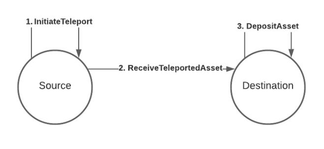
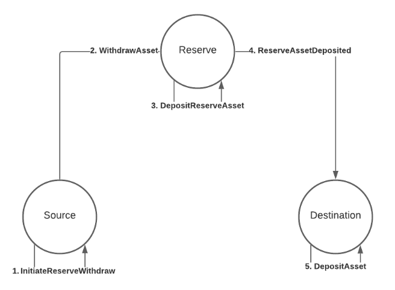
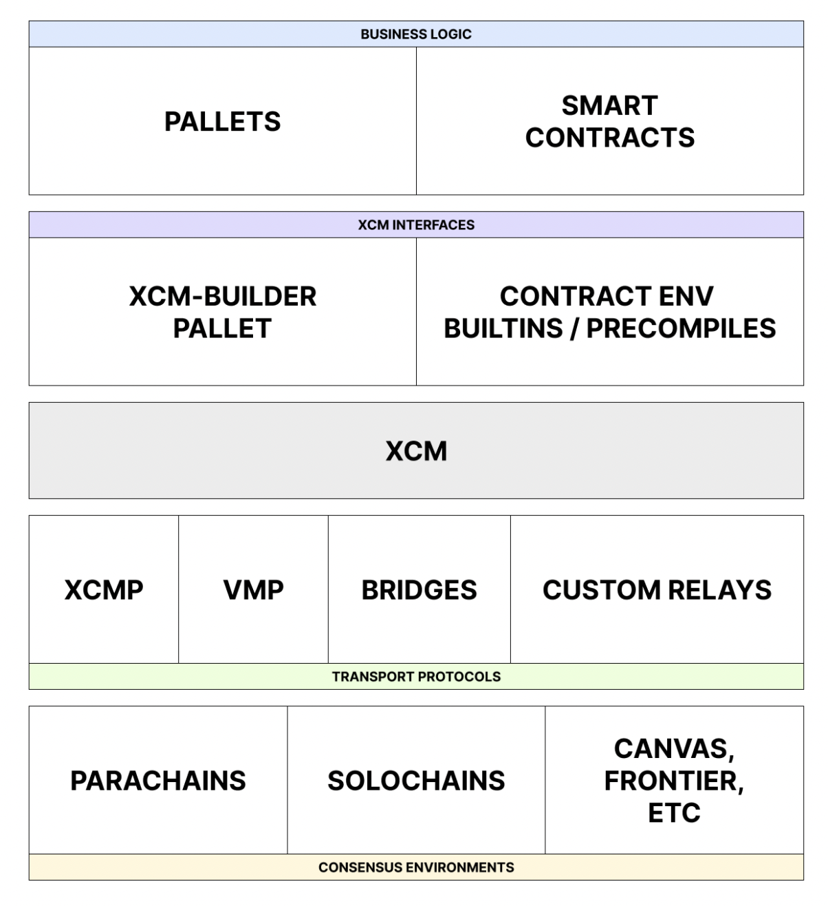

Cross-Consensus Message Format(XCM) aims to be a language to communicate ideas between consensus systems. One
of Polkadot's promises is that of interoperability, and XCM is the vehicle through which it will deliver this
promise. Simply, it is a standard that allows protocol developers to define the data and origins which
their chains can send and recieve from. Out of the box it comes with a VM that allows for customization
of execution as well as the following properties:

1. **Asynchronous**: XCM messages in no way assume that the sender will be blocking on its
   completion.
2. **Absolute**: XCM messages are guaranteed to be delivered and interpreted accurately, in order
   and in a timely fashion.
3. **Asymmetric**: XCM messages do not have results. Any results must be separately communicated to
   the sender with an additional message.
4. **Agnostic**: XCM makes no assumptions about the nature of the Consensus System between which
   messages are being passed.

:::note 

XCM is a work-in-progress. XCM v2 is deployed on Polkadot and v3 is currently in
development. See Gavin's talk about v3 in the resources section.

:::

## A Format, Not a Protocol

What started as an approach to _cross-chain communication_, has evolved into a format for
[**Cross-Consensus Communication**](https://polkadot.network/cross-chain-communication) that is
not only conducted between chains, but also between smart contracts, pallets, bridges, and even
sharded enclaves like [SPREE](learn-spree.md).

**XCM is related to cross-chain in the same way that REST is related to RESTful.**

XCM cannot actually send messages between systems. It is a format for how message transfer should be
performed, similar to how RESTful services use REST as an architectural style of development.

Similar to UDP, out of the box XCM is a "fire and forget" model. Unless, there is a seperate XCM message
designed to be a response message which can be sent from the recipient to the sender. Any kind of error
handling should also be done on the recipient side.

:::info

XCM is not designed in a way where every system supporting the format is expected to be able to interpret
any possible XCM message. Practically speaking, one can imagine that some messages will not have
reasonable interpretations under some systems or will be intentionally unsupported.

:::

### Example Use-Cases

- Request for specific operations to occur on the recipient system such as governance voting.
- Enables single use-case chains e.g. Statemint/e as asset parachains
- Optionally include payment of fees on a target network for requested operation.
- Provide methods for various asset transfer models:
  - **Remote Transfers**: control an account on a remote chain, allowing the local chain to have an
    address on the remote chain for receiving funds and to eventually transfer those funds it
    controls into other accounts on that remote chain.
  - **Asset Teleportation**: movement of an asset happens by destroying it on one side and creating a clone
    on the other side.
  - **Reserve Asset Transfer**: there may be two chains that want to nominate a third chain, where
    one includes a native asset that can be used as a reserve for that asset. Then, the derivative
    form of the asset on each of those chains would be fully backed, allowing the derivative asset
    to be exchanged for the underlying asset on the reserve chain backing it.

Let's review two of these example asset transfer use cases: **Asset Teleportation** and **Reserve Asset Transfer**.

### Asset Teleportation
An asset teleport operation from a single source to a single destination. 




1. [InitiateTeleport](https://github.com/paritytech/xcm-format#initiateteleport)

  The source gathers the assets to be teleported from the sending account and takes them out of the circulating supply, taking note of the total amount of assets that was taken out.

2. [ReceiveTeleportedAsset](https://github.com/paritytech/xcm-format#receiveteleportedasset)

  The source then creates an XCM instruction called `ReceiveTeleportedAssets` and puts the amount of assets taken out of circulation and the receiving account as parameters to this instruction. It then sends this instruction over to the destination, where it gets processed and new assets gets put back into circulating supply accordingly.

3. [DepositAsset](https://github.com/paritytech/xcm-format#depositasset)

  The destination then deposits the assets to the receiving account of the asset.

### Reserve Asset Transfer
When consensus systems do not have a established layer of trust over which they can transfer assets, they can opt for a trusted 3rd entity to store the assets. Eg. Statemine(Kusama) to Polkadot or Statemint(Polkadot) to Kusama. 



1. [InitiateReserveWithdraw](https://github.com/paritytech/xcm-format#initiatereservewithdraw)

  The source gathers the derivative assets to be transferred from the sending account and burns them, taking note of the amount of derivatives that were burned.

2. [WithdrawAsset](https://github.com/paritytech/xcm-format#withdrawasset)

  The source sends a WithdrawAsset instruction to the reserve, instructing the reserve to withdraw assets equivalent to the amount of derivatives burned from the source's sovereign account.

3. [DepositReserveAsset](https://github.com/paritytech/xcm-format#depositreserveasset)

  The reserve deposits the assets withdrawn from the previous step to the destination's sovereign account, taking note of the amount of assets deposited.

4. [ReserveAssetDeposited](https://github.com/paritytech/xcm-format#reserveassetdeposited)

  The reserve creates a ReserveAssetDeposited instruction with the amount of assets deposited to the destination's sovereign account, and sends this instruction onwards to the destination. The destination receives the instruction and processes it, minting the derivative assets as a result of the process.

5. [DepositAsset](https://github.com/paritytech/xcm-format#depositasset)

  The destination deposits the derivative assets minted to the receiving account.

### XCM Tech Stack



XCM can be used to express the meaning of the messages over each of these three communication
channels.

## XCVM (Cross-Consensus Virtual Machine)

At the core of XCM lies the Cross-Consensus Virtual Machine (XCVM). A “message” in XCM is an XCVM program. The XCVM is a state machine, state is kept track in Registers.

It’s an ultra-high level non-Turing-complete computer whose instructions are designed to be roughly at the same level as transactions. Messages are one or more XCM instructions. The program executes until it either runs to the end or hits an error, at which point it finishes up and halts. An XCM executor following the XCVM specification is provided by Parity, and it can be extended or customized, or even ignored altogether and users can create their own construct that follows the XCVM spec.

A _message_ in XCM is simply just a programme that runs on the `XCVM`: in other words, one or more
XCM instructions. To learn more about the XCVM and the XCM Format, see the latest
[blog post](https://medium.com/polkadot-network/xcm-the-cross-consensus-message-format-3b77b1373392)
by Dr. Gavin Wood.

XCM Instructions might change a register, they might change the state of the consensus system or both.

One example of such an instruction would be `TransferAsset` which is used to transfer an asset to some other address on the remote system. It needs to be told which asset(s) to transfer and to whom/where the asset is to be transferred.

```
enum Instruction {
    TransferAsset {
        assets: MultiAssets,
        beneficiary: MultiLocation,
    }
    /* snip */
}
```
A `MultiAsset` is a general identifier for an asset. It may represent both fungible and non-fungible assets, and in the case of a fungible asset, it represents some defined amount of the asset.

A `MultiLocation` is a relative identifier, meaning that it can only be used to define the relative path between two locations, and cannot generally be used to refer to a location universally. Much like a relative file-system path will first begin with any "../" components used to ascend into to the containing directory, followed by the directory names into which to descend, a `MultiLocation` has two main parts to it: the number of times to ascend into the outer consensus from the local and then an interior location within that outer consensus.

## Cross-Consensus Protocols (XCMP, VMP, HRMP)

With the XCM format established, common patterns for protocols of these messages are needed.
Polkadot implements two message passing protocols for acting on XCM messages between its constituent
parachains.

### XCMP (Cross-Chain Message Passing)

:::caution

XCMP is currently under development and most cross-chain message passing uses HRMP channels for the time being.

:::

_Cross-Chain Message Passing_ secure message passing between parachains. There are two variants:
_Direct_ and _Relayed_.

- With _Direct_, message data goes direct between parachains and is O(1) on the side of the
  Relay-chain and is very scalable.
- With _Relayed_, message data is passed via the Relay-chain, and piggy-backs over VMP. It is much
  less scalable, and parathreads in particular may not receive messages due to excessive queue
  growth.

Cross-chain transactions are resolved using a simple queuing mechanism based around a Merkle tree to
ensure fidelity. It is the task of the Relay Chain validators to move transactions on the output
queue of one parachain into the input queue of the destination parachain. However, only the
associated metadata is stored as a hash in the Relay Chain storage.

The input and output queue are sometimes referred to in the Polkadot codebase and associated
documentation as `ingress` and `egress` messages, respectively.

### VMP (Vertical Message Passing)

_Vertical Message Passing_ message passing between the Relay-chain itself and a parachain. Message
data in both cases exists on the Relay-chain. This includes:

- #### UMP (Upward Message Passing)

  _Upward Message Passing_ message passing from a parachain to the Relay-chain.

- #### DMP (Downward Message Passing)
  _Downward Message Passing_ message passing from the Relay-chain to a parachain.

### HRMP (XCMP-Lite)

While XCMP is still being implemented, a stop-gap protocol (see definition below) known as
**Horizontal Relay-routed Message Passing (HRMP)** exists in its place. HRMP has the same interface
and functionality as XCMP but is much more demanding on resources since it stores all messages in
the Relay Chain storage. When XCMP has been implemented, HRMP is planned to be deprecated and phased
out in favor of it.

:::note

A stop-gap protocol is a temporary substitute for the functionality that is not fully complete.
While XCMP proper is still in development, HRMP is a working replacement.

:::

A tutorial on how to open an HRMP channel on a parachain can be found
[here](../build/build-hrmp-channels.md).

#### XCMP Design

- Cross-chain messages will _not_ be delivered to the Relay Chain.
- Cross-chain messages will be constrained to a maximum size in bytes.
- Parachains are allowed to block messages from other parachains, in which case the dispatching
  parachain would be aware of this block.
- Collator nodes are responsible for routing messages between chains.
- Collators produce a list of `egress` messages and will receive the `ingress` messages from other
  parachains.
- On each block, parachains are expected to route messages from some subset of all other parachains.
- When a collator produces a new block to hand off to a validator, it will collect the latest
  ingress queue information and process it.
- Validators will check the proof that the new candidate for the next parachain block includes the
  processing of the expected ingress messages to that parachain.

XCMP queues must be initiated by first opening a channel between two parachains. The channel is
identified by both the sender and recipient parachains, meaning that it's a one-way channel. A pair
of parachains can have at most establish two channels between them, one for sending messages to the
other chain and another for receiving messages. The channel will require a deposit in DOT to be
opened, which will get returned when the channel is closed.

#### XCMP Message Format

For an updated and complete description of the XCMP message format please see the
[xcm-format repository on GitHub](https://github.com/paritytech/xcm-format).

#### The Anatomy of an XCMP Interaction

A smart contract that exists on parachain `A` will route a message to parachain `B` in which another
smart contract is called that makes a transfer of some assets within that chain.

Charlie executes the smart contract on parachain `A`, which initiates a new cross-chain message for
the destination of a smart contract on parachain `B`.

The collator node of parachain `A` will place this new cross-chain message into its outbound
messages queue, along with a `destination` and a `timestamp`.

The collator node of parachain `B` routinely pings all other collator nodes asking for new messages
(filtering by the `destination` field). When the collator of parachain `B` makes its next ping, it
will see this new message on parachain `A` and add it into its own inbound queue for processing into
the next block.

Validators for parachain `A` will also read the outbound queue and know the message. Validators for
parachain `B` will do the same. This is so that they will be able to verify the message transmission
happened.

When the collator of parachain `B` is building the next block in its chain, it will process the new
message in its inbound queue as well as any other messages it may have found/received.

During processing, the message will execute the smart contract on parachain `B` and complete the
asset transfer as intended.

The collator now hands this block to the validator, which itself will verify that this message was
processed. If the message was processed and all other aspects of the block are valid, the validator
will include this block for parachain `B` into the Relay Chain.

Check out our animated video below that explores how XCMP works.

<!-- Made with Adobe Animate and Canvas -->

<video
      controls="controls"  
      name="XCMP Animated Video" 
      width="560" height="315"
      src="https://storage.googleapis.com/w3f-tech-ed-contents/XCMP.mp4"> Sorry, your browser
doesn't support embedded videos. </video>

## Resources

- [Shawn Tabrizi: XCM - The Backbone Of A Multichain Future | Polkadot Decoded 2022](https://www.youtube.com/watch?v=cS8GvPGMLS0) - High level overview which should answer “What is XCM?

- [XCM: The Cross-Consensus Message Format](https://medium.com/polkadot-network/xcm-the-cross-consensus-message-format-3b77b1373392) - Detailed blog post by Dr. Gavin Wood about the XCM Format.

- [XCM Format specification](https://github.com/paritytech/xcm-format) - The best starting point for understanding the XCM API at a technical level.

- [Gavin Wood, Polkadot founder: XCM v3 | Polkadot Decoded 2022](https://www.youtube.com/watch?v=K2c6xrCoQOU&t=1196s) - High level overview of XCM and specifically the new features available in XCM v3.

- [XCMP Scheme](https://research.web3.foundation/en/latest/polkadot/XCMP.html) - Full technical description of cross-chain communication on the Web3 Foundation research wiki.

- [Messaging Overview](https://paritytech.github.io/polkadot/book/types/messages.html) - An
  overview of the messaging schemes from the Polkadot Parachain Host Implementor's guide.

- [Sub0 Online: Getting Started with XCM - Your First Cross Chain Messages](https://www.youtube.com/watch?v=5cgq5jOZx9g) - Code focused workshop on how XCM v1 works, and the core concepts of XCM.

- [XCM: Cross-Consensus Messaging Audit](https://blog.quarkslab.com/resources/2022-02-27-xcmv2-audit/21-12-908-REP.pdf) - Technical audit report by Quarkslab prepared for Parity.

- [XCM pallet code](https://github.com/paritytech/polkadot/blob/master/xcm/pallet-xcm/src/lib.rs) - The pallet that contains XCM logic from the Polkadot code repository