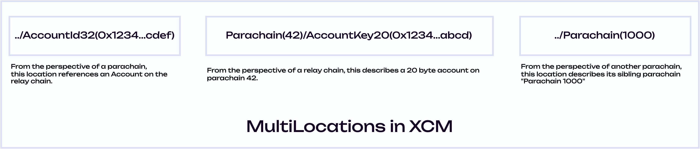

!!!info "XCM Documentation"
    For a more practical approach to utilizing XCM, refer to the [XCM Docs](./xcm/overview/intro.md). Please keep in mind that XCM is under active development.

At the core of XCM lies the Cross-Consensus Virtual Machine (XCVM). A “message” in XCM is an XCVM
program, referred to as an **"XCM"** or **"XCMs"** for multiple messages. The XCVM is a
register-based state machine. The state is tracked in domain-specific registers that hold
information that is used and mutated along the execution of a particular message. Most of the XCM
format comprises these registers and the instructions used to compose XCVM programs.

The XCVM is an ultra-high-level non-Turing-complete computer whose instructions are designed to be
roughly at the same level as transactions in terms of definition. Messages are one or more XCM
instructions executed in order by the XCVM. An XCM is executed until it either runs to the end or
hits an error, at which point it finishes up and halts.

The first implementation of the XCVM is the
[`xcm-executor`](https://github.com/paritytech/polkadot/tree/26b0c4f6273190f4538b24939a56b6a0b51a344c/xcm/xcm-executor).
It follows the XCVM specification provided by Parity. It's engineered to be extendable, providing
maximum customizability when configuring XCM. Because the `xcm-executor` is just an implementation
of XCVM, it's entirely possible to create another implementation if desired.

## XCMs are XCVM Programs

A cross consensus message (XCM) is just a program that runs on the `XCVM`: in other words, one or
more XCM instructions that are executed by an XCVM implementation, such as the `xcm-executor`. To
learn more about the XCVM and the XCM format, see the latest
[blog post on XCM](https://medium.com/polkadot-network/xcm-part-iii-execution-and-error-management-ceb8155dd166)
by Dr. Gavin Wood.

XCM instructions might change a register, the state of the consensus system, or both. Depending on
the program's goal, whether it is to teleport assets from one chain to another or call a smart
contract on another chain, XCMs usually require changes to the registers before any changes to the
consensus system can be made.

## XCM Executor & Configuration

The XCM Executor's implementation centers around a core piece: the XCM configuration. Each instance
of the Executor must have a valid configuration, which specifies a multitude of options on how a
chain may treat incoming messages via
[Barriers](https://github.com/paritytech/polkadot/blob/26b0c4f6273190f4538b24939a56b6a0b51a344c/xcm/xcm-executor/src/config.rs#L52),
calculate weight for a message via the
[Weigher](https://github.com/paritytech/polkadot/blob/26b0c4f6273190f4538b24939a56b6a0b51a344c/xcm/xcm-executor/src/config.rs#L55),
how much weight to purchase via the
[Trader](https://github.com/paritytech/polkadot/blob/26b0c4f6273190f4538b24939a56b6a0b51a344c/xcm/xcm-executor/src/config.rs#L58),
[configure fees](https://github.com/paritytech/polkadot/blob/26b0c4f6273190f4538b24939a56b6a0b51a344c/xcm/xcm-executor/src/config.rs#L89),
how to
[convert origins](https://github.com/paritytech/polkadot/blob/26b0c4f6273190f4538b24939a56b6a0b51a344c/xcm/xcm-executor/src/config.rs#L40),
and more.

## Cross Consensus Message (XCM) Anatomy & Flow

An XCM is made up of a list of instructions that are executed in order. There are four different
kinds of XCM instructions:

1. **Instruction** - Results in a state change in the local consensus system or some state change.
2. **Trusted Indication** - Tells the XCVM, or the Executor, that some action has been done before
   already - meaning, this action is now trusted and can be acted on, i.e., in a teleport scenario.
3. **Information** - Provides additional information about a particular origin, usually the result
   of a query, i.e., a `QueryResponse` instruction.
4. **System Notification** - Typically used in the context of when an HRMP channel is being opened,
   closed, or accepted.

Typically, an XCM takes the following path through the XCVM:

1.  Instructions within an XCM are read one-by-one by the XCVM. An XCM may contain one or more
    instructions.
2.  The instruction is executed. This means that the current values of the _XCVM registers_, the
    _instruction type_, and the _instruction operands_ are all used to execute some operation, which
    might result in some registers changing their value, or in an error being thrown, which would
    halt execution.
3.  Each subsequent instruction within the XCM is read until the end of the message has been
    reached.

### Example Register: The Holding Register

There are many instructions that depend on the _Holding register_. The _Holding register_ is an XCVM
register that provides a place for any assets that are in an intermediary state to be held until
they are taken out of the Holding register. It requires an instruction to place assets within it and
another to withdraw them. The simplest example of this occurring is the `DepositAsset` instruction,
which in its Rust form looks like this:

```rust
enum Instruction {
    DepositAsset {
        assets: MultiAssetFilter,
        beneficiary: MultiLocation,
    },
    /* snip */
}
```

This instruction specifies which assets (asset type and amount), already present in the Holding
register, are going to be taken from it and deposited to the specified beneficiary (recipient). It
is very common for instructions to remove and place assets into the Holding register when
transacting between chains.

### Example: TransferAsset

An example below illustrates how a chain may transfer assets locally, or locally on a remote chain
(as part of another instruction) using an XCM. In this message, the `TransferAsset` instruction is
defined with two parameters: `assets`, which are the assets to be transferred, and the
`beneficiary`, whoever will be the sole beneficiary of these assets. More complex instructions,
especially those which perform actions that target a location other than the interpreting consensus
system may make use of XCVM registers.

```rust
enum Instruction {
    TransferAsset {
        assets: MultiAssets,
        beneficiary: MultiLocation,
    }
    /* snip */
}
```

- A `MultiAsset` is a general identifier for an asset. It may represent both fungible and
  non-fungible assets, and in the case of a fungible asset, it represents some defined amount of the
  asset.

- A `MultiLocation` is a relative identifier, meaning that it can only be used to define the
  relative path between two locations, and cannot generally be used to refer to a location
  universally.

`TransferAsset` is one of the many instructions that can be contained within an XCM. For more
information, please read [XCM Instructions in the wiki](./learn-xcm-instructions.md).

## Locations in XCM

XCM's generic nature involves specifying a wide array of "locations", or any body that is governed
by consensus (parachains, solochains, smart contracts, accounts, etc). These are relatively abstract
notions that point to _where_ but also _to who_ a particular action may affect. The `MulitLocation`
type is what XCM uses to define these locations.

A `MultiLocation` is a relative identifier that defines a **relative** path into some state-bearing
consensus system.

It is used to define the relative path between two locations, and cannot generally be used to refer
to a location universally. It is very much akin to how a **relative** filesystem path works and is
dependent on which consensus system the location expression is being evaluated.



`MultiLocation` has two primary fields:

- A series of paths, called `Junctions`, which define an interior portion of state to descend into
  it (sometimes called a "sub-consensus" system, such as a smart contract or pallet). An interior
  location may also be used to refer to a Junction, used in the context of "a parachain is an
  **interior location** of the relay chain", or how a UTXO is interior to Bitcoin's consensus.
- The number of parent junctions at the beginning of a `MultiLocation`'s formation - in other words,
  the number of parent consensus systems above it.

There are a number of various `Junction` variants that may be used to describe a particular
location - whether it's a 32 byte account, a Substrate pallet, or a pluralistic body.

### MultiLocation Scenario Example

In this scenario, assume an XCM is to be sent from our parachain to the Asset Hub
(`Parachain 1000`). This XCM references an account on the Asset Hub. As a general path, the
`MultiLocation` would look like this:

```
../Parachain(1000)/AccountId32(<some_account_id>)
```

Or, as a Rust enum:

```rust
MultiLocation {
  parents: 1,
  interior: X2(Parachain(1000), <some_account_id>.into())
}
```

- In the first field, `parents`, there is a parent of `1`. This is because our parachain has the
  relay chain as a parent - in other words, it will go **up** by one consensus system to the relay
  chain. This is also illustrated by the `../` of the "file path" representation.

- The second field, `interior`, defines where to go after the relay chain. In this case, from the
  relay chain this message will go to the Asset Hub (`Parachain 1000`), then reference the account
  (`some_account_id`) located within.

Keep in mind that this location is specific to this interaction. The identities may need to change
if this location was defined on another consensus system, such as Kusama. On other consensus
systems, such as Ethereum, it won't be able to interpret it.

### UniversalLocation in XCM

A `UniversalLocation` refers to any global consensus system. A global consensus system is an entity
that provides its top-level consensus through some non-derivative consensus algorithm that can exist
without reference to any other singleton data system. Such global consensus systems include Polkadot
(or other relay chains), Bitcoin, or Ethereum. It provides a point of reference for overarching
consensus systems.

The `GlobalConsensus` junction refers to a global consensus system and takes a `NetworkId` that
specifies a particular remote network. A `UniversalLocation` allows overarching consensus systems to
communicate using this junction. Sub-consensus systems (i.e., a parachain on Polkadot) may refer to
other _remote_ sub-consensus systems (i.e., a parachain on Kusama) using a relative path defined via
a `MultiLocation`.

## Simulating XCVM using the xcm-simulator

Within the Polkadot repository exists the
[`xcm-simulator`](https://github.com/paritytech/polkadot-sdk/tree/master/polkadot/xcm/xcm-simulator),
which allows developers to experiment with building, executing, and simulating various XCM use
scenarios.
