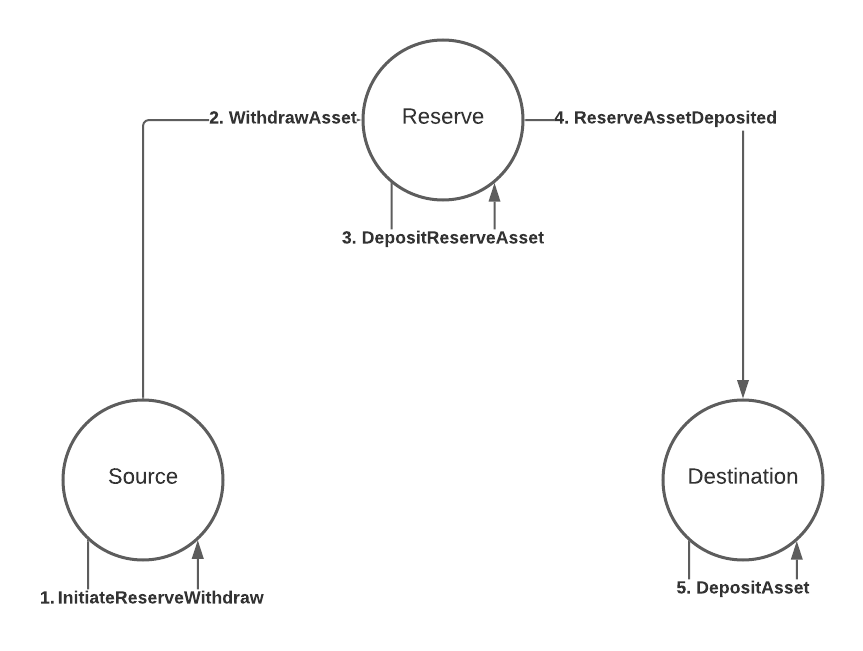
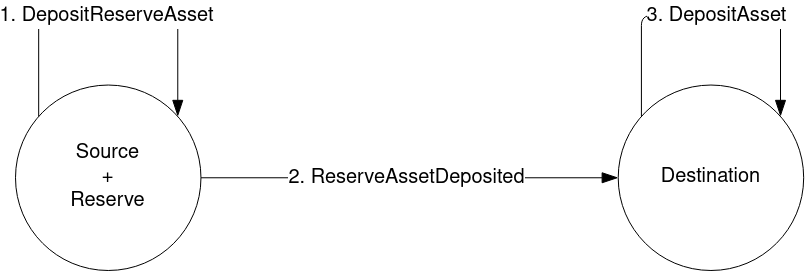

# Reserve-backed transfers

For consensus systems that don't have the level of trust required for asset teleportation, they can
instead opt for trusting a third party called a reserve to store the real assets (think Statemine on
Kusama, or Statemint on Polkadot). The source and the destination need a way to keep track of the
real assets they own on the reserve, this is usually done by minting a new derivative token. Both
source and destination now need accounts on the reserve to hold their assets, we call these their
sovereign accounts on that system.

## Process



The flow in this diagram is further explained below:

### 1. InitiateReserveWithdraw

The source gathers the derivative assets to be transferred from the sending account and burns them,
taking note of the amount of derivatives that were burned.

### 2. WithdrawAsset

The source sends a `WithdrawAsset` instruction to the reserve, instructing it to withdraw real
assets equivalent to the amount of derivatives burned from the source chain.

### 3. DepositReserveAsset

The reserve deposits the assets withdrawn from the previous step to the destination's sovereign
account, taking note of the amount of assets deposited.

### 4. ReserveAssetDeposited

The reserve creates a `ReserveAssetDeposited` instruction with the amount of assets deposited to the
destination's sovereign account, and sends this instruction onwards to the destination. The
destination receives the instruction and processes it, minting the correct amount of derivative
assets.

### 5. DepositAsset

The destination deposits the derivative assets minted to the receiving account.

### Thoughts

The addition of a third consensus system is already a hint of the disadvantages of a reserve asset
transfer model. Firstly, the reserve could easily become a point of centralization when too many
consensus systems rely on it to be the reserve of choice for their assets. Secondly, the sheer
amount of steps required necessarily makes it more prone to errors, and as such, implementors will
have to consider more possible pitfalls and provide technical support accordingly when an end user
encounters issues arising from these steps. Last, but not least, either the source or destination
can opt to designate multiple consensus systems to be their reserves. In such a situation, care must
be taken in order to ensure that the sovereign accounts on the reserves are balanced, so that one
doesn't get drained while the others still contain a healthy balance.

### A note on trust

We mentioned that reserve-backed transfers require the sender and the destination to trust a third
party, the reserve, and not each other. This is true, but it doesn't mean the sender and destination
have to trust ONLY the reserve, they also have to trust the issuer of the token. Whenever you are
dealing with a particular asset, you are always trusting the issuer of said asset, because at any
point they could mint a huge amount of that asset, wreaking havoc. You have to make sure you trust
the asset, based on the security mechanisms used to protect its issuance. For this reason, reserves
work best when they are the issuers of the asset being transacted. In that scenario, you only have
to trust the reserve, period.

## Example

We'll create a program for the scenario in the diagram. Let's assume that the reserve is a relay
chain and both source and destination are parachains 1 and 2 respectively. Let's also say that an
account ALICE in parachain 1 wants to transfer the relay chain's native token to their other account
(also ALICE) on parachain 2. The program might look like this:

```rust
let message = Xcm(vec![
  WithdrawAsset((Parent, amount).into()),
  InitiateReserveWithdraw {
    assets: All.into(),
    reserve: Parent.into(),
    xcm: Xcm(vec![DepositReserveAsset {
      assets: All.into(),
      dest: Parachain(2).into(),
      xcm: Xcm(vec![DepositAsset {
        assets: All.into(),
        beneficiary: AccountId32 { id: ALICE.into(), network: None }.into(),
      }]),
    }]),
  },
]);
```

This program should be executed on the source, so on parachain 1. We start, as usual, with a
`WithdrawAsset` instruction. The `MultiAsset` here references the relay chain's native token, which
means we'll be gathering the derivative on this chain.

### InitiateReserveWithdraw

```rust
InitiateReserveWithdraw { assets: MultiAssetFilter, reserve: MultiLocation, xcm: Xcm<()> }
```

The `InitiateReserveWithdraw` instruction takes the derivative token from the holding register and
burns it. Then it sends a new XCM to the specified `reserve`, in this example, the relay chain. This
new XCM contains the following instructions, in order:

1. WithdrawAsset
2. ClearOrigin
3. All instructions specified in the `xcm` operand, in this case `DepositReserveAsset`

As was the case with [teleports](teleports.md), instructions 1. and 2. are added automatically by
the executor when using `InitiateReserveWithdraw`.

Upon receiving this XCM, the reserve will withdraw the asset from parachain 1's sovereign account
(where the real asset is stored), and deposit it on parachain 2's sovereign account.

### DepositReserveAsset

```rust
DepositReserveAsset { assets: MultiAssetFilter, dest: MultiLocation, xcm: Xcm<()> }
```

This instruction is used in this example instead of `DepositAsset`, because as well as depositing
the assets to parachain 2's sovereign account, this instruction will send another XCM to
parachain 2. This new XCM has the following instructions:

1. ReserveAssetDeposited
2. ClearOrigin
3. All instructions specified in the `xcm` operand, in this case, only `DepositAsset`

### ReserveAssetDeposited

```rust
ReserveAssetDeposited(MultiAssets)
```

Parachain 2 receives the XCM, mints new derivative tokens and deposit them locally to the
beneficiary account. `ReserveAssetDeposited` is a _trusted indication_. As is the case with
teleporting, you need to trust the reserve to have actually put the specified amount of assets in
the sovereign account of this system. You can specify which systems you trust as reserves for which
assets by configuring the [IsReserve](../../executor_config/config.md) type in the executor. In our
example, both parachains trust the relay chain as a reserve for its own native token.

## Another example

We now know this type of transfers requires 3 actors: the source, the reserve, and the destination.
However, the source and reserve don't have to be different systems, they could be one and the same,
as in the following diagram.



In this case the message is the following:

```rust
let message = Xcm(vec![
  WithdrawAsset((Parent, amount).into()),
  DepositReserveAsset {
    assets: All.into(),
    dest: Parachain(2).into(),
    xcm: Xcm(vec![DepositAsset {
      assets: All.into(),
      beneficiary: AccountId32 { id: ALICE.into(), network: None }.into(),
    }]),
  },
]);
```

This simplifies the reserve-backed transfer. However, the destination still needs to:

- Recognize the source as the proper reserve for the tokens that are being sent over and
- Support minting derivatives of the tokens being sent over

It's also possible to skip the `WithdrawAsset` instruction. The `TransferReserveAsset` instruction
handles the withdrawal already. It can be called like so:

```rust
let message = Xcm(vec![
  TransferReserveAsset {
    assets: (Parent, amount).into(),
    dest: Parachain(2).into(),
    xcm: Xcm(vec![DepositAsset {
      assets: All.into(),
      beneficiary: AccountId32 { id: ALICE.into(), network: None }.into(),
    }]),
  },
]);
```

### Another note on trust

In this model, where the sender is the reserve, the destination is trusting the sender entirely.
It's the sender the one who doesn't need to trust the destination, since it'll ever only be minting
derivatives anyway, the sender/reserve controls the real assets and issuance.

## Next steps

Next, we'll talk about a very important topic we mentioned before but skipped in this chapter,
[paying fees](../fees.md) for the effects our XCMs have.
