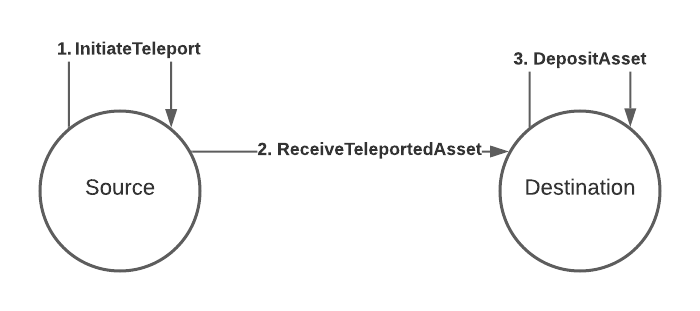

# Asset teleportation

Asset teleportation is the simpler method of the two for sending assets from one chain to another.
It has only two actors, the source and the destination.

## Process



The way in which we transfer assets between the source and the destination are briefly summarized in
the numbered labels on the diagram, and are explained in more detail below:

### 1. InitiateTeleport

The source gathers the assets to be teleported from the sending account and _takes them out of the
circulating supply_, taking note of the total amount of assets that were taken out.

### 2. ReceiveTeleportedAssets

The source then creates an XCM instruction called `ReceiveTeleportedAssets` and puts the amount of
assets taken out of circulation and the receiving account as parameters to this instruction. It then
sends this instruction over to the destination, where it gets processed and new assets are _put back
into the circulating supply_ accordingly.

### 3. DepositAsset

The destination then deposits the assets to the receiving account of the asset.

### Thoughts

The phrases "taken out of circulating supply" and "put back into circulating supply" are highlighted
above to give an indication of how much flexibility an XCM executor has in implementing the
semantics of taking an asset out of and putting it back into its circulating supply. The
straightforward answer is to burn the assets to take them out of circulation, but there are multiple
methods of achieving the same goal, such as transferring the assets locally to an inaccessible
account. Likewise for putting assets back to circulation, the receiving consensus system can freely
choose to implement such semantics by releasing assets from a pre-filled and inaccessible treasury
of the assets transferred, or perform a mint of the assets.

The above also gives a hint on the disadvantages of this model, it requires both the source and
destination to have a high level of mutual trust. The destination must trust that the source has
appropriately removed the assets that were sent over from the circulating supply, and the source
must also trust the destination to put the assets back into circulation. An asset teleportation
should result in the same circulating supply of the asset. Failing to uphold either of these two
conditions will result in a change in the asset's total issuance (in the case of fungible tokens) or
a complete loss/duplication of an NFT.

## Example

The following is an example XCM program that achieves the process described above.

```rust
let message = Xcm(vec![
  WithdrawAsset((Here, teleport_amount).into()),
  InitiateTeleport {
    assets: All.into(),
    dest: Parachain(1).into(),
    xcm: Xcm(vec![DepositAsset {
      assets: All.into(),
      beneficiary: Junction::AccountId32 {
        network: None,
        id: ALICE.into(),
      }
    }]),
  },
]);
```

Let's discuss how the new instructions work.

### InitiateTeleport

```rust
InitiateTeleport { assets: MultiAssetFilter, dest: MultiLocation, xcm: Xcm<()> }
```

This instruction is intended to be executed from the source system. It takes the assets to be
teleported (that match the `MultiAssetFilter`) from the holding register, which needs to have been
populated, usually with a `WithdrawAsset` instruction. It then sends an XCM to the destination
system given by `dest` with the following instructions:

1. ReceiveTeleportedAsset
2. ClearOrigin
3. All the instructions from the `xcm` operand, in this case `DepositAsset`

As we see in the example, instructions 1. and 2. are always added by the executor, no need to
specify them.

### ReceiveTeleportedAsset

```rust
ReceiveTeleportedAssets(MultiAssets)
```

This instruction is a _trusted indication_. It should only be executed if the origin of the XCM is
trusted for this purpose. This level of care must be taken because this instruction will _put assets
into the circulating supply_, usually minting them. As specified earlier, this can result in an
increase/decrease in circulating supply of an asset, or a duplication/loss of an NFT, if the source
is not trusted for this purpose.

You can set which origins are allowed to act as teleporters by configuring the
[IsTeleporter](../../executor_config/config.md#isteleporter) type in the XCM executor. If the origin
is not allowed to teleport assets to this system, an `UntrustedTeleportLocation` error is returned.

This instruction will populate the holding register with the teleported assets, which can be used by
further instructions. In our example, the `DepositAsset` instruction will deposit these assets to
the receiving account.

### ClearOrigin

```rust
ClearOrigin
```

This instruction clears the origin register of the XCVM. It's mainly used to not allow further
instructions to act on behalf of the previous origin. The `InitiateTeleport` instruction sends a XCM
to the destination system with freshly minted assets and immediately clears the origin.

## Another example

Let's say we want to teleport an NFT (Non-Fungible Token) this time, instead of a fungible token, to
another system. We could do so with the following program:

```rust
let message = Xcm(vec![
  WithdrawAsset((GeneralIndex(1), 42u32).into()),
  InitiateTeleport {
    assets: All.into(),
    dest: Parachain(1).into(),
    xcm: Xcm(vec![DepositAsset {
      assets: All.into(),
      beneficiary: Junction::AccountId32 {
        id: ALICE.into(),
        network: None,
      }.into()
    }]),
  },
]);
```

Very little changes, in fact, only the `MultiAsset` we're referencing changes, like we would expect.
All the teleportation logic stays the same. The example assumes an NFT with index 42 inside a
collection with index 1.

## Next steps

We'll look at reserve-backed transfers [next](reserve.md).
