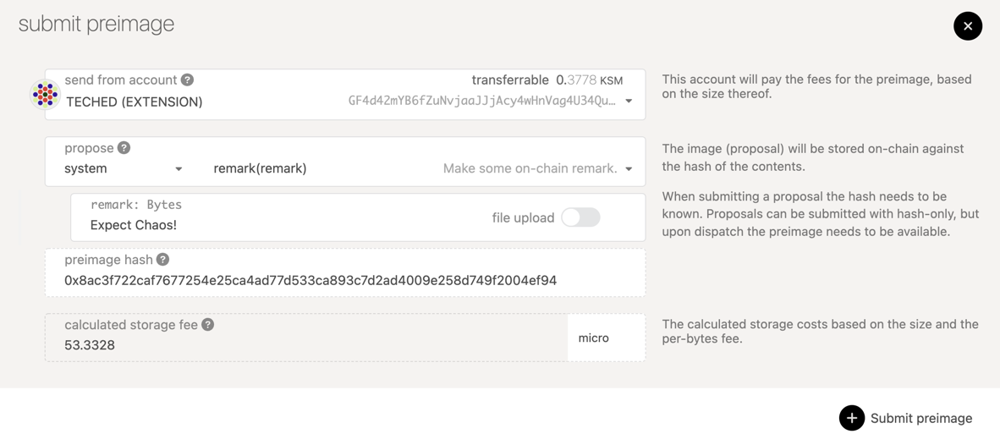

The public referenda chamber is one of the three bodies of on-chain governance
as it's instantiated in Polkadot and Kusama. The other two bodies are the
[council](maintain-guides-how-to-join-council) and the
[technical committee](learn-governance#technical-committee).

Public referenda can be proposed and voted on by any token holder in the system
as long as they provide a bond. After a proposal is made, others can agree with
it by _seconding_ it and putting up tokens equal to the original bond. Every
launch period, the most seconded proposal will be moved to the public referenda
table will it can be voted upon. Voters who are willing to lock up their tokens
for a greater duration of time can do so and get their vote amplified. For more
details on the governance system please see [here](learn-governance).

This guide will instruct token holders how to propose and vote on public
referenda using the Democracy module as it's implemented in Kusama.

## Important Parameters

The important parameters to be aware of when voting using the Democracry module are as follow:

**Launch Period** - How often new public referenda are launched.

**Voting Period** - How often votes for referenda are tallied.

**Emergency Voting Period** - The minimum voting period for a fast-tracked
emergency referendum.

**Minimum Deposit** - The minimum amount to be used as a deposit for a public
referendum proposal.

**Enactment Period** - The minimum period for locking funds _and_ the period 
between a proposal being approved and enacted.

**Cooloff Period** - The period in blocks where a proposal may not be 
re-submitted after being vetoed.

## Proposing an Action

Proposing an action to be taken requires you to bond some tokens. In order to
ensure you have enough tokens to make the minimum deposit you can check the
parameter in the chain state.

On Polkadot Apps you can use the "Democracy" tab to make a new proposal. In order
to submit a proposal, you will need to submit what's called the preimage hash.
The preimage hash is simply the hash of the proposal to be enacted. The easiest
way to get the preimage hash is by clicking on the "Submit preimage" button and
configuring the action that you are proposing.

For example, if you wanted to propose that the account "Dave" would have a balance
of 10 tokens your proposal may look something like the below image. The preimage
hash would be `0xa50af1fadfca818feea213762d14cd198404d5496bca691294ec724be9d2a4c0`.
You can copy this preimage hash and save it for the next step. There is no need to click Submit Preimage at this point, though you could. We'll go over that in the next section.

Now you will click on the "Submit proposal" button and enter the preimage hash
in the input titled "preimage hash" and _at least_ the minimum deposit into the
"locked balance" field. Click on the blue "Submit proposal" button and confirm
the transaction. You should now see your proposal appear in the "proposals"
column on the page.

Now your proposal is visible by anyone who accesses the chain and others can
second it or submit a preimage. However, it's hard to tell what exactly this
proposal does since it shows the hash of the action. Other holders will not be
able to make a judgement for whether they second it or not until someone submits
the actual preimage for this proposal. In the next step you will submit the preimage.

## Submitting a Preimage

The act of making a proposal is split from submitting the preimage for the proposal
since the storage cost of submitting a large preimage could be pretty expensive.
Allowing for the preimage submission to come as a separate transaction means that
another account could submit the preimage for you if you don't have the funds to
do so. It also means that you don't have to pay so many funds right away as you
can prove the preimage hash out-of-band.

However, at some point before the proposal passes you will need to submit the
preimage or else the proposal cannot be enacted. The guide will now show you how
to do this.

Click on the blue "Submit preimage" button and configure it to be the same as
what you did before to acquire the preimage hash. This time, instead of copying
the hash to another tab, you will follow through and click "Submit preimage" and
confirm the transaction. 

Once the transaction is included you should see the UI
update with the information for your already submitted proposal.

## Seconding a Proposal

Seconding a proposal means that you are agreeing with the proposal and backing
it with an equal amount of deposit as was originally locked. By seconding a 
proposal you will move it higher up the rank of proposals. The most seconded
proposal - in value, not number of supporters - will be tabled as a referendum to be voted on every launch period.

To second a proposal, navigate to the proposal you want to second and click on
the "Second" button.

You will be prompted with the full details of the proposal (if the preimage has
been submitted!) and can then broadcast the transaction by clicking the blue
"Second" button.

Once successful you will see your second appear in the dropdown in the proposal
details.

## Voting on a Proposal

At the end of each launch period, the most seconded proposal will move to
referendum. During this time you can cast a vote for or against the proposal.
You may also lock up your tokens for a greater length of time to weigh your vote
more strongly.

To vote on a referendum, navigate to the "Democracy" tab of Polkadot Apps. Any
active referendum will show in the "referenda" column. Click the blue button
"Vote" to cast a vote for the referendum.

If you would like to cast your vote for the proposal select the "Aye, I approve"
option. If you would like to cast your vote against the proposal in referendum
you will select "Nay, I do not approve" option. 

The second option is to select your conviction for this vote. The longer you are
willing to lock your tokens, the stronger your vote will be weighted. Unwillingness
to lock your tokens means that your vote only counts for 10% of the tokens that
you hold, while the maximum lock up of 128 days means you can make your vote count
for 500% of the tokens that you hold.

When you are comfortable with the decision you have made, click the blue "Vote"
button to submit your transaction and wait for it to be included in a block.

## Delegate a Vote

You may want to delegate your vote to another account in case that you are unsure
about the best decision for a particular referendum, but trust the judgement of
another.

You can delegate your vote to another account and even attach a "Conviction"
to the delegation. Navigate to the "Extrinsics" tab on Polkadot Apps and select
the options "democracy" and "delegate". This means you are accessing the democracy
pallet and choosing the delegate transaction type to send. 

In the first input select the account you want to delegate to and in the second
input select the amount of your conviction. Remember, higher convictions means
that your vote will be locked longer. So choose wisely!

After you send the delegate transaction, you can verify it went through by navigating
to the "Chain State" tab and selecting the "democracy" and "delegations" options.
You will see an output similar to below, showing the addresses to which you have
delegated your voting power.

## Undelegate a Vote

After some time if you decide to undelegate your vote from the delegated account,
you must send the `undelegate` transaction from the account you wish to
clear.

The easiest way to do this is from the "Extrinsics" tab of Polkadot Apps. Select
the "democracy" pallet and the "undelegate" transaction type. Ensure that you are
sending the transaction from the account you want to clear of delegations. Click
"Submit transaction" and confirm. 

## Proxies

Proxies can be used to vote on behalf of a stash account. Unlike delegation,
the proxy is meant to act as a longer-term account that makes all the voting
decisions for funds held in a different account. Delegation is a logical action,
taken when you trust another account's judgement, while proxying is more of a
recommended security practice for keeping your funds safe and using an active
account with low funds instead.

### Setting a proxy

Setting a proxy involves submitting a single transaction, 
the transaction type "setProxy" from the "democracy" pallet.

You can make this transaction from Polkadot Apps by navigating to the "Extrinsics"
tab and selecting the "democracy" pallet and the "setProxy" transaction type.
Send the transaction from the "Stash" account which holds the funds that you want
to vote with, and the target to the proxy account that will be responsible for
casting the votes going forward. In the example below, "Alice Stash" is proxying
to "Alice" so that Alice can vote on behalf of Alice Stash.

### Voting with a proxy

Making a vote on behalf of a stash requires a `proxyVote` transaction. When
sending this transaction you will specify the index of the referendum that is
being voted on as well as the judgement (i.e. "Aye" for approval or "Nay" for
rejection).

### Removing a proxy

At some point you may want to remove a proxy from being able to vote on behalf
of a stash account. This is possible to do by submitting a `removeProxy` transaction
from the stash account, targetting the proxy account.

### Resigning a proxy

If a proxy account wants to resign their proxy status for a different stash account
this is possible to do by sending the `resignProxy` transaction. Simply call this
transaction from the proxy account and all of its proxy responsibilities will be
removed.

