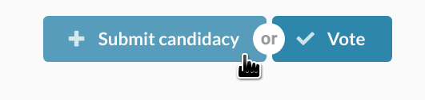
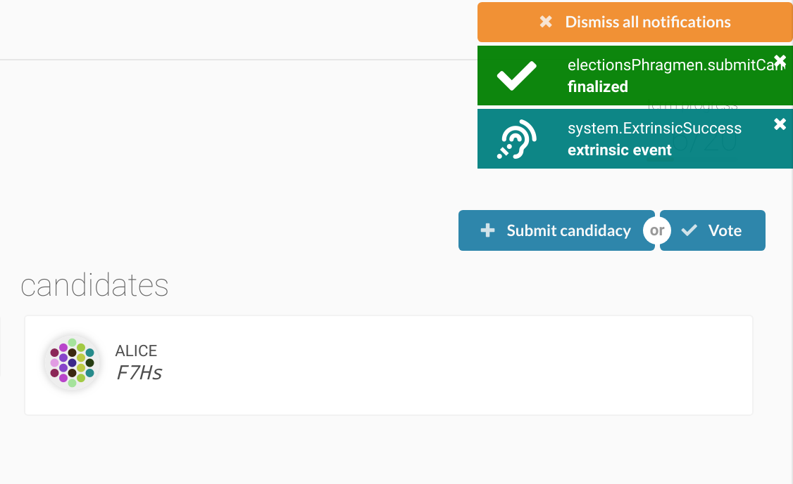
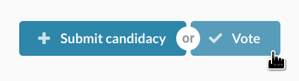
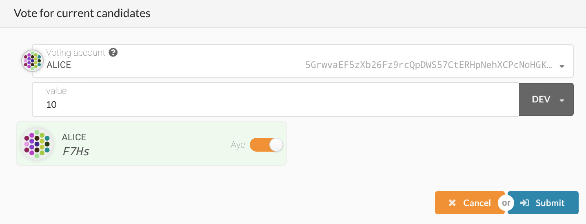
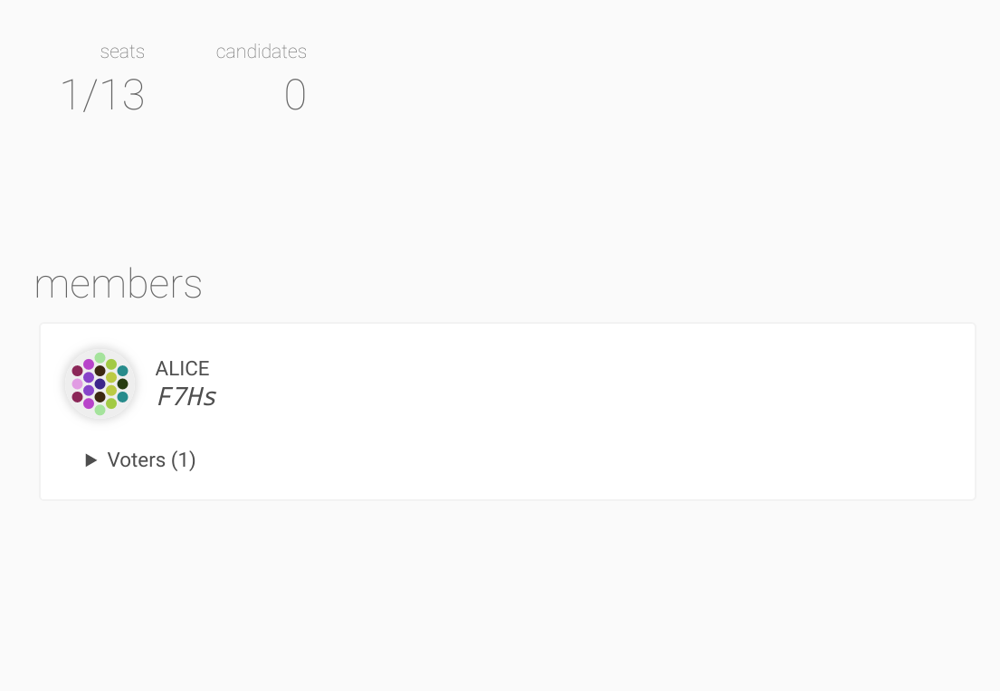

The council is an elected body of on-chain accounts that are intended to represent the passive stakeholders of Polkadot and/or Kusama. The council has two major tasks in governance: proposing referenda and vetoing dangerous or malicious referenda. For more information on the council, see the [governance page](learn-governance#council). This guide will walk you through entering your candidacy to the council.

## Submit Candidacy

Submitting your candidacy for the council requires a small bond of DOTs / KSMs. The bond will be forfeited if your
candidacy does not win or become a runner-up, but if you become a member of the council you will eventually get your
bond back. Runner-ups are selected after every round and are reserved members in case one of the winners gets forcefully
removed.

> Currently the bond for submitting a council candidacy on Kusama is 1 KSM.

It is a good idea to announce your council intention before submitting your candidacy so that your supporters will know
that when they can start to vote for you. You can also vote for yourself in case no one else does.

Go to [Polkadot Apps Dashboard](https://polkadot.js.org/apps) and navigate to the "Council" tab. Click the button on the
right that says "Submit Candidacy."

After making the transaction, you will see your account appear on the right column under the "Candidates." 

It is a good idea now to lead by example and give yourself a vote.

## Voting on Candidates

Next to the button to submit candidacy is another button titled "Vote." You will click this button to make a vote for
yourself (optional).

The council uses the Phragmen approval voting which is also used in the validator elections. This means that you can
choose up to 16 distinct candidates to vote for and your stake will equalize between them. For this guide, choose to
approve your own candidacy by clicking on the switch next to your account and changing it to say "Aye."

## Winning

If you are one of the lucky ones to win a council election you will see your account move to the left column under
the heading "Members." 

Congratulations! Now you are able to participate on the council by making motions or vetoing
proposals. It's a good idea to now [set a nick]() so that others know who the account belongs to and join the public
[Kusama governance channel](). 
