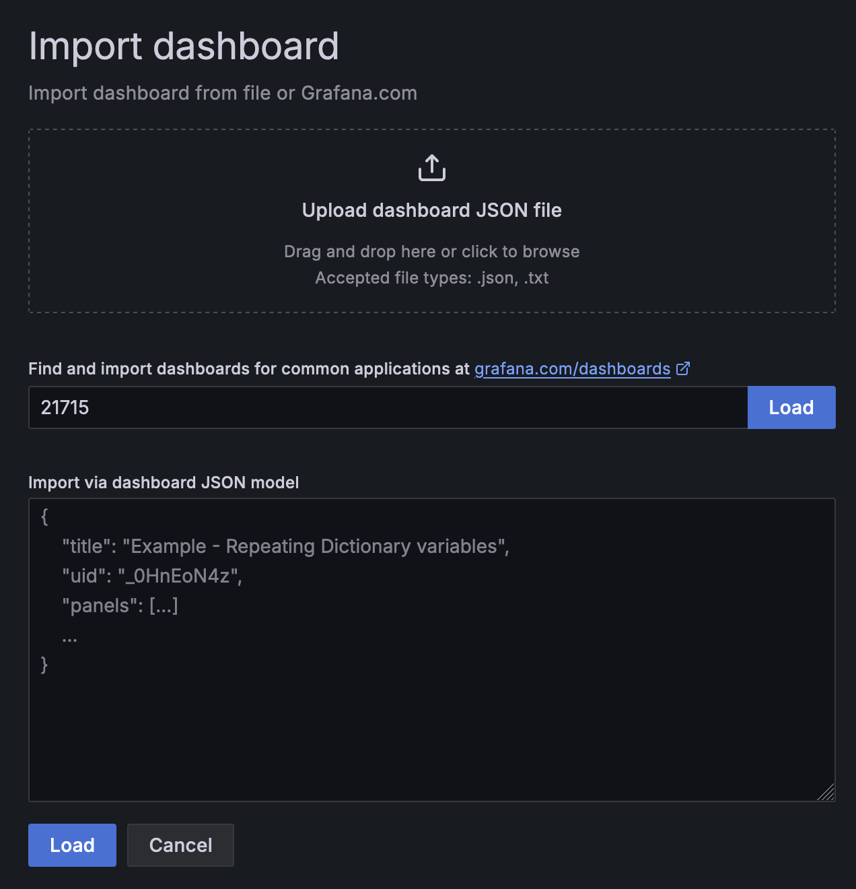
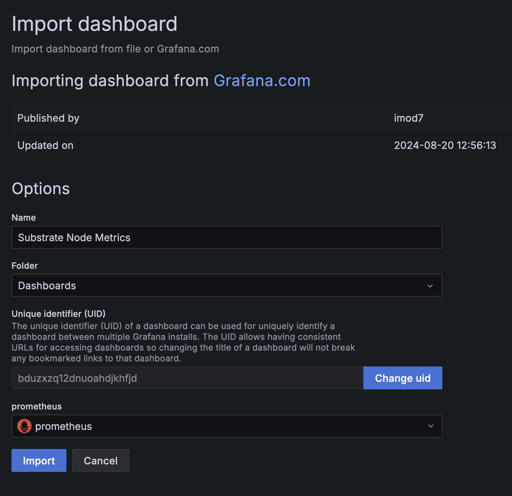

This guide will walk you through how to set up [Prometheus](https://prometheus.io/) with
[Grafana](https://grafana.com/) to monitor your node using Ubuntu 18.04.

A Substrate-based chain exposes data such as the height of the chain, the number of connected peers
to your node, CPU, memory usage of your machine, and more. To monitor this data, Prometheus is used
to collect metrics and Grafana allows for displaying them on the dashboard.

## Preparation

First, create a user for Prometheus by adding the `--no-create-home` flag to disallow `prometheus` from
logging in.

```bash
sudo useradd --no-create-home --shell /usr/sbin/nologin prometheus
```

Create the directories required to store the configuration and executable files.

```bash
sudo mkdir /etc/prometheus
sudo mkdir /var/lib/prometheus
```

Change the ownership of these directories to `prometheus` so that only prometheus can access them.

```bash
sudo chown -R prometheus:prometheus /etc/prometheus
sudo chown -R prometheus:prometheus /var/lib/prometheus
```

## Installing and Configuring Prometheus

After setting up the environment, update your OS, and install the latest Prometheus. You can check
the latest release by going to their GitHub repository under the
[releases](https://github.com/prometheus/prometheus/releases/) page.

```bash
sudo apt-get update && apt-get upgrade
wget https://github.com/prometheus/prometheus/releases/download/v2.20.1/prometheus-2.20.1.linux-amd64.tar.gz
tar xfz prometheus-*.tar.gz
cd prometheus-2.20.1.linux-amd64
```

The following two binaries are in the directory:

- prometheus - Prometheus main binary file
- promtool

The following two directories (which contain the web interface, configuration files examples and the
license) are in the directory:

- consoles
- console_libraries

Copy the executable files to the `/usr/local/bin/` directory.

```bash
sudo cp ./prometheus /usr/local/bin/
sudo cp ./promtool /usr/local/bin/
```

Change the ownership of these files to the `prometheus` user.

```bash
sudo chown prometheus:prometheus /usr/local/bin/prometheus
sudo chown prometheus:prometheus /usr/local/bin/promtool
```

Copy the `consoles` and `console_libraries` directories to `/etc/prometheus`

```bash
sudo cp -r ./consoles /etc/prometheus
sudo cp -r ./console_libraries /etc/prometheus
```

Change the ownership of these directories to the `prometheus` user.

```bash
sudo chown -R prometheus:prometheus /etc/prometheus/consoles
sudo chown -R prometheus:prometheus /etc/prometheus/console_libraries
```

Once everything is done, run this command to remove `prometheus` directory.

```bash
cd .. && rm -rf prometheus*
```

Before using Prometheus, it needs some configuration. Create a YAML configuration file named
`prometheus.yml` by running the command below.

```bash
sudo nano /etc/prometheus/prometheus.yml
```

The configuration file is divided into three parts which are `global`, `rule_files`, and `scrape_configs`.

- `scrape_interval` defines how often Prometheus scrapes targets, while `evaluation_interval` controls
how often the software will evaluate rules.

- `rule_files` block contains information of the location of any rules we want the Prometheus server
to load.

- `scrape_configs` contains the information which resources Prometheus monitors.

The configuration file should look like this below:

```yaml
global:
  scrape_interval:     15s
  evaluation_interval: 15s

rule_files:
  # - "first.rules"
  # - "second.rules"

scrape_configs:
  - job_name: 'prometheus'
    scrape_interval: 5s
    static_configs:
      - targets: ['localhost:9090']
  - job_name: 'substrate_node'
    scrape_interval: 5s
    static_configs:
      - targets: ['localhost:9165']
```

With the above configuration file, the first exporter is the one that Prometheus exports to monitor
itself. As we want to have more precise information about the state of the Prometheus server we
reduced the `scrape_interval` to 5 seconds for this job. The parameters `static_configs` and
`targets` determine where the exporters are running. While the second exporter is capturing the data
from your node, and the port by default is `9165`.

Save the configuration file and change the ownership of the file to `prometheus` user.

```bash
sudo chown prometheus:prometheus /etc/prometheus/prometheus.yml
```

## Starting Prometheus

To test the Prometheus is setup properly, execute the following command to start it as a
`prometheus` user.

```bash
sudo -u prometheus /usr/local/bin/prometheus --config.file /etc/prometheus/prometheus.yml --storage.tsdb.path /var/lib/prometheus/ --web.console.templates=/etc/prometheus/consoles --web.console.libraries=/etc/prometheus/console_libraries
```

The following messages indicate the status of the server. If you see the following messages, your
server is setup properly.

```bash
level=info ts=2020-08-12T21:39:05.453Z caller=main.go:308 msg="No time or size retention was set so using the default time retention" duration=15d
level=info ts=2020-08-12T21:39:05.453Z caller=main.go:343 msg="Starting Prometheus" version="(version=2.20.1, branch=HEAD, revision=983ebb4a513302315a8117932ab832815f85e3d2)"
level=info ts=2020-08-12T21:39:05.453Z caller=main.go:344 build_context="(go=go1.14.6, user=root@7cbd4d1c15e0, date=20200805-17:26:58)"
level=info ts=2020-08-12T21:39:05.453Z caller=main.go:345 host_details="(Linux 4.15.0-88-generic #88-Ubuntu SMP Tue Feb 11 20:11:34 UTC 2020 x86_64 Ethereum-Archive-Node (none))"
level=info ts=2020-08-12T21:39:05.453Z caller=main.go:346 fd_limits="(soft=1024, hard=1048576)"
level=info ts=2020-08-12T21:39:05.453Z caller=main.go:347 vm_limits="(soft=unlimited, hard=unlimited)"
level=info ts=2020-08-12T21:39:05.455Z caller=web.go:524 component=web msg="Start listening for connections" address=0.0.0.0:9090
level=info ts=2020-08-12T21:39:05.455Z caller=main.go:684 msg="Starting TSDB ..."
level=info ts=2020-08-12T21:39:05.459Z caller=head.go:641 component=tsdb msg="Replaying on-disk memory mappable chunks if any"
level=info ts=2020-08-12T21:39:05.459Z caller=head.go:655 component=tsdb msg="On-disk memory mappable chunks replay completed" duration=2.846µs
level=info ts=2020-08-12T21:39:05.459Z caller=head.go:661 component=tsdb msg="Replaying WAL, this may take a while"
level=info ts=2020-08-12T21:39:05.464Z caller=head.go:713 component=tsdb msg="WAL segment loaded" segment=0 maxSegment=0
level=info ts=2020-08-12T21:39:05.464Z caller=head.go:716 component=tsdb msg="WAL replay completed" checkpoint_replay_duration=26.822µs wal_replay_duration=4.649295ms total_replay_duration=4.737874ms
level=info ts=2020-08-12T21:39:05.466Z caller=main.go:700 fs_type=EXT4_SUPER_MAGIC
level=info ts=2020-08-12T21:39:05.466Z caller=main.go:701 msg="TSDB started"
level=info ts=2020-08-12T21:39:05.466Z caller=main.go:805 msg="Loading configuration file" filename=/etc/prometheus/prometheus.yml
level=info ts=2020-08-12T21:39:05.467Z caller=main.go:833 msg="Completed loading of configuration file" filename=/etc/prometheus/prometheus.yml
level=info ts=2020-08-12T21:39:05.467Z caller=main.go:652 msg="Server is ready to receive web requests."
```

Go to `http://SERVER_IP_ADDRESS:9090/graph` to check whether you are able to access the Prometheus
interface or not. If it is working, simply exit the process by pressing on `CTRL + C` on your
Prometheus console.

Next, we would like to automatically start the server during the boot process, so we have to create
a new `systemd` configuration file with the following config.

```bash
sudo nano /etc/systemd/system/prometheus.service
```

```bash
[Unit]
  Description=Prometheus Monitoring
  Wants=network-online.target
  After=network-online.target

[Service]
  User=prometheus
  Group=prometheus
  Type=simple
  ExecStart=/usr/local/bin/prometheus \
  --config.file /etc/prometheus/prometheus.yml \
  --storage.tsdb.path /var/lib/prometheus/ \
  --web.console.templates=/etc/prometheus/consoles \
  --web.console.libraries=/etc/prometheus/console_libraries
  ExecReload=/bin/kill -HUP $MAINPID

[Install]
  WantedBy=multi-user.target
```

Once the file is saved, execute the command below to use reload the `systemd` and enable the service
so that it will be loaded automatically during starting the OS.

```bash
sudo systemctl daemon-reload && systemctl enable prometheus && systemctl start prometheus
```

## Installing Grafana

In order to visualize your node metrics, you can use Grafana to query the Prometheus server. Run the
following commands to install it first.

```bash
sudo sudo apt-get install -y adduser libfontconfig1
wget https://dl.grafana.com/oss/release/grafana_7.1.3_amd64.deb
sudo dpkg -i grafana_7.1.3_amd64.deb
```

If everything is fine, start the Grafana server and access it by going to the
`http://SERVER_IP_ADDRESS:3000/login`. The default user and password is admin/admin.

```bash
sudo systemctl daemon-reload && sudo systemctl enable grafana-server && sudo systemctl start grafana-server
```


In order to visualize the node metrics, click setting to configure the `Data Sources` first.


Click `Add data source` to choose where the data is coming from.


Select `Prometheus`.


The only thing you need to input is the `URL` that is `https://localhost:9090` and then click
`Save & Test`. If you see `Data source is working`, your connection is configured
correctly.


Next, import the dashboard that lets you visualize your node data. Go to the menu bar on the
left and mouse hover "+" then select `Import`.

`Import via grafana.com` - It allows you to use a dashboard that someone else has created and made
public. You can check what other dashboards are available via
[https://grafana.com/grafana/dashboards](https://grafana.com/grafana/dashboards). In this guide, we
use ["My Polkadot Metrics"](https://grafana.com/grafana/dashboards/12425), so input "12425" under the id field and click `Load`.



Once it has been loaded, make sure to select "Prometheus" in the Prometheus dropdown list. Then
click `Import`.



In the meantime, start your Polkadot node by running `./polkadot`. If everything is done
correctly, you should be able to monitor your node's performance such as the current block height,
CPU, memory usage, etc. on the Grafana dashboard.


