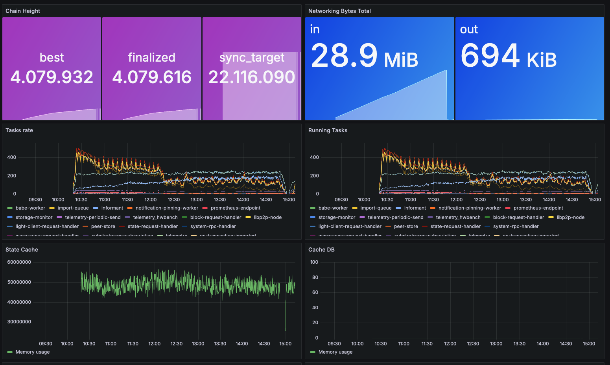

This guide will walk you through how to set up the [Prometheus](https://prometheus.io/) with [Grafana](https://grafana.com/) to monitor your node using Ubuntu 18.04.

## Preparation

First, create a user for Prometheus and Node Exporter without the possibility to log in.

```bash
useradd --no-create-home --shell /usr/sbin/nologin prometheus
useradd --no-create-home --shell /bin/false node_exporter
```

Create the directories required to store the configuration and executable files.

```bash
mkdir /etc/prometheus
mkdir /var/lib/prometheus
```

Change the ownership of these directories to `prometheus` so that only prometheus can access to these them.

```bash
sudo chown prometheus:prometheus /etc/prometheus
sudo chown prometheus:prometheus /var/lib/prometheus
```

## Installing & Configuring Node Exporter

```bash
wget https://github.com/prometheus/node_exporter/releases/download/v1.0.1/node_exporter-1.0.1.linux-amd64.tar.gz
```

```bash
tar xvf node_exporter-1.0.1.linux-amd64.tar.gz
```

```bash
cp node_exporter-1.0.1.linux-amd64/node_exporter /usr/local/bin
chown node_exporter:node_exporter /usr/local/bin/node_exporter
```

```bash
rm -rf node_exporter-1.0.1.linux-amd64*
```

```bash
nano /etc/systemd/system/node_exporter.service
```

```bash
[Unit]
Description=Node Exporter
Wants=network-online.target
After=network-online.target

[Service]
User=node_exporter
Group=node_exporter
Type=simple
ExecStart=/usr/local/bin/node_exporter

[Install]
WantedBy=multi-user.target
```


```bash
systemctl daemon-reload && systemctl start node_exporter && systemctl status node_exporter
```

```bash
systemctl enable node_exporter
```

## Installing & Configuring Prometheus

```bash
apt-get update && apt-get upgrade
wget https://github.com/prometheus/prometheus/releases/download/v2.20.1/prometheus-2.20.1.linux-amd64.tar.gz
tar xfz prometheus-*.tar.gz
cd prometheus-2.20.1.linux-amd64
```

```bash
cp ./prometheus /usr/local/bin/
cp ./promtool /usr/local/bin/
```

```bash
chown prometheus:prometheus /usr/local/bin/prometheus
chown prometheus:prometheus /usr/local/bin/promtool
```

```bash
cp -r ./consoles /etc/prometheus
cp -r ./console_libraries /etc/prometheus
```

```bash
chown -R prometheus:prometheus /etc/prometheus/consoles
chown -R prometheus:prometheus /etc/prometheus/console_libraries
```

```bash
cd .. && rm -rf prometheus*
```

```bash
nano /etc/prometheus/prometheus.yml
```

```bash
global:
  scrape_interval:     15s
  evaluation_interval: 15s

rule_files:
  # - "first.rules"
  # - "second.rules"

scrape_configs:
  - job_name: 'prometheus'
    scrape_interval: 5s
    static_configs:
      - targets: ['localhost:9090']
  - job_name: 'node_exporter'
    scrape_interval: 5s
    static_configs:
      - targets: ['localhost:9100']
```

```bash
chown prometheus:prometheus /etc/prometheus/prometheus.yml
```

```bash
sudo -u prometheus /usr/local/bin/prometheus --config.file /etc/prometheus/prometheus.yml --storage.tsdb.path /var/lib/prometheus/ --web.console.templates=/etc/prometheus/consoles --web.console.libraries=/etc/prometheus/console_libraries
```


```bash
level=info ts=2020-08-12T21:39:05.453Z caller=main.go:308 msg="No time or size retention was set so using the default time retention" duration=15d
level=info ts=2020-08-12T21:39:05.453Z caller=main.go:343 msg="Starting Prometheus" version="(version=2.20.1, branch=HEAD, revision=983ebb4a513302315a8117932ab832815f85e3d2)"
level=info ts=2020-08-12T21:39:05.453Z caller=main.go:344 build_context="(go=go1.14.6, user=root@7cbd4d1c15e0, date=20200805-17:26:58)"
level=info ts=2020-08-12T21:39:05.453Z caller=main.go:345 host_details="(Linux 4.15.0-88-generic #88-Ubuntu SMP Tue Feb 11 20:11:34 UTC 2020 x86_64 Ethereum-Archive-Node (none))"
level=info ts=2020-08-12T21:39:05.453Z caller=main.go:346 fd_limits="(soft=1024, hard=1048576)"
level=info ts=2020-08-12T21:39:05.453Z caller=main.go:347 vm_limits="(soft=unlimited, hard=unlimited)"
level=info ts=2020-08-12T21:39:05.455Z caller=web.go:524 component=web msg="Start listening for connections" address=0.0.0.0:9090
level=info ts=2020-08-12T21:39:05.455Z caller=main.go:684 msg="Starting TSDB ..."
level=info ts=2020-08-12T21:39:05.459Z caller=head.go:641 component=tsdb msg="Replaying on-disk memory mappable chunks if any"
level=info ts=2020-08-12T21:39:05.459Z caller=head.go:655 component=tsdb msg="On-disk memory mappable chunks replay completed" duration=2.846µs
level=info ts=2020-08-12T21:39:05.459Z caller=head.go:661 component=tsdb msg="Replaying WAL, this may take a while"
level=info ts=2020-08-12T21:39:05.464Z caller=head.go:713 component=tsdb msg="WAL segment loaded" segment=0 maxSegment=0
level=info ts=2020-08-12T21:39:05.464Z caller=head.go:716 component=tsdb msg="WAL replay completed" checkpoint_replay_duration=26.822µs wal_replay_duration=4.649295ms total_replay_duration=4.737874ms
level=info ts=2020-08-12T21:39:05.466Z caller=main.go:700 fs_type=EXT4_SUPER_MAGIC
level=info ts=2020-08-12T21:39:05.466Z caller=main.go:701 msg="TSDB started"
level=info ts=2020-08-12T21:39:05.466Z caller=main.go:805 msg="Loading configuration file" filename=/etc/prometheus/prometheus.yml
level=info ts=2020-08-12T21:39:05.467Z caller=main.go:833 msg="Completed loading of configuration file" filename=/etc/prometheus/prometheus.yml
level=info ts=2020-08-12T21:39:05.467Z caller=main.go:652 msg="Server is ready to receive web requests."
```

```bash
nano /etc/systemd/system/prometheus.service
```

```bash
[Unit]
  Description=Prometheus Monitoring
  Wants=network-online.target
  After=network-online.target

[Service]
  User=prometheus
  Group=prometheus
  Type=simple
  ExecStart=/usr/local/bin/prometheus \
  --config.file /etc/prometheus/prometheus.yml \
  --storage.tsdb.path /var/lib/prometheus/ \
  --web.console.templates=/etc/prometheus/consoles \
  --web.console.libraries=/etc/prometheus/console_libraries
  ExecReload=/bin/kill -HUP $MAINPID

[Install]
  WantedBy=multi-user.target
```

```bash
systemctl daemon-reload && systemctl enable prometheus && systemctl start prometheus
```


## Installing Grafana

```bash
sudo apt-get install -y adduser libfontconfig1
wget https://dl.grafana.com/oss/release/grafana_7.1.3_amd64.deb
sudo dpkg -i grafana_7.1.3_amd64.deb
```

```bash
systemctl daemon-reload && sudo systemctl enable grafana-server && sudo systemctl start grafana-server
```

`http://IP_ADDRESS:3000/login`. The default user and password is admin/admin.



