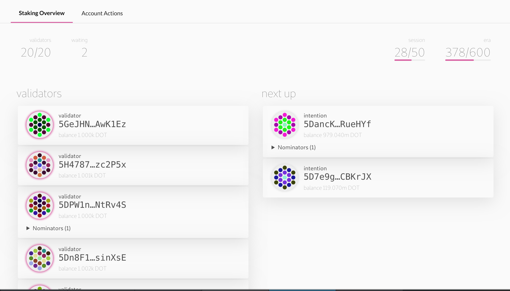

TODO: we're no longer in soft launch

## During Soft Launch

While Kusama is still in the soft launch phase most of the functionality is disabled besides Staking. This is so that
50 - 100 validators can register their intention to secure the Kusama network by running [validator nodes](maintain-validator).
If you do not want to operate a validator node yourself, you can still stake your tokens and earn rewards by
_nominating_ to a reputable validator. This guide will walk you through how to do that during the soft launch phase.

### Step 1: Bond your tokens

During soft launch you will likely only have one account with KSM. This means that your _stash_ and _controller_ accounts
will be the same account. After soft launch it is advised to set a new controller on your stash account, but for now
this is fine. 

On the [Polkadot UI](https://polkadot.js.org/apps) navigate to the "Staking" tab.

On this tab click on the "Account Actions" button on the top-left of the screen.

Click the blue "New Stake" button.

You will see a modal window that looks like the below:

As mentioned before, **choose the same account for both controller and stash**.

Select a "value bonded" that is **less** than the total amount of KSM you have, so you have some left over to transfer
later when transfers are enabled. Try to save at least 500 mKSM to cover transferring to a new account and some fees.

Choose whatever payment destination sounds good to you. If you're unsure just click "Stash account (increase amount at
stake)".

### Step 2: Nominate a validator 

You are now bonded and can nominate up to 16 validators. Be careful about the validators you choose since you will be
slashed if your validator commits an offence. 

Go to the "Staking Overview" tab.

The initial Proof-of-Authority validators are currently in the left-hand column. You cannot stake to these validators.

On the right-hand column in the list that's labelled "next up", you will see all of the validators that have signalled
their intention to operate genesis validators on Kusama.

Pick one (or more) of these validators to nominate and copy their address by clicking on the icon.

Return to the "Account Actions" screen and you will see your bonded account.

Click the "Nominate" button and fill in the blank field with the address of the validator you have chosen.

Sign and submit the transaction, and you are now nominating!

### Step 3: Stop nominating

At some point, you might decide to stop nominating one or more validators.

You can do this by clicking the "Stop nominating" button, which will set your account to _chill_ (meaning that it will
not do any actions). If you want to start nominating again, just re-do the actions you took in step 2!
