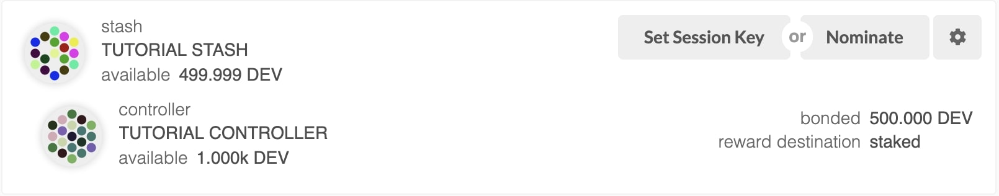
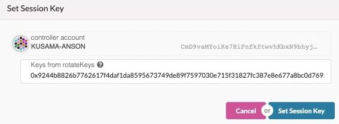
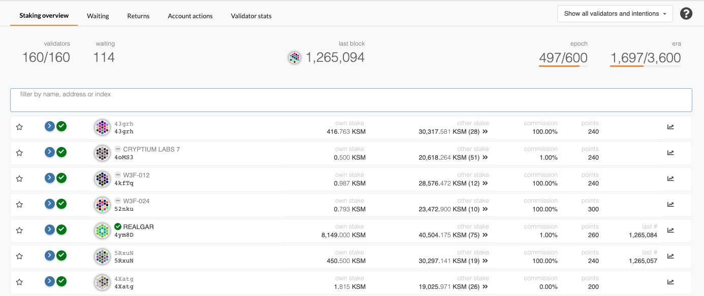

This guide will instruct you how to set up a validator node on the Kusama network.

## Preliminaries

Running a validator on a live network is a lot of responsibility! You will be accountable for not only your own stake,
but also the stake of your current nominators. If you make a mistake and get slashed, your money and your reputation
will be at risk. However, running a validator can also be very rewarding, knowing that you contribute to the security
of a decentralized network while growing your stash.

Since security is so important to running a successful validator, you should take a look at the [secure validator](maintain-guides-secure-validator)
information to make you understand the factors to consider when constructing your infrastructure. The Web3 Foundation also
maintains a [reference implementation for a secure validator set-up](https://github.com/w3f/polkadot-secure-validator)
that you can use by deploying yourself. As you progress in your journey as a validator, you will likely want to use
this repository as a _starting point_ for your own modifications and customizations.

If you need help, please reach out on the [Kusama validator chat](https://riot.im/app/#/room/#KusamaValidatorLounge:polkadot.builders)
on Riot. The team and other validators are there to help answer questions and provide experience. If you have a more
significant proposal, you can write it on the [Kusama forum](https://forum.kusama.network).

### How Many KSM Do I Need?

Validators are elected based on [Phragmen's algorithm](learn-phragmen). To be elected into the set, you need a minimum stake behind your validator. This stake can come from yourself or from [nominators](maintain-nominator). This means that as a minimum, you will need enough KSM to set up Stash and Controller [accounts](learn-keys) with the existential deposit, plus a little extra for transaction fees. The rest can come from nominators.

**Warning:** Any KSM that you stake for your validator is liable to be slashed, meaning that an insecure or improper
setup may result in loss of KSM tokens! If you are not confident in your ability to run a validator node, it is
recommended to nominate your KSM to a trusted validator node instead.

## Initial Set-up

### Requirements

You will likely run your validator on a cloud server running Linux. You may choose whatever [VPS](#vps-list) provider
that your prefer, and whatever operating system you are comfortable with. For this guide we will be using **Ubuntu 18.04**,
but the instructions should be similar for other platforms.

You will not need a very powerful machine to run your validator, but you should be aware of the resource constraints.
The most important resource for your validator node is networking bandwidth, followed by its storage and memory
capabilities. The bare minimum requirements for a machine to run a validator are as follows:

- **Storage:** 40GB - 80GB. Kusama doesn't have very heavy storage requirements yet so something in this range will be fine,
just keep in mind you may have to upgrade it later if the chain state becomes very big.
- **Memory:** 2GB - 8GB. 2GB is really the minimum memory you should operate your validator with, anything less than this
make build times too inconvenient. For better performance you can bump it up to 4GB or 8GB, but anything more than that
is probably over-kill.
- **CPU:** 1 - 2. One CPU is okay, but 2 is better. Again, this is a performance preference.

On most cloud service providers, these specs are usually within the $10 - $20 per month range.

### Install Rust

Once you choose your cloud service provider and set-up your new server, the first thing you will do is install Rust.

If you have never installed Rust, you should do this first. This command will fetch the latest version of Rust and
install it.

```sh
curl https://sh.rustup.rs -sSf | sh
```

Otherwise, if you have already installed Rust, run the following command to make sure you are using the latest version.

```sh
rustup update
```

Finally, run this command to install the necessary dependencies for compiling and running the Kusama node software.

```sh
sudo apt install make clang pkg-config libssl-dev build-essential
```

Note - if you are using OSX and you have [Homebrew](https://brew.sh) installed, you can issue the following equivalent
command INSTEAD of the previous one:

```sh
brew install cmake pkg-config openssl git llvm
```

### Building and Installing the `polkadot` Binary

You will need to build the `polkadot` binary from the [paritytech/polkadot](https://github.com/paritytech/polkadot)
repository on GitHub using the source code available in the **v0.7** branch.

You should generally use the latest **0.7.x** tag.  At the time of writing, this was **0.7.20**, but you should review the output from the "git tag" command (`git tag | grep "$v\0\.7"`) to see a list of all the potential 0.7 releases.  You should replace `v0.7.20` with the latest build (i.e., the highest number). You can also find the latest Kusama version on the [release](https://github.com/paritytech/polkadot/releases) tab.

> Note: If you prefer to use SSH rather than HTTPS, you can replace the first line of the below with
> `git clone git@github.com:paritytech/polkadot.git`.

```sh
git clone https://github.com/paritytech/polkadot.git
cd polkadot
git tag | grep "$v\0\.7"
git checkout v0.7.20
./scripts/init.sh
cargo build --release
```

This step will take a while (generally 15 - 30 minutes, depending on your hardware).

If you are interested in generating keys locally, you can also install `subkey` from the same directory.
You may then take the generated `subkey` executable and transfer it to an air-gapped machine for extra security.

```sh
cargo install --force --git https://github.com/paritytech/substrate subkey
```

### Synchronize Chain Data

> **Note:** Validators must sync their nodes in archive mode to avoid being slashed. If you've already synced the chain,
you must first remove the database with `polkadot purge-chain` and then ensure that you run Polkadot with the `--pruning=archive` option.

#### New to the Network

You can begin syncing your node by running the following command:

```sh
./target/release/polkadot --pruning=archive
```

if you do not want to start in validator mode right away.

**Note:** The `--pruning=archive` flag is implied by the `--validator` and `--sentry` flags, so it is only required explicitly if you start your node without one of these two options. If you do not set your pruning to archive node, even when not running in validator and sentry mode, you will need to re-sync your database when you switch.

#### Previous Kusama CC2 Validator

Before synchronizing the latest chain data, you will need to copy your previous keystore to the new chain id in order to use the previously set session keys. If you do not do this, you will need to generate and set your session keys again.

Kusama CC1 and Kusama CC2 have different default data directories, usually located in the `$HOME/.local/share/polkadot/chains` directory on Linux based machines. For example, the default directory for Kusama CC2 is `$HOME/.local/share/polkadot/chains/ksmcc2/keystore` while CC2 keys are located in `$HOME/.local/share/polkadot/chains/ksmcc2/keystore`.

You can easily generate the default keystore for CC2 by first starting to sync and exiitng out of your node client.

```sh
./target/release/polkadot
# Wait a few seconds for it to start up and create the data directory then press `ctrl-c`.
```

Now you can copy your old session keys into the new CC3 keystore with the next command:

```sh
cp -r $HOME/.local/share/polkadot/chains/ksmcc2/keystore $HOME/.local/share/polkadot/chains/ksmcc3/keystore
```

If your keystore is empty, it means that the keys were not created on your node in the CC2 chain. You want to fix this.
The best way to do this would be to call the `author_rotateKeys` RPC call and make sure the call is directed to your
validator node (not the default Polkadot JS connection or one of the boot nodes). Before submitting the `setKeys`
transaction, verify that the keys are in the new CC2 keystore. See more information in the [section below](#generating-session-keys).

After you copy your keystore into the new chains directory, you want to to inject the keys into the memory of the node.
For this you can use the `author_insertKey` method for each of the four types of keys: 'babe', 'gran', 'imon', and 'para'.
You can map these keys to the ones in your keystore by parsing the concatenated output of the `rotateKeys` RPC call you
made the first time. They will be concatenated in order following the below struct declaration:

```rust
pub struct SessionKeys {
    pub grandpa: Grandpa,
    pub babe: Babe,
    pub im_online: ImOnline,
    pub parachain_validator: Parachains,
    pub authority_discovery: AuthorityDiscovery,
}
```

> **Note:** The session keys are consensus critical, so if you are not sure if your node has the current session keys
> that you made the `setKeys` transaction for then simply run through the process of generating and setting new ones
> using the `rotateKeys` method below. Better safe than sorry!

Start your node.

```sh
./target/release/polkadot --pruning=archive
```

Depending on the size of the chain when you do this, this step may take anywhere from a few minutes to a few hours.

If you are interested in determining how much longer you have to go, your server logs (printed to STDOUT from the
`polkadot` process) will tell you the latest block your node has processed and verified. You can then compare that to
the current highest block via [Telemetry](https://telemetry.polkadot.io/#list/Kusama%20CC3) or the
[PolkadotJS Block Explorer](https://polkadot.js.org/apps/#/explorer).

> **Note:** If you do not already have KSM, this is as far as you will be able to go until the end of the soft
> launch period. You can still run a node, but you will need to have a minimal amount of KSM to continue, as balance
> transfers are disabled during the soft launch. Please keep in mind that even for those with KSM, they will only be
> indicating their _intent_ to validate; they will also not be able to run a validator until the NPoS phase starts.

## Bond KSM

It is highly recommended that you make your controller and stash accounts be two separate accounts. For this, you will create two accounts and make sure each of them have at least enough funds to pay the fees for making transactions. Keep most of your funds in the stash account since it is meant to be the custodian of your staking funds.

Make sure not to bond all your KSM balance since you will be unable to pay transaction fees from your bonded balance.

It is now time to set up our validator. We will do the following:

- Bond the KSM of the Stash account. These KSM will be put at stake for the security of the network and can be slashed.
- Select the Controller. This is the account that will decide when to start or stop validating.

First, go to the [Staking](https://polkadot.js.org/apps/#/staking/actions) section. Click on "Account Actions", and then
the "New stake" button.


- **Stash account** - Select your Stash account. In this example, we will bond 100 milliKSMs - make sure that your Stash
account contains _at least_ this much. You can, of course, stake more than this.
- **Controller account** - Select the Controller account created earlier. This account will also need a small amount of
KSM in order to start and stop validating.
- **Value bonded** - How much KSM from the Stash account you want to bond/stake. Note that you do not need to bond all
of the KSM in that account. Also note that you can always bond _more_ KSM later. However, _withdrawing_ any bonded
amount requires the duration of the unbonding  period. On Kusama, the unbonding period is 7 days. On Polkadot, the planned unbonding period is 28 days.
- **Payment destination** - The account where the rewards from validating are sent. More info
[here](https://wiki.polkadot.network/en/latest/polkadot/learn/staking/#reward-distribution).

Once everything is filled in properly, click `Bond` and sign the transaction with your Stash account.

After a few seconds, you should see an "ExtrinsicSuccess" message. You should now see a new card with all your accounts
(note: you may need to refresh the screen). The bonded amount on the right corresponds to the funds bonded by the Stash
account.

## Set Session Keys

Once your node is fully synced, stop the process by pressing Ctrl-C. At your terminal prompt, you will now start running
the node in validator mode with the pruning option set to `archive`.

```sh
./target/release/polkadot --validator --name "name on telemetry" --pruning=archive
```

You can give your validator any name that you like, but note that others will be able to see it, and it will be included
in the list of all servers using the same telemetry server. Since numerous people are using telemetry, it is recommended
that you choose something likely to be unique.

### Generating the Session Keys

You need to tell the chain your Session keys by signing and submitting an extrinsic. This is what associates your
validator node with your Controller account on Polkadot.

#### Option 1: PolkadotJS-APPS

You can generate your [Session keys](https://wiki.polkadot.network/en/latest/polkadot/learn/keys/#session-key) in the
client via the apps RPC. If you are doing this, make sure that you have the PolkadotJS-Apps explorer attached to your
validator node. You can configure the apps dashboard to connect to the endpoint of your validator in the Settings tab.
If you are connected to a default endpoint hosted by Parity of Web3 Foundation, you will not be able to use this method
since making RPC requests to this node would effect the local keystore hosted on a _public node_ and you want to make
sure you are interacting with the keystore for _your node_.

Once ensuring that you have connected to your node, the easiest way to set session keys for your node is by calling the
`author_rotateKeys` RPC request to create new keys in your validator's keystore.
Navigate to Toolbox tab and select RPC Calls then select the author > rotateKeys() option and remember to save the
output that you get back for a later step.


#### Option 2: CLI

If you are on a remote server, it is easier to run this command on the same machine (while the node is running with the
default HTTP RPC port configured):

```sh
curl -H "Content-Type: application/json" -d '{"id":1, "jsonrpc":"2.0", "method": "author_rotateKeys", "params":[]}' http://localhost:9933
```

The output will have a hex-encoded "result" field. The result is the concatenation of the four public keys. Save this
result for a later step.

### Submitting the `setKeys` Transaction

You need to tell the chain your Session keys by signing and submitting an extrinsic. This is what associates your
validator with your Controller account.

Go to [Staking > Account Actions](https://polkadot.js.org/apps/#/staking/actions), and click "Set Session Key" on the
bonding account you generated earlier. Enter the output from `author_rotateKeys` in the field and click "Set Session Key".




Submit this extrinsic and you are now ready to start validating.

## Validate

To verify that your node is live and synchronized, head to [Telemetry](https://telemetry.polkadot.io/#list/Kusama%20CC1)
and find your node. Note that this will show all nodes on the Kusama network, which is why it is important to select a
unique name!

If everything looks good, go ahead and click on "Validate" in Polkadot UI.


- **Payment preferences** - Rewards you will keep, the rest will be shared among you and your nominators.

Click "Validate".

If you go to the Staking tab, you should see a list of active validators currently running on the network. At the top of the page, it shows how many validator slots are available and how many nodes are intended to be a validator.
You can also go to the Waiting tab to double check to see whether your node is listed there.



The validator set is refreshed every era. In the next era, if there is a slot available and your node is selected to join the validator set, your node will become an active validator. Until then, it will remain in the
_waiting_ queue. If your validator is not selected to become part of the validator set, it will remain in the _waiting_
queue until it is. There is no need to re-start if you are not selected for the validator set in a particular era.
However, it may be necessary to increase the number of KSMs staked or seek out nominators for your validator in order to
join the validator set.

**Congratulations!** If you have followed all of these steps, and been selected to be a part of the validator set, you
are now running a Kusama validator! If you need help, reach out on the [Kusama forum](https://forum.kusama.network/) or
in the [Kusama Validator chat](https://riot.im/app/#/room/#KusamaValidatorLounge:polkadot.builders).

## FAQ

### Why am I unable to synchronize the chain with 0 peers?


Make sure to enable `30333` libp2p port. Eventually, it will take a little bit of time to discover other peers
over the network.

### How do I clear all my chain data?

```sh
./target/release/polkadot purge-chain
```

## VPS List

* [OVH](https://www.ovh.com.au/)
* [Digital Ocean](https://www.digitalocean.com/)
* [Vultr](https://www.vultr.com/)
* [Linode](https://www.linode.com/)
* [Contabo](https://contabo.com/)
* [Scaleway](https://www.scaleway.com/)

## Using Docker

If you have Docker installed, you can use it to start your validator node without needing to build the binary. You can do this with a simple one line command:

```sh
$ docker run parity/polkadot:v0.7.20 --validator --name "name on telemetry"
```
