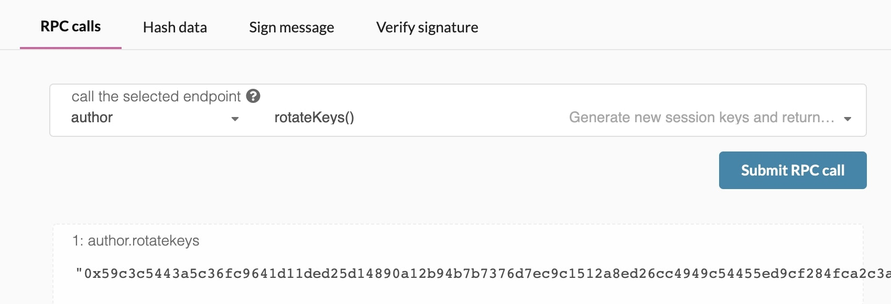
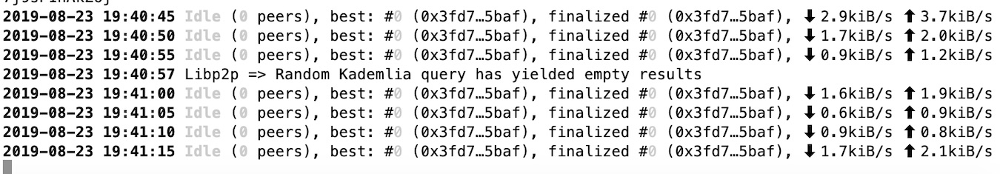

This guide will instruct you how to set up a validator node on the Kusama network

## Preliminaries

Running a validator on a live network is a lot of responsibility! You will be accountable for not
only your own stake, but also the stake of your current nominators. If you make a mistake and get
slashed, your money and your reputation will be at risk. However, running a validator can also be
very rewarding, knowing that you contribute to the security of a decentralized network while growing
your stash.

:::warning

It is highly recommended that you have significant system administration experience
before attempting to run your own validator.

:::

Since security is so important to running a successful validator, you should take a look at the
[validator setup](../maintain-guides-secure-validator.md) information to make you understand the
factors to consider when constructing your infrastructure. Web3 Foundation also maintains a
[reference implementation for a validator set-up](https://github.com/w3f/polkadot-validator-setup)
that you can use by deploying yourself. As you progress in your journey as a validator, you will
likely want to use this repository as a _starting point_ for your own modifications and
customizations.

If you need help, please reach out on the
[Kusama validator chat](https://app.element.io/#/room/#KusamaValidatorLounge:polkadot.builders) on
Matrix. The team and other validators are there to help answer questions and provide experience. You
can join directly in your web browser (link above) or using a client such as Element (formerly
Riot.im) using [this link](https://matrix.to/#/#KusamaValidatorLounge:polkadot.builders).

### How Many KSM Do I Need?

You can have a rough estimate on that by using the methods listed
[here](../../general/faq.md#What-is-the-minimum-stake-necessary-to-be-elected-as-an-active-validator-?).
Validators are elected based on [Phragmén's algorithm](../../learn/learn-phragmen.md). To be elected into the
set, you need a minimum stake behind your validator. This stake can come from yourself or from
[nominators](../../learn/learn-nominator.md). This means that as a minimum, you will need enough KSM to set up
Stash and Controller [accounts](../../learn/learn-keys.md) with the existential deposit, plus a little extra for
transaction fees. The rest can come from nominators.

:::warning

Any KSM that you stake for your validator is liable to be slashed, meaning that an
insecure or improper setup may result in loss of KSM tokens! If you are not confident in your
ability to run a validator node, it is recommended to nominate your KSM to a trusted validator node
instead.

:::

## Initial Set-up

### Requirements

The most common way for a beginner to run a validator is on a cloud server running Linux. You may
choose whatever [VPS](#vps-list) provider that your prefer, and whatever operating system you are
comfortable with. For this guide we will be using **Ubuntu 18.04**, but the instructions should be
similar for other platforms.

The transactions weights in Polkadot were benchmarked on standard hardware. It is recommended that
validators run at least the standard hardware in order to ensure they are able to process all blocks
in time. The following are not _minimum requirements_ but if you decide to run with less than this
beware that you might have performance issue.

#### Standard Hardware

For the full details of the standard hardware please see
[here](https://github.com/paritytech/substrate/pull/5848).

- **CPU** - Intel(R) Core(TM) i7-7700K CPU @ 4.20GHz
- **Storage** - A NVMe solid state drive. Should be reasonably sized to deal with blockchain growth.
  Starting around 80GB - 160GB will be okay for the first six months of Polkadot, but will need to
  be re-evaluated every six months.
- **Memory** - 64GB.

The specs posted above are by no means the minimum specs that you could use when running a
validator, however you should be aware that if you are using less you may need to toggle some extra
optimizations in order to be equal to other validators that are running the standard.

### Node Prerequisites: Install Rust and Dependencies

Once you choose your cloud service provider and set-up your new server, the first thing you will do
is install Rust.

If you have never installed Rust, you should do this first.

If you have already installed Rust, run the following command to make sure you are using the latest
version.

```sh
rustup update
```

If not, this command will fetch the latest version of Rust and install it.

```sh
curl https://sh.rustup.rs -sSf | sh -s -- -y
```

:::note

If you do not have "curl" installed, run:

```bash
sudo apt install curl
```

:::

To configure your shell, run the following command.

```sh
source $HOME/.cargo/env
```

Verify your installation.

```sh
rustc --version
```

Finally, run this command to install the necessary dependencies for compiling and running the
Polkadot node software.

```sh
sudo apt install make clang pkg-config libssl-dev build-essential
```

Note - if you are using OSX and you have [Homebrew](https://brew.sh) installed, you can issue the
following equivalent command INSTEAD of the previous one:

```sh
brew install cmake pkg-config openssl git llvm
```

### Install & Configure Network Time Protocol (NTP) Client

[NTP](https://en.wikipedia.org/wiki/Network_Time_Protocol) is a networking protocol designed to
synchronize the clocks of computers over a network. NTP allows you to synchronize the clocks of all
the systems within the network. Currently it is required that validators' local clocks stay
reasonably in sync, so you should be running NTP or a similar service. You can check whether you
have the NTP client by running:

_If you are using Ubuntu 18.04 / 19.04, NTP Client should be installed by default._

```sh
timedatectl
```

If NTP is installed and running, you should see `System clock synchronized: yes` (or a similar
message). If you do not see it, you can install it by executing:

```sh
sudo apt-get install ntp
```

ntpd will be started automatically after install. You can query ntpd for status information to
verify that everything is working:

```sh
sudo ntpq -p
```

:::warning

Skipping this can result in the validator node missing block authorship opportunities.
If the clock is out of sync (even by a small amount), the blocks the validator produces may not
get accepted by the network. This will result in `ImOnline` heartbeats making it on chain, but
zero allocated blocks making it on chain.

:::

### Building and Installing the `polkadot` Binary

#### Optional: Installation via Package Managers

The Polkadot Binary in included in `Debian` derivatives (i.e. **Debian**, **Ubuntu**) and `RPM-based` distros (i.e. **Fedora**, **CentOS**).

#### Debian-based (Debian, Ubuntu)

Run the following commands as the root user:

```ssh
# Import the security@parity.io GPG key
gpg --recv-keys --keyserver hkps://keys.mailvelope.com 9D4B2B6EB8F97156D19669A9FF0812D491B96798
gpg --export 9D4B2B6EB8F97156D19669A9FF0812D491B96798 > /usr/share/keyrings/parity.gpg
# Add the Parity repository and update the package index
echo 'deb [signed-by=/usr/share/keyrings/parity.gpg] https://releases.parity.io/deb release main' > /etc/apt/sources.list.d/parity.list
apt update
# Install the `parity-keyring` package - This will ensure the GPG key
# used by APT remains up-to-date
apt install parity-keyring
# Install polkadot
apt install polkadot
```

#### RPM-based (Fedora, CentOS)

Run the following commands as the root user:

```bash
# Install dnf-plugins-core (This might already be installed)
dnf install dnf-plugins-core
# Add the repository and enable it
dnf config-manager --add-repo https://releases.parity.io/rpm/polkadot.repo
dnf config-manager --set-enabled polkadot
# Install polkadot (You may have to confirm the import of the GPG key, which
# should have the following fingerprint: 9D4B2B6EB8F97156D19669A9FF0812D491B96798)
dnf install polkadot
```

After installing Polkadot, you can verify the installation by running

```bash
which polkadot
```

It should return

```bash
/usr/bin/polkadot
```

:::info By default, the Polkadot systemd service is disabled

To start the service, run 

```bash
sudo systemctl start polkadot.service
```

:::

### Polkadot Binary

You will need to build the `polkadot` binary from the
[paritytech/polkadot](https://github.com/paritytech/polkadot) repository on GitHub using the source
code available in the **v0.8** branch.

You should generally use the latest **0.8.x** tag. At the time of writing, this was **0.8.26-1**,
but you should review the output from the "git tag" command to see a list of all the potential 0.8
releases. You should replace `VERSION` with the latest build (i.e., the highest number). You can
also find the latest Kusama version on the
[release](https://github.com/paritytech/polkadot/releases) tab.

:::note

If you prefer to use SSH rather than HTTPS, you can replace the first line of the below with:

```sh
git clone git@github.com:paritytech/polkadot.git
```

:::

```sh
git clone https://github.com/paritytech/polkadot.git
cd polkadot
```

Run the following command to find the latest version.

```sh
git tag -l | sort -V | grep -v -- '-rc'
```

Find the latest version; replace "VERSION" in the commmand below and run to change your branch.

```sh
git checkout VERSION
./scripts/init.sh
```

Build native code with the cargo release profile.

```sh
cargo build --release
```

**_This step will take a while (generally 10 - 40 minutes, depending on your hardware)._**

:::note Compilation Errors

If you run into compile errors, you may have to switch to a less recent nightly. This can be
done by running:

```sh
rustup install nightly-2021-06-09
rustup target add wasm32-unknown-unknown --toolchain nightly-2021-06-09
cargo +nightly-2021-06-09 build --release
```

You may also need to run the build more than once.

If you would like to execute the tests, run the following command:

```sh
cargo test --all
```

:::

If you are interested in generating keys locally, you can also install `subkey` from the same
directory. You may then take the generated `subkey` executable and transfer it to an air-gapped
machine for extra security.

```sh
cargo install --force --git https://github.com/paritytech/substrate subkey
```

### Synchronize Chain Data

:::info By default, Validator nodes are in archive mode

If you've already synced the chain not
in archive mode, you must first remove the database with `polkadot purge-chain` and then ensure
that you run Polkadot with the `--pruning=archive` option.

You may run a validator node in non-archive mode by adding the following flags:
`--unsafe-pruning --pruning <NUMBER OF BLOCKS>`, but note that an archive node and non-archive
node's databases are not compatible with each other, and to switch you will need to purge the
chain data.

:::

You can begin syncing your node by running the following command:

```sh
./target/release/polkadot --pruning=archive --chain kusama
```

if you do not want to start in validator mode right away.

```
2021-06-17 02:34:25 ----------------------------
2021-06-17 02:34:25 This chain is not in any way
2021-06-17 02:34:25       endorsed by the
2021-06-17 02:34:25      KUSAMA FOUNDATION
2021-06-17 02:34:25 ----------------------------
2021-06-17 02:34:25 Parity Polkadot
2021-06-17 02:34:25 ✌️  version 0.9.5-95f6aa201-x86_64-linux-gnu
2021-06-17 02:34:25 ❤️  by Parity Technologies <admin@parity.io>, 2017-2021
2021-06-17 02:34:25 📋 Chain specification: Kusama
2021-06-17 02:34:25 🏷 Node name: obtainable-kitten-0716
2021-06-17 02:34:25 👤 Role: FULL
2021-06-17 02:34:25 💾 Database: RocksDb at /root/.local/share/polkadot/chains/ksmcc3/db
2021-06-17 02:34:25 ⛓  Native runtime: kusama-9050 (parity-kusama-0.tx5.au2)
2021-06-17 02:34:25 🔨 Initializing Genesis block/state (state: 0xb000…ef6b, header-hash: 0xb0a8…dafe)
2021-06-17 02:34:25 👴 Loading GRANDPA authority set from genesis on what appears to be first startup.
2021-06-17 02:34:26 ⏱  Loaded block-time = 6s from block 0xb0a8d493285c2df73290dfb7e61f870f17b41801197a149ca93654499ea3dafe
2021-06-17 02:34:26 👶 Creating empty BABE epoch changes on what appears to be first startup.
2021-06-17 02:34:26 🏷 Local node identity is: 12D3KooWLE7ivpuXJQpFVP4fuuutAqEsk8nrNEpuR3tddqnXgLPB
2021-06-17 02:34:26 📦 Highest known block at #0
2021-06-17 02:34:26 〽️ Prometheus server started at 127.0.0.1:9615
2021-06-17 02:34:26 Listening for new connections on 127.0.0.1:9944.
```

:::note Example of node sync:

```
2021-06-17 02:34:34 🔍 Discovered new external address for our node: /ip4/100.102.231.64/tcp/30333/ws/p2p/12D3KooWLE7ivpuXJQpFVP4fuuutAqEsk8nrNEpuR3tddqnXgLPB
2021-06-17 02:34:36 ⚙️  Syncing 409.2 bps, target=#8062689 (5 peers), best: #3477 (0x63ad…e046), finalized #3072 (0x0e4c…f587), ⬇ 153.2kiB/s ⬆ 12.9kiB/s
2021-06-17 02:34:37 🔍 Discovered new external address for our node: /ip4/100.111.175.0/tcp/30333/ws/p2p/12D3KooWLE7ivpuXJQpFVP4fuuutAqEsk8nrNEpuR3tddqnXgLPB
2021-06-17 02:34:38 🔍 Discovered new external address for our node: /ip4/100.100.176.0/tcp/30333/ws/p2p/12D3KooWLE7ivpuXJQpFVP4fuuutAqEsk8nrNEpuR3tddqnXgLPB
2021-06-17 02:34:41 ⚙️  Syncing 386.2 bps, target=#8062690 (7 peers), best: #5409 (0x1d76…8c3d), finalized #5121 (0x8ad1…b6dc), ⬇ 96.1kiB/s ⬆ 10.9kiB/s
2021-06-17 02:34:46 ⚙️  Syncing 394.8 bps, target=#8062691 (11 peers), best: #7383 (0x0689…6f1e), finalized #7168 (0x72a9…8d8c), ⬇ 352.9kiB/s ⬆ 5.1kiB/s
2021-06-17 02:34:51 ⚙️  Syncing 347.0 bps, target=#8062692 (12 peers), best: #9118 (0x66fc…cce3), finalized #8704 (0x14c9…705e), ⬇ 62.7kiB/s ⬆ 1.7kiB/s
```

:::

The `--pruning=archive` flag is implied by the `--validator` flag, so it is only
required explicitly if you start your node without one of these two options. If you do not set your
pruning to archive node, even when not running in validator, you will need to
re-sync your database when you switch.

:::note Validators should sync using the RocksDb backend

This is implicit by default, but can be explicit by passing the `--database RocksDb` flag.

In the future, it is recommended to switch to the faster and more efficient ParityDB option. Note
that **ParityDB is still experimental and should not be used in production.** If you want to test
out ParityDB, you can add the flag `--database paritydb`. Switching between database backends will
require a resync.

:::

Depending on the size of the chain when you do this, this step may take anywhere from a few minutes
to a few hours.

If you are interested in determining how much longer you have to go, your server logs (printed to
STDOUT from the `polkadot` process) will tell you the latest block your node has processed and
verified. You can then compare that to the current highest block via
[Telemetry](https://telemetry.polkadot.io/#list/Kusama) or the
[Polkadot-JS Block Explorer](https://polkadot.js.org/apps/#/explorer).

## Bond KSM

It is highly recommended that you make your controller and stash accounts be two separate accounts.
For this, you will create two accounts and make sure each of them have at least enough funds to pay
the fees for making transactions. Keep most of your funds in the stash account since it is meant to
be the custodian of your staking funds.

Make sure not to bond all your KSM balance since you will be unable to pay transaction fees from
your bonded balance.

It is now time to set up our validator. We will do the following:

- Bond the KSM of the Stash account. These KSM will be put at stake for the security of the network
  and can be slashed.
- Select the Controller. This is the account that will decide when to start or stop validating.

First, go to the [Staking](https://polkadot.js.org/apps/#/staking/actions) section. Click on
"Account Actions", and then the "New stake" button.


- **Stash account** - Select your Stash account. In this example, we will bond 100 milliKSM - make
  sure that your Stash account contains _at least_ this much. You can, of course, stake more than
  this.
- **Controller account** - Select the Controller account created earlier. This account will also
  need a small amount of KSM in order to start and stop validating.
- **Value bonded** - How much KSM from the Stash account you want to bond/stake. Note that you do
  not need to bond all of the KSM in that account. Also note that you can always bond _more_ KSM
  later. However, _withdrawing_ any bonded amount requires the duration of the unbonding period. On
  Kusama, the unbonding period is 7 days. On Polkadot, the planned unbonding period is 28 days.
- **Payment destination** - The account where the rewards from validating are sent. More info
  [here](../../learn/learn-staking.md#reward-distribution). Starting with runtime version v2023 natively
  included in client version [0.9.3](https://github.com/paritytech/polkadot/releases/tag/v0.9.3),
  payouts can go to any custom address. If you'd like to redirect payments to an account that is
  neither the controller nor the stash account, set one up. Note that it is extremely unsafe to set
  an exchange address as the recipient of the staking rewards.

Once everything is filled in properly, click `Bond` and sign the transaction with your Stash
account.

After a few seconds, you should see an "ExtrinsicSuccess" message. You should now see a new card
with all your accounts (note: you may need to refresh the screen). The bonded amount on the right
corresponds to the funds bonded by the Stash account.

## Set Session Keys

:::caution Session keys are consensus critical

If you are not sure if your node has the current session keys that you made the `setKeys` 
transaction then you can use one of the two available RPC methods to query your node:
[hasKey](https://polkadot.js.org/api/substrate/rpc.html#haskey-publickey-bytes-keytype-text-bool)
to check for a specific key or
[hasSessionKeys](https://polkadot.js.org/api/substrate/rpc.html#hassessionkeys-sessionkeys-bytes-bool)
to check the full session key public key string.

:::

Once your node is fully synced, stop the process by pressing Ctrl-C. At your terminal prompt, you
will now start running the node in validator mode with a flag allowing unsafe RPC calls, needed for
some advanced operations.

```sh
./target/release/polkadot --validator --name "name on telemetry" --chain kusama
```

Similarly:

```
2021-06-17 02:47:05 ----------------------------
2021-06-17 02:47:05 This chain is not in any way
2021-06-17 02:47:05       endorsed by the
2021-06-17 02:47:05      KUSAMA FOUNDATION
2021-06-17 02:47:05 ----------------------------
2021-06-17 02:47:05 Parity Polkadot
2021-06-17 02:47:05 ✌️  version 0.9.5-95f6aa201-x86_64-linux-gnu
2021-06-17 02:47:05 ❤️  by Parity Technologies <admin@parity.io>, 2017-2021
2021-06-17 02:47:05 📋 Chain specification: Kusama
2021-06-17 02:47:05 🏷 Node name: techedtest
2021-06-17 02:47:05 👤 Role: AUTHORITY
2021-06-17 02:47:05 💾 Database: RocksDb at /root/.local/share/polkadot/chains/ksmcc3/db
2021-06-17 02:47:05 ⛓  Native runtime: kusama-9050 (parity-kusama-0.tx5.au2)
2021-06-17 02:47:07 🏷 Local node identity is: 12D3KooWLE7ivpuXJQpFVP4fuuutAqEsk8nrNEpuR3tddqnXgLPB
2021-06-17 02:47:07 📦 Highest known block at #139917
2021-06-17 02:47:07 〽️ Prometheus server started at 127.0.0.1:9615
2021-06-17 02:47:07 Listening for new connections on 127.0.0.1:9944.
2021-06-17 02:47:07 👶 Starting BABE Authorship worker
```

```
2021-06-17 02:48:15 🔍 Discovered new external address for our node: /ip4/10.2.99.4/tcp/30333/p2p/12D3KooWLE7ivpuXJQpFVP4fuuutAqEsk8nrNEpuR3tddqnXgLPB

2021-06-17 02:48:17 ⚙️  Syncing 235.6 bps, target=#8062826 (49 peers), best: #155136 (0x23ea…e4fc), finalized #154624 (0x234f…f6a0), ⬇ 380.0kiB/s ⬆ 57.4kiB/s
```

You can give your validator any name that you like, but note that others will be able to see it, and
it will be included in the list of all servers using the same telemetry server. Since numerous
people are using telemetry, it is recommended that you choose something likely to be unique.

### Generating the Session Keys

You need to tell the chain your Session keys by signing and submitting an extrinsic. This is what
associates your validator node with your Controller account on Polkadot.

#### Option 1: Polkadot-JS Apps

You can generate your [Session keys](../../learn/learn-keys.md#session-keys) in the client via the apps RPC. If
you are doing this, make sure that you have the Polkadot-JS Apps explorer attached to your validator
node. You can configure the apps dashboard to connect to the endpoint of your validator in the
Settings tab. If you are connected to a default endpoint hosted by Parity of Web3 Foundation, you
will not be able to use this method since making RPC requests to this node would effect the local
keystore hosted on a _public node_ and you want to make sure you are interacting with the keystore
for _your node_.

Once ensuring that you have connected to your node, the easiest way to set session keys for your
node is by calling the `author_rotateKeys` RPC request to create new keys in your validator's
keystore. Navigate to Toolbox tab and select RPC Calls then select the author > rotateKeys() option
and remember to save the output that you get back for a later step.



#### Option 2: CLI

If you are on a remote server, it is easier to run this command on the same machine (while the node
is running with the default HTTP RPC port configured):

```sh
curl -H "Content-Type: application/json" -d '{"id":1, "jsonrpc":"2.0", "method": "author_rotateKeys", "params":[]}' http://localhost:9933
```

The output will have a hex-encoded "result" field. The result is the concatenation of the four
public keys. Save this result for a later step.

### Submitting the `setKeys` Transaction

You need to tell the chain your Session keys by signing and submitting an extrinsic. This is what
associates your validator with your Controller account.

Go to [Staking > Account Actions](https://polkadot.js.org/apps/#/staking/actions), and click "Set
Session Key" on the bonding account you generated earlier. Enter the output from `author_rotateKeys`
in the field and click "Set Session Key".


Submit this extrinsic and you are now ready to start validating.

### Setup via Validator Tab


Here you will need to input the Keys from `rotateKeys`, which is the Hex output from
`author_rotateKeys`. The keys will show as pending until applied at the start of a new session.

The "reward commission percentage" is the commission percentage that you can declare against your
validator's rewards. This is the rate that your validator will be commissioned with.

- **Payment preferences** - You can specify the percentage of the rewards that will get paid to you.
  The remaining will be split among your nominators.

:::caution setting a commission rate of 100% suggests that you do not want your validator to receive nominations

:::

You can also determine if you would like to receive nominations with the "allows new nominations"
option.


Click "Bond & Validate".

If you go to the "Staking" tab, you will see a list of active validators currently running on the
network. At the top of the page, it shows how many validator slots are available as well as how many
nodes have signaled their intention to be a validator. You can also go to the "Waiting" tab to
double check to see whether your node is listed there.


The validator set is refreshed every era. In the next era, if there is a slot available and your
node is selected to join the validator set, your node will become an active validator. Until then,
it will remain in the _waiting_ queue. If your validator is not selected to become part of the
validator set, it will remain in the _waiting_ queue until it is. There is no need to re-start if
you are not selected for the validator set in a particular era. However, it may be necessary to
increase the number of KSM staked or seek out nominators for your validator in order to join the
validator set.

**Congratulations**, if you have followed all of these steps, and been selected to be a part of the
validator set, you are now running a Kusama validator! If you need help, reach out on the
[Kusama forum](https://forum.kusama.network/) or in the
[Kusama Validator chat](https://riot.im/app/#/room/#KusamaValidatorLounge:polkadot.builders).

## Thousand Validators Programme

The Thousand Validators Programme is a joint initiative by Web3 Foundation and Parity Technologies
to provide support for community validators. If you are interested in applying for the programme,
you can find more information [on the wiki page](../../general/thousand-validators.md).

## FAQ

### Why am I unable to synchronize the chain with 0 peers?



Make sure to enable `30333` libp2p port. Eventually, it will take a little bit of time to discover
other peers over the network.

### How do I clear all my chain data?

```sh
./target/release/polkadot purge-chain
```

## VPS List

- [OVH](https://www.ovh.com.au/)
- [Digital Ocean](https://www.digitalocean.com/)
- [Vultr](https://www.vultr.com/)
- [Linode](https://www.linode.com/)
- [Contabo](https://contabo.com/)
- [Scaleway](https://www.scaleway.com/)

  :::caution Beware of the **Terms and Conditions** and **Acceptable Use Policies** for each VPS provider

  You may be locked out of your account and your server shut down if you come in violation.
  For instance, Digital Ocean lists "Mining of Cryptocurrencies" under the Network Abuse section of
  their [Acceptable Use Policy](https://www.digitalocean.com/legal/acceptable-use-policy/) and requires
  explicit permission to do so. This may extend to other cryptocurrency activity.}

  :::

## Using Docker

If you have Docker installed, you can use it to start your validator node without needing to build
the binary. You can do this with a simple one line command:

```sh
$ docker run parity/polkadot:latest --validator --name "name on telemetry" --chain kusama
```
