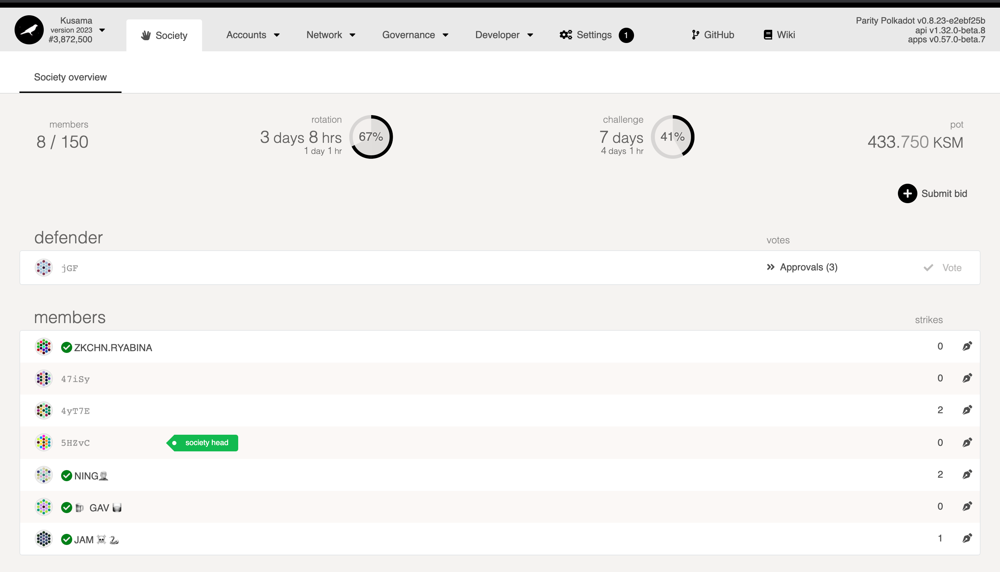
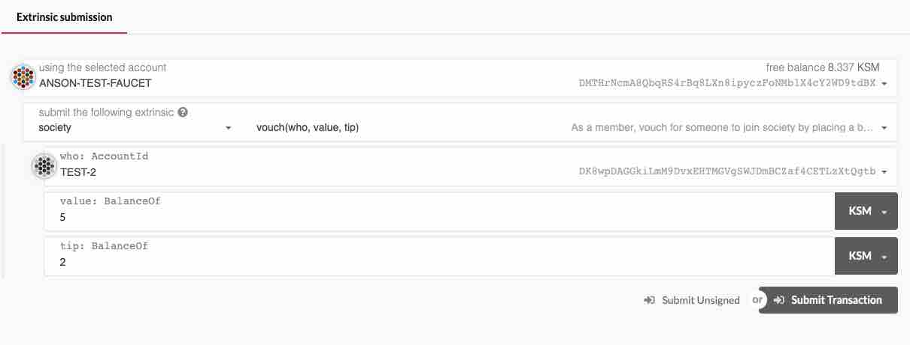

Kappa Sigma Mu is a membership club using the Substrate [Society pallet][substrate pallet]. It is an
economic game to incentivize users to join a society that coordinates around whatever the rules are
decided to be. The members of the society are incentivized to participate in the society via the
rewards paid by the treasury. Currently, there is only one society on Kusama but it is possible to
have multiple societies in the future through a runtime upgrade.




Before joining the society, let's take a brief look at the
[Society UI](https://polkadot.js.org/apps/#/society) on Polkadot-JS apps and read through all the
[rules][kappa rules] to become a member.

## UI Overview

- `Members`: The number of members in the society. Currently, the maximum number of members is set
  to `150`. It can be changed by using governance to increase the number.
- `Rotation`: The time period for membership rotations.
- `Challenge`: The time period to randomly select one of the members to defend his membership in the
  society.
- `Pot`: Resource balance that is used to support members of the society.
- `Bids`: A list of users who submitted a bid to join the society.

## User Types

Below are the various types of users at different stages.

- `Bidder` - A token holder who intends to join the society by placing a bid.
- `Candidate` - The selected bidders that will be voted on by members of the society.
- `Suspended Candidate` - The candidates that failed to join the society.
- `Member` - Member of the society.
- `Suspender Member` - A member of the society who has accumulated too many strikes or failed their
  membership challenge.
- `Head` - One winning candidate will be randomly chosen as head of the members, weighted by the
  number of approvals the winning candidates accumulated.
- `Defender` - In every challenge period, one of the members will be randomly selected to defend
  their membership in the society. The rules for defending the membership are documented [in the
  rules][kappa rules].

## Procedure

Remember to take a look at the [rules][kappa rules] first. And since those rules are not enforced
entirely on-chain, it is recommended to join the
[Kappa Sigma Mu Lounge](https://app.element.io/#/room/!BUmiAAnAYSRGarqwOt:matrix.parity.io) to ask
any questions if anything is unclear.

### 1. Bid Phase

To submit a bid, click the Submit Bid button on the
[Society page](https://ipfs.io/ipns/kusama.dotapps.io/#/society).

Anyone can submit a bid to join the society by reserving a deposit or finding an existing member to
create a bid on their behalf by vouching for them. At every rotation period, as many bids as the
society pot can support will be selected. The selected bids will be moved to the candidate phase,
whereas bids that were not selected will stay in the bidder pool until they are selected or a user
chooses to unbid.

Anyone who wants to join the society is required to deposit 1.6 KSM for reserve on Kusama and
declare the bid amount (1 KSM in this case) that they will receive for joining the society.


Once you have submitted the transaction, your bid will be shown on the
[Society page](https://ipfs.io/ipns/kusama.dotapps.io/#/society) under the bids section. You can
cancel the bidding if you changed your mind about joining the society by calling `unbid` on the same
page.

You can find an existing member to place a bid on your behalf if you do not have KSM and you are
willing to give them a tip. An existing member can submit a `vouch` transaction through the
Extrinsics page.

:::info vouch(who,value,tip)

- who: The user you are vouching for
- value: The value that the user would like to get when joining the society
- tip: Fees you get

The final value that the candidate will get = (value - tip)

:::



### 2. Candidate Phase

Bids selected in this phase will be voted on by the existing members to decide whether or not you
will be approved to join the society. Members will vote for all the candidates and the final outcome
will be randomly selected by one of the votes. Let's take a look the example shown below:

:::note

If the randomly selected member does not vote, it will be treated as a rejection. For each rotation
period, the maximum number of members that can be accepted is set as 10.

:::

A - Accept, R - Reject, S - Skeptic

| Member   | 1   | 2   | 3   | 4   | 5   |
| -------- | --- | --- | --- | --- | --- |
| Vote     | A   | A   | A   | R   | S   |
| Selected |     |     | X   |     |     |

In this example, a candidate will be approved to join the society since member 3 was selected as a
final voting outcome. A number of members will also be randomly chosen as "skeptics" to vote for the
candidates during the rotation period.

Since member 5 was chosen as a skeptic, they are required to participate in the voting process. If
they do not participate in voting, they will be punished with one strike per missing vote. If one
accumulates too many strikes, one's membership is suspended which means they may need to re-apply
and their unclaimed payouts will be slashed. Moreover, each member who voted opposite to the
randomly selected vote will have their unclaimed payouts slashed and strikes increased. In this
case, member 4 will be punished.

:::info The maximum number of strikes you can have is on Kusama is 10

:::

The slashed funds (2 KSM currently) will be given to a random member who voted the same as the
selected vote as a reward for participating in the vote. The reward is escrowed for some period of
time - see below.

#### Lock-up Time

It would take the number of members of the society as the variable to determine how many blocks you
have to wait in order to get the payout. The longest lockup time is close to 3 years. The formula is
defined [in the society pallet][substrate pallet] if you would like to have a look.

Example:

```
Let's assume we have 5 members in the society

lock_duration = 100 - 50_000 / (5 + 500)
lock_duration * MAX_LOCK_DURATION_IN_BLOCKS

Result = 1% * 15_552_000 ~ 11 days
```

Based on the above calculation, it is required to wait close to 11 days to get the slashed funds.

If the candidate wins the vote, they receive their bid reward as a future payout. If the bid was
placed by a voucher, they will get back the reward that was set during vouching with the remainder
given to the candidate - both escrowed for some time.

If the candidate loses the vote, they are suspended and it is up to the founder of the society (the
`Suspension Judgement Origin`) to determine if the candidate should go through the bidding process
again, should be accepted into the membership society, or rejected and their deposit slashed.

### 3. Member Phase

Once you become a member of the society, you will get back the deposit that you have reserved during
the bidding. A few things you need to be aware of. First, you should vote on candidates who applied
for the membership in every rotation period.

Second, you will need to claim your payout manually by calling `payout` after the lockup time. It is
the same as the above mentioned lockup formula.


Third, there will be a membership challenge every seven days on Kusama. So one of the members will
be randomly selected as a defender. Then, other members can vote whether this defender should stay
in the society or not. A simple majority wins the vote. You can take a look [here][kappa rules] and
search for "Existing Members (Challenges)". Besides that, you can earn extra KSM by helping a user
apply for the membership and requesting a tip. This is useful when a user does not have enough
balance to reserve a deposit. The tip will be given when a user successfully joins the society.

:::info

Each member can only vouch for one user at a time. A member is not required to reserve the deposit
when vouching for a user.

:::

If a member accumulates too many strikes or fails their membership challenge, they will become
suspended. While a member is suspended, they are unable to claim matured payouts. It is up to the
suspension judgment origin to determine if the member should re-enter society or be removed from
society with all their future payouts slashed.

## Useful links

[Convention of Approval of Membership](https://kusama.subscan.io/extrinsic/0x948d3a4378914341dc7af9220a4c73acb2b3f72a70f14ee8089799da16d94c17) -
Rules about joining the Kusama society

In order to decode the rules you need to navigate to the Parameters section: Element 1 ("proposal")
-> "value" -> "params" -> Element 2 ("rules") -> copy the section "value" and paste it into a
hexadecimal to UTF8 converter.

[substrate pallet]: https://paritytech.github.io/substrate/master/pallet_society/index.html
[kappa rules]:
  https://kusama.subscan.io/extrinsic/0x948d3a4378914341dc7af9220a4c73acb2b3f72a70f14ee8089799da16d94c17
