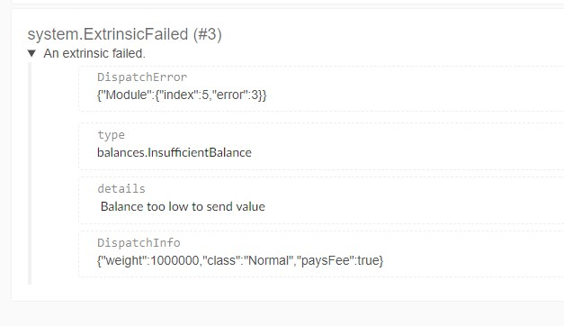

Errors in Substrate-based chains are usually accompanied by descriptive messages. However, to read
these messages, a tool parsing the blockchain data needs to request _chain metadata_ from a node.
That metadata explains how to read the messages. One such tool with a built-in parser for chain
metadata is the [Polkadot-JS Apps UI](https://polkadot.js.org/apps).

If this page does not answer your question, try searching for your problem at the
[Polkadot Knowledge Base](https://support.polkadot.network/) for more information on troubleshooting
your issue.

## PolkadotJS Apps Explorer

Here's how to find out the detailed error description through Polkadot-JS Apps.

A typical failed transactions looks something like this:

The image displays only the error name as defined in the code, not its error message. Despite this
error being rather self-explanatory, let's find its details.

In the [explorer tab](https://polkadot.js.org/apps/#/explorer), find the block in which this failure
occurred. Then, expand the `system.ExtrinsicFailed` frame:

Notice how the `details` field contains a human-readable description of the error. Most errors will
have this, if looked up this way.

[This block](https://polkadot.js.org/apps/#/explorer/query/0xa10104ed21dfe409c7871a975155766c5dd97e1e2ac7faf3c90f1f8dca89104b)
is a live example of the above.

If you cannot look up the error this way, or there is no message in the `details` field, consult the
table below.

## Polkascan and Subscan

Polkascan and Subscan show the `ExtrinsicFailed` event when a transaction does not succeed
([example](https://polkascan.io/polkadot/event/2836233-3)). This event gives us the `error` and
`index` indices of the error but does not give us a nice message to understand what it means. We
will look up the error in the codebase ourselves to understand what went wrong.

First, we should understand that the `index` number is the index of the pallet in the runtime from
which the error originated. The `error` is likewise the index of that pallet's errors which is the
exact one we're looking for. Both of these indices start counting from 0.

For example, if `index` is 5 and `error` is 3, as in the example linked above, we need to look at
the runtime for the fourth error (index 3) in the sixth pallet (index 5).

By looking at the
[runtime code](https://github.com/paritytech/polkadot/blob/master/runtime/polkadot/src/lib.rs)
we see that the pallet at index 5 is
`Balances`. Now we will check the Balances pallet's code which is hosted in the Substrate repository,
and look for the fourth error in the `Error enum`. According to its source the error that we got is `InsufficientBalance`, or in other words, "Balance too low to send value".

## Common Errors

The table below lists the most commonly encountered errors and ways to resolve them.

| Error              | Description                                                                                                  | Solution                                                                                                                                                                                                                                                                                                                                                                                  |
| ------------------ | ------------------------------------------------------------------------------------------------------------ | ----------------------------------------------------------------------------------------------------------------------------------------------------------------------------------------------------------------------------------------------------------------------------------------------------------------------------------------------------------------------------------------- |
| BadOrigin          | You are not allowed to do this operation, e.g. trying to create a council motion with a non-council account. | Either switch to an account that has the necessary permissions, or check if the operation you're trying to execute is permitted at all (e.g. calling `system.setCode` to do a runtime upgrade directly, without voting).                                                                                                                                                                  |
| BadProof           | The transaction's signature seems invalid.                                                                   | It's possible that the node you're connected to is following an obsolete fork - trying again after it catches up usually resolves the issue. To check for bigger problems, inspect the last finalized and current best block of the node you're connected to and compare the values to chain stats exposed by other nodes - are they in sync? If not, try connecting to a different node. |
| Future              | Transaction nonce too high, i.e. it's "from the future", **see note below**.                                                     | Reduce the nonce to +1 of current nonce. Check current nonce by inspecting the address you're using to send the transaction.                                                                                                                                                                                                                                                              |
| Stale              | Transaction nonce too low.                                                                                   | Increase the nonce to +1 of current nonce. Check current nonce by inspecting the address you're using to send the transaction.                                                                                                                                                                                                                                                            |
| ExhaustsResources  | There aren't enough resources left in the current block to submit this transaction.                          | Try again in the next block.                                                                                                                                                                                                                                                                                                                                                              |
| Payment            | Unable to pay for TX fee.                                                                                    | You might not have enough free balance to cover the fee this transaction would incur.                                                                                                                                                                                                                                                                                                     |
| Temporarily banned | The transaction is temporarily banned.                                                                       | The tx is already in pool. Either try on a different node, or wait to see if the initial transaction goes through.                                                                                                                                                                                                                                                                        |
 

:::note Future Error

This error will not cause the TX to be discarded immediately. Instead, it will be sent to the [futures queue](https://docs.substrate.io/v3/concepts/tx-pool/#sorting), where it will wait to be executed at the correct place in the nonce sequence OR it will get discarded due to some other error (ex. the validity period expires).*

:::

## Error Table

The below table is a reference to the errors that exists in Polkadot. It is generated from the
runtime's metadata.

| Pallet                  | Error                                  | Documentation                                                                                                                                    |
| ----------------------- | -------------------------------------- | ------------------------------------------------------------------------------------------------------------------------------------------------ |
| System (0)              |                                        |                                                                                                                                                  |
|                         | InvalidSpecName (0)                    | The name of specification does not match between the current runtime and the new runtime.                                                        |
|                         | SpecVersionNeedsToIncrease (1)         | The specification version is not allowed to decrease between the current runtime and the new runtime.                                            |
|                         | FailedToExtractRuntimeVersion (2)      | Failed to extract the runtime version from the new runtime. Either calling `Core_version` or decoding `RuntimeVersion` failed.                   |
|                         | NonDefaultComposite (3)                | Suicide called when the account has non-default composite data.                                                                                  |
|                         | NonZeroRefCount (4)                    | There is a non-zero reference count preventing the account from being purged.                                                                    |
| Scheduler (1)           |                                        |                                                                                                                                                  |
|                         | FailedToSchedule (0)                   | Failed to schedule a call                                                                                                                        |
|                         | NotFound (1)                           | Cannot find the scheduled call.                                                                                                                  |
|                         | TargetBlockNumberInPast (2)            | Given target block number is in the past.                                                                                                        |
|                         | RescheduleNoChange (3)                 | Reschedule failed because it does not change scheduled time.                                                                                     |
| Balances (5)            |                                        |                                                                                                                                                  |
|                         | VestingBalance (0)                     | Vesting balance too high to send value                                                                                                           |
|                         | LiquidityRestrictions (1)              | Account liquidity restrictions prevent withdrawal                                                                                                |
|                         | Overflow (2)                           | Got an overflow after adding                                                                                                                     |
|                         | InsufficientBalance (3)                | Balance too low to send value                                                                                                                    |
|                         | ExistentialDeposit (4)                 | Value too low to create account due to existential deposit                                                                                       |
|                         | KeepAlive (5)                          | Transfer/payment would kill account                                                                                                              |
|                         | ExistingVestingSchedule (6)            | A vesting schedule already exists for this account                                                                                               |
|                         | DeadAccount (7)                        | Beneficiary account must pre-exist                                                                                                               |
| Authorship (6)          |                                        |                                                                                                                                                  |
|                         | InvalidUncleParent (0)                 | The uncle parent not in the chain.                                                                                                               |
|                         | UnclesAlreadySet (1)                   | Uncles already set in the block.                                                                                                                 |
|                         | TooManyUncles (2)                      | Too many uncles.                                                                                                                                 |
|                         | GenesisUncle (3)                       | The uncle is genesis.                                                                                                                            |
|                         | TooHighUncle (4)                       | The uncle is too high in chain.                                                                                                                  |
|                         | UncleAlreadyIncluded (5)               | The uncle is already included.                                                                                                                   |
|                         | OldUncle (6)                           | The uncle isn't recent enough to be included.                                                                                                    |
| Staking (7)             |                                        |                                                                                                                                                  |
|                         | NotController (0)                      | Not a controller account.                                                                                                                        |
|                         | NotStash (1)                           | Not a stash account.                                                                                                                             |
|                         | AlreadyBonded (2)                      | Stash is already bonded.                                                                                                                         |
|                         | AlreadyPaired (3)                      | Controller is already paired.                                                                                                                    |
|                         | EmptyTargets (4)                       | Targets cannot be empty.                                                                                                                         |
|                         | DuplicateIndex (5)                     | Duplicate index.                                                                                                                                 |
|                         | InvalidSlashIndex (6)                  | Slash record index out of bounds.                                                                                                                |
|                         | InsufficientValue (7)                  | Can not bond with value less than minimum balance.                                                                                               |
|                         | NoMoreChunks (8)                       | Can not schedule more unlock chunks.                                                                                                             |
|                         | NoUnlockChunk (9)                      | Can not rebond without unlocking chunks.                                                                                                         |
|                         | FundedTarget (10)                      | Attempting to target a stash that still has funds.                                                                                               |
|                         | InvalidEraToReward (11)                | Invalid era to reward.                                                                                                                           |
|                         | InvalidNumberOfNominations (12)        | Invalid number of nominations.                                                                                                                   |
|                         | NotSortedAndUnique (13)                | Items are not sorted and unique.                                                                                                                 |
|                         | AlreadyClaimed (14)                    | Rewards for this era have already been claimed for this validator.                                                                               |
|                         | OffchainElectionEarlySubmission (15)   | The submitted result is received out of the open window.                                                                                         |
|                         | OffchainElectionWeakSubmission (16)    | The submitted result is not as good as the one stored on chain.                                                                                  |
|                         | SnapshotUnavailable (17)               | The snapshot data of the current window is missing.                                                                                              |
|                         | OffchainElectionBogusWinnerCount (18)  | Incorrect number of winners were presented.                                                                                                      |
|                         | OffchainElectionBogusWinner (19)       | One of the submitted winners is not an active candidate on chain (index is out of range in snapshot).                                            |
|                         | OffchainElectionBogusCompact (20)      | Error while building the assignment type from the compact. This can happen if an index is invalid, or if the weights _overflow_.                 |
|                         | OffchainElectionBogusNominator (21)    | One of the submitted nominators is not an active nominator on chain.                                                                             |
|                         | OffchainElectionBogusNomination (22)   | One of the submitted nominators has an edge to which they have not voted on chain.                                                               |
|                         | OffchainElectionSlashedNomination (23) | One of the submitted nominators has an edge which is submitted before the last non-zero slash of the target.                                     |
|                         | OffchainElectionBogusSelfVote (24)     | A self vote must only be originated from a validator to ONLY themselves.                                                                         |
|                         | OffchainElectionBogusEdge (25)         | The submitted result has unknown edges that are not among the presented winners.                                                                 |
|                         | OffchainElectionBogusScore (26)        | The claimed score does not match with the one computed from the data.                                                                            |
|                         | OffchainElectionBogusElectionSize (27) | The election size is invalid.                                                                                                                    |
|                         | CallNotAllowed (28)                    | The call is not allowed at the given time due to restrictions of election period.                                                                |
|                         | IncorrectHistoryDepth (29)             | Incorrect previous history depth input provided.                                                                                                 |
|                         | IncorrectSlashingSpans (30)            | Incorrect number of slashing spans provided.                                                                                                     |
| Session (9)             |                                        |                                                                                                                                                  |
|                         | InvalidProof (0)                       | Invalid ownership proof.                                                                                                                         |
|                         | NoAssociatedValidatorId (1)            | No associated validator ID for account.                                                                                                          |
|                         | DuplicatedKey (2)                      | Registered duplicate key.                                                                                                                        |
|                         | NoKeys (3)                             | No keys are associated with this account.                                                                                                        |
| Grandpa (11)            |                                        |                                                                                                                                                  |
|                         | PauseFailed (0)                        | Attempt to signal GRANDPA pause when the authority set isn't live (either paused or already pending pause).                                      |
|                         | ResumeFailed (1)                       | Attempt to signal GRANDPA resume when the authority set isn't paused (either live or already pending resume).                                    |
|                         | ChangePending (2)                      | Attempt to signal GRANDPA change with one already pending.                                                                                       |
|                         | TooSoon (3)                            | Cannot signal forced change so soon after last.                                                                                                  |
|                         | InvalidKeyOwnershipProof (4)           | A key ownership proof provided as part of an equivocation report is invalid.                                                                     |
|                         | InvalidEquivocationProof (5)           | An equivocation proof provided as part of an equivocation report is invalid.                                                                     |
|                         | DuplicateOffenceReport (6)             | A given equivocation report is valid but already previously reported.                                                                            |
| ImOnline (12)           |                                        |                                                                                                                                                  |
|                         | InvalidKey (0)                         | Non existent public key.                                                                                                                         |
|                         | DuplicatedHeartbeat (1)                | Duplicated heartbeat.                                                                                                                            |
| Democracy (14)          |                                        |                                                                                                                                                  |
|                         | ValueLow (0)                           | Value too low                                                                                                                                    |
|                         | ProposalMissing (1)                    | Proposal does not exist                                                                                                                          |
|                         | BadIndex (2)                           | Unknown index                                                                                                                                    |
|                         | AlreadyCanceled (3)                    | Cannot cancel the same proposal twice                                                                                                            |
|                         | DuplicateProposal (4)                  | Proposal already made                                                                                                                            |
|                         | ProposalBlacklisted (5)                | Proposal still blacklisted                                                                                                                       |
|                         | NotSimpleMajority (6)                  | Next external proposal not simple majority                                                                                                       |
|                         | InvalidHash (7)                        | Invalid hash                                                                                                                                     |
|                         | NoProposal (8)                         | No external proposal                                                                                                                             |
|                         | AlreadyVetoed (9)                      | Identity may not veto a proposal twice                                                                                                           |
|                         | NotDelegated (10)                      | Not delegated                                                                                                                                    |
|                         | DuplicatePreimage (11)                 | Preimage already noted                                                                                                                           |
|                         | NotImminent (12)                       | Not imminent                                                                                                                                     |
|                         | TooEarly (13)                          | Too early                                                                                                                                        |
|                         | Imminent (14)                          | Imminent                                                                                                                                         |
|                         | PreimageMissing (15)                   | Preimage not found                                                                                                                               |
|                         | ReferendumInvalid (16)                 | Vote given for invalid referendum                                                                                                                |
|                         | PreimageInvalid (17)                   | Invalid preimage                                                                                                                                 |
|                         | NoneWaiting (18)                       | No proposals waiting                                                                                                                             |
|                         | NotLocked (19)                         | The target account does not have a lock.                                                                                                         |
|                         | NotExpired (20)                        | The lock on the account to be unlocked has not yet expired.                                                                                      |
|                         | NotVoter (21)                          | The given account did not vote on the referendum.                                                                                                |
|                         | NoPermission (22)                      | The actor has no permission to conduct the action.                                                                                               |
|                         | AlreadyDelegating (23)                 | The account is already delegating.                                                                                                               |
|                         | Overflow (24)                          | An unexpected integer overflow occurred.                                                                                                         |
|                         | Underflow (25)                         | An unexpected integer underflow occurred.                                                                                                        |
|                         | InsufficientFunds (26)                 | Too high a balance was provided that the account cannot afford.                                                                                  |
|                         | NotDelegating (27)                     | The account is not currently delegating.                                                                                                         |
|                         | VotesExist (28)                        | The account currently has votes attached to it and the operation cannot succeed until these are removed, either through `unvote` or `reap_vote`. |
|                         | InstantNotAllowed (29)                 | The instant referendum origin is currently disallowed.                                                                                           |
|                         | Nonsense (30)                          | Delegation to oneself makes no sense.                                                                                                            |
|                         | WrongUpperBound (31)                   | Invalid upper bound.                                                                                                                             |
|                         | MaxVotesReached (32)                   | Maximum number of votes reached.                                                                                                                 |
|                         | InvalidWitness (33)                    | The provided witness data is wrong.                                                                                                              |
|                         | TooManyProposals (34)                  | Maximum number of proposals reached.                                                                                                             |
| Council (15)            |                                        |                                                                                                                                                  |
|                         | NotMember (0)                          | Account is not a member                                                                                                                          |
|                         | DuplicateProposal (1)                  | Duplicate proposals not allowed                                                                                                                  |
|                         | ProposalMissing (2)                    | Proposal must exist                                                                                                                              |
|                         | WrongIndex (3)                         | Mismatched index                                                                                                                                 |
|                         | DuplicateVote (4)                      | Duplicate vote ignored                                                                                                                           |
|                         | AlreadyInitialized (5)                 | Members are already initialized!                                                                                                                 |
|                         | TooEarly (6)                           | The close call was made too early, before the end of the voting.                                                                                 |
|                         | TooManyProposals (7)                   | There can only be a maximum of `MaxProposals` active proposals.                                                                                  |
|                         | WrongProposalWeight (8)                | The given weight bound for the proposal was too low.                                                                                             |
|                         | WrongProposalLength (9)                | The given length bound for the proposal was too low.                                                                                             |
| TechnicalCommittee (16) |                                        |                                                                                                                                                  |
|                         | NotMember (0)                          | Account is not a member                                                                                                                          |
|                         | DuplicateProposal (1)                  | Duplicate proposals not allowed                                                                                                                  |
|                         | ProposalMissing (2)                    | Proposal must exist                                                                                                                              |
|                         | WrongIndex (3)                         | Mismatched index                                                                                                                                 |
|                         | DuplicateVote (4)                      | Duplicate vote ignored                                                                                                                           |
|                         | AlreadyInitialized (5)                 | Members are already initialized!                                                                                                                 |
|                         | TooEarly (6)                           | The close call was made too early, before the end of the voting.                                                                                 |
|                         | TooManyProposals (7)                   | There can only be a maximum of `MaxProposals` active proposals.                                                                                  |
|                         | WrongProposalWeight (8)                | The given weight bound for the proposal was too low.                                                                                             |
|                         | WrongProposalLength (9)                | The given length bound for the proposal was too low.                                                                                             |
| ElectionsPhragmen (17)  |                                        |                                                                                                                                                  |
|                         | UnableToVote (0)                       | Cannot vote when no candidates or members exist.                                                                                                 |
|                         | NoVotes (1)                            | Must vote for at least one candidate.                                                                                                            |
|                         | TooManyVotes (2)                       | Cannot vote more than candidates.                                                                                                                |
|                         | MaximumVotesExceeded (3)               | Cannot vote more than maximum allowed.                                                                                                           |
|                         | LowBalance (4)                         | Cannot vote with stake less than minimum balance.                                                                                                |
|                         | UnableToPayBond (5)                    | Voter can not pay voting bond.                                                                                                                   |
|                         | MustBeVoter (6)                        | Must be a voter.                                                                                                                                 |
|                         | ReportSelf (7)                         | Cannot report self.                                                                                                                              |
|                         | DuplicatedCandidate (8)                | Duplicated candidate submission.                                                                                                                 |
|                         | MemberSubmit (9)                       | Member cannot re-submit candidacy.                                                                                                               |
|                         | RunnerSubmit (10)                      | Runner cannot re-submit candidacy.                                                                                                               |
|                         | InsufficientCandidateFunds (11)        | Candidate does not have enough funds.                                                                                                            |
|                         | NotMember (12)                         | Not a member.                                                                                                                                    |
|                         | InvalidCandidateCount (13)             | The provided count of number of candidates is incorrect.                                                                                         |
|                         | InvalidVoteCount (14)                  | The provided count of number of votes is incorrect.                                                                                              |
|                         | InvalidRenouncing (15)                 | The renouncing origin presented a wrong `Renouncing` parameter.                                                                                  |
|                         | InvalidReplacement (16)                | Prediction regarding replacement after member removal is wrong.                                                                                  |
| Treasury (19)           |                                        |                                                                                                                                                  |
|                         | InsufficientProposersBalance (0)       | Proposer's balance is too low.                                                                                                                   |
|                         | InvalidIndex (1)                       | No proposal or bounty at that index.                                                                                                             |
|                         | ReasonTooBig (2)                       | The reason given is just too big.                                                                                                                |
|                         | AlreadyKnown (3)                       | The tip was already found/started.                                                                                                               |
|                         | UnknownTip (4)                         | The tip hash is unknown.                                                                                                                         |
|                         | NotFinder (5)                          | The account attempting to retract the tip is not the finder of the tip.                                                                          |
|                         | StillOpen (6)                          | The tip cannot be claimed/closed because there are not enough tippers yet.                                                                       |
|                         | Premature (7)                          | The tip cannot be claimed/closed because it's still in the countdown period.                                                                     |
|                         | UnexpectedStatus (8)                   | The bounty status is unexpected.                                                                                                                 |
|                         | RequireCurator (9)                     | Require bounty curator.                                                                                                                          |
|                         | InvalidValue (10)                      | Invalid bounty value.                                                                                                                            |
|                         | InvalidFee (11)                        | Invalid bounty fee.                                                                                                                              |
|                         | PendingPayout (12)                     | A bounty payout is pending. To cancel the bounty, you must unassign and slash the curator.                                                       |
| Claims (24)             |                                        |                                                                                                                                                  |
|                         | InvalidEthereumSignature (0)           | Invalid Ethereum signature.                                                                                                                      |
|                         | SignerHasNoClaim (1)                   | Ethereum address has no claim.                                                                                                                   |
|                         | SenderHasNoClaim (2)                   | Account ID sending tx has no claim.                                                                                                              |
|                         | PotUnderflow (3)                       | There's not enough in the pot to pay out some unvested amount. Generally implies a logic error.                                                  |
|                         | InvalidStatement (4)                   | A needed statement was not included.                                                                                                             |
|                         | VestedBalanceExists (5)                | The account already has a vested balance.                                                                                                        |
| Vesting (25)            |                                        |                                                                                                                                                  |
|                         | NotVesting (0)                         | The account given is not vesting.                                                                                                                |
|                         | ExistingVestingSchedule (1)            | An existing vesting schedule already exists for this account that cannot be clobbered.                                                           |
|                         | AmountLow (2)                          | Amount being transferred is too low to create a vesting schedule.                                                                                |
| Identity (28)           |                                        |                                                                                                                                                  |
|                         | TooManySubAccounts (0)                 | Too many subs-accounts.                                                                                                                          |
|                         | NotFound (1)                           | Account isn't found.                                                                                                                             |
|                         | NotNamed (2)                           | Account isn't named.                                                                                                                             |
|                         | EmptyIndex (3)                         | Empty index.                                                                                                                                     |
|                         | FeeChanged (4)                         | Fee is changed.                                                                                                                                  |
|                         | NoIdentity (5)                         | No identity found.                                                                                                                               |
|                         | StickyJudgement (6)                    | Sticky judgement.                                                                                                                                |
|                         | JudgementGiven (7)                     | Judgement given.                                                                                                                                 |
|                         | InvalidJudgement (8)                   | Invalid judgement.                                                                                                                               |
|                         | InvalidIndex (9)                       | The index is invalid.                                                                                                                            |
|                         | InvalidTarget (10)                     | The target is invalid.                                                                                                                           |
|                         | TooManyFields (11)                     | Too many additional fields.                                                                                                                      |
|                         | TooManyRegistrars (12)                 | Maximum amount of registrars reached. Cannot add any more.                                                                                       |
|                         | AlreadyClaimed (13)                    | Account ID is already named.                                                                                                                     |
|                         | NotSub (14)                            | Sender is not a sub-account.                                                                                                                     |
|                         | NotOwned (15)                          | Sub-account isn't owned by sender.                                                                                                               |
| Proxy (29)              |                                        |                                                                                                                                                  |
|                         | TooMany (0)                            | There are too many proxies registered or too many announcements pending.                                                                         |
|                         | NotFound (1)                           | Proxy registration not found.                                                                                                                    |
|                         | NotProxy (2)                           | Sender is not a proxy of the account to be proxied.                                                                                              |
|                         | Unproxyable (3)                        | A call which is incompatible with the proxy type's filter was attempted.                                                                         |
|                         | Duplicate (4)                          | Account is already a proxy.                                                                                                                      |
|                         | NoPermission (5)                       | Call may not be made by proxy because it may escalate its privileges.                                                                            |
|                         | Unannounced (6)                        | Announcement, if made at all, was made too recently.                                                                                             |
| Multisig (30)           |                                        |                                                                                                                                                  |
|                         | MinimumThreshold (0)                   | Threshold must be 2 or greater.                                                                                                                  |
|                         | AlreadyApproved (1)                    | Call is already approved by this signatory.                                                                                                      |
|                         | NoApprovalsNeeded (2)                  | Call doesn't need any (more) approvals.                                                                                                          |
|                         | TooFewSignatories (3)                  | There are too few signatories in the list.                                                                                                       |
|                         | TooManySignatories (4)                 | There are too many signatories in the list.                                                                                                      |
|                         | SignatoriesOutOfOrder (5)              | The signatories were provided out of order; they should be ordered.                                                                              |
|                         | SenderInSignatories (6)                | The sender was contained in the other signatories; it shouldn't be.                                                                              |
|                         | NotFound (7)                           | Multisig operation not found when attempting to cancel.                                                                                          |
|                         | NotOwner (8)                           | Only the account that originally created the multisig is able to cancel it.                                                                      |
|                         | NoTimepoint (9)                        | No timepoint was given, yet the multisig operation is already underway.                                                                          |
|                         | WrongTimepoint (10)                    | A different timepoint was given to the multisig operation that is underway.                                                                      |
|                         | UnexpectedTimepoint (11)               | A timepoint was given, yet no multisig operation is underway.                                                                                    |
|                         | WeightTooLow (12)                      | The maximum weight information provided was too low.                                                                                             |
|                         | AlreadyStored (13)                     | The data to be stored is already stored.                                                                                                         |
