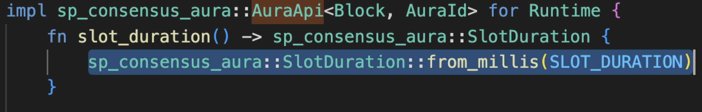
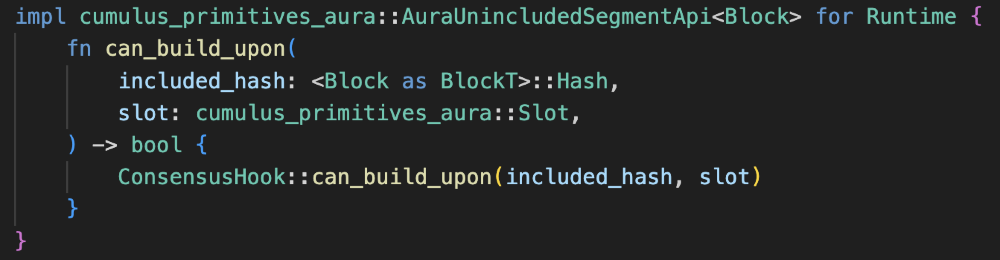
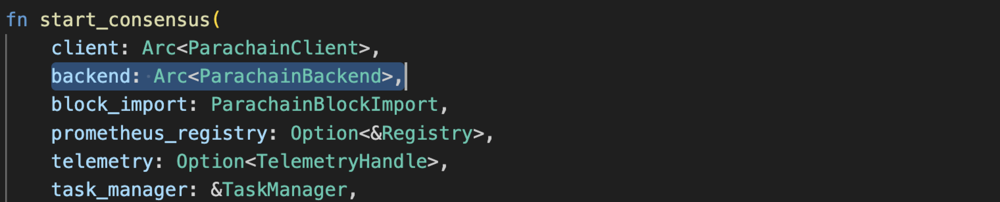

:::info Who is this guide for?

This guide is relevant for cumulus based parachain projects started in 2023 or before. Later
projects should already be async backing compatible. If starting a new parachain project, please use
an async backing compatible template such as
[`cumulus/parachain-template`](https://github.com/paritytech/polkadot-sdk/tree/master/cumulus/parachain-template).

:::

The rollout process for Async Backing has three phases. Phases 1 and 2 below put new infrastructure
in place. Then we can simply turn on async backing in phase 3. But first, some pre-reqs and context
to set the stage.

## Async Backing Prerequisites

:::info

For more contextual information about asynchronous backing, see
[this page](../learn/learn-async-backing.md).

:::

Pull the latest version of Cumulus for use with your parachain. It contains necessary changes for
async backing compatibility. Latest on master branch of
[Polkadot-SDK](https://github.com/paritytech/polkadot-sdk) is currently sufficient. Any 2024 release
will work as well.

## Async Backing Terminology and Parameters

Time for a bit of context before we get started. The following concepts will aid in demystifying the
collator side of Async Backing and establish a basic understanding of the changes being made:

- **Unincluded segment** - From the perspective of a parachain block under construction, the
  unincluded segment describes a chain of recent block ancestors which have yet to be included on
  the relay chain. The ability to build new blocks on top of the unincluded segment rather than on
  top of blocks freshly included in the relay chain is the core of asynchronous backing.
- **Capacity** - The maximum size of the unincluded segment. The longer this is, the farther ahead a
  parachain can work, producing new candidates before the ancestors of those candidates have been
  seen as included on-chain. Practically, a capacity of 2-3 is sufficient to realize the full
  benefits of asynchronous backing, at least until the release of elastic scaling.
- **Velocity** - The base rate at which a parachain should produce blocks. A velocity of 1 indicates
  that 1 parachain block should be produced per relay chain block. In order to fill the unincluded
  segment with candidates, collators may build up to `Velocity + 1` candidates per aura slot while
  there is remaining capacity. When elastic scaling has been released velocities greater than 1 will
  be supported.
- **AllowMultipleBlocksPerSlot** - If this is `true`, Aura will allow slots to stay the same across
  sequential parablocks. Otherwise the slot number must increase with each block. To fill the
  unincluded segment as described above we need this to be `true`.
- **FixedVelocityConsensusHook** - This is a variety of `ConsensusHook` intended to be passed to
  `parachain-system` as part of its `Config`. It is triggered on initialization of a new runtime. An
  instance of `FixedVelocityConsensusHook` is defined with both a fixed capacity and velocity. It
  aborts the runtime early if either capacity or velocity is exceeded, as the collator shouldn’t be
  creating additional blocks in that case.
- **AsyncBackingParams.max_candidate_depth** - This parameter determines the maximum unincluded
  segment depth the relay chain will support. Candidates sent to validators which exceed
  `max_candidate_depth` will be ignored. `Capacity`, as mentioned above, should not exceed
  `max_candidate_depth`.
- **AsyncBackingParams.allowed_ancestry_len** - Each parachain block candidate has a `relay_parent`
  from which its execution and validation context is derived. Before async backing the
  `relay_parent` for a candidate not yet backed was required to be the fresh head of a fork. With
  async backing we can relax this requirement. Instead we set a conservative maximum age in blocks
  for the `relay_parent`s of candidates in the unincluded segment. This age, `allowed_ancestry_len`
  lives on the relay chain and is queried by parachains when deciding which block to build on top
  of.
- **Lookahead Collator** - A collator for Aura that looks ahead of the most recently included
  parachain block when determining what to build upon. This collator also builds additional blocks
  when the maximum backlog is not saturated. The size of the backlog is determined by invoking the
  AuraUnincludedSegmentApi. If that runtime API is not supported, this assumes a maximum backlog
  size of 1.

## Phase 1 - Update Parachain Runtime

This phase involves configuring your parachain’s runtime to make use of async backing system.

1. Establish constants for `capacity` and `velocity` and set both of them to 1 in
   `/runtime/src/lib.rs`.

2. Establish a constant relay chain slot duration measured in milliseconds equal to `6000` in
   `/runtime/src/lib.rs`.


3. Establish constants `MILLISECS_PER_BLOCK` and `SLOT_DURATION` if not already present in
   `/runtime/src/lib.rs`.


4. Configure `cumulus_pallet_parachain_system` in `runtime/src/lib.rs`

   - Define a `FixedVelocityConsensusHook` using our capacity, velocity, and relay slot duration
     constants. Use this to set the parachain system `ConsensusHook` property.

   

   - Set the parachain system property `CheckAssociatedRelayNumber` to
     `RelayNumberMonotonicallyIncreases`

   

5. Configure `pallet_aura` in `runtime/src/lib.rs`

   - Set `AllowMultipleBlocksPerSlot` to `false` (don't worry, we will set it to `true` when we
     activate async backing in step 3).
   - Define `pallet_aura::SlotDuration` using our constant `SLOT_DURATION`

   

6. Update `aura_api::SlotDuration()` to match the constant `SLOT_DURATION`

   

7. Implement the `AuraUnincludedSegmentApi`, which allows the collator client to query its runtime
   to determine whether it should author a block.

   - Add the dependency `cumulus-primitives-aura` to the `runtime/Cargo.toml` file for your runtime

     

   - In the same file, add `"cumulus-primitives-aura/std",` to the `std` feature.

   - Inside the `impl_runtime_apis!` block for your runtime, implement the
     `AuraUnincludedSegmentApi` as shown below.

     

     Important note: With a capacity of 1 we have an effective velocity of ½ even when velocity is
     configured to some larger value. This is because capacity will be filled after a single block
     is produced and will only be freed up after that block is included on the relay chain, which
     takes 2 relay blocks to accomplish. Thus with capacity 1 and velocity 1 we get the customary 12
     second parachain block time.

8. If your `runtime/src/lib.rs` provides a `CheckInherents` type to `register_validate_block`,
   remove it. `FixedVelocityConsensusHook` makes it unnecessary. The following example shows how
   `register_validate_block` should look after removing `CheckInherents`.

   

## Phase 2 - Update Parachain Nodes

This phase consists of plugging in the new lookahead collator node.

1. Import `cumulus_primitives_core::ValidationCode` to `node/src/service.rs`


2. In `node/src/service.rs`, modify `sc_service::spawn_tasks` to use a clone of `Backend` rather
   than the original


3. Add `backend` as a parameter to `start_consensus()` in `node/src/service.rs`




4. In `start_consensus()` import the lookahead collator rather than the basic collator


5. In `start_consensus()` replace the `BasicAuraParams` struct with `AuraParams`
   - Change the struct type from `BasicAuraParams` to `AuraParams`
   - In the `para_client` field, pass in a cloned para client rather than the original
   - Add a `para_backend` parameter after `para_client`, passing in our para backend
   - Provide a `code_hash_provider` closure like that shown below
   - Increase `authoring_duration` from 500 milliseconds to 1500

Note: Set `authoring_duration` to whatever you want, taking your own hardware into account. But if
the backer who should be slower than you due to reading from disk, times out at two seconds your
candidates will be rejected.


6. In `start_consensus()` replace `basic_aura::run` with `aura::run`


## Phase 3 - Activate Async Backing

This phase consists of changes to your parachain’s runtime that activate async backing feature.

1. Configure `pallet_aura`, setting `AllowMultipleBlocksPerSlot` to true in `runtime/src/lib.rs`.


1. Increase the maximum `UNINCLUDED_SEGMENT_CAPACITY` in `runtime/src/lib.rs`.


3. Decrease `MILLISECS_PER_BLOCK` to 6000.

- Note: For a parachain which measures time in terms of its own block number rather than by relay
  block number it may be preferable to increase velocity. Changing block time may cause
  complications, requiring additional changes. See the section “Timing by Block Number”.


4. Update `MAXIMUM_BLOCK_WEIGHT` to reflect the increased time available for block production.


5. Add a feature flagged alternative for `MinimumPeriod` in `pallet_timestamp`. The type should be
   `ConstU64<0>` with the feature flag experimental, and `ConstU64<{SLOT_DURATION / 2}>` without.


6. **Update parameters:** Once the runtime is deployed the final step is to update three parameters!

After the runtime upgrade with async backing is activated there will be two new parameters:

```json
"async_backing_params": {
    "max_candidate_depth": 0,
    "allowed_ancestry_len": 0
}
```

These need to be set to 3 and 2 respectively in governance for async backing to be enabled.

⚠️ scheduling_lookahead must also be set to 2 along with this change otherwise parachain block times
will degrade to worse than with sync backing! ⚠️

## Timing by Block Number

With asynchronous backing it will be possible for parachains to opt for a block time of 6 seconds
rather than 12 seconds. But modifying block duration isn’t so simple for a parachain which was
measuring time in terms of its own block number. It could result in expected and actual time not
matching up, stalling the parachain.

One strategy to deal with this issue is to instead rely on relay chain block numbers for timing.
Relay block number is kept track of by each parachain in `pallet-parachain-system` with the storage
value `LastRelayChainBlockNumber`. This value can be obtained and used wherever timing based on
block number is needed.
