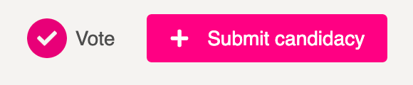
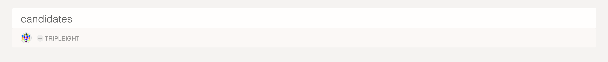
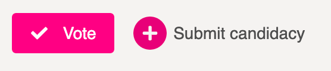
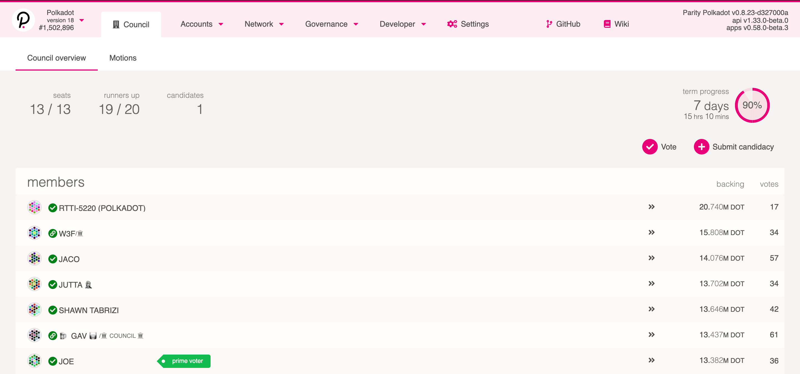

The council is an elected body of on-chain accounts that are intended to represent the passive
stakeholders of Polkadot and/or Kusama. The council has two major tasks in governance: proposing
referenda and vetoing dangerous or malicious referenda. For more information on the council, see the
[governance page](../learn/learn-governance.md#council). This guide will walk you through entering your
candidacy to the council.

## Submit Candidacy

Submitting your candidacy for the council requires a small bond of DOT / KSM. Unless your candidacy
wins, the bond will be forfeited. You can receive your bond back if you manually renounce your
candidacy before losing. Runners-up are selected after every round and are reserved members in case
one of the winners gets forcefully removed.

:::note

Currently the bond for submitting a council candidacy on Polkadot is 100 DOT, and 0.0033 KSM on
Kusama.

:::

It is a good idea to announce your council intention before submitting your candidacy so that your
supporters will know when they can start to vote for you. You can also vote for yourself in case no
one else does.

Go to [Polkadot Apps Dashboard](https://polkadot.js.org/apps) and navigate to the "Council" tab.
Click the button on the right that says "Submit Candidacy."

After making the transaction, you will see your account appear underneath the row "Candidates."

It is a good idea now to lead by example and give yourself a vote.

## Voting on Candidates

Next to the button to submit candidacy is another button titled "Vote." You will click this button
to make a vote for yourself (optional).

The council uses [Phragmén](../learn/learn-phragmen.md) approval voting, which is also used in the validator
elections. This means that you can choose up to 16 distinct candidates to vote for and your stake
will equalize between them. For this guide, choose to approve your own candidacy by clicking on the
switch next to your account and changing it to say "Aye."

## Winning

If you are one of the lucky ones to win a council election you will see your account move underneath
the row "Members".

Now you are able to participate on the council by making motions or voting proposals. To join in on
the active discussions, join the
[Polkadot Direction channel](https://matrix.to/#/#polkadot-direction:matrix.parity.io).
