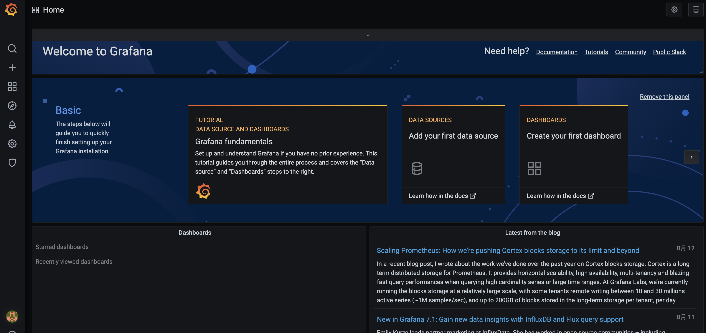
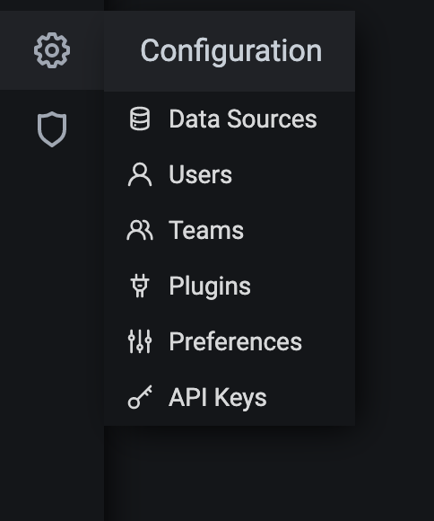
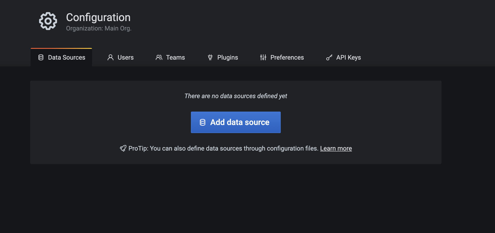
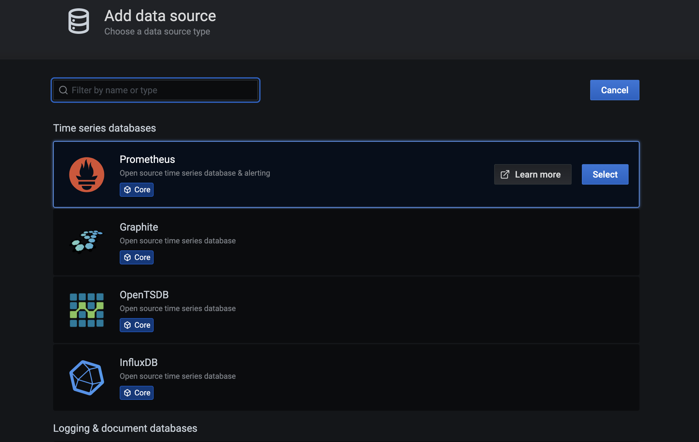
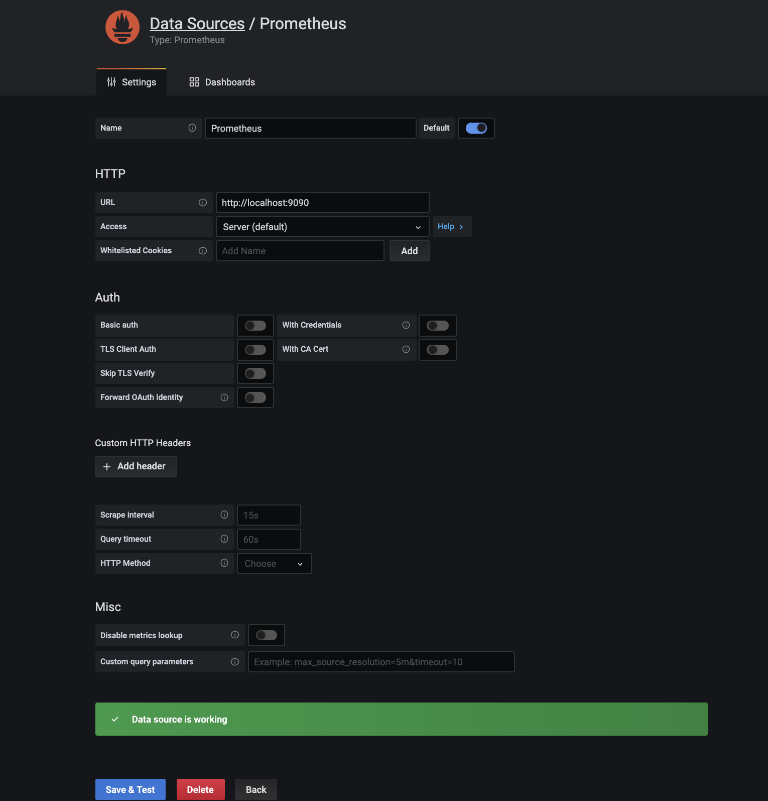
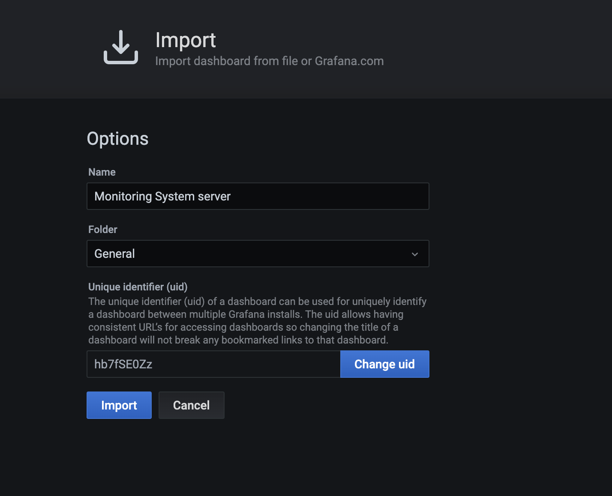
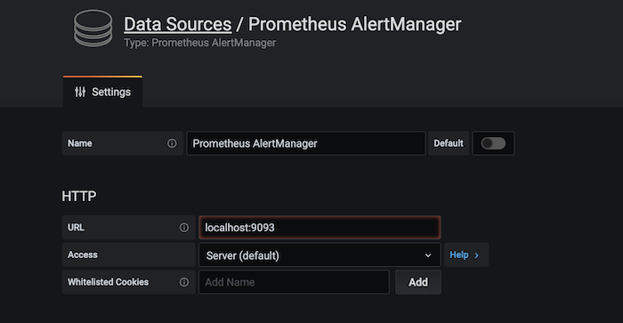
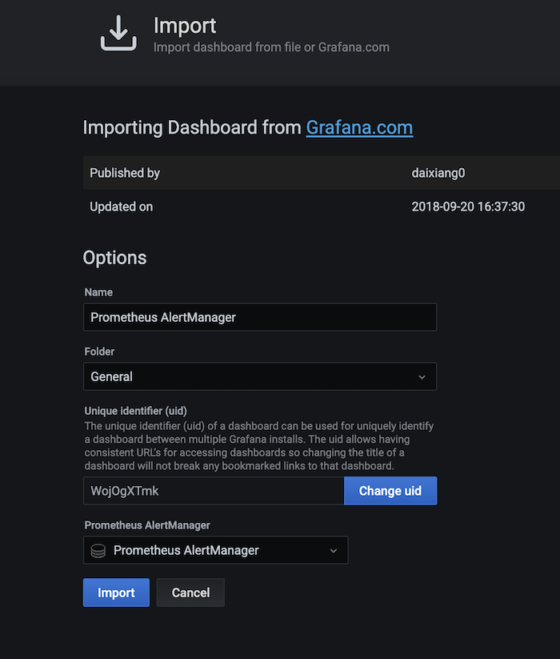
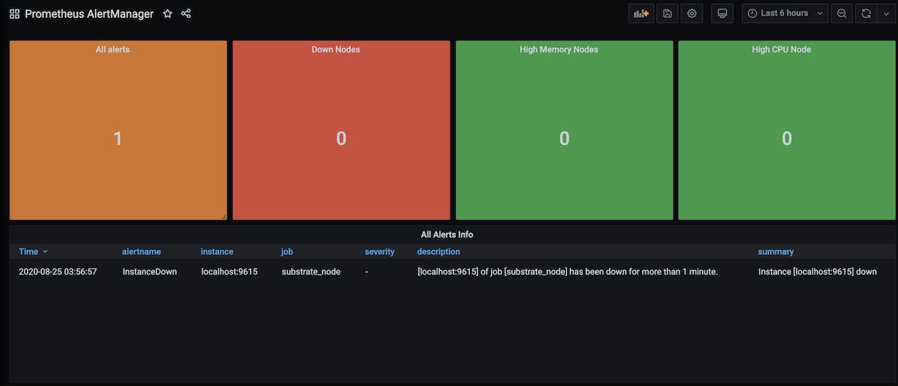

This guide will walk you through how to set up [Prometheus](https://prometheus.io/) with
[Grafana](https://grafana.com/) to monitor your node using Ubuntu 18.04 or 20.04.

A Substrate-based chain exposes data such as the height of the chain, the number of connected peers
to your node, CPU, memory usage of your machine, and more. To monitor this data, Prometheus is used
to collect metrics and Grafana allows for displaying them on the dashboard.

## Preparation

First, create a user for Prometheus by adding the `--no-create-home` flag to disallow `prometheus`
from logging in.

```bash
sudo useradd --no-create-home --shell /usr/sbin/nologin prometheus
```

Create the directories required to store the configuration and executable files.

```bash
sudo mkdir /etc/prometheus
sudo mkdir /var/lib/prometheus
```

Change the ownership of these directories to `prometheus` so that only prometheus can access them.

```bash
sudo chown -R prometheus:prometheus /etc/prometheus
sudo chown -R prometheus:prometheus /var/lib/prometheus
```

## Installing and Configuring Prometheus

After setting up the environment, update your OS, and install the latest Prometheus. You can check
the latest release by going to their GitHub repository under the
[releases](https://github.com/prometheus/prometheus/releases/) page.

```bash
sudo apt-get update && apt-get upgrade
wget https://github.com/prometheus/prometheus/releases/download/v2.26.0/prometheus-2.26.0.linux-amd64.tar.gz
tar xfz prometheus-*.tar.gz
cd prometheus-2.26.0.linux-amd64
```

The following two binaries are in the directory:

- prometheus - Prometheus main binary file
- promtool

The following two directories (which contain the web interface, configuration files examples and the
license) are in the directory:

- consoles
- console_libraries

Copy the executable files to the `/usr/local/bin/` directory.

```bash
sudo cp ./prometheus /usr/local/bin/
sudo cp ./promtool /usr/local/bin/
```

Change the ownership of these files to the `prometheus` user.

```bash
sudo chown prometheus:prometheus /usr/local/bin/prometheus
sudo chown prometheus:prometheus /usr/local/bin/promtool
```

Copy the `consoles` and `console_libraries` directories to `/etc/prometheus`

```bash
sudo cp -r ./consoles /etc/prometheus
sudo cp -r ./console_libraries /etc/prometheus
```

Change the ownership of these directories to the `prometheus` user.

```bash
sudo chown -R prometheus:prometheus /etc/prometheus/consoles
sudo chown -R prometheus:prometheus /etc/prometheus/console_libraries
```

Once everything is done, run this command to remove `prometheus` directory.

```bash
cd .. && rm -rf prometheus*
```

Before using Prometheus, it needs some configuration. Create a YAML configuration file named
`prometheus.yml` by running the command below.

```bash
sudo nano /etc/prometheus/prometheus.yml
```

The configuration file is divided into three parts which are `global`, `rule_files`, and
`scrape_configs`.

- `scrape_interval` defines how often Prometheus scrapes targets, while `evaluation_interval`
  controls how often the software will evaluate rules.

- `rule_files` block contains information of the location of any rules we want the Prometheus server
  to load.

- `scrape_configs` contains the information which resources Prometheus monitors.

The configuration file should look like this below:

```yaml
global:
  scrape_interval: 15s
  evaluation_interval: 15s

rule_files:
  # - "first.rules"
  # - "second.rules"

scrape_configs:
  - job_name: "prometheus"
    scrape_interval: 5s
    static_configs:
      - targets: ["localhost:9090"]
  - job_name: "substrate_node"
    scrape_interval: 5s
    static_configs:
      - targets: ["localhost:9615"]
```

With the above configuration file, the first exporter is the one that Prometheus exports to monitor
itself. As we want to have more precise information about the state of the Prometheus server we
reduced the `scrape_interval` to 5 seconds for this job. The parameters `static_configs` and
`targets` determine where the exporters are running. The second exporter is capturing the data from
your node, and the port by default is `9615`.

You can check the validity of this configuration file by running
`promtool check config /etc/prometheus/prometheus.yml`.

Save the configuration file and change the ownership of the file to `prometheus` user.

```bash
sudo chown prometheus:prometheus /etc/prometheus/prometheus.yml
```

## Starting Prometheus

To test that Prometheus is set up properly, execute the following command to start it as the
`prometheus` user.

```bash
sudo -u prometheus /usr/local/bin/prometheus --config.file /etc/prometheus/prometheus.yml --storage.tsdb.path /var/lib/prometheus/ --web.console.templates=/etc/prometheus/consoles --web.console.libraries=/etc/prometheus/console_libraries
```

The following messages indicate the status of the server. If you see the following messages, your
server is set up properly.

```bash
level=info ts=2021-04-16T19:02:20.167Z caller=main.go:380 msg="No time or size retention was set so using the default time retention" duration=15d
level=info ts=2021-04-16T19:02:20.167Z caller=main.go:418 msg="Starting Prometheus" version="(version=2.26.0, branch=HEAD, revision=3cafc58827d1ebd1a67749f88be4218f0bab3d8d)"
level=info ts=2021-04-16T19:02:20.167Z caller=main.go:423 build_context="(go=go1.16.2, user=root@a67cafebe6d0, date=20210331-11:56:23)"
level=info ts=2021-04-16T19:02:20.167Z caller=main.go:424 host_details="(Linux 5.4.0-42-generic #46-Ubuntu SMP Fri Jul 10 00:24:02 UTC 2020 x86_64 ubuntu2004 (none))"
level=info ts=2021-04-16T19:02:20.167Z caller=main.go:425 fd_limits="(soft=1024, hard=1048576)"
level=info ts=2021-04-16T19:02:20.167Z caller=main.go:426 vm_limits="(soft=unlimited, hard=unlimited)"
level=info ts=2021-04-16T19:02:20.169Z caller=web.go:540 component=web msg="Start listening for connections" address=0.0.0.0:9090
level=info ts=2021-04-16T19:02:20.170Z caller=main.go:795 msg="Starting TSDB ..."
level=info ts=2021-04-16T19:02:20.171Z caller=tls_config.go:191 component=web msg="TLS is disabled." http2=false
level=info ts=2021-04-16T19:02:20.174Z caller=head.go:696 component=tsdb msg="Replaying on-disk memory mappable chunks if any"
level=info ts=2021-04-16T19:02:20.175Z caller=head.go:710 component=tsdb msg="On-disk memory mappable chunks replay completed" duration=1.391446ms
level=info ts=2021-04-16T19:02:20.175Z caller=head.go:716 component=tsdb msg="Replaying WAL, this may take a while"
level=info ts=2021-04-16T19:02:20.178Z caller=head.go:768 component=tsdb msg="WAL segment loaded" segment=0 maxSegment=4
level=info ts=2021-04-16T19:02:20.193Z caller=head.go:768 component=tsdb msg="WAL segment loaded" segment=1 maxSegment=4
level=info ts=2021-04-16T19:02:20.221Z caller=head.go:768 component=tsdb msg="WAL segment loaded" segment=2 maxSegment=4
level=info ts=2021-04-16T19:02:20.224Z caller=head.go:768 component=tsdb msg="WAL segment loaded" segment=3 maxSegment=4
level=info ts=2021-04-16T19:02:20.229Z caller=head.go:768 component=tsdb msg="WAL segment loaded" segment=4 maxSegment=4
level=info ts=2021-04-16T19:02:20.229Z caller=head.go:773 component=tsdb msg="WAL replay completed" checkpoint_replay_duration=43.716µs wal_replay_duration=53.973285ms total_replay_duration=55.445308ms
level=info ts=2021-04-16T19:02:20.233Z caller=main.go:815 fs_type=EXT4_SUPER_MAGIC
level=info ts=2021-04-16T19:02:20.233Z caller=main.go:818 msg="TSDB started"
level=info ts=2021-04-16T19:02:20.233Z caller=main.go:944 msg="Loading configuration file" filename=/etc/prometheus/prometheus.yml
level=info ts=2021-04-16T19:02:20.234Z caller=main.go:975 msg="Completed loading of configuration file" filename=/etc/prometheus/prometheus.yml totalDuration=824.115µs remote_storage=3.131µs web_handler=401ns query_engine=1.056µs scrape=236.454µs scrape_sd=45.432µs notify=723ns notify_sd=2.61µs rules=956ns
level=info ts=2021-04-16T19:02:20.234Z caller=main.go:767 msg="Server is ready to receive web requests."

```

Go to `http://SERVER_IP_ADDRESS:9090/graph` to check whether you are able to access the Prometheus
interface or not. If it is working, exit the process by pressing on `CTRL + C`.

Next, we would like to automatically start the server during the boot process, so we have to create
a new `systemd` configuration file with the following config.

```bash
sudo nano /etc/systemd/system/prometheus.service
```

```bash
[Unit]
  Description=Prometheus Monitoring
  Wants=network-online.target
  After=network-online.target

[Service]
  User=prometheus
  Group=prometheus
  Type=simple
  ExecStart=/usr/local/bin/prometheus \
  --config.file /etc/prometheus/prometheus.yml \
  --storage.tsdb.path /var/lib/prometheus/ \
  --web.console.templates=/etc/prometheus/consoles \
  --web.console.libraries=/etc/prometheus/console_libraries
  ExecReload=/bin/kill -HUP $MAINPID

[Install]
  WantedBy=multi-user.target
```

Once the file is saved, execute the command below to reload `systemd` and enable the service so that
it will be loaded automatically during the operating system's startup.

```bash
sudo systemctl daemon-reload && systemctl enable prometheus && systemctl start prometheus
```

Prometheus should be running now, and you should be able to access its front again end by
re-visiting `IP_ADDRESS:9090/`.

## Installing Grafana

In order to visualize your node metrics, you can use Grafana to query the Prometheus server. Run the
following commands to install it first.

```bash
sudo apt-get install -y adduser libfontconfig1
wget https://dl.grafana.com/oss/release/grafana_7.5.4_amd64.deb
sudo dpkg -i grafana_7.5.4_amd64.deb
```

If everything is fine, configure Grafana to auto-start on boot and then start the service.

```bash
sudo systemctl daemon-reload
sudo systemctl enable grafana-server
sudo systemctl start grafana-server
```

You can now access it by going to the `http://SERVER_IP_ADDRESS:3000/login`. The default user and
password is admin/admin.

:::note

If you want to change the port on which Grafana runs (3000 is a popular port), edit the file
`/usr/share/grafana/conf/defaults.ini` with a command like
`sudo vim /usr/share/grafana/conf/defaults.ini` and change the `http_port` value to something
else. Then restart grafana with `sudo systemctl restart grafana-server`.

:::



In order to visualize the node metrics, click _settings_ to configure the `Data Sources` first.



Click `Add data source` to choose where the data is coming from.



Select `Prometheus`.



The only thing you need to input is the `URL` that is `https://localhost:9090` and then click
`Save & Test`. If you see `Data source is working`, your connection is configured correctly.



Next, import the dashboard that lets you visualize your node data. Go to the menu bar on the left
and mouse hover "+" then select `Import`.

`Import via grafana.com` - It allows you to use a dashboard that someone else has created and made
public. You can check what other dashboards are available via
[https://grafana.com/grafana/dashboards](https://grafana.com/grafana/dashboards). In this guide, we
use ["My Polkadot Metrics"](https://grafana.com/grafana/dashboards/12425), so input "12425" under
the id field and click `Load`.



Once it has been loaded, make sure to select "Prometheus" in the Prometheus dropdown list. Then
click `Import`.


In the meantime, start your Polkadot node by running `./polkadot`. If everything is done correctly,
you should be able to monitor your node's performance such as the current block height, CPU, memory
usage, etc. on the Grafana dashboard.


## Installing and Configuring Alertmanager (Optional)

In this section, let's configure the Alertmanager that helps to predict the potential problem or
notify you of the current problem in your server. Alerts can be sent in Slack, Email, Matrix, or
others. In this guide, we will show you how to configure the email notifications using Gmail if your
node goes down.

First, download the latest binary of AlertManager and unzip it by running the command below:

```bash
wget https://github.com/prometheus/alertmanager/releases/download/v0.21.0/alertmanager-0.21.0.linux-amd64.tar.gz
tar -xvzf alertmanager-0.21.0.linux-amd64.tar.gz
mv alertmanager-0.21.0.linux-amd64/alertmanager /usr/local/bin/
```

### Gmail Setup

To allow AlertManager to send an email to you, you will need to generate something called an
`app password` in your Gmail account. For details, click
[here](https://support.google.com/accounts/answer/185833?hl=en) to follow the whole setup.

You should see something like below:


Copy and save it somewhere else first.

### AlertManager Configuration

There is a configuration file named `alertmanager.yml` inside the directory that you just extracted
in the previous command, but that is not of our use. We will create our `alertmanager.yml` file
under `/etc/alertmanager` with the following config.

:::note 

Ensure to change the ownership of "/etc/alertmanager" to `prometheus` by executing

```bash
sudo chown -R prometheus:prometheus /etc/alertmanager
```

:::

```
global:
 resolve_timeout: 1m

route:
 receiver: 'gmail-notifications'

receivers:
- name: 'gmail-notifications'
  email_configs:
  - to: YOUR_EMAIL
    from: YOUR_EMAIL
    smarthost: smtp.gmail.com:587
    auth_username: YOUR_EMAIL
    auth_identity: YOUR_EMAIL
    auth_password: YOUR_APP_PASSWORD
    send_resolved: true
```

With the above configuration, alerts will be sent using the the email you set above. Remember to
change `YOUR_EMAIL` to your email and paste the app password you just saved earlier to the
`YOUR_APP_PASSWORD`.

Next, create another `systemd` configuration file named `alertmanager.service` by running the
command `sudo nano /etc/systemd/system/alertmanager.service` with the following config.

:::info SERVER_IP

Change to your host IP address and make sure port 9093 is opened.

:::

```
[Unit]
Description=AlertManager Server Service
Wants=network-online.target
After=network-online.target

[Service]
User=root
Group=root
Type=simple
ExecStart=/usr/local/bin/alertmanager --config.file /etc/alertmanager/alertmanager.yml --web.external-url=http://SERVER_IP:9093 --cluster.advertise-address='0.0.0.0:9093'


[Install]
WantedBy=multi-user.target
```

To the start the Alertmanager, run the following commands:

```
sudo systemctl daemon-reload && sudo systemctl enable alertmanager && sudo systemctl start alertmanager && sudo systemctl status alertmanager
```

```
● alertmanager.service - AlertManager Server Service
   Loaded: loaded (/etc/systemd/system/alertmanager.service; enabled; vendor preset: enabled)
   Active: active (running) since Thu 2020-08-20 22:01:21 CEST; 3 days ago
 Main PID: 20592 (alertmanager)
    Tasks: 70 (limit: 9830)
   CGroup: /system.slice/alertmanager.service
```

You should see the process status is "active (running)" if you have configured properly.

There is a Alertmanager plugin in Grafana that can help you to monitor the alert information. To
install it, execute the command below:

```
sudo grafana-cli plugins install camptocamp-prometheus-alertmanager-datasource
```

And restart Grafana once the plugin is successfully installed.

```
sudo systemctl restart grafana-server
```

Now go to your Grafana dashboard `SERVER_IP:3000` and configure the Alertmanager datasource.


Go to Configuration -> Data Sources, search "Prometheus AlertManger" if you cannot find it at the
top.



Fill in the `URL` to your server location followed by the port number used in the Alertmanager.

Then click "Save & Test" at the bottom to test the connection.



To monitor the alerts, let's import dashboard "[8010](https://grafana.com/dashboards/8010)" that is
used for Alertmanager. And make sure to select the "Prometheus AlertManager" in the last column.
Then click "Import".

You will end up having the following:



### AlertManager Integration

To let the Prometheus server be able to talk to the AlertManager, we will need to add the following
config in the `etc/prometheus/prometheus.yml`.

```
rule_files:
  - 'rules.yml'

alerting:
  alertmanagers:
  - static_configs:
    - targets:
      - localhost:9093
```

That is the updated `etc/prometheus/prometheus.yml`.

```
global:
  scrape_interval:     15s
  evaluation_interval: 15s

rule_files:
  - 'rules.yml'

alerting:
  alertmanagers:
  - static_configs:
    - targets:
      - localhost:9093

scrape_configs:
  - job_name: 'prometheus'
    scrape_interval: 5s
    static_configs:
      - targets: ['localhost:9090']
  - job_name: 'substrate_node'
    scrape_interval: 5s
    static_configs:
      - targets: ['localhost:9615']
```

We will need to create a new file called "rules.yml" under `/etc/prometheus/` that is defined all
the rules we would like to detect. If any of the rules defined in this file is fulfilled, an alert
will be triggered. The rule below checks whether the instance is down. If it is down for more than 5
minutes, an email notification will be sent. If you would like to learn more about the details of
the rule defining, go
[here](https://prometheus.io/docs/prometheus/latest/configuration/alerting_rules/). There are other
interesting alerts you may find useful [here](https://awesome-prometheus-alerts.grep.to/rules.html).

```
groups:
  - name: alert_rules
    rules:
      - alert: InstanceDown
        expr: up == 0
        for: 5m
        labels:
          severity: critical
        annotations:
          summary: "Instance [{{ $labels.instance }}] down"
          description: "[{{ $labels.instance }}] of job [{{ $labels.job }}] has been down for more than 1 minute."
```

Change the ownership of this file to `prometheus` instead of `root` by running:

```bash
sudo chown prometheus:prometheus rules.yml
```

To check the rules defined in the "rules.yml" is syntactically correct, run the following command:

```bash
sudo -u prometheus promtool check rules rules.yml
```

Finally, restart everything by running:

```bash
sudo systemctl restart prometheus && sudo systemctl restart alertmanager
```

Now if one of your target instances down, you will receive an alert on the AlertManager and Gmail
like below.


