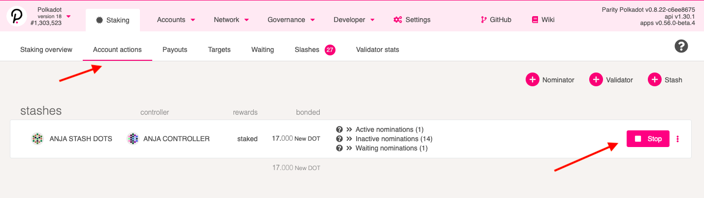
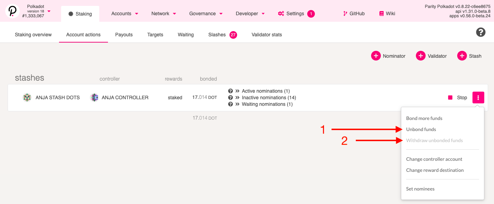
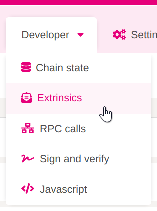
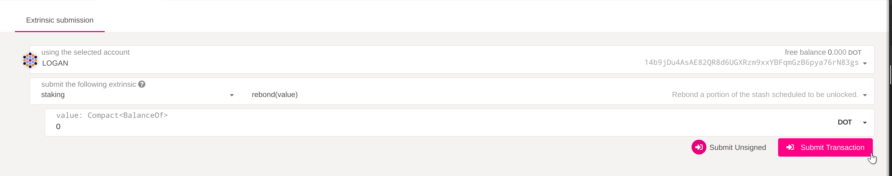

The following content describes how to stop nominating or validating and retrieve your stake. Please note
that all networks on which you can nominate have a delayed exit period, called the _unbonding
period_, which serves as a cooldown. You will not be able to transfer your tokens before this period
has elapsed, and you will not receive any staking rewards during this period (as you are not
nominating any validators).

Below are the steps you need to follow to unbond **all** of your bonded tokens.

**Skip Step 1 and directly go to Step 2** if you like to **unbond a fraction of your bonded tokens**

### Step 1: Stop Nominating

On the [Polkadot-JS Apps][] navigate to the "Staking" tab.

On this tab click on the "Account Actions" tab at the top of the screen.

Here, click "Stop Nominating" or "Stop Validating" (depending on your role) on an account you're
staking with and would like to free the funds for. This will "chill" the tokens.

After you confirm this transaction, your tokens will still remain _bonded_. This means they stay ready to
be distributed among nominees or used as validator self-stake again. To actually withdraw them, you
need to unbond.

### Step 2: Unbonding an amount

To unbond the amount, click the three dots next to the account you want to unbond tokens for, and
select "Unbond funds".

Select the amount you wish to unbond and click Unbond, then confirm the transaction. If successful,
your balance will show as "unbonding" with an indicator of how many more blocks remain until the
amount is fully unlocked.

This duration varies depending on the network you're on and will typically be four times as fast on
Kusama as it is on Polkadot. The unbonding period is 28 days on Polkadot, and 7 on Kusama.

Once this process is complete, you will have to issue another, final transaction: Withdraw Unbonded,
which will be available in the same pop-up. You can also check how long you have to wait in order to
withdraw your stake in the
[Accounts](https://polkadot.js.org/apps/?rpc=wss%3A%2F%2Frpc.polkadot.io#/accounts) page by
expanding your account balance. There is a tiny icon beside the word "unbonding" that will
eventually become an unlock icon once the remaning blocks get passed.

Then, you can click that icon directly to submit the withdraw transaction. Finally, your
transferrable balance will increase by the amount of tokens you've just fully unbonded.

## Rebonding before the end of the unbonding period

If you want to rebond your tokens before the unbonding period is over, you can do this by issuing a
`rebond` extrinsic. This allows you to bond your tokens that are still locked without waiting until
the end of the unbonding period.

In order to do this, you will need to issue an extrinsic manually from [Polkadot-JS Apps][].

Go to the "Extrinsics" option that's located in the "Developer" dropdown in the top menu.

Select the "staking" pallet and the "rebond" extrinsic. Enter the amount of [Plancks](../learn/learn-DOT.md#polkadot) that are
currently locked in unbonding that you want to rebond, where 1 DOT = 10,000,000,000 Plancks. Then click "Submit Transaction".

Confirm the transaction in the next pop-up. Once the transaction is included in the next block your
tokens will be rebonded again and you can start staking with them.

[polkadot-js apps]: https://polkadot.js.org/apps
