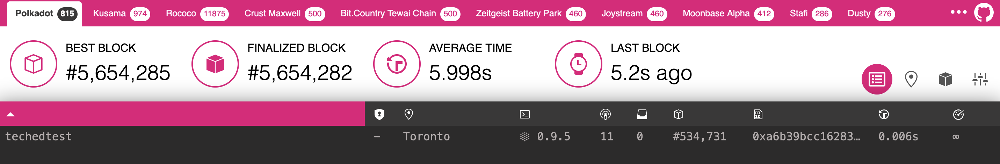
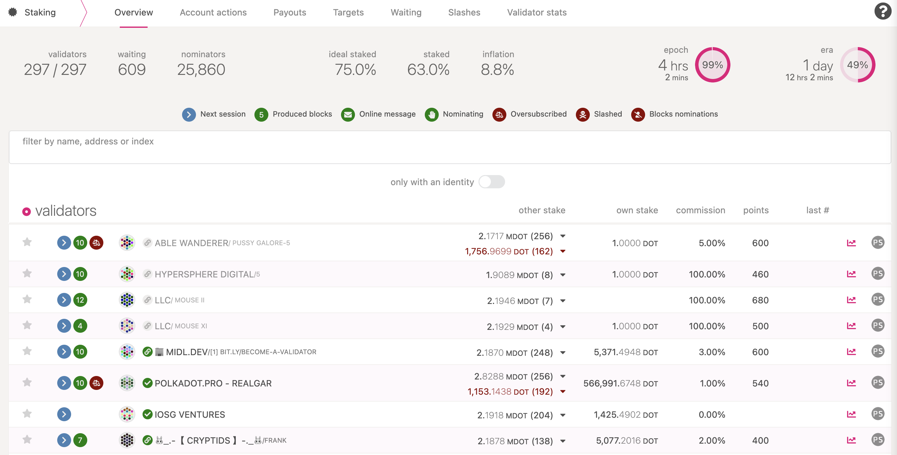

:::info

The following information applies to the Polkadot network. If you want to set up a validator on Kusama, check out the [Kusama guide](kusama/maintain-guides-how-to-validate-kusama.md) instead.

This guide will instruct you how to set up a validator node on the Polkadot network.

:::

## Preliminaries

Running a validator on a live network is a lot of responsibility! You will be accountable for not
only your own stake, but also the stake of your current nominators. If you make a mistake and get
slashed, your money and your reputation will be at risk. However, running a validator can also be
very rewarding, knowing that you contribute to the security of a decentralized network while growing
your stash.

:::warning

It is highly recommended that you have significant system administration experience before attempting to run your own validator.

You must be able to handle technical issues and anomalies with your node which you must be able to
tackle yourself. Being a validator involves more than just executing the Polkadot binary.

:::

Since security is so important to running a successful validator, you should take a look at the
[secure validator](maintain-guides-secure-validator.md) information to make sure you understand the
factors to consider when constructing your infrastructure. Web3 Foundation also maintains a
[reference implementation for a validator set-up](https://github.com/w3f/polkadot-validator-setup)
that you can use by deploying yourself (video walkthrough is available
[here](https://www.youtube.com/watch?v=tTn8P6t7JYc)). As you progress in your journey as a
validator, you will likely want to use this repository as a _starting point_ for your own
modifications and customizations.

If you need help, please reach out on the
[Polkadot Validator Lounge](https://matrix.to/#/!NZrbtteFeqYKCUGQtr:matrix.parity.io?via=matrix.parity.io&via=matrix.org&via=web3.foundation)
on Riot. The team and other validators are there to help answer questions and provide tips from
experience.

### How many DOT do I need?

You can have a rough estimate on that by using the methods listed
[here](../general/faq.md/#what-is-the-minimum-stake-necessary-to-be-elected-as-an-active-validator). To be elected
into the set, you need a minimum stake behind your validator. This stake can come from yourself or from
[nominators](../learn/learn-nominator.md). This means that as a minimum, you will need enough DOT to set up
Stash and Controller [accounts](../learn/learn-keys.md) with the existential deposit, plus a little extra for
transaction fees. The rest can come from nominators. To understand how validators are elected, check the
[NPoS Election algorithms](../learn/learn-phragmen.md) page.

**Warning:** Any DOT that you stake for your validator is liable to be slashed, meaning that an
insecure or improper setup may result in loss of DOT tokens! If you are not confident in your
ability to run a validator node, it is recommended to nominate your DOT to a trusted validator node
instead.

## Initial Set-up

### Requirements

The most common way for a beginner to run a validator is on a cloud server running Linux. You may
choose whatever [VPS](#note-about-vps) provider that your prefer. As OS it is best to use a recent Debian Linux. For this guide we will be using **Ubuntu 22.04**, but the instructions should be
similar for other platforms.

#### Reference Hardware

The transaction weights in Polkadot are benchmarked on reference hardware. We ran the benchmark on VM instances of two major cloud providers: Google Cloud Platform (GCP) and Amazon Web Services (AWS).
To be specific, we used `c2d-highcpu-8` VM instance on GCP and `c6id.2xlarge` on AWS.
It is recommended that the hardware used to run the validators at least matches the specs of
the reference hardware in order to ensure they are able to process all blocks
in time. If you use subpar hardware you will possibly run into performance issues, get less era points, and potentially even get slashed.

- **CPU**
  - x86-64 compatible;
  - Intel Ice Lake, or newer (Xeon or Core series); AMD Zen3, or newer (EPYC or Ryzen);
  - 4 physical cores @ 3.4GHz;
  - Simultaneous multithreading disabled (Hyper-Threading on Intel, SMT on AMD);
  - Prefer single-threaded performance over higher cores count. A comparison of single-threaded performance can be found [here](https://www.cpubenchmark.net/singleThread.html).
- **Storage**
  - An NVMe SSD of 1 TB (As it should be reasonably sized to deal with blockchain growth). An estimation of current chain snapshot sizes can be found [here](https://paranodes.io/DBSize). In general, the latency is more important than the throughput.
- **Memory**
  - 16GB DDR4 ECC.
- **System**
  - Linux Kernel 5.16 or newer.
- **Network**
  - The minimum symmetric networking speed is set to 500 Mbit/s (= 62.5 MB/s). This is required to support a large number of parachains and allow for proper congestion control in busy network situations.

The specs posted above are not a *hard* requirement to run a validator, but are considered best practice.
Running a validator is a responsible task; using professional hardware is a must in any way.

### Node Prerequisites: Install Rust and Dependencies

Once you choose your cloud service provider and set-up your new server, the first thing you will do
is install Rust.

If you have never installed Rust, you should do this first.

If you have already installed Rust, run the following command to make sure you are using the latest
version.

```sh
rustup update
```

If not, this command will fetch the latest version of Rust and install it.

```sh
curl https://sh.rustup.rs -sSf | sh -s -- -y
```

:::note

If you do not have "curl" installed, run:

```bash
sudo apt install curl
```

:::

To configure your shell, run the following command.

```sh
source $HOME/.cargo/env
```

Verify your installation.

```sh
rustc --version
```

Finally, run this command to install the necessary dependencies for compiling and running the
Polkadot node software.

```sh
sudo apt install make clang pkg-config libssl-dev build-essential
```

Note - if you are using OSX and you have [Homebrew](https://brew.sh) installed, you can issue the
following equivalent command INSTEAD of the previous one:

```sh
brew install cmake pkg-config openssl git llvm
```

### Install & Configure Network Time Protocol (NTP) Client

[NTP](https://en.wikipedia.org/wiki/Network_Time_Protocol) is a networking protocol designed to
synchronize the clocks of computers over a network. NTP allows you to synchronize the clocks of all
the systems within the network. Currently it is required that validators' local clocks stay
reasonably in sync, so you should be running NTP or a similar service. You can check whether you
have the NTP client by running:

_If you are using Ubuntu 18.04 or a newer version, NTP Client should be installed by default._

```sh
timedatectl
```

If NTP is installed and running, you should see `System clock synchronized: yes` (or a similar
message). If you do not see it, you can install it by executing:

```sh
sudo apt-get install ntp
```

ntpd will be started automatically after install. You can query ntpd for status information to
verify that everything is working:

```sh
sudo ntpq -p
```

:::warning

Skipping this can result in the validator node missing block authorship opportunities.
If the clock is out of sync (even by a small amount), the blocks the validator produces may not
get accepted by the network. This will result in `ImOnline` heartbeats making it on chain, but
zero allocated blocks making it on chain.

:::

### Building and Installing the `polkadot` binary

#### Optional: Installation via Package Managers

The Polkadot Binary in included in `Debian` derivatives (i.e. **Debian**, **Ubuntu**) and `RPM-based` distros (i.e. **Fedora**, **CentOS**).

#### Debian-based (Debian, Ubuntu)

Run the following commands as the root user:

```ssh
# Import the security@parity.io GPG key
gpg --recv-keys --keyserver hkps://keys.mailvelope.com 9D4B2B6EB8F97156D19669A9FF0812D491B96798
gpg --export 9D4B2B6EB8F97156D19669A9FF0812D491B96798 > /usr/share/keyrings/parity.gpg
# Add the Parity repository and update the package index
echo 'deb [signed-by=/usr/share/keyrings/parity.gpg] https://releases.parity.io/deb release main' > /etc/apt/sources.list.d/parity.list
apt update
# Install the `parity-keyring` package - This will ensure the GPG key
# used by APT remains up-to-date
apt install parity-keyring
# Install polkadot
apt install polkadot
```

#### RPM-based (Fedora, CentOS)

Run the following commands as the root user:

```bash
# Install dnf-plugins-core (This might already be installed)
dnf install dnf-plugins-core
# Add the repository and enable it
dnf config-manager --add-repo https://releases.parity.io/rpm/polkadot.repo
dnf config-manager --set-enabled polkadot
# Install polkadot (You may have to confirm the import of the GPG key, which
# should have the following fingerprint: 9D4B2B6EB8F97156D19669A9FF0812D491B96798)
dnf install polkadot
```

After installing Polkadot, you can verify the installation by running

```bash
which polkadot
```

It should return

```bash
/usr/bin/polkadot
```

:::note By default, the Polkadot systemd service is disabled

To start the service, run:

```bash
sudo systemctl start polkadot.service
```

:::

### Polkadot Binary

You will need to build the `polkadot` binary from the
[paritytech/polkadot](https://github.com/paritytech/polkadot) repository on GitHub using the source
code available in the **v0.9** branch.

You should generally use the latest **0.9.x** tag. You should either review the output from the "git
tag" command or visit the [Releases](https://github.com/paritytech/polkadot/releases) to see a list
of all the potential 0.9 releases. You should replace `VERSION` below with the latest build (i.e.,
the highest number). You can also find the latest Kusama version on the
[release](https://github.com/paritytech/polkadot/releases) tab.

:::note

If you prefer to use SSH rather than HTTPS, you can replace the first line of the below with

```sh
git clone git@github.com:paritytech/polkadot.git
```

:::

```sh
git clone https://github.com/paritytech/polkadot.git
cd polkadot
```

Run the following command to find the latest version.

```sh
git tag -l | sort -V | grep -v -- '-rc'
```

Find the latest version; replace "VERSION" in the commmand below and run to change your branch.

```sh
git checkout VERSION
./scripts/init.sh
```

Build native code with the production profile.

```sh
cargo build --profile production
```

**_This step will take a while (generally 10 - 40 minutes, depending on your hardware)._**

:::note Compilation Errors

If you run into compile errors, you may have to pin the version of Rust compiler to the one that was used to build the release. Check out `Rust compiler versions` section in the release notes. This can be done by running:

```sh
rustup install nightly-2022-05-18
rustup target add wasm32-unknown-unknown --toolchain nightly-2022-05-18
cargo +nightly-2022-05-18 build --release
```

You may also need to run the build more than once.

If you would like to execute the tests, run the following command:

```sh
cargo test --all
```

:::

If you are interested in generating keys locally, you can also install `subkey` from the same
directory. You may then take the generated `subkey` executable and transfer it to an air-gapped
machine for extra security.

```sh
cargo install --force --git https://github.com/paritytech/substrate subkey
```

### Synchronize Chain Data

:::info By default, Validator nodes are in archive mode

If you've already synced the chain not in archive mode, you must first remove the
database with `polkadot purge-chain` and then ensure that you run Polkadot with
the `--pruning=archive` option.

:::

You can begin syncing your node by running the following command:

```sh
./target/release/polkadot --pruning=archive
```

if you do not want to start in validator mode right away.

```
2021-06-17 03:07:07 Parity Polkadot
2021-06-17 03:07:07 ✌️  version 0.9.5-95f6aa201-x86_64-linux-gnu
2021-06-17 03:07:07 ❤️  by Parity Technologies <admin@parity.io>, 2017-2021
2021-06-17 03:07:07 📋 Chain specification: Polkadot
2021-06-17 03:07:07 🏷 Node name: boiling-pet-7554
2021-06-17 03:07:07 👤 Role: FULL
2021-06-17 03:07:07 💾 Database: RocksDb at /root/.local/share/polkadot/chains/polkadot/db
2021-06-17 03:07:07 ⛓  Native runtime: polkadot-9050 (parity-polkadot-0.tx7.au0)
2021-06-17 03:07:10 🏷 Local node identity is: 12D3KooWLtXFWf1oGrnxMGmPKPW54xWCHAXHbFh4Eap6KXmxoi9u
2021-06-17 03:07:10 📦 Highest known block at #17914
2021-06-17 03:07:10 〽️ Prometheus server started at 127.0.0.1:9615
2021-06-17 03:07:10 Listening for new connections on 127.0.0.1:9944.
```

:::note Example of node sync

```
2021-06-17 03:07:39 🔍 Discovered new external address for our node: /ip4/10.26.16.1/tcp/30333/ws/p2p/12D3KooWLtXFWf1oGrnxMGmPKPW54xWCHAXHbFh4Eap6KXmxoi9u
2021-06-17 03:07:40 ⚙️  Syncing 218.8 bps, target=#5553764 (17 peers), best: #24034 (0x08af…dcf5), finalized #23552 (0xd4f0…2642), ⬇ 173.5kiB/s ⬆ 12.7kiB/s
2021-06-17 03:07:45 ⚙️  Syncing 214.8 bps, target=#5553765 (20 peers), best: #25108 (0xb272…e800), finalized #25088 (0x94e6…8a9f), ⬇ 134.3kiB/s ⬆ 7.4kiB/s
2021-06-17 03:07:50 ⚙️  Syncing 214.8 bps, target=#5553766 (21 peers), best: #26182 (0xe7a5…01a2), finalized #26112 (0xcc29…b1a9), ⬇ 5.0kiB/s ⬆ 1.1kiB/s
2021-06-17 03:07:55 ⚙️  Syncing 138.4 bps, target=#5553767 (21 peers), best: #26874 (0xcf4b…6553), finalized #26624 (0x9dd9…27f8), ⬇ 18.9kiB/s ⬆ 2.0kiB/s
2021-06-17 03:08:00 ⚙️  Syncing 37.0 bps, target=#5553768 (22 peers), best: #27059 (0x5b73…6fc9), finalized #26624 (0x9dd9…27f8), ⬇ 14.3kiB/s ⬆ 4.4kiB/s
```

:::

The `--pruning=archive` flag is implied by the `--validator` flag, so it is only
required explicitly if you start your node without one of these two options. If you do not set your
pruning to archive node, even when not running in validator mode, you will need to
re-sync your database when you switch.

:::note Validators should sync using the RocksDb backend

This is implicit by default, but can
be explicit by passing the `--database RocksDb` flag.

In the future, it is recommended to switch to the faster and more efficient ParityDB option. Note
that **ParityDB is still experimental and should not be used in production.** If you want to test
out ParityDB, you can add the flag `--database paritydb`. Switching between database backends will
require a resync.

:::

Depending on the size of the chain when you do this, this step may take anywhere from a few minutes
to a few hours.

If you are interested in determining how much longer you have to go, your server logs (printed to
STDOUT from the `polkadot` process) will tell you the latest block your node has processed and
verified. You can then compare that to the current highest block via
[Telemetry](https://telemetry.polkadot.io/#list/Polkadot%20CC1) or the
[PolkadotJS Block Explorer](https://polkadot.js.org/apps/#/explorer).

#### Database Snapshot Services

If you start a node for the first time, it will start building from the genesis block. This process can
take a while depending on the database size. To make this process faster, snapshots can be used. Snapshots
are compressed backups of the database directory of Polkadot/Kusama nodes, containing the whole chain
(or a pruned version of it, with states only from the latest 1000 or 256 blocks). Listed below are a few
public snapshot providers for Polkadot and Kusama.

- [STAKEWORLD](https://stakeworld.nl/docs/snapshot)
- [Polkachu](https://polkachu.com/snapshots)
- [Polkashots](https://polkashots.io/)

:::caution

For the security of the network, it is recommended that you sync from scratch, even if you are running your
node in pruning mode for validation. The reason is that if these snapshots get corrupted and a majority of nodes
run based on these snapshots, the network could end up running on a non-canonical chain.

:::


## Bond DOT

It is highly recommended that you make your controller and stash accounts be two separate accounts.
For this, you will create two accounts and make sure each of them have at least enough funds to pay
the fees for making transactions. Keep most of your funds in the stash account since it is meant to
be the custodian of your staking funds.

Make sure not to bond all your DOT balance since you will be unable to pay transaction fees from
your bonded balance.

It is now time to set up our validator. We will do the following:

- Bond the DOT of the Stash account. These DOT will be put at stake for the security of the network
  and can be slashed.
- Select the Controller. This is the account that will decide when to start or stop validating.

First, go to the [Staking](https://polkadot.js.org/apps/#/staking/actions) section. Click on
"Account Actions", and then the "+ Stash" button.


- **Stash account** - Select your Stash account. In this example, we will bond 1 DOT, where the
  minimum bonding amount is 1. Make sure that your Stash account contains _at least_ this much. You
  can, of course, stake more than this.
- **Controller account** - Select the Controller account created earlier. This account will also
  need a small amount of DOT in order to start and stop validating.
- **Value bonded** - How much DOT from the Stash account you want to bond/stake. Note that you do
  not need to bond all of the DOT in that account. Also note that you can always bond _more_ DOT
  later. However, _withdrawing_ any bonded amount requires the duration of the unbonding period. On
  Kusama, the unbonding period is 7 days. On Polkadot, the planned unbonding period is 28 days.
- **Payment destination** - The account where the rewards from validating are sent. More info
  [here](../learn/learn-staking.md/#reward-distribution). Starting with runtime version v23 natively included
  in client version [0.9.3](https://github.com/paritytech/polkadot/releases/tag/v0.9.3), payouts can
  go to any custom address. If you'd like to redirect payments to an account that is neither the
  controller nor the stash account, set one up. Note that it is extremely unsafe to set an exchange
  address as the recipient of the staking rewards.

Once everything is filled in properly, click `Bond` and sign the transaction with your Stash
account.


After a few seconds, you should see an `ExtrinsicSuccess` message.

Your bonded account will available under `Stashes`. You should now see a new card with all your
accounts (note: you may need to refresh the screen). The bonded amount on the right corresponds to
the funds bonded by the Stash account.


## Set Session Keys

:::caution Session keys are consensus critical

If you are not sure if your node has the
current session keys that you made the `setKeys` transaction then you can use one of the two
available RPC methods to query your node:
[hasKey](https://polkadot.js.org/docs/substrate/rpc/#haskeypublickey-bytes-keytype-text-bool) to
check for a specific key or
[hasSessionKeys](https://polkadot.js.org/docs/substrate/rpc/#hassessionkeyssessionkeys-bytes-bool)
to check the full session key public key string.

:::

Once your node is fully synced, stop the process by pressing Ctrl-C. At your terminal prompt, you
will now start running the node.

```sh
./target/release/polkadot --validator --name "name on telemetry"
```

Similarly:

```
2021-06-17 03:12:08 Parity Polkadot
2021-06-17 03:12:08 ✌️  version 0.9.5-95f6aa201-x86_64-linux-gnu
2021-06-17 03:12:08 ❤️  by Parity Technologies <admin@parity.io>, 2017-2021
2021-06-17 03:12:08 📋 Chain specification: Polkadot
2021-06-17 03:12:08 🏷 Node name: nateched-test
2021-06-17 03:12:08 👤 Role: AUTHORITY
2021-06-17 03:12:08 💾 Database: RocksDb at /root/.local/share/polkadot/chains/polkadot/db
2021-06-17 03:12:08 ⛓  Native runtime: polkadot-9050 (parity-polkadot-0.tx7.au0)
2021-06-17 03:12:12 🏷 Local node identity is: 12D3KooWLtXFWf1oGrnxMGmPKPW54xWCHAXHbFh4Eap6KXmxoi9u
2021-06-17 03:12:12 📦 Highest known block at #64673
2021-06-17 03:12:12 〽️ Prometheus server started at 127.0.0.1:9615
2021-06-17 03:12:12 Listening for new connections on 127.0.0.1:9944.
2021-06-17 03:12:12 👶 Starting BABE Authorship worker
```

```
2021-06-17 03:12:16 🔍 Discovered new external address for our node: /ip4/10.26.11.1/tcp/30333/p2p/12D3KooWLtXFWf1oGrnxMGmPKPW54xWCHAXHbFh4Eap6KXmxoi9u
2021-06-17 03:12:17 ⚙️  Syncing, target=#5553810 (14 peers), best: #65068 (0x6da5…0662), finalized #65024 (0x4e84…d170), ⬇ 352.2kiB/s ⬆ 75.6kiB/s
```

You can give your validator any name that you like, but note that others will be able to see it, and
it will be included in the list of all servers using the same telemetry server. Since numerous
people are using telemetry, it is recommended that you choose something likely to be unique.

### Generating the Session Keys

You need to tell the chain your Session keys by signing and submitting an extrinsic. This is what
associates your validator node with your Controller account on Polkadot.

#### Option 1: PolkadotJS-APPS

You can generate your [Session keys](../learn/learn-keys.md#session-keys) in the client via the apps RPC.
If you are doing this, make sure that you have the PolkadotJS-Apps explorer attached to your validator
node. You can configure the apps dashboard to connect to the endpoint of your validator in the
Settings tab. If you are connected to a default endpoint hosted by Parity of Web3 Foundation, you
will not be able to use this method since making RPC requests to this node would effect the local
keystore hosted on a _public node_ and you want to make sure you are interacting with the keystore
for _your node_.

Once ensuring that you have connected to your node, the easiest way to set session keys for your
node is by calling the `author_rotateKeys` RPC request to create new keys in your validator's
keystore. Navigate to Toolbox tab and select RPC Calls then select the author > rotateKeys() option
and remember to save the output that you get back for a later step.


#### Option 2: CLI

If you are on a remote server, it is easier to run this command on the same machine (while the node
is running with the default HTTP RPC port configured):

```sh
curl -H "Content-Type: application/json" -d '{"id":1, "jsonrpc":"2.0", "method": "author_rotateKeys", "params":[]}' http://localhost:9933
```

The output will have a hex-encoded "result" field. The result is the concatenation of the four
public keys. Save this result for a later step.

You can restart your node at this point.

### Submitting the `setKeys` Transaction

You need to tell the chain your Session keys by signing and submitting an extrinsic. This is what
associates your validator with your Controller account.

Go to [Staking > Account Actions](https://polkadot.js.org/apps/#/staking/actions), and click "Set
Session Key" on the bonding account you generated earlier. Enter the output from `author_rotateKeys`
in the field and click "Set Session Key".


Submit this extrinsic and you are now ready to start validating.

## Validate

To verify that your node is live and synchronized, head to
[Telemetry](https://telemetry.polkadot.io/#list/Polkadot%20CC1) and find your node. Note that this
will show all nodes on the Polkadot network, which is why it is important to select a unique name!

In this example, we used the name `techedtest` and have successfully located it upon searching:



### Setup via Validator Tab


Here you will need to input the Keys from `rotateKeys`, which is the Hex output from
`author_rotateKeys`. The keys will show as pending until applied at the start of a new session.

The "reward commission percentage" is the commission percentage that you can declare against your
validator's rewards. This is the rate that your validator will be commissioned with.

- **Payment preferences** - You can specify the percentage of the rewards that will get paid to you.
  The remaining will be split among your nominators.

:::caution Setting a commission rate of 100% suggests that you do not want your validator to receive nominations

:::

You can also determine if you would like to receive nominations with the "allows new nominations"
option.


Click "Bond & Validate".

If you go to the "Staking" tab, you will see a list of active validators currently running on the
network. At the top of the page, it shows the number of validator slots that are available as well
as the number of nodes that have signaled their intention to be a validator. You can go to the
"Waiting" tab to double check to see whether your node is listed there.



The validator set is refreshed every era. In the next era, if there is a slot available and your
node is selected to join the validator set, your node will become an active validator. Until then,
it will remain in the _waiting_ queue. If your validator is not selected to become part of the
validator set, it will remain in the _waiting_ queue until it is. There is no need to re-start if
you are not selected for the validator set in a particular era. However, it may be necessary to
increase the number of DOT staked or seek out nominators for your validator in order to join the
validator set.

**Congratulations!** If you have followed all of these steps, and been selected to be a part of the
validator set, you are now running a Polkadot validator! If you need help, reach out on the
[Polkadot Validator chat](https://matrix.to/#/!NZrbtteFeqYKCUGQtr:matrix.parity.io?via=matrix.parity.io&via=matrix.org&via=web3.foundation).

## Thousand Validators Programme

The Thousand Validators Programme is a joint initiative by Web3 Foundation and Parity Technologies
to provide support for community validators. If you are interested in applying for the programme,
you can find more information [on the wiki page](../general/thousand-validators.md).

## FAQ

### Why am I unable to synchronize the chain with 0 peers?


Make sure to enable `30333` libp2p port. Eventually, it will take a little bit of time to discover
other peers over the network.

### How do I clear all my chain data?

```sh
./target/release/polkadot purge-chain
```

:::info

Check out the [Substrate StackExchange](https://substrate.stackexchange.com/) to quickly get the answers you need.

:::

## Note about VPS

VPS providers are very popular for running servers of any kind.
Extensive benchmarking was conducted to ensure that VPS servers are able to keep up with the work load in general.

:::note

Before you run a live Validator, please verify if the advertised performance is actually delivered consistently by the VPS provider.

:::
The following server types showed acceptable performance during the benchmark tests. Please note that this is not an endorsement in any way:
- GCP's *c2* and *c2d* machine families
- AWS's *c6id* machine family

The following additional configurations were applied to the instances to tune their performance:

### Disable [SMT](https://en.wikipedia.org/wiki/Simultaneous_multithreading)
As critical path of Substrate is single-threaded we need to optimize for single-core CPU performance. The node still profits from multiple cores when doing networking and other non-runtime operations. It is therefore still necessary to run it on at least the minimum required number of cores.
Disabling SMT improves the performance as each vCPU becomes mapped to a physical CPU core rather than being presented to the OS as two logical cores.
SMT implementation is called _Hyper-Threading_ on Intel and _2-way SMT_ on AMD Zen. To disable SMT in runtime:
```bash
for cpunum in $(cat /sys/devices/system/cpu/cpu*/topology/thread_siblings_list | cut -s -d, -f2- | tr ',' '\n' | sort -un)
do
  echo 0 > /sys/devices/system/cpu/cpu$cpunum/online
done
```
It will disable every other (vCPU) core.

To save changes permanently add `nosmt=force` as kernel parameter. Edit `/etc/default/grub` and add `nosmt=force` to `GRUB_CMDLINE_LINUX_DEFAULT` variable and run `sudo update-grub`. After the reboot you should see half of the cores are offline. Run `lscpu --extended` to confirm.

### Disable automatic NUMA balancing
If you have multiple physical CPUs (CPU0 and CPU1) in the system each with its own memory bank (MB0 and MB1), then it is usually slower for a CPU0 to access MB1 due to the slower interconnection. To prevent the OS from automatically moving the running Substrate process from one CPU to another and thus causing an increased latency, it is recommended to disable automatic NUMA balancing.

With automatic NUMA balancing disabled, an OS will always run a process on the same NUMA node where it was initially scheduled.

To disable NUMA balancing in runtime:
```bash
sysctl kernel.numa_balancing=0
```
To save changes permanently, update startup options and reconfigure GRUB. Edit `/etc/default/grub` and add `numa_balancing=disable` to `GRUB_CMDLINE_LINUX_DEFAULT` variable and run `sudo update-grub`. After reboot you can confirm the change by running `sysctl -a | grep 'kernel.numa_balancing'` and checking if the parameter is set to 0

### Configure Spectre/Meltdown Mitigations
Spectre and Meltdown are vulnerabilities discovered in modern CPUs a few years ago. Mitigations were made to the Linux kernel to cope with the multiple variations of these attacks. Check out https://meltdownattack.com/ for more info.

Initially those mitigations added ~20% penalty to the performance of the workloads. As CPU manufacturers started to roll-out mitigations implemented in hardware, the performance gap [narrowed down](https://www.phoronix.com/scan.php?page=article&item=3-years-specmelt&num=1). As the benchmark demonstrates, the performance penalty got reduced to ~7% on Intel 10th Gen CPUs. This is true for the workloads running on both bare-metal and VMs. But the penalty remains high for the containerized workloads in some cases.

As demonstrated in [Yusuke Endoh's article](http://mamememo.blogspot.com/2020/05/cpu-intensive-rubypython-code-runs.html), a performance penalty for containerized workloads can be as high as 100%. This is due to SECCOMP profile being overprotective about applying Spectre/Meltdown mitigations without providing real security. A longer explanation is a available in the [kernel patch discussion](https://lkml.org/lkml/2020/11/4/1135).

Linux 5.16 [loosened the protections](https://www.phoronix.com/scan.php?page=news_item&px=Linux-Spectre-SECCOMP-Default) applied to SECCOMP threads by default. Containers running on kernel 5.16 and later now don't suffer from the performance penalty implied by using a SECCOMP profile in container runtimes.

#### For Linux >= 5.16
You are all set. The performance of containerized workloads is on par with non-containerized ones. You don't have to do anything.

#### For Linux < 5.16
You'll need to disable mitigations for Spectre V2 for user-space tasks as well as Speculative Store Bypass Disable (SSBD) for Spectre V4.
[This patch message](https://git.kernel.org/pub/scm/linux/kernel/git/kees/linux.git/commit/?h=for-next/seccomp&id=2f46993d83ff4abb310ef7b4beced56ba96f0d9d) describes the reasoning for this default change in more detail:

> Ultimately setting SSBD and STIBP by default for all seccomp jails is a bad sweet spot and bad default with more cons than pros that end up reducing security in the public cloud (by giving an huge incentive to not expose SPEC_CTRL which would be needed to get full security with IBPB after setting nosmt in the guest) and by excessively hurting performance to more secure apps using seccomp that end up having to opt out with SECCOMP_FILTER_FLAG_SPEC_ALLOW.

To disable the mitigations edit `/etc/default/grub` and add `spec_store_bypass_disable=prctl spectre_v2_user=prctl` to `GRUB_CMDLINE_LINUX_DEFAULT` variable, run `sudo update-grub`, then reboot.

Note that mitigations are not disabled completely. You can fully disable all the available kernel mitigations by setting `mitigations=off`. But we don't recommend doing this unless you run a fully trusted code on the host.

### VPS List

- [Google Cloud](https://cloud.google.com/)
- [Amazon AWS](https://aws.amazon.com/)
- [OVH](https://www.ovh.com.au/)
- [Digital Ocean](https://www.digitalocean.com/)
- [Vultr](https://www.vultr.com/)
- [Linode](https://www.linode.com/)
- [Scaleway](https://www.scaleway.com/)
- [OnFinality](https://onfinality.io/)

:::caution Beware of the **Terms and Conditions** and **Acceptable Use Policies** for each VPS provider

You may be locked out of your account and your server shut down if you come in violation.
For instance, Digital Ocean lists "Mining of Cryptocurrencies" under the Network Abuse section of
their [Acceptable Use Policy](https://www.digitalocean.com/legal/acceptable-use-policy/) and requires
explicit permission to do so. This may extend to other cryptocurrency activity.

:::

## Using Docker

If you have Docker installed, you can use it to start your validator node without needing to build
the binary. You can do this with a simple one line command:

```sh
$ docker run parity/polkadot:latest --validator --name "name on telemetry"
```
