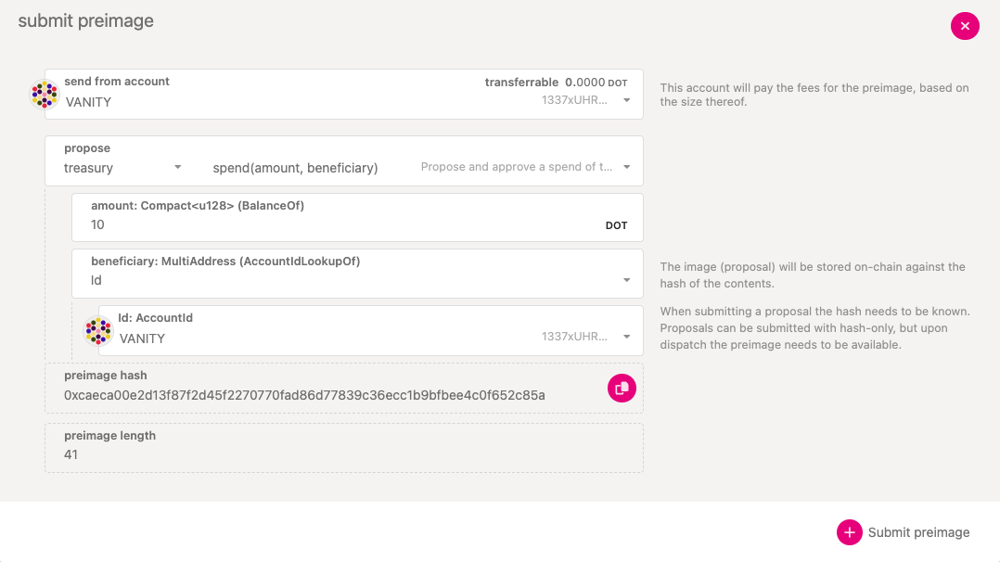

## Create a Referenda Proposal

### Submitting a Preimage

The act of making a proposal is split from submitting the preimage for the proposal since the
storage cost of submitting a large preimage could be pretty expensive. Allowing for the preimage
submission to come as a separate transaction means that another account could submit the preimage
for you and pay the fee for it.

### Submitting a Proposal

## Voting on Referenda

:::caution

Use `convictionVoting.vote` for voting on Referenda in OpenGov instead of `democracy.vote` (which
only works for old version of governance)

:::

## Origins and Tracks

Whitelist

| Origin              | ID  |
| ------------------- | --- |
| `WhitelistedCaller` | 1   |

General administration

| Origin            | ID  |
| ----------------- | --- |
| `StakingAdmin`    | 10  |
| `Treasurer`       | 11  |
| `LeaseAdmin`      | 12  |
| `FellowshipAdmin` | 13  |
| `GeneralAdmin`    | 14  |
| `AuctionAdmin`    | 15  |

Referendum adminstration

| Origin                | ID  |
| --------------------- | --- |
| `ReferendumCanceller` | 20  |
| `ReferendumKiller`    | 21  |

Limited treasury spending

| Origin          | ID  |
| --------------- | --- |
| `SmallTipper`   | 30  |
| `BigTipper`     | 31  |
| `SmallSpender`  | 32  |
| `MediumSpender` | 33  |
| `BigSpender`    | 34  |
