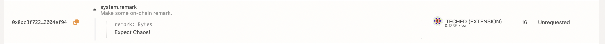

import Tracks from "./../../components/Referenda-Tracks"; import Chart from
"./../../components/Chart";

:::info Learn more about OpenGov

For background information about OpenGov, please refer to this
[dedicated Wiki document](../learn/learn-opengov.md).

:::

This guide will instruct token holders how to propose and vote on public referenda using the
Referenda module (OpenGov). Below are a few links to stay informed and directly engage with the
community.

- [Polkadot Direction](https://matrix.to/#/#Polkadot-Direction:parity.io) - a place to discuss
  governance and the future of Polkadot.
- [Kusama Direction](https://matrix.to/#/#Kusama-Direction:parity.io) - a place to discuss
  governance and the future of Kusama.
- [Polkadot](https://polkadot.polkassembly.io) and [Kusama](https://kusama.polkassembly.io)
  Polkassembly - for current referenda, latest proposals, motions, treasury proposals, tips,
  bounties, and more.
- [Polkadot Daily Digest](https://matrix.to/#/#dailydigest:web3.foundation) - News about what is
  happening in the Polkadot ecosystem, published every weekday except holidays.

## OpenGov Terminology and Parameters

The important parameters to be aware of when voting using the Referenda module are as follows:

**Origin** - Each origin has a fixed set of privileges. When making a proposal, it is important to
choose the origin that has the privilege to execute the referenda.

**Track** - Each track has its own dispatch origin and a preset configuration that governs the
voting process and parameters.

**Submission Deposit** - The minimum amount to be used as a (refundable) deposit to submit a public
referendum proposal.

**Prepare Period** - The minimum time the referendum needs to wait before it can progress to the
next phase after submission. Voting is enabled, but the votes do not count toward the outcome of the
referendum yet.

**Decision Deposit** - This deposit is required for a referendum to progress to the decision phase
after the end of prepare period.

**Decision Period** - Amount of time a decision may take to be approved to move to the confirming
period. If the proposal is not approved by the end of the decision period, it gets rejected.

**Max Deciding** - The maximum number of referenda that can be in the decision period of a track all
at once.

**Conviction**: A multiplier to increase voting power.

**Approval**: the share of the approval vote-weight after adjustments for conviction against the
total number of vote-weight for both approval and rejection

**Support**: The total number of votes in approval (ignoring adjustments for conviction) compared to
the total possible amount of votes that could be made in the system. Support also takes into account
abstained votes.

**Min Approval** - The threshold of approval (along with the min support) needed for a proposal to
meet the requirements of the confirm period.

**Min Support** - The threshold of support (along with the min approval) needed for a proposal to
meet the requirements of the confirm period.

**Confirmation Period** - The total time the referenda must meet both the min approval and support
criteria during the decision period in order to pass and enter the enactment period.

**Min Enactment Period** - Minimum time that an approved proposal must be in the dispatch queue
after approval. The proposer has the option to set the enactment period to be of any value greater
than the min enactment period.

## Origins and Tracks Info

{{ polkadot: <Tracks network="polkadot" defaultValue="Loading Polkadot Tracks..."/> :polkadot }}{{ kusama: <Tracks network="kusama" defaultValue="Loading Kusama Tracks..."/> :kusama }}

:::info

For every referendum in each of these tracks, the Polkadot-JS UI displays interactive graphs of the
support and approval.

:::

### Root

The origin with the highest level of privileges. This track requires extremely high levels of
approval and support for early passing. The prepare and enactment periods are also large. For
instance, a referendum proposed in this track needs to amass
{{ polkadot: 48.2% :polkadot }}{{ kusama:  46.8%  :kusama }} support (total network issuance) by the
end of the first day with over {{ polkadot: 93.5% :polkadot }}{{ kusama:  88%  :kusama }} approval
to be considered to be part of the confirm period. The support curve drops linearly to 25% by the
end of day {{ polkadot: 14 :polkadot }}{{ kusama:  7  :kusama }} and almost to 0% by the end of day
{{ polkadot: 28 :polkadot }}{{ kusama:  14  :kusama }}. This ensures that the token holders receive
ample time to vote on the proposal during the decision period.

{{ polkadot: <Chart title="" type="line" dataId="Root" network="Polkadot" maxX="672" maxY="100" /> :polkadot }}
{{ kusama: <Chart title="" type="line" dataId="Root" network="Kusama" maxX="336" maxY="100" /> :kusama }}

### Whitelisted Caller

Origin commanded by the [Fellowship](../learn/learn-opengov.md#fellowship) whitelist some hash of a
call and allow the call to be dispatched with the root origin (after the referendum passes). This
track allows for a shorter voting turnaround, safe in the knowledge through an open and transparent
process for time-critical proposals. For instance, a referendum proposed in this track needs to
amass {{ polkadot: 20% :polkadot }}{{ kusama:  14%  :kusama }} support (much lesser than the root)
by the end of the first day with over {{ polkadot: 93.5% :polkadot }}{{ kusama:  88%  :kusama }}
approval to be considered to be part of the confirm period.

{{ polkadot: <Chart title="" type="line" dataId="Whitelist" network="Polkadot" maxX="672" maxY="100" /> :polkadot }}
{{ kusama: <Chart title="" type="line" dataId="Whitelist" network="Kusama" maxX="336" maxY="100" /> :kusama }}

### Staking Admin

The origin for canceling slashes. This origin has the privilege to execute calls from the staking
pallet and the Election Provider Multiphase Pallet.

{{ polkadot: <Chart title="" type="line" dataId="AdminStaking" network="Polkadot" maxX="672" maxY="100" /> :polkadot }}
{{ kusama: <Chart title="" type="line" dataId="AdminStaking" network="Kusama" maxX="336" maxY="100" /> :kusama }}

### Treasurer

The origin for spending funds from the treasury (up to
{{ polkadot: 10M DOT :polkadot }}{{ kusama:  333333.33 KSM  :kusama }}). This origin has the
privilege to execute calls from the Treasury pallet.

{{ polkadot: <Chart title="" type="line" dataId="Treasurer" network="Polkadot" maxX="672" maxY="100" /> :polkadot }}
{{ kusama: <Chart title="" type="line" dataId="Treasurer" network="Kusama" maxX="336" maxY="100" /> :kusama }}

### Lease Admin

Origin can force slot leases. This origin has the privilege to execute calls from the Slots pallet.

{{ polkadot: <Chart title="" type="line" dataId="AdminLease" network="Polkadot" maxX="672" maxY="100" /> :polkadot }}
{{ kusama: <Chart title="" type="line" dataId="AdminLease" network="Kusama" maxX="336" maxY="100" /> :kusama }}

### Fellowship Admin

The origin for managing the composition of the fellowship.

{{ polkadot: <Chart title="" type="line" dataId="AdminFellowship" network="Polkadot" maxX="672" maxY="100" /> :polkadot }}
{{ kusama: <Chart title="" type="line" dataId="AdminFellowship" network="Kusama" maxX="336" maxY="100" /> :kusama }}

### General Admin

The origin for managing the registrar. This origin has the privilege of executing calls from the
Identity pallet.

{{ polkadot: <Chart title="" type="line" dataId="AdminGeneral" network="Polkadot" maxX="672" maxY="100" /> :polkadot }}
{{ kusama: <Chart title="" type="line" dataId="AdminGeneral" network="Kusama" maxX="336" maxY="100" /> :kusama }}

### Auction Admin

The origin for starting auctions. This origin can execute calls from the Auctions pallet and the
Scheduler Pallet.

{{ polkadot: <Chart title="" type="line" dataId="AdminAuction" network="Polkadot" maxX="672" maxY="100" /> :polkadot }}
{{ kusama: <Chart title="" type="line" dataId="AdminAuction" network="Kusama" maxX="336" maxY="100" /> :kusama }}

### Referendum Canceller

The origin can cancel referenda. This track has a low lead time and approval/support curves with
slightly sharper reductions in their thresholds for passing.

{{ polkadot: <Chart title="" type="line" dataId="RefCanceller" network="Polkadot" maxX="672" maxY="100" /> :polkadot }}
{{ kusama: <Chart title="" type="line" dataId="RefCanceller" network="Kusama" maxX="336" maxY="100" /> :kusama }}

### Referendum Killer

The origin can cancel an ongoing referendum and slash the deposits. This track also has a low
lead-time and approval/support curves with slightly sharper reductions in their thresholds for
passing.

{{ polkadot: <Chart title="" type="line" dataId="RefKiller" network="Polkadot" maxX="672" maxY="100" /> :polkadot }}
{{ kusama: <Chart title="" type="line" dataId="RefKiller" network="Kusama" maxX="336" maxY="100" /> :kusama }}

### Small Tipper

Origin able to spend up to {{ polkadot: 250 DOT :polkadot }}{{ kusama:  8.25 KSM  :kusama }} from
the treasury at once.

{{ polkadot: <Chart title="" type="line" dataId="SmallTipper" network="Polkadot" maxX="672" maxY="100" /> :polkadot }}
{{ kusama: <Chart title="" type="line" dataId="SmallTipper" network="Kusama" maxX="336" maxY="100" /> :kusama }}

### Big Tipper

Origin able to spend up to {{ polkadot: 1000 DOT :polkadot }}{{ kusama:  33.33 KSM  :kusama }} from
the treasury at once.

{{ polkadot: <Chart title="" type="line" dataId="BigTipper" network="Polkadot" maxX="672" maxY="100" /> :polkadot }}
{{ kusama: <Chart title="" type="line" dataId="BigTipper" network="Kusama" maxX="336" maxY="100" /> :kusama }}

### Small Spender

Origin able to spend up to {{ polkadot: 10000 DOT :polkadot }}{{ kusama:  333.33 KSM  :kusama }}
from the treasury at once.

{{ polkadot: <Chart title="" type="line" dataId="SmallSpender" network="Polkadot" maxX="672" maxY="100" /> :polkadot }}
{{ kusama: <Chart title="" type="line" dataId="SmallSpender" network="Kusama" maxX="336" maxY="100" /> :kusama }}

### Medium Spender

Origin able to spend up to {{ polkadot: 100000 DOT :polkadot }}{{ kusama:  3333.33 KSM  :kusama }}
from the treasury at once.

{{ polkadot: <Chart title="" type="line" dataId="MediumSpender" network="Polkadot" maxX="672" maxY="100" /> :polkadot }}
{{ kusama: <Chart title="" type="line" dataId="MediumSpender" network="Kusama" maxX="336" maxY="100" /> :kusama }}

### Big Spender

Origin able to spend up to {{ polkadot: 1000000 DOT :polkadot }}{{ kusama:  33333.33 KSM  :kusama }}
from the treasury at once.

{{ polkadot: <Chart title="" type="line" dataId="BigSpender" network="Polkadot" maxX="672" maxY="100" /> :polkadot }}
{{ kusama: <Chart title="" type="line" dataId="BigSpender" network="Kusama" maxX="336" maxY="100" /> :kusama }}

## Create a Referenda Proposal using Polkadot-JS UI

### Submitting a Preimage

The act of making a proposal is split from submitting the preimage for the proposal since the
storage cost of submitting a large preimage could be pretty expensive. Allowing for the preimage
submission to come as a separate transaction means that another account could submit the preimage
for you and pay the fee for it. The example below demonstrates the creation of a preimage on Kusama
(**the same procedure applies when OpenGov is live on Polkadot**). To propose that a remark "Expect
Chaos!" be added to the blockchain, the preimage hash would be
`0x8ac3f722caf7677254e25ca4ad77d533ca893c7d2ad4009e258d749f2004ef94`.

After the preimage is submitted successfuly on-chain, Polkadot-JS UI lists it under the tab of
Governance > Preimages.

### Submitting a Proposal

Submitting a proposal requires you to bond some tokens. On Polkadot-JS UI, you can navigate to the
Governance -> Referenda to make a new proposal. In order to submit a proposal, you will need to
submit what's called the preimage hash. The preimage hash is simply the hash of the proposal to be
enacted. The easiest way to get the preimage hash is by clicking on the "Submit preimage" button as
shown in the previous section.

The proposal will be registered from the account selected and the balance lock will be applied to
it. An appropriate origin must be chosen, as each origin has different privileges, and acceptance
criteria. After entering the hash of the preimage for the proposal, the preimage length field is
automatically populated. The enactment delay can be specified either as a block number, or as a
specific number of blocks after the referendum is approved. The deposit for this proposal will be
locked for the referendum duration.

## Voting on Referenda

To vote on a referendum, navigate to the "Referenda" tab of Polkadot-JS UI. All the active referenda
will be shown in their respective track sections. Click the "Vote" button to cast a vote for the
corresponding referendum. As OpenGov takes both the approval and support into account, there are
four options to choose from when voting on a referendum:

- Aye
- Nay
- Split
- Abstain

Also, you have to specify the conviction multiplier for this vote. The longer you are willing to
lock your tokens, the stronger your vote will be weighted. Unwillingness to lock your tokens means
that your vote only counts for 10% of the tokens that you hold.

:::caution OpenGov uses Conviction Voting Pallet (Not Democracy Pallet)

Use `convictionVoting.vote` for voting on Referenda in OpenGov instead of `democracy.vote` (which
only works for old version of governance).

:::

### Removing expired voting locks

To remove the lock from votes you first need to call `removeVote` and then `unlock` through the
`convictionVoting` pallet.

## Delegating Voting Power

For an overview on how delegation works in OpenGov, check out the
[Multirole Delegation](./../learn/learn-opengov.md#multirole-delegation) section on the
[Learn OpenGov](./../learn/learn-opengov.md) page.

The following steps outline how to delegate voting power in OpenGov through Polkadot-JS UI:

1. Navigate to the [referenda tab](https://polkadot.js.org/apps/#/referenda)
2. Click the `Delegate` icon in the top-right corner
   
3. Ensure the `delegate from account` field lists the account you wish to apply delegation over
4. Next, select the appropriate `submission track` that you wish to delegate (or select the option
   `apply delegation to all tracks`)
5. Specify the `delegate vote value`, which is the amount of DOT or KSM you wish to provide the
   delegate with
6. Provide a `conviction` multiplier determining how long the funds from the previous step are
   locked (for additional details see the section on [Voluntary Locking](#voluntary-locking)) and
   click `Next`
7. The final step is to provide the account address that will be the delegate for the original
   account provided (this account will be receiving the voting power for the source account on the
   specified track)

When you are ready to undelegate:

1. Navigate to the [extrinsics tab](https://polkadot.js.org/apps/#/extrinsics)
2. Select a wallet address that is currently delegating to another account
3. From the `submit the following extrinsic` dropdown, select `convictionVoting`
4. Select `undelegate` from the next dropdown to the right of the previous step (note you can also
   delegate from this page as an alternative to the solution provided above)
5. Provide the `submission track` that was used when originally delegating from above
6. Sign and submit the transaction to restore the voting power back to the original source address

