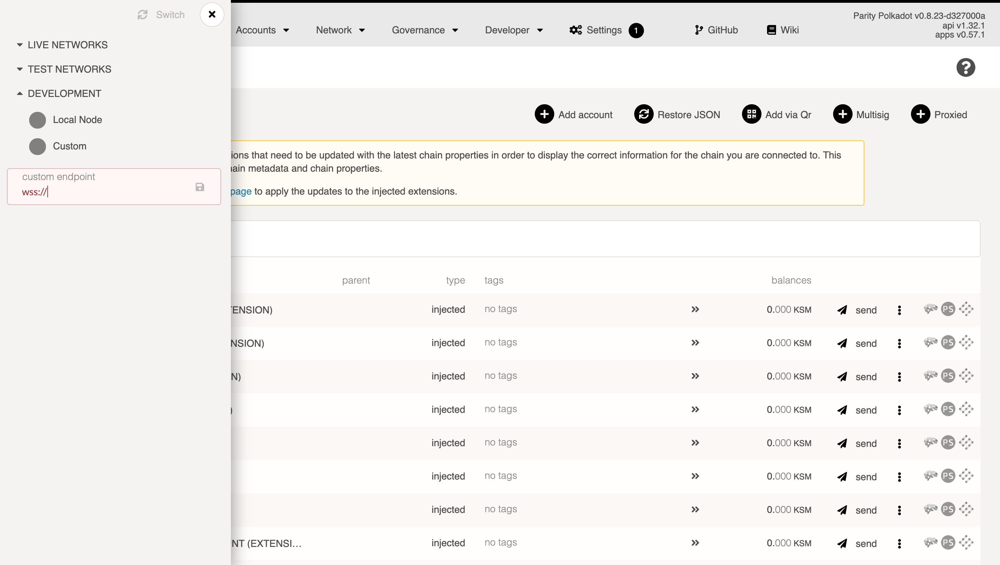

You might want to host a node on one server and then connect to it from a UI hosted on another, e.g.
[Polkadot-JS UI](https://polkadot.js.org/apps). This will not be possible unless you set up a secure
proxy for websocket connections. Let's see how we can set up WSS on a remote Substrate node.

_Note: this should **only** be done for sync nodes used as back-end for some dapps or projects.
Never open websockets to your validator node - there's no reason to do that and it can only lead to
security gaffes._

In this guide we'll be using Ubuntu 18.04 hosted on a \$10 DigitalOcean droplet. We'll assume you're
using a similar OS, and that you have nginx installed (if not, run `sudo apt-get install nginx`).

## Set up a node

Whether it's a generic Substrate node, a Kusama node, or your own private blockchain, they all
default to the same websocket connection: port 9944 on localhost. For this example, we'll set up a
Kusama sync node (non-validator).

Create a new server on your provider of choice or locally at home (preferred). We'll assume you're
using Ubuntu 18.04. Then install Substrate and build the node.

```bash
curl https://getsubstrate.io -sSf | bash
git clone https://github.com/paritytech/polkadot kusama
cd kusama
./scripts/init.sh
cargo build --release
./target/release/polkadot --name "DigitalOcean 10 USD droplet ftw" --rpc-cors all
```

This will start the syncing process with Kusama's mainnet.

:::note The `--rpc-cors` mode needs to be set to all so that all external connections are allowed

:::

## Set up a certificate

To get WSS (secure websocket), you need an SSL certificate. There are two possible approaches.

### Domain and Certbot

The first approach is getting a dedicated domain, redirecting its nameservers to your IP address,
setting up an Nginx server for that domain, and finally
[following LetsEncrypt instructions](https://certbot.eff.org/instructions?ws=nginx&os=ubuntubionic)
for Nginx setup. This will auto-generate an SSL certificate and include it in your Nginx
configuration. This will let you connect Polkadot-JS UI to a URL like mynode.mydomain.com rather
than 82.196.8.192:9944, which is arguably more user friendly.

This is simple to do on cloud hosting providers or if you have a static IP, but harder to pull off
when running things from your home server.

### Self-signed

The second approach and one we'll follow here is generating a self-signed certificate and relying on
the raw IP address of your node when connecting to it.

Generate a self-signed certificate.

```bash
sudo openssl req -x509 -nodes -days 365 -newkey rsa:2048 -keyout /etc/ssl/private/nginx-selfsigned.key -out /etc/ssl/certs/nginx-selfsigned.crt
sudo openssl dhparam -out /etc/ssl/certs/dhparam.pem 2048
```

## Set up Nginx server

Now it's time to tell Nginx to use these certificates. The server block below is all you need, but
keep in mind that you need to replace some placeholder values. Notably:

- `SERVER_ADDRESS` should be replaced by your domain name if you have it, or your server's IP
  address if not.
- `CERT_LOCATION` should be `/etc/letsencrypt/live/YOUR_DOMAIN/fullchain.pem` if you used Certbot,
  or `/etc/ssl/certs/nginx-selfsigned.crt` if self-signed.
- `CERT_LOCATION_KEY` should be `/etc/letsencrypt/live/YOUR_DOMAIN/privkey.pem` if you used Certbot,
  or `/etc/ssl/private/nginx-selfsigned.key` if self-signed.
- `CERT_DHPARAM` should be `/etc/letsencrypt/ssl-dhparams.pem` if you used Certbot, and
  `/etc/ssl/certs/dhparam.pem` if self-signed.

_Note that if you used Certbot, it should have made the path insertions below for you if you
followed the [official instructions](https://certbot.eff.org/instructions?ws=nginx&os=ubuntubionic)_

```conf
server {

        server_name SERVER_ADDRESS;

        root /var/www/html;
        index index.html;

        location / {
          try_files $uri $uri/ =404;

          proxy_buffering off;
          proxy_pass http://localhost:9944;
          proxy_set_header X-Real-IP $remote_addr;
          proxy_set_header Host $host;
          proxy_set_header X-Forwarded-For $proxy_add_x_forwarded_for;

          proxy_http_version 1.1;
          proxy_set_header Upgrade $http_upgrade;
          proxy_set_header Connection "upgrade";
        }

        listen [::]:443 ssl ipv6only=on;
        listen 443 ssl;
        ssl_certificate CERT_LOCATION;
        ssl_certificate_key CERT_LOCATION_KEY;

        ssl_session_cache shared:cache_nginx_SSL:1m;
        ssl_session_timeout 1440m;

        ssl_protocols TLSv1 TLSv1.1 TLSv1.2;
        ssl_prefer_server_ciphers on;

        ssl_ciphers "ECDHE-ECDSA-CHACHA20-POLY1305:ECDHE-RSA-CHACHA20-POLY1305:ECDHE-ECDSA-AES128-GCM-SHA256:ECDHE-RSA-AES128-GCM-SHA256:ECDHE-ECDSA-AES256-GCM-SHA384:ECDHE-RSA-AES256-GCM-SHA384:DHE-RSA-AES128-GCM-SHA256:DHE-RSA-AES256-GCM-SHA384:ECDHE-ECDSA-AES128-SHA256:ECDHE-RSA-AES128-SHA256:ECDHE-ECDSA-AES128-SHA:ECDHE-RSA-AES256-SHA384:ECDHE-RSA-AES128-SHA:ECDHE-ECDSA-AES256-SHA384:ECDHE-ECDSA-AES256-SHA:ECDHE-RSA-AES256-SHA:DHE-RSA-AES128-SHA256:DHE-RSA-AES128-SHA:DHE-RSA-AES256-SHA256:DHE-RSA-AES256-SHA:ECDHE-ECDSA-DES-CBC3-SHA:ECDHE-RSA-DES-CBC3-SHA:EDH-RSA-DES-CBC3-SHA:AES128-GCM-SHA256:AES256-GCM-SHA384:AES128-SHA256:AES256-SHA256:AES128-SHA:AES256-SHA:DES-CBC3-SHA:!DSS";

        ssl_dhparam CERT_DHPARAM;

}
```

Restart nginx after setting this up: `sudo service nginx restart`.

## Importing the Certificate

If you used the self-signed certificate approach, modern browsers will not let you connect to this
websocket endpoint without that certificate being imported - they will emit an
`NET:ERR_CERT_AUTHORITY_INVALID` message.

Every websocket connection bootstraps itself with `https` first, so to allow the certificate, visit
the IP of your machine in the browser prefixed with `https`, like so: `https://MY_IP`. This should
produce a "Not private" warning which you can skip by going to "Advanced" and the clicking on
"Proceed to Site". You have now whitelisted this IP and its self-signed certificate for connecting.

## Connecting to the node

Open [Polkadot-JS UI](https://polkadot.js.org/apps) and click the logo in the top left to switch the
node. Activate the "Development" toggle and input your node's address - either the domain or the IP
address. Remember to prefix with `wss://` and if you're using the 443 port, append `:443`, like so:
`wss://example.com:443`.



Now you have a secure remote connect setup for your Substrate node.
